# 2.2.2 Linear analysis of the Indian Point reactor feedwater line

**Product: **Abaqus/Standard  

This example concerns the linear analysis of an actual pipeline from a nuclear reactor and is intended to illustrate some of the issues that must be addressed in performing seismic piping analysis. The pipeline is the Indian Point Boiler Feedwater Pipe fitted with modern supports, as shown in [Figure 2.2.2--1](ch02s02aex81.md#sxmfeedwater-lineconfig). This pipeline was tested experimentally in EPRI's full-scale testing program. The model corresponds to Configuration 1 of the line in Phase III of the testing program. The experimental results are documented in EPRI Report NP–3108 Volume 1 (1983).

We first verify that the geometric/kinematic model is adequate to simulate the dynamic response accurately. For this purpose we compare predictions of the natural frequencies of the system using a coarse model and a finer model, as well as two substructure models created from the coarse mesh. These analyses are intended to verify that the models used in subsequent runs provide accurate predictions of the lower frequencies of the pipeline. We then perform linear dynamic response analysis in the time domain for one of the “snap-back” loadings applied in the physical test (EPRI NP–3108, 1983) and compare the results with the experimental measurements. The linear dynamic response analysis results are also compared with the results of direct integration analysis (integration of all variables in the entire model, as would be performed for a generally nonlinear problem). This is done primarily for cross-verification of the two analysis procedures. These snap-back response analyses correspond to a load of 31136 N (7000 lb) applied at node 25 in the *z*-direction, with the pipe filled with water. This load case is referred to as test S138R1SZ in EPRI NP–3108.

We also compute the pipeline's response in the frequency domain to steady excitation at node 27 in the *z*-direction. Experimental data are also available for comparison with these results.

### Geometry and model

Geometrical and material properties are taken from EPRI NP–3108 (1983). The supports are assumed to be linear springs for the purpose of these linear analyses, although their actual response is probably nonlinear. The spring stiffness values are those recommended by Tang et al. (1985). The pipe is assumed to be completely restrained in the vertical direction at the wall penetration.

In the experimental snap-back test used for the comparison (test S138R1SZ), the pipe is full of water. The density of the general beam section is, therefore, adjusted to account for the additional mass of the water by computing a composite (steel plus water) mass per unit length of pipe.

The pipeline is modeled with element type B31. This is a shear flexible beam element that uses linear interpolation of displacement and rotation between two nodes, with transverse shear behavior modeled according to Timoshenko beam theory. The element uses a lumped mass matrix because this provides more accurate results in test cases.

The coarse finite element model uses at least two beam elements along each straight run, with a finer division around the curved segments of the pipe to describe the curvature of the pipe with reasonable accuracy. Separate nodes are assigned for all spring supports, external loading locations, and all the points where experimental data have been recorded. The model is shown in [Figure 2.2.2--2](ch02s02aex81.md#sxmfeedwater-meshmodels). This mesh has 74 beam elements.

In typical piping systems the elbows play a dominant role in the response because of their flexibility. This could be incorporated in the model by using the ELBOW elements. However, ELBOW elements are intended for applications that involve nonlinear response within the elbows themselves and are an expensive option for linear response of the elbows, which is the case for this study. Therefore, instead of using elbow elements, we modify the geometrical properties of beam elements to model the elbows with correct flexibility. This is done by calculating the flexibility factor, *k*, for each elbow and modifying the moments of inertia of the beam cross-sections in these regions. The flexibility factor for an elbow is a function of two parameters. One is a geometric parameter, , defined as

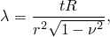

where *t* is the wall thickness of the curved pipe, *R* is the bend radius of the centerline of the curved pipe, *r* is the mean cross-sectional radius of the curved pipe, and  is Poisson's ratio. The other parameter is an internal pressure loading parameter, . For thick sections (like the ones used in this pipe),  has negligible effect unless the pressures are very high and the water in this case is not pressurized. Consequently, the flexibility factor is a function of  only.

For the elbows in this pipeline 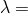 0.786 for the 203 mm (8 in) section and  0.912 for the 152 mm (6 in) section. The corresponding flexibility factors obtained from Dodge and Moore (1972) are 2.09 and 1.85. These are implemented in the model by modifying the moments of inertia of the beam cross-sections in the curved regions of the pipeline.

Abaqus provides two different options for introducing geometrical properties of a beam cross-section. For general beam sections all geometric properties (area, moments of inertia) can be given without specifying the shape of the cross-section. The material data, including the density, are given on the same option. Alternatively, the geometrical properties of the cross-section can be given by using a beam section. With this option the cross-section dimensions are given, and Abaqus calculates the corresponding cross-sectional behavior by numerical integration, thus allowing for nonlinear material response in the section. When this option is used, the material properties—including density and damping coefficients—are introduced in the material definition associated with the section. This approach is more expensive for systems in which the cross-sectional behavior is linear, since numerical integration over the section is required each time the stress must be computed. Thus, in this case we use a general beam section.

To verify that the mesh will provide results of adequate accuracy, the natural frequencies predicted with this model are compared with those obtained with another mesh that has twice as many elements in each pipe segment. [Table 2.2.2--1](ch02s02aex81.md#table-feedwater-comparenatfreqs) shows that these two meshes provide results within 2% for the first six modes and generally quite similar frequencies up to about 30 Hz. Based on this comparison the smaller model, with 74 beam elements, is used for the remaining studies (although the larger model would add little to the cost of the linear analyses, which for either case would be based on the same number of eigenmodes: only in direct integration would the cost increase proportionally with the model size).

### Substructure models

In Abaqus the dynamic response of a substructure is defined by a combination of Guyan reduction and the inclusion of some natural modes of the fully restrained substructure. Guyan reduction consists of choosing additional physical degrees of freedom to retain in the dynamic model that are not needed to connect the substructure to the rest of the mesh. In this example we use only Guyan reduction since the model is small and it is easy to identify suitable degrees of freedom to retain. A critical modeling issue with this method is the choice of retained degrees of freedom: enough degrees of freedom must be retained so that the dynamic response of the substructure is modeled with sufficient accuracy. The retained degrees of freedom should be such as to distribute the mass evenly in each substructure so that the lower frequency response of each substructure is modeled accurately. Only frequencies up to 33 Hz are generally considered important in the seismic response of piping systems such as the one studied in this example, so the retained degrees of freedom must be chosen to provide accurate modeling of the response up to that frequency.

In this case the pipeline naturally divides into three segments in terms of which kinematic directions participate in the dynamic response, because the response of a pipeline is generally dominated by transverse displacement. The lower part of the pipeline, between nodes 1 and 23, is, therefore, likely to respond predominantly in degrees of freedom 1 and 2; the middle part, between nodes 23 and 49, should respond in degrees of freedom 2 and 3; and the top part, above node 49, should respond in degrees of freedom 1 and 3. Comparative tests (not documented) have been run to verify these conjectures, and two substructure models have been retained for further analysis: one in which the entire pipeline is treated as a single substructure, and one in which it is split into three substructures. In the latter case all degrees of freedom must be retained at the interface nodes to join the substructures correctly. At other nodes only some translational degrees of freedom are retained, based on the arguments presented above.

The choice of which degrees of freedom to retain can be investigated inexpensively in a case such as this by numerical experiments—extracting the modes of the reduced system for the particular set of retained degrees of freedom and comparing these modes with those of the complete model. The choices made in the substructure models used here are based somewhat on such tests, although insufficient tests have been run to ensure that they are close to the optimal choice for accuracy with a given number of retained variables. For linear analysis of a model as small as this one, achieving an optimal selection of retained degrees of freedom is not critical because computer run times are short: it becomes more critical when the reduced model is used in a nonlinear analysis or where the underlying model is so large that comparative eigenvalue tests cannot be performed easily. In such cases the inclusion of natural modes of the substructure is desirable. The substructure models are shown in [Figure 2.2.2--2](ch02s02aex81.md#sxmfeedwater-meshmodels).

### Damping

“Damping” plays an essential role in any practical dynamic analysis. In nonlinear analysis the “damping” is often modeled by introducing dissipation directly into the constitutive definition as viscosity or plasticity. In linear analysis equivalent linear damping is used to approximate dissipation mechanisms that are not modeled explicitly.

Experimental estimates of equivalent linear damping, based on three different methods, are found in EPRI NP–3108 (see Table 7–6, Table 7–7, and Figure 7–15 of that report). For the load case and pipe configuration analyzed here, those results suggest that linear damping corresponding to 2.8% of critical damping in the lowest mode of the system matches the measured behavior of the structure, with the experimental results also showing that the percentage of critical damping changes from mode to mode. In spite of this all the numerical analyses reported here assume the same damping ratio for all modes included in the model, this choice being made for simplicity only.

For linear dynamic analysis based on the eigenmodes, Abaqus allows damping to be defined as a percentage of critical damping in each mode, as structural damping (proportional to nodal forces), or as Rayleigh damping (proportional to the mass and stiffness of the structure). Only the last option is possible when using direct integration, although other forms of damping can be added as discrete dashpots or in the constitutive models. In this case results are obtained for linear dynamic analysis with modal and Rayleigh damping and for direct integration with Rayleigh damping. For linear dynamic analysis based on the eigenmodes, modal damping can be specified using the mode numbers or using the frequency ranges.

### Results and discussion

Results are shown for four geometric models: the “coarse” (74 element) model, which has a total of 435 degrees of freedom; a finer (148 element) model, which has a total of 870 degrees of freedom; a model in which the pipeline is modeled as a single substructure (made from the coarse model), with 59 retained degrees of freedom; and a model in which the pipeline is modeled with three substructures (made from the coarse model), with 65 retained degrees of freedom.

The first comparison of results is the natural frequencies of the system, as they are measured and as they are predicted by the various models. The first 24 modes are shown in [Table 2.2.2--1](ch02s02aex81.md#table-feedwater-comparenatfreqs). These modes span the frequency range from the lowest frequency (about 4.3 Hz) to about 43 Hz. In typical seismic analysis of systems such as this, the frequency range of practical importance is up to 33 Hz; on this basis these modes are more than sufficient.

Only the first six modes of the actual system have been measured, so any comparison at higher frequencies is between the numerical calculations reported here and other similar computations. The results obtained with the four models correlate quite well between themselves, suggesting that the mesh and the choices of retained degrees of freedom in the substructure models are reasonable. It is particularly noteworthy that the results for the substructure models correspond extremely well with those provided by the original model, considering the large reduction in the number of degrees of freedom for the substructures. The results also correlate roughly with the analysis results obtained by EDS and reported in EPRI NP-3108: except for modes 3 and 4 the frequencies are within 10% of the EDS numbers. For the first three modes the Abaqus results are lower than those reported by EDS. This suggests the possibility that the Abaqus model may be too flexible. The SUPERPIPE values are significantly higher than any of the other data for most modes, and the Abaqus and the EDS results diverge from the test results after the first four modes.

The results of the time history analyses are summarized in [Table 2.2.2--2](ch02s02aex81.md#table-feedwater-compareinitrxns) to [Table 2.2.2--5](ch02s02aex81.md#table-feedwater-peakrxnforces). These analyses are based on using all 24 modes of the coarse model. Typical predicted response plots are shown in [Figure 2.2.2--3](ch02s02aex81.md#sxmfeedwater-24modezdisp) to [Figure 2.2.2--7](ch02s02aex81.md#sxmfeedwater-24modesprforce). In many cases of regular, beam-type, one-dimensional structures, the first few modes will generally establish the dynamic behavior. Although the pipeline has an irregular shape, it is worth checking how much the higher modes influence the results. This is done in this case by comparing the results using the first six modes only with the results obtained with 24 modes. The highest discrepancy (20%) is found in the predicted accelerations at certain degrees of freedom. All other results show at most 5–10% differences (see [Figure 2.2.2--3](ch02s02aex81.md#sxmfeedwater-24modezdisp) and [Figure 2.2.2--4](ch02s02aex81.md#sxmfeedwater-6modezdisp)). This conclusion is also supported by the steady-state results.

All the Abaqus results are reasonably self-consistent, in the sense that Rayleigh and modal damping and modal dynamics and direct integration all predict essentially the same values. The choice of 2.8% damping seems reasonable, in that oscillations caused by the snap-back are damped out almost completely in 10 seconds, which corresponds to the measurements.

Unfortunately there is poor correlation between predicted and measured support reactions and maximum recorded displacements. The test results and the corresponding computations are shown in [Table 2.2.2--2](ch02s02aex81.md#table-feedwater-compareinitrxns) and [Table 2.2.2--3](ch02s02aex81.md#table-feedwater-comparemaxdisps). All the models give essentially the same values. The initial reactions and displacements are computed for a snap-back load of 31136 N (7000 lb) applied at node 25 (node 417 in EPRI report NP–3108) in the *z*-direction. The maximum recorded displacements occur at node 27 (node 419 in EPRI report NP–3108) in the *y*- and *z*-directions. It is assumed that the supports are in the positions relative to the pipe exactly as shown in [Figure 2.2.2--1](ch02s02aex81.md#sxmfeedwater-lineconfig). The scatter in the experimental measurements makes it difficult to assess the validity of the stiffness chosen for the spring supports. The maximum displacement predicted at node 27 in the *z*-direction is almost twice that measured. This again implies the possibility that, at least in the area near this node, the model is too flexible.

The generally satisfactory agreement between the natural frequency predictions and poor agreement between the maximum displacements and reactions suggests that improved modeling of the supports may be necessary. In this context it is worthwhile noting that the experimental program recorded significantly different support parameters in different tests on the pipeline system.

[Table 2.2.2--4](ch02s02aex81.md#table-feedwater-peakdisp-node27) shows the results for displacement and acceleration for node 27 (which has the largest displacement). All the computed results are higher than the experimental values. The largest discrepancies between the measurements and the analysis results are in the predictions of peak forces in the springs, summarized in [Table 2.2.2--5](ch02s02aex81.md#table-feedwater-peakrxnforces). Results obtained with the various models differ by less than 10%: these differences are caused by the differences in the models, different types of damping, and—for the direct integration results—errors in the time integration (for the modal dynamic procedure the time integration is exact). The principal cause of the discrepancies between the measurements and the computed values is believed to be the assumption of linear response in the springs in the numerical models. In reality the spring supports are either rigid struts or mechanical snubbers (Configuration 2). Especially when snubbers are used, the supports perform as nonlinear elements and must be modeled as such to reflect the support behavior accurately. Interestingly, even with the assumption of linear support behavior, the character of the oscillation is well-predicted for many variables.

The last group of numerical results are frequency domain calculations obtained using the steady-state dynamic analysis. The response corresponds to steady harmonic excitation at node 27 in the *z*-direction by a force with a peak amplitude of 31136 N (7000 lb). Such frequency domain results play a valuable role in earthquake analysis because they define the frequency ranges in which the structure's response is most amplified by the excitation. Although it is expected that the first few natural frequencies will be where the most amplification occurs, the results show clearly that some variables are strongly amplified by the fifth and sixth modes. This is observed both in the simulations and in the experimental measurements. Measured experimental results are available for the acceleration of node 33 (node 419 in EPRI NO–3108) in the *z*-direction and for the force in spring FW-R-21. The character of curves obtained with Abaqus agrees well with the experimental results (see [Figure 2.2.2--8](ch02s02aex81.md#sxmfeedwater-compareaccel) and [Figure 2.2.2--9](ch02s02aex81.md#sxmfeedwater-compareforce)), but the values differ significantly, as in the time domain results. The peak acceleration recorded is 2.0 m/s2 (78.47 in/s2), at the first natural frequency, while the analysis predicts 4.0 m/s2 (157.5 in/s2). Likewise, the peak force value recorded is 2.0 kN (450 lb), compared to 5.9 kN (1326 lb) predicted. The discrepancies are again attributed to incorrect estimates of the support stiffness or to nonlinearities in the supports.

### Input files

[indianpoint_modaldyn_coarse.inp](../eif/indianpoint_modaldyn_coarse.inp)

[*MODAL DYNAMIC](../key/key-link.md#usb-kws-hmodaldyn) analysis with modal damping using the coarse model.

[indianpoint_modaldyn_3sub.inp](../eif/indianpoint_modaldyn_3sub.inp)

[*MODAL DYNAMIC](../key/key-link.md#usb-kws-hmodaldyn) analysis using the three substructure model.

[indianpoint_3sub_gen1.inp](../eif/indianpoint_3sub_gen1.inp)

First substructure generation referenced by the analysis indianpoint_modaldyn_3sub.inp.

[indianpoint_3sub_gen2.inp](../eif/indianpoint_3sub_gen2.inp)

Second substructure generation referenced by the analysis indianpoint_modaldyn_3sub.inp.

[indianpoint_3sub_gen3.inp](../eif/indianpoint_3sub_gen3.inp)

Third substructure generation referenced by the analysis indianpoint_modaldyn_3sub.inp.

[indianpoint_sstate_sinedwell.inp](../eif/indianpoint_sstate_sinedwell.inp)

[*STEADY STATE DYNAMICS](../key/key-link.md#usb-kws-hsteadystdyn) analysis corresponding to the sine dwell test performed experimentally using the coarse model.

[indianpoint_direct_beam_coarse.inp](../eif/indianpoint_direct_beam_coarse.inp)

Direct integration analysis using the coarse model with the [*BEAM SECTION](../key/key-link.md#usb-kws-mbeamsection) option.

[indianpoint_sstate_modaldamp.inp](../eif/indianpoint_sstate_modaldamp.inp)

[*STEADY STATE DYNAMICS](../key/key-link.md#usb-kws-hsteadystdyn) analysis with modal damping, covering a range of frequencies using the coarse model.

[indianpoint_modaldyn_1sub.inp](../eif/indianpoint_modaldyn_1sub.inp)

[*MODAL DYNAMIC](../key/key-link.md#usb-kws-hmodaldyn) analysis with one substructure.

[indianpoint_1sub_gen1.inp](../eif/indianpoint_1sub_gen1.inp)

Substructure generation referenced by the analysis indianpoint_modaldyn_1sub.inp.

[indianpoint_direct_beamgensect.inp](../eif/indianpoint_direct_beamgensect.inp)

Direct integration using the coarse model with [*BEAM GENERAL SECTION](../key/key-link.md#usb-kws-mbeamgensect) instead of [*BEAM SECTION](../key/key-link.md#usb-kws-mbeamsection), which, thus, runs faster on the computer since numerical integration of the cross-section is avoided.

[indianpoint_modaldyn_elmatrix1.inp](../eif/indianpoint_modaldyn_elmatrix1.inp)

[*MODAL DYNAMIC](../key/key-link.md#usb-kws-hmodaldyn) analysis that reads and uses the substructure matrix written to the results file in indianpoint_3sub_gen1.inp, indianpoint_3sub_gen2.inp, and indianpoint_3sub_gen3.inp.

[indianpoint_modaldyn_elmatrix2.inp](../eif/indianpoint_modaldyn_elmatrix2.inp)

Reads and uses the element matrix written to the results file in indianpoint_modaldyn_3sub.inp.

[indianpoint_modaldyn_elmatrix3.inp](../eif/indianpoint_modaldyn_elmatrix3.inp)

Reads and uses the substructure matrix written to the results file in indianpoint_1sub_gen1.inp.

[indianpoint_modaldyn_elmatrix4.inp](../eif/indianpoint_modaldyn_elmatrix4.inp)

Reads and uses the element matrix written to the results file in indianpoint_modaldyn_1sub.inp.

[indianpoint_modaldamp_rayleigh.inp](../eif/indianpoint_modaldamp_rayleigh.inp)

[*MODAL DAMPING](../key/key-link.md#usb-kws-hmodaldamp) analysis with modal Rayleigh damping using the coarse mesh with the [*BEAM SECTION](../key/key-link.md#usb-kws-mbeamsection) option.

[indianpoint_dyn_rayleigh_3sub.inp](../eif/indianpoint_dyn_rayleigh_3sub.inp)

[*DYNAMIC](../key/key-link.md#usb-kws-hdynamic) analysis with Rayleigh damping using the three substructure model.

[indianpoint_rayleigh_3sub_gen1.inp](../eif/indianpoint_rayleigh_3sub_gen1.inp)

First substructure generation referenced by the analysis indianpoint_dyn_rayleigh_3sub.inp.

[indianpoint_rayleigh_3sub_gen2.inp](../eif/indianpoint_rayleigh_3sub_gen2.inp)

Second substructure generation referenced by the analysis indianpoint_dyn_rayleigh_3sub.inp.

[indianpoint_rayleigh_3sub_gen3.inp](../eif/indianpoint_rayleigh_3sub_gen3.inp)

Third substructure generation referenced by the analysis indianpoint_dyn_rayleigh_3sub.inp.

[indianpoint_modaldyn_unsorted.inp](../eif/indianpoint_modaldyn_unsorted.inp)

One substructure [*MODAL DYNAMIC](../key/key-link.md#usb-kws-hmodaldyn) analysis with unsorted node sets and unsorted retained degrees of freedom.

[indianpoint_unsorted_gen1.inp](../eif/indianpoint_unsorted_gen1.inp)

Substructure generation with unsorted node sets and unsorted retained degrees of freedom referenced by the analysis indianpoint_modaldyn_unsorted.inp.

[indianpoint_lanczos.inp](../eif/indianpoint_lanczos.inp)

Same as indianpoint_modaldyn_coarse.inp, except that it uses the Lanczos solver and the eigenvectors are normalized with respect to the generalized mass.

[indianpoint_restart_normdisp.inp](../eif/indianpoint_restart_normdisp.inp)

Restarts from indianpoint_lanczos.inp and continues the eigenvalue extraction with the eigenvectors normalized with respect to the maximum displacement.

[indianpoint_restart_bc.inp](../eif/indianpoint_restart_bc.inp)

Restarts from indianpoint_lanczos.inp and continues the eigenvalue extraction with modified boundary conditions.

[indianpoint_overlapfreq.inp](../eif/indianpoint_overlapfreq.inp)

Contains two steps, which extract eigenvalues with overlapping frequency ranges.

### References

Consolidated Edison Company of New York, Inc., EDS Nuclear, Inc., and Anco Engineers, Inc., *Testing and Analysis of Feedwater Piping at Indian Point Unit 1, Volume 1: Damping and Frequency*, EPRI NP-3108, vol. 1, July 1983.

Dodge,  W. G., and S. E. Moore, “Stress Indices and Flexibility Factors for Moment Loadings in Elbows and Curved Pipe,” WRC Bulletin, no.179, December 1972.

Tang,  Y. K., M. Gonin, and H. T. Tang, “Correlation Analysis of In-situ Piping Support Reactions,” EPRI correspondence with ABAQUS, May 1985.

### Tables

**Table 2.2.2–1** Comparison of natural frequencies (Hz).
| Mode | Anco (experiment) | EDS | SUPER PIPE | Abaqus |
| --- | --- | --- | --- | --- |
| coarse mesh | finer mesh | single sub | three subs |
| 1 | 4.20 | 4.30 | 5.30 | 4.25 | 4.26 | 4.25 | 4.25 |
| 2 | 6.80 | 6.80 | 8.10 | 6.27 | 6.25 | 6.27 | 6.27 |
| 3 | 8.30 | 8.80 | 12.00 | 7.29 | 7.29 | 7.30 | 7.30 |
| 4 | 12.60 | 10.60 | 13.30 | 12.80 | 12.66 | 12.87 | 12.86 |
| 5 | 15.40 | 13.00 | 14.40 | 13.18 | 13.14 | 13.19 | 13.20 |
| 6 | 16.70 | 14.50 | 15.90 | 13.90 | 13.75 | 13.91 | 13.92 |
| 7 |  | 16.20 | 18.30 | 15.11 | 15.98 | 14.34 | 14.39 |
| 8 |  |  | 19.40 | 16.30 | 16.07 | 16.24 | 16.31 |
| 9 |  |  | 20.20 | 16.89 | 16.81 | 16.43 | 16.43 |
| 10 |  |  | 22.20 | 17.43 | 17.82 | 17.17 | 17.20 |
| 11 |  |  |  | 18.02 | 19.07 | 18.10 | 18.10 |
| 12 |  |  |  | 19.58 | 20.10 | 20.05 | 20.01 |
| 13 |  |  |  | 23.43 | 21.45 | 23.98 | 24.00 |
| 14 |  |  |  | 23.99 | 22.13 | 24.47 | 24.47 |
| 15 |  |  |  | 24.27 | 23.58 | 24.97 | 24.96 |
| 16 |  |  |  | 24.80 | 24.15 | 25.34 | 25.28 |
| 17 |  |  |  | 26.82 | 26.84 | 27.63 | 27.56 |
| 18 |  |  |  | 29.53 | 30.18 | 30.31 | 30.55 |
| 19 |  |  |  | 30.61 | 30.60 | 31.08 | 31.06 |
| 20 |  |  |  | 30.95 | 32.58 | 31.43 | 31.43 |
| 21 |  |  |  | 31.52 | 33.11 | 32.00 | 31.98 |
| 22 |  |  |  | 33.50 | 35.08 | 33.76 | 33.77 |
| 23 |  |  |  | 39.09 | 39.65 | 39.75 | 39.97 |
| 24 |  |  |  | 39.86 | 43.25 | 42.98 | 42.97 |

**Table 2.2.2–2** Comparison of initial support reactions. Snap-back Test No. S138R1SZ; 31136 N (7000 lb) at node 25, *z*-direction.
| NODE | SUPPORT | Anco TEST | Abaqus |
| --- | --- | --- | --- |
| N | (lb) | N | (lb) |
| 15 | FW-R-11 | 8000 | (1798.6) | 11712 | (2633) |
| 22 | FW-R-13 | 30000 | (6744.6) | 29352 | (6599) |
| 23 | FW-R-14 | 252 | (56.7) | 3754 | (844) |
| 35 | FW-R-17 | 23625 | (5311.4) | 102 | (22.8) |
| 35 | FW-R-18 | 10025 | (2553.8) | 18468 | (4152) |
| 39 | FW-R-20 | 24000 | (5395.7) | 4212 | ( 947) |
| 39 | FW-R-21 | 24500 | (5508.1) | 25016 | (5624) |
| 49 | FW-R-23 | 8000 | (1798.6) | 24348 | (5474) |
| 53 | FW-R-24 | 4324 | (972.1) | 4057 | (912) |
| 53 | FW-R-25 | 2000 | (449.6) | 816 | (183) |
| 56 | FW-R-27 | 432 | (97.1) | 1801 | (405) |
| 56 | FW-R-28 | 156 | (35.1) | 799 | (180) |

**Table 2.2.2–3** Comparison of maximum displacements.
| Abaqus NODE No. | Anco NODE No. | Measured | Abaqus |
| --- | --- | --- | --- |
| mm | (in) | mm | (in) |
| 27 | 419-Y | 16.0 | (.630) | 26.85 | (1.057) |
| 27 | 419-Z | 37.81 | (1.49) | 65.72 | (2.587) |

**Table 2.2.2–4** Peak displacement and acceleration values at node 27.
| Variable | Measured (Anco) | Abaqus |
| --- | --- | --- |
| Modal, 2.8% modal damping | Modal, Rayleigh damping | Direct integration |
|  (mm) | 0.024/0.024 | 0.029/0.029 | 0.031/0.031 | 0.031/0.031 |
|  (mm) | 0.038/0.038 | 0.058/0.066 | 0.062/0.059 | 0.063/0.068 |
| 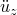 (m/s2) | 47.6/40.9 | 42.1/50.8 | 49.6/49.9 | 83.8/91.0 |
| The high acceleration amplitude reported for the Abaqus direct integration analysis occurs only during the first few increments, after which it reduces to 31.6/48.6 m/s2. |

**Table 2.2.2–5** Peak reaction forces at supports (in kN).
| Support number | Measured (Anco) | Abaqus |
| --- | --- | --- |
| Modal, 2.8% modal damping | Modal, Rayleigh damping | Direct integration |
| FW-R-11 | 16.44/19.22 | 19.80/13.42 | 19.90/14.26 | 21.82/15.76 |
| FW-R-13 | 15.10/29.91 | 18.94/24.45 | 19.46/23.61 | 28.50/21.98 |
| FW-R-14 | 7.22/12.00 | 9.34/7.35 | 10.23/10.00 | 12.54/9.03 |
| FW-R-17 | 34.40/26.20 | 7.50/10.59 | .17/9.25 | 7.91/10.97 |
| FW-R-18 | 14.30/14.40 | 33.26/32.06 | 33.58/31.61 | 33.46/32.63 |
| FW-R-20 | 25.60/26.90 | 7.54/8.79 | 7.98/8.50 | 8.07/10.60 |
| FW-R-21 | 24.50/23.80 | 25.55/24.47 | 26.38/25.30 | 27.78/25.26 |
| FW-R-23 | 15.30/16.00 | 25.39/24.63 | 26.06/25.36 | 25.40/24.35 |
| FW-R-24 | 9.61/7.30 | 7.17/6.87 | 7.69/7.20 | 8.23/8.64 |
| FW-R-25 | 6.77/6.21 | 3.48/4.36 | 3.34/4.55 | 7.13/4.71 |
| FW-R-27 | 3.76/3.04 | 4.12/4.00 | 3.78/3.80 | 4.29/4.43 |
| FW-R-28 | 1.10/1.82 | 1.53/1.08 | 1.62/1.15 | 1.79/1.44 |

### Figures

**Figure 2.2.2–1** Indian Point boiler feedwater line: modern supports, Configuration 1.

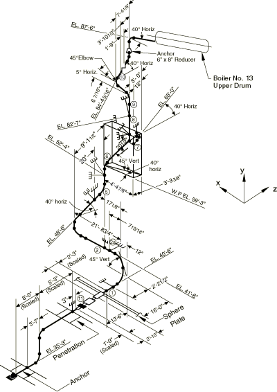

**Figure 2.2.2–2** Basic mesh and substructure models.

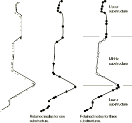

**Figure 2.2.2–3** *z*-displacement at node 27, modal analysis with 24 modes.

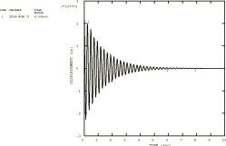

**Figure 2.2.2–4** *z*-displacement at node 27, modal analysis with 6 modes.

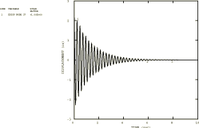

**Figure 2.2.2–5** *z*-displacement at node 27, direct integration analysis.

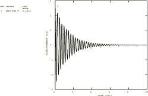

**Figure 2.2.2–6** *z*-direction acceleration at node 27, modal analysis with 24 modes.

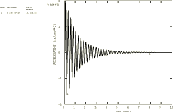

**Figure 2.2.2–7** Force in spring support FW–R–11, modal analysis with 24 modes.

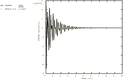

**Figure 2.2.2–8** Comparison of *z*-direction acceleration at node 33 between experimental steady-state results (solid line) and Abaqus (dashed line).

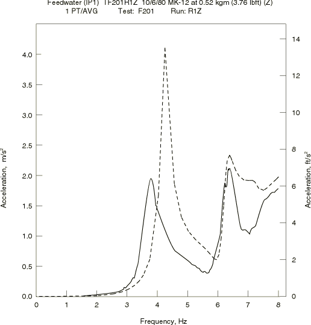

**Figure 2.2.2–9** Comparison of force in spring support FW–R–21 between experimental steady-state results (solid line) and Abaqus (dashed line).

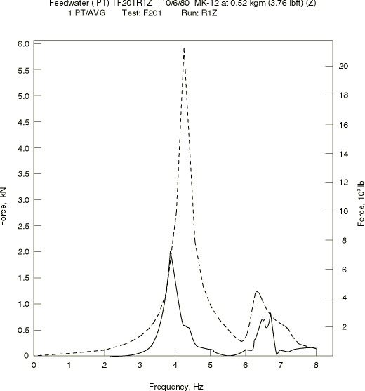

