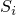
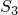
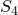
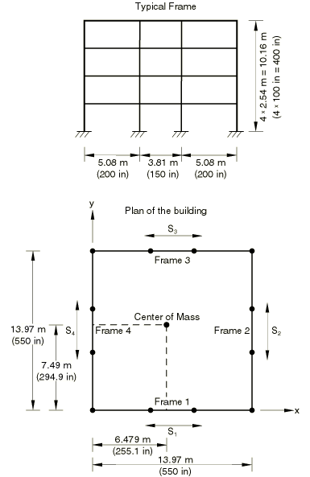

# 2.2.3 三维框架建筑的反应谱分析

**产品：** Abaqus/Standard  

本示例的目的是验证反应谱程序中固有模式的不同叠加方法。为了比较Abaqus中可用的五种不同方法，我们检查了一个具有紧密间隔模式的三维模型。

### 几何结构和模型

分析了一个四层钢框架建筑。建筑中所有柱子具有相同的几何属性。然而，如图2.2.3-1所示（ch02s02aex82.md#sxm3dframe-system），框架1和2中的梁属性与框架3和4中的不同，以将结构的质量中心移离其几何中心。对模型进行的特征值提取表明，覆盖高达40 Hz频率范围的30个模式中有许多是紧密间隔的。基于El Centro地震记录的加速度谱被施加在x-y平面上。[frameresponsespect_acc.f](../eif/frameresponsespect_acc.f)中给出的FORTRAN程序用于生成谱。频率范围选择在0.1 Hz到40 Hz之间，谱计算的点数量设置为501。仅为2%阻尼请求了一条谱曲线。

### 结果与讨论

如"Abaqus Benchmarks Guide"第1.4.9节"Rod under dynamic loading下的线性分析"中所述（../bmk/bmk-link.md#bmk-anl-rodlindynamic），对于具有分离良好的模式的结构，TENP和CQC方法简化为SRSS方法，而NRL和ABS方法给出相似的结果。因此，对于此类结构，两种叠加规则就足够了，ABS提供更保守的结果。然而，当分析具有紧密间隔模式的结构时，五种叠加规则都可能产生非常不同的结果。这在三维问题中更为明显。在本示例中，地震运动的平面沿x轴，因此我们预期结构响应将由框架1和3主导，并将导致x方向的显著基底剪力。所有五种方法与使用相同El Centro加速度记录的模态时程响应进行了比较，如表2.2.3-1所示（ch02s02aex82.md#table-3dframe-compare-forces），其中每个框架平面中的基底剪力被叠加为，其中i是框架编号。此比较表明，CQC方法产生了最佳近似。其他方法高估了y方向的剪力，其中一些低估了x方向的基底剪力。CQC方法通常推荐用于具有紧密间隔结构模式的不对称三维问题。该方法通过交叉模式相关系数考虑模式形状的符号，可以正确预测与激励方向垂直的方向上的响应。

### 输入文件

[frameresponsespect_freq.inp](../eif/frameresponsespect_freq.inp)

[*FREQUENCY*](../key/key-link.md#usb-kws-hfrequency) 分析。

[frameresponsespect_rs.inp](../eif/frameresponsespect_rs.inp)

[*RESPONSE SPECTRUM*](../key/key-link.md#usb-kws-hresponspec) 分析。

[frameresponsespect_modal.inp](../eif/frameresponsespect_modal.inp)

[*MODAL DYNAMIC*](../key/key-link.md#usb-kws-hmodaldyn) 分析。要运行此文件，用户必须获取文件cantilever_quakedata.inp并将其复制到`QUAKE.AMP`。

[frameresponsespect_acc.f](../eif/frameresponsespect_acc.f)

FORTRAN程序，将生成运行frameresponsespect_rs.inp所需的加速度谱。要运行此程序，用户必须获取文件cantilever_quakedata.inp并将其复制到`QUAKE.AMP`。

### 表格

**表2.2.3-1** 不同叠加方法的基底剪力比较。
| 方法 |  (kip) |  (kip) |  (kip) |  (kip) |
| --- | --- | --- | --- | --- |
| 时程 | 25.5 | 14.0 | 37.0 | 22.8 |
| ABS/ALG | 48.3 | 48.3 | 65.1 | 65.1 |
| SRSS/ALG | 18.4 | 18.4 | 24.8 | 24.8 |
| TENP/ALG | 28.9 | 28.9 | 35.9 | 35.9 |
| NRL/ALG | 25.9 | 25.9 | 34.6 | 34.6 |
| CQC/ALG | 23.3 | 13.0 | 29.0 | 20.7 |

### 图表

**图2.2.3-1** 三维框架系统。

