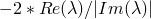
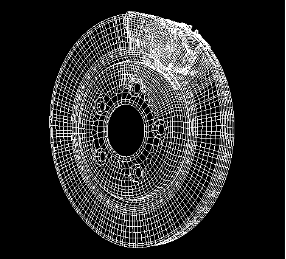
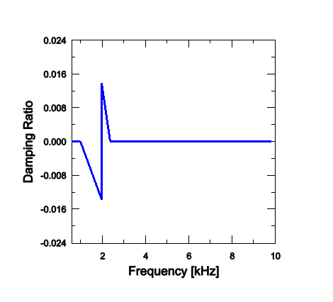
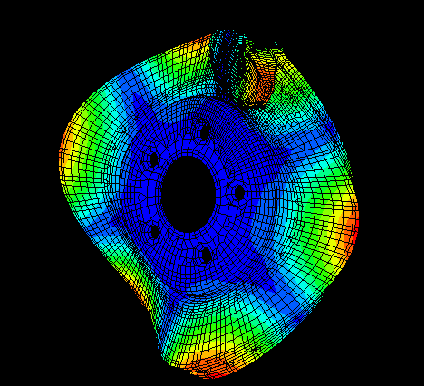
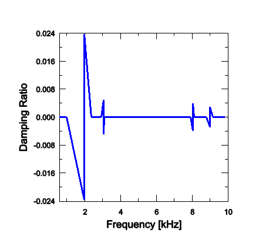

# 2.2.4 Brake squeal analysis

**Product: **Abaqus/Standard  

This example illustrates the use of the complex eigenvalue extraction procedure (["Complex eigenvalue extraction," Section 6.3.6 of the Abaqus Analysis User's Guide](../usb/usb-link.md#usb-anl-acomplexfreqextract)) in a brake squeal analysis. Disc brakes operate by pressing a set of brake pads against a rotating disc. The friction between the pads and the disc causes deceleration, but it may also induce a dynamic instability of the system, known as brake squeal. One possible explanation for the brake squeal phenomenon is the coupling of two neighboring modes. Two modes, which are close to each other in the frequency range and have similar characteristics, may merge as the friction contribution increases. When these modes merge at the same frequency (become coupled), one of them becomes unstable. The unstable mode can be identified during complex eigenvalue extraction because the real part of the eigenvalue corresponding to an unstable mode is positive. The brake system design can be stabilized by changing the geometry or material properties of the brake components to decouple the modes.

The purpose of this analysis is to identify the unstable modes (if they exist) in a particular disc brake system.

### Problem description and model definition

The brake model used in this example is a simplified version of a disc brake system  used in domestic passenger vehicles. The simplified model consists of a rotor and two pads positioned on both sides of the rotor. The pads are made of an organic friction material, which is modeled as an anisotropic elastic material. The rotor has a diameter of 288 mm and a thickness of 20 mm and is made of cast iron. The back plates and insulators are positioned behind the pads and are made of steel. In this problem material damping is ignored. The mesh (shown in [Figure 2.2.4--1](ch02s02aex83.md#brakesqueal-mesh)) is generated using C3D6 and C3D8I elements. Contact is defined between both sides of the rotor and the pads using the small-sliding contact formulation. Initially, the friction coefficient is set to zero.

Contact between the rotor and the pads is established initially in the first step by applying pressure to the external surfaces of the insulators. In the next step a rotational velocity of =5 rad/s is imposed on the rotor using the prescribed rotational motion. The imposed velocity corresponds to braking at low velocity. The friction coefficient, , is also increased to 0.3 using a change to friction properties. In general, the friction coefficient can depend on the slip rate, contact pressure, and temperature. If the friction coefficient depends on the slip rate, the velocity imposed by the motion predefined field is used to determine the corresponding value of . The friction coefficient is ramped from zero up to the desired value to avoid the discontinuities and convergence problems that may arise because of the change in friction coefficient that typically occurs when bodies in contact are moving with respect to each other. This issue is described in detail in ["Static stress analysis," Section 6.2.2 of the Abaqus Analysis User's Guide](../usb/usb-link.md#usb-anl-astatic). The unsymmetric solver is used in this step. At the end of the step a steady-state braking condition is obtained.

In the next step the eigenvalue extraction procedure is performed in this steady-state condition. Because the complex eigensolver uses the subspace projection technique, the real eigenvectors are extracted first to define the projection subspace. In the eigenvalue extraction procedure the tangential degrees of freedom are not constrained at the contact nodes at which a velocity differential is defined. One hundred real eigenmodes are extracted and, by default, all of them are used to define the projection subspace. The subspace can be reduced by selecting the eigenmodes to be used in the complex eigenvalue extraction step. The complex eigenvalue analysis is performed up to 10 kHz (the first 55 modes).

### Results and discussion

[Figure 2.2.4--2](ch02s02aex83.md#brakesqueal-freqdamp1) shows the damping ratio as a function of frequency. The damping ratio is defined as , where  is a complex eigenvalue. A negative value of the damping ratio indicates an unstable mode. In the range of interest the complex eigensolver found an unstable mode at the frequency 2.0 kHz with a damping ratio of 0.0138. [Figure 2.2.4--3](ch02s02aex83.md#brakesqueal-mode1) presents the unstable mode as the combined magnitude of both the real and imaginary components of the complex eigenvector.

In the second analysis the value of the friction coefficient between the rotor and the pads is increased to 0.5. Because the real eigenvectors do not differ significantly between the problems with different friction coefficients, the eigenspace determined in the first analysis can be reused as the projection subspace for the second complex eigenvalue extraction procedure. The analysis is restarted after the frequency extraction step of the preceding run, and two new procedure steps are defined. In the first nonlinear static step the friction coefficient is increased by changing friction properties, followed by the complex eigenvalue extraction in the second step. The results are presented in the form of a damping ratio plot, shown in [Figure 2.2.4--4](ch02s02aex83.md#brakesqueal-freqdamp2). In this case four unstable modes at 2.0, 3.0, 8.0, and 9.0 kHz are found. As the friction coefficient is increased, more neighboring modes couple and become unstable.

### Acknowledgments

SIMULIA would like to thank Dr. Li Jun Zeng of TRW Automotive for supplying the disc brake model used in this example.

### Input files

[brake_squeal.inp](../eif/brake_squeal.inp)

The initial brake squeal analysis with a friction coefficient =0.3.

[brake_squeal_node.inp](../eif/brake_squeal_node.inp)

Nodal coordinates for the brake model.

[brake_squeal_elem.inp](../eif/brake_squeal_elem.inp)

Element definitions for the brake model.

[brake_squeal_res.inp](../eif/brake_squeal_res.inp)

The restarted brake squeal analysis with a friction coefficient =0.5.

### Figures

**Figure 2.2.4–1** Geometry and mesh of the disc brake system.

**Figure 2.2.4–2** Damping ratios for the analysis with =0.3.

**Figure 2.2.4–3** The unstable mode at 2.0 kHz in the analysis with =0.3.

**Figure 2.2.4–4** Damping ratios for the analysis with =0.5.

