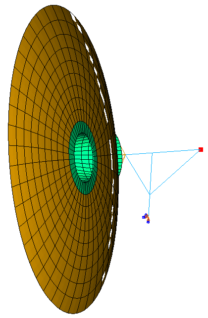
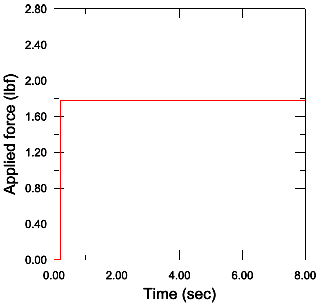
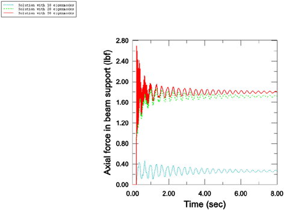
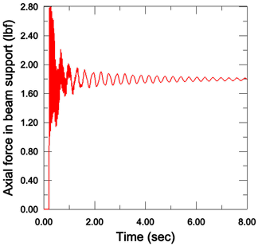

# 2.2.5 Dynamic analysis of antenna structure utilizing residual modes

**Product: **Abaqus/Standard  

This example illustrates the use of residual modes in a modal dynamic analysis. The residual modes capability is a cost-effective approach to correct inaccuracies due to modal truncation that are often prevalent in modal dynamic analyses. For performance reasons, usually only a relatively small subset of the total possible eigenmodes is extracted for the model. This set of eigenmodes typically is chosen to cover adequately the frequency content of the applied loads in the modal dynamic analysis. However, this criterion alone does not guarantee that the system will be represented adequately by this set of eigenmodes; consequently, inaccuracies can occur in the modal dynamic solution. Fortunately, adding a few residual modes to the set of eigenmodes can significantly improve the solution at a relatively low cost compared to extracting additional eigenmodes arbitrarily.

### Geometry and problem description

The model used for this study is a relatively simple antenna structure that has shell elements for the dish with beam elements for the support, as shown in [Figure 2.2.5--1](ch02s02aex84.md#exa-dyn-antennamodel). The objective is to calculate the total force in the main support beam due to a force dynamically applied to the antenna. The bottom of the antenna is completely fixed to the ground. The force is applied in the vertical direction as a step function of magnitude 1.78 lbf, as shown in [Figure 2.2.5--2](ch02s02aex84.md#exa-dyn-appliedforce).

### Models

Four models are created to demonstrate modal truncation inaccuracies and comparisons of the results using residual modes with a relatively small number of eigenmodes to the results using no residual modes but many eigenmodes.

The finite element discretization and excitation environment are the same in all models. The only difference between the models is the number of eigenmodes extracted and subsequently used in the modal dynamic analysis. More specifically, the first three models use 10, 20, and 50 eigenmodes, respectively; and the fourth model uses 10 eigenmodes in addition to a single residual mode.

### Procedure

Following the usual procedure for modal dynamics, the eigenmodes are first extracted in a frequency step. This step is followed by a modal dynamics step in which the forcing excitation is applied.

To activate the residual mode capability, a static perturbation step must precede the frequency extraction step. The same loading pattern that is given in the modal dynamics step must be applied in the static perturbation step. In addition, residual modes must be extracted in the frequency step. The modal dynamics step remains the same as in the case without residual modes.

### Results and discussion

Since the magnitude of the applied load is 1.78 lbf, the static solution for the total axial force in the main support beam is also 1.78 lbf. When the modal dynamic analysis is performed, modal truncation inaccuracies become evident. [Figure 2.2.5--3](ch02s02aex84.md#exa-dyn-eigenmodesolutions) shows the force results using 10, 20, and 50 eigenmodes. For the 10-eigenmode case, the peak force in the support beam is only 0.4 lbf. If 20 eigenmodes are included, the peak force jumps to 1.7 lbf. If 50 eigenmodes are used, the peak force is 2.5 lbf and the correct static response of 1.78 lbf is recovered.

The answers vary because of modal truncation. The excitation history is a step function and, thus, includes the full span of frequency content. Similarly, since the excitation is applied at a single point, it can be accurately represented in the modal analysis only by using a large span of eigenmodes. Since a very large number of eigenmodes are potentially excited due to the temporal and spatial characteristics of the excitation, it is necessary to extract and use many eigenmodes. It is possible to determine how many eigenmodes are needed by looking at the total effective mass of the extracted modes or by performing a convergence study by systematically increasing the number of eigenmodes used in the modal dynamics analysis, similar to the study conducted above.

A much less time-consuming approach (in terms of human intervention and analysis cost) for achieving more accurate results is to use the residual modes capability. Due to the nature of the loading in this analysis, the residual mode capability is particularly useful in capturing the mode shape that dominates the static response. [Figure 2.2.5--4](ch02s02aex84.md#exa-dyn-residualmodesolution) shows that a single residual mode combined with only 10 eigenmodes yields the correct solution. The residual modes approach (with a total of only 11 modes) produces essentially the same accuracy as using 50 pure eigenmodes.

### Input files

[antenna_10.inp](../eif/antenna_10.inp)

Modal dynamic analysis of antenna structure using 10 system eigenmodes.

[antenna_20.inp](../eif/antenna_20.inp)

Modal dynamic analysis of antenna structure using 20 system eigenmodes.

[antenna_50.inp](../eif/antenna_50.inp)

Modal dynamic analysis of antenna structure using 50 system eigenmodes.

[antenna_10_resvec.inp](../eif/antenna_10_resvec.inp)

Modal dynamic analysis of antenna structure using 10 eigenmodes plus residual modes.

### Figures

**Figure 2.2.5–1** Antenna model.

**Figure 2.2.5–2** Excitation history.

**Figure 2.2.5–3** Axial force in main support beam due to dynamic excitation using 10, 20, and 50 eigenmodes.

**Figure 2.2.5–4** Axial force in main support beam due to dynamic excitation using 10 eigenmodes and residual modes.

