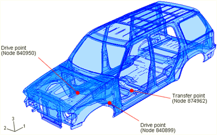
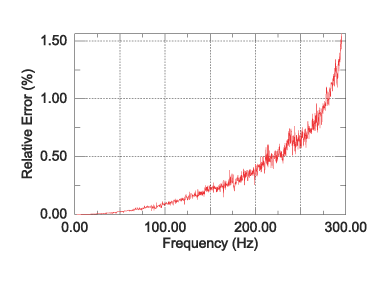
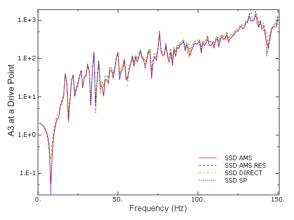
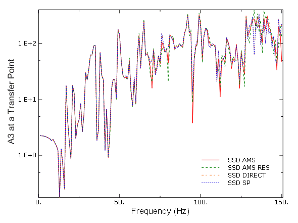

# 2.2.6 白车身模型的稳态动态分析

**产品：** Abaqus/Standard  Abaqus/AMS  

### 目标

本示例演示了Abaqus的以下特征和技术，用于频率提取和稳态动态分析：
- 在频率提取步骤中使用自动多级子结构（AMS）特征求解器以及残余模式；
- 在使用AMS特征求解器的频率提取步骤期间投影全局材料结构阻尼算子；
- 使用具有材料结构阻尼的基于SIM的稳态动态分析程序；和
- 演示使用AMS特征求解器的基于SIM的稳态动态分析程序与使用Lanczos特征求解器的基于子空间的稳态动态分析程序相比的性能优势。

### 应用描述

本示例通过固有模式和频率响应函数检查白车身（BIW）模型的结构行为。此外，本示例演示了稳态动态分析程序与AMS特征求解器和SIM架构的使用（参见"Abaqus Analysis User's Guide"第6.3.1节"Dynamic analysis procedures: overview"中的"Using the SIM architecture for modal superposition dynamic analyses"）（../usb/usb-link.md#usb-anl-alineardynamics）。如图2.2.6-1所示的模型（ch02s02aex85.md#exa-dyn-biw-model）来自国家高速公路交通安全管理局（NHTSA）网站（http://www-nrd.nhtsa.dot.gov/departments/nrd-11/FEA_models.md）。该模型包含材料结构阻尼。

本示例的主要目标是演示使用AMS特征求解器的基于SIM的稳态动态分析程序与基于子空间的稳态动态分析程序相比显著的性能提升。在执行稳态动态分析之前，使用AMS特征求解器计算无阻尼特征解。该模型的全局截止频率为300 Hz，因此提取300 Hz以下的全局固有模式。在AMS特征求解器的简化阶段，提取1500 Hz以下的所有子结构固有模式，并使用默认的值5计算全局特征解。此外，材料结构阻尼算子被投影到全局固有模式子空间上。

### 几何结构

该模型由包括固定挡风玻璃的框架车身的裸金属壳组成。该模型有127,213个单元和794,292个有效自由度，总共定义了1107个紧固件来模拟框架车身中的点焊。

### 材料

所有壳单元使用线性弹性材料，材料结构阻尼值为0.01，应用于车顶、地板、发动机罩和车身侧面。这种阻尼导致每频率点必须求解的完整系统模态方程。

### 边界条件和载荷

该结构未受约束，因此模型中有六个刚体模式。将两个集中载荷施加到车体底部两个枢轴点的节点上，以模拟稳态动态分析中车辆的滚动运动。

### Abaqus建模方法和模拟技术

本分析的目标是理解由于滚动运动导致的白车身模型的总体结构响应。通过研究驱动点节点和传递点节点处的频率响应来评估响应。

与使用Lanczos特征求解器的基于子空间的稳态动态分析程序相比，使用AMS特征求解器的基于SIM的稳态动态分析程序显示出显著的性能优势，具有可接受的精度。通过比较基于SIM和基于子空间的稳态动态分析的频率响应函数来评估基于SIM的稳态动态解决方案的精度。

驱动点和传递点响应分别在节点840950和874962计算，以演示使用AMS特征求解器计算的固有模式的基于SIM的稳态动态分析程序的精度。该模型在全局截止频率以下有1210个全局固有模式，包括6个刚体模式。AMS特征求解器在300 Hz的全局截止频率以下近似了1188个全局固有模式，在1 Hz增量下计算150 Hz以下的频率响应解决方案。还添加了两个残余模式，以演示使用更少全局模式提高效率的方法。

### 分析案例摘要

| 案例1 | 使用AMS的基于SIM的稳态动态分析。 |
| --- | --- |
| 案例2 | 使用Lanczos的基于子空间的稳态动态分析。 |
| 案例3 | 直接解稳态动态分析。 |

### 分析类型

频率提取步骤之后是稳态动态分析步骤。频率提取步骤的全局截止频率为300 Hz，考虑的频率范围为1-150 Hz，增量为1 Hz。对于基于子空间的稳态动态分析，使用300 Hz以下的1000个固有模式。对于基于SIM的稳态动态分析，使用300 Hz以下的所有固有模式（约1200个固有模式）。

### 结果讨论和案例比较

AMS特征求解器计算的固有频率的精度通过假设Lanczos特征求解器计算的固有频率是精确的来评估，相对误差如图2.2.6-2所示（ch02s02aex85.md#exa-dyn-biw-freqerror）。这些误差在全局截止频率300 Hz以下小于1.6%。在150 Hz以下（特别感兴趣的区域），误差小于0.25%，频率响应函数中的共振峰值相当准确。

通过比较频率响应曲线定性地评估稳态动力学解决方案的精度。在两个不同的输出位置比较响应曲线：驱动点节点和传递点节点。

图2.2.6-3（ch02s02aex85.md#exa-dyn-biw-driveptfrf）显示了节点840950处的点惯性；标有`SSD DIRECT`的曲线表示直接解稳态动态分析程序，标有`SSD SP`的曲线表示基于子空间的稳态动态分析程序，标有`SSD AMS`的曲线表示基于SIM的稳态动态分析程序，标有`SSD AMS RES`的曲线表示带残余模式的基于SIM的稳态动态分析程序。对于125 Hz以下的频率，曲线几乎无法区分。为了提高响应函数的精度，可以添加残余模式来补偿高频截断误差。通过在AMS特征值提取步骤中指定施加力的节点来请求残余模式的计算。对于此解决方案（`SSD AMS RES`），全局截止频率设置为225 Hz而不是300 Hz，以证明可以降低全局截止频率而不会失去准确性。通过将全局截止频率降低到225 Hz并在全局固有模式子空间中添加两个残余模式，可以实现约25%的加速。

图2.2.6-4（ch02s02aex85.md#exa-dyn-biw-transptfrf）显示了驾驶员座椅底部节点的传递惯性；上面讨论的相同曲线标签在此图中使用。由基于SIM的稳态动态分析程序计算的频率响应与由基于子空间的稳态动态分析程序和直接解稳态动态分析程序计算的频率响应在125 Hz以下几乎匹配。为了提高125 Hz以上频率的精度，应该提取和使用更多固有模式。

三种稳态动态分析程序的总体性能比较总结在表2.2.6-1中（ch02s02aex85.md#exa-dyn-biw-tableperf）（分析成本与是否使用残余模式无关）。性能在具有单个处理器的Linux/x86-64服务器上评估。每次运行的可用内存设置为16 GB。显然，使用AMS特征求解器的基于SIM的稳态动态分析程序与使用Lanczos特征求解器的基于子空间的稳态动态分析程序或直接解稳态动态分析程序相比，表现出优异的性能。

### 输入文件

[biw_modeldata.inp](../eif/biw_modeldata.inp)

BIW模型数据的输入文件。

[biw_freq_ams.inp](../eif/biw_freq_ams.inp)

使用AMS特征求解器对BIW模型进行频率提取分析。

[biw_ssd_ams.inp](../eif/biw_ssd_ams.inp)

使用AMS特征解对BIW模型进行基于SIM的稳态动态分析。

[biw_freq_ams_res.inp](../eif/biw_freq_ams_res.inp)

使用AMS特征求解器（包括残余模式）进行频率提取分析。

[biw_ssd_ams_res.inp](../eif/biw_ssd_ams_res.inp)

使用AMS特征解（包括残余模式）进行基于SIM的稳态动态分析。

[biw_freq_lnz.inp](../eif/biw_freq_lnz.inp)

使用Lanczos特征求解器对BIW模型进行频率提取分析。

[biw_ssd_lnz.inp](../eif/biw_ssd_lnz.inp)

使用Lanczos特征解对BIW模型进行基于子空间的稳态动态分析。

[biw_ssd_dir.inp](../eif/biw_ssd_dir.inp)

BIW模型的直接解稳态动态分析。

### 参考文献

**Abaqus Analysis User's Guide**
- "Abaqus Analysis User's Guide"第6.3.1节"Dynamic analysis procedures: overview"中的"Using the SIM architecture for modal superposition dynamic analyses"（../usb/usb-link.md#usb-anl-alineardynamics）
- "Abaqus Analysis User's Guide"第6.3.4节"Direct-solution steady-state dynamic analysis"（../usb/usb-link.md#usb-anl-asteadystdyndirect）
- "Abaqus Analysis User's Guide"第6.3.5节"Natural frequency extraction"（../usb/usb-link.md#usb-anl-afreqextraction）
- "Abaqus Analysis User's Guide"第6.3.8节"Mode-based steady-state dynamic analysis"（../usb/usb-link.md#usb-anl-asteadystdyn）
- "Abaqus Analysis User's Guide"第6.3.9节"Subspace-based steady-state dynamic analysis"（../usb/usb-link.md#usb-anl-asteadystdynsubspace）

**Abaqus Keywords Reference Guide**
- [*FREQUENCY*](../key/key-link.md#usb-kws-hfrequency)
- [*STEADY STATE DYNAMICS*](../key/key-link.md#usb-kws-hsteadystdyn)

**Abaqus Verification Guide**
- "Abaqus Verification Guide"第3.24.1节"Steady-state dynamics with nondiagonal damping using the AMS eigensolver"（../ver/ver-link.md#ver-prc-ssddamp）

### 表格

**表2.2.6-1** 稳态动态分析程序的整体性能比较（hh:mm:ss）。
| 性能 | 带AMS的SSD | 带Lanczos的SSD SP | SSD DIRECT |
| --- | --- | --- | --- |
| 总运行时间 | 00:06:31 | 03:20:45 | 05:58:54 |
| 特征求解器运行时间 | 00:05:35 | 01:36:24 | N/A |
| SSD运行时间 | 00:00:56 | 01:44:21 | 05:58:54 |

### 图表

**图2.2.6-1** 运动型多功能车的白车身模型。

**图2.2.6-2** 在全局截止频率300 Hz以下，AMS计算的固有频率相对于Lanczos计算的固有频率的相对误差。

**图2.2.6-3** 节点840950处的点惯性。

**图2.2.6-4** 节点874962处的传递惯性。

