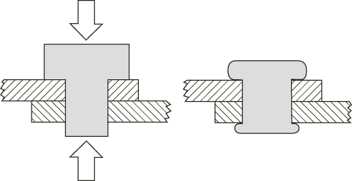
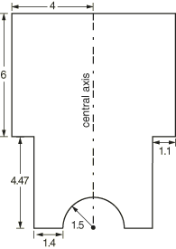
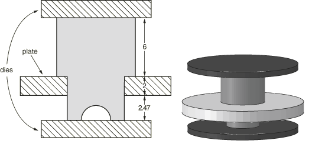
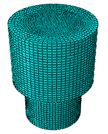
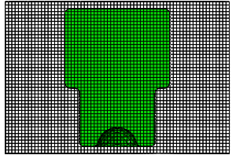
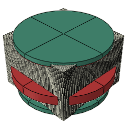
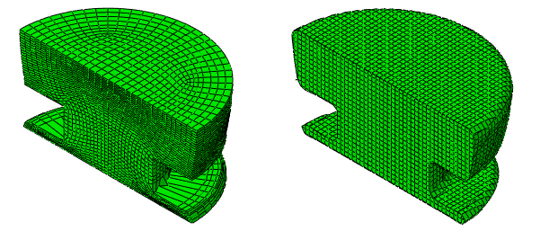
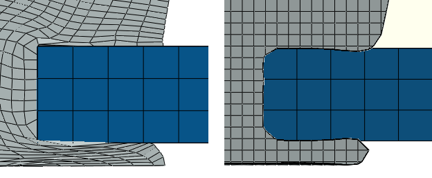
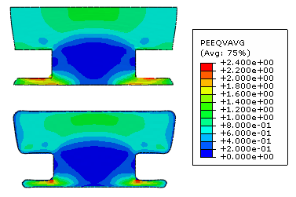
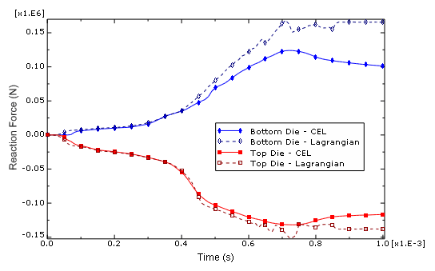

# 2.3.1 铆钉成形

**产品：** Abaqus/Explicit  Abaqus/CAE  

### 目标

本示例问题展示了 Abaqus/Explicit 成形分析的以下几个方面：
- 使用耦合欧拉-拉格朗日（CEL）分析 formulation 来分析经历极端变形的固体力学模型，以及
- 将基于 CEL 的分析结果与使用传统拉格朗日 formulation 的相同模型进行比较。

### 应用描述

铆钉是一种设计用于在两个或多个材料板之间形成永久连接的紧固件。铆钉设计通常由一个具有两种直径的圆柱体组成：较小的直径穿过重叠板上的孔，然后压缩铆钉的两端。压缩有效地扩大了铆钉体的直径，将材料板夹在铆钉两端之间（参见[图 2.3.1-1](ch02s03aex86.md#exa-dyn-rivet-sample)）。不同的铆钉设计和应用会经历不同的变形，但基本原理在所有情况下都是相同的。

本示例通过模拟其压缩（也称为成形过程）来研究特定铆钉的有效性。本研究中三个问题尤为重要：
- 铆钉在成形过程中是否适当变形？
- 成形过程后，铆钉是否保持足够的强度以维持对紧固材料的夹持？
- 铆钉安装工具是否能够成形铆钉？

成形模拟过程中的位移表明铆钉是否适当变形。变形后，铆钉的强度主要基于其材料特性；检查铆钉中的等效塑性应变可以了解材料中潜在的损伤或强度退化。为了评估铆钉对安装工具的影响，可以将工具中的反作用力与标准安装工具中的已知力容量进行比较。

### 几何结构

本分析中使用的铆钉是一个简单的多直径圆柱体，如上所述。为了帮助铆钉较小端的变形，从圆柱体中心移除一个半球部分。[图 2.3.1-2](ch02s03aex86.md#exa-dyn-rivet-dims) 显示了铆钉模型的尺寸。

为了模拟成形，将铆钉放置在圆形板中心的孔中。代表安装工具的圆形模具位于铆钉的顶端和底端（参见[图 2.3.1-3](ch02s03aex86.md#exa-dyn-rivet-model)）。

### 材料

该模型中的铆钉由弹塑性钢组成，密度为 7.85×10⁹ t/mm³，弹性模量为 2.1×10⁵ N/mm²，泊松比为 0.266，塑性屈服起始于 3.0×10⁵ N/mm²。

板和模具被认为比铆钉硬得多，这些部件预计不会变形。

### 边界条件和载荷

通过施加位移边界条件来模拟成形过程。板被约束在固定位置。上模具向下位移 3 mm，同时下模具向上位移 2 mm。

### 相互作用

必须在铆钉和所有安装工具部件之间强制执行接触相互作用；铆钉的变形取决于通过工具位移传递的接触载荷。工具部件从不相互接触，因此可以忽略板和模具之间的相互作用。

### Abaqus 建模方法和仿真技术

铆钉成形模拟在 Abaqus/Explicit 中使用两种根本不同的单元 formulation 进行。传统的拉格朗日 formulation 通常提供精度和计算效率，但纯拉格朗日模型在经历极端变形时往往会出现网格畸变和相关精度损失。欧拉 formulation 以牺牲一些几何和结果精度换取在涉及非常大变形的分析中的稳健性；在拉格朗日 formulation 产生不可靠的解决方案或根本无法求解的情况下，可以使用欧拉 formulation 来获得合理的解决方案。

拉格朗日单元和欧拉单元可以使用称为耦合欧拉-拉格朗日（CEL）分析的技术在同一模型中组合。在 CEL 分析中，经历大变形的物体用欧拉单元网格划分，而模型中较硬的物体用更有效的拉格朗日单元网格划分。

铆钉成形分析使用两种方法进行：纯拉格朗日方法，其中铆钉、板和模具都使用拉格朗日单元建模；以及耦合欧拉-拉格朗日方法，其中铆钉使用欧拉单元建模，而板和模具使用拉格朗日单元建模。

### 分析案例摘要

| 案例 1 | 纯拉格朗日铆钉成形分析。 |
| --- | --- |
| 案例 2 | 耦合欧拉-拉格朗日（CEL）铆钉成形分析。 |

以下各节详细说明了两个分析案例共同的建模技术。

### 分析类型

两个分析案例都使用准静态显式动力学过程进行。成形过程在一个持续 1 ms 的单一步骤中完成。

### 材料模型

铆钉材料使用各向同性硬化 Mises 塑性模型。用于定义塑性行为的应力-应变数据点如[表 2.3.1-1](ch02s03aex86.md#exa-dyn-rivet-plastic)所示。

### 边界条件

在两个分析案例中，板和模具都建模为施加了刚体约束的拉格朗日体。在板体的参考点上施加阻止位移和旋转的边界条件。边界条件也应用于每个模具的参考点，以防止它们旋转或位移，但在垂直 3 方向除外：顶部参考点的边界条件使其在负 3 方向上位移 3 mm，底部参考点的边界条件使其在正 3 方向上位移 2 mm。边界条件的应用由幅值控制，在 0.8 ms 期间将位移从零线性 ramp 到全位移；然后在分析的最后 0.2 ms 中将模具固定到位。

### 约束

如上所述，刚体约束应用于板和两个模具。这些部件被认为比铆钉硬得多，在成形过程中不会变形。刚体约束提高了计算效率，并允许使用简单的边界条件来启动成形。

### 输出请求

专门请求了模型中等效塑性应变（PEEQ）的场输出。此外，还请求了每个模具参考点在 3 方向（RF3）上反作用力的历史输出。

### 纯拉格朗日分析案例

第一个分析案例使用从离散几何部件实例创建的四个拉格朗日体。在纯拉格朗日情况下，模型的几何形状直接对应于被建模部件的形状，使装配过程相当直观。

### 网格设计

铆钉使用 C3D8R 单元网格划分，全局网格种子为 0.25 mm（参见[图 2.3.1-4](ch02s03aex86.md#exa-dyn-rivet-lagmesh)）。

板和模具也使用 C3D8R 单元网格划分，但应用于这些部件的刚体约束使单元选择有些任意。本可以使用无网格解析刚体表面来建模板和模具，但使用刚体约束是为了与 CEL 模型保持一致。

### 相互作用

通用接触定义强制执行模型中所有体之间的接触相互作用。摩擦、无硬接触模型控制所有相互作用。

### 求解控制

虽然分析中预期会有大变形，但没有向模型应用特殊的求解控制或分析技术（如自适应网格划分），从而允许在纯拉格朗日模型和 CEL 模型之间进行直接比较。

### CEL 分析案例

在第二个分析案例中，铆钉使用欧拉单元建模。板和模具仍然是刚体。CEL 分析中的建模方法与纯拉格朗日情况有一些明显不同。

### 网格设计

在欧拉 formulation 中，网格通常不对应于被建模部件的几何形状；相反，材料在欧拉网格内的放置定义了部件的几何形状。欧拉网格不会变形或位移；只有网格内的材料可以移动。通常，欧拉网格是规则六面体单元的任意集合，完全包含分析过程中材料可能存在的区域。

在本示例中，欧拉部件是一个 17×17×11.5 mm 的矩形棱柱，使用 EC3D8R 单元网格划分。0.25 mm 的全局网格种子决定单元尺寸。

此网格不定义铆钉的几何形状；相反，网格定义了铆钉材料可以存在的域。铆钉几何形状通过将钢材料分配给此网格的对应于铆钉形状的部分来定义，如下面"[初始条件](ch02s03aex86.md#exa-dyn-rivet-ic)"节中所讨论的。欧拉技术的一个优势是能够独立于被建模部件的几何形状来定义规则、高质量的网格。

重要的是，欧拉网格必须足够大，以完全容纳变形过程中的铆钉材料；如果材料到达网格边缘，它会流出模型并丢失到仿真中。

### 初始条件

铆钉几何形状使用欧拉网格上的材料分配初始条件定义。材料分配指定网格中哪些单元最初包含钢。每个单元被指定一个百分比（称为体积分数），表示该单元中填充钢的部分。对于部分填充的单元，Abaqus 将材料定位在单元中，使其与相邻单元中的材料形成连续表面。最终结果是网格中材料分布对应于铆钉几何形状，如[图 2.3.1-5](ch02s03aex86.md#exa-dyn-rivet-matassign)所示。您可以使用 Abaqus/CAE 的 Visualization 模块中的视图切割管理器来可视化欧拉网格中材料的范围，如"查看欧拉分析输出，" Abaqus/CAE User's Guide 第 28.7 节中所讨论的。

材料分配是使用 Abaqus/CAE 中的体积分数工具创建的。体积分数工具计算欧拉网格与某些参考几何部件之间的重叠。要将此体积分数工具用于本分析案例，整个拉格朗日装配（包括拉格朗日铆钉）从前一个分析案例复制并定位在欧拉网格内（参见[图 2.3.1-6](ch02s03aex86.md#exa-dyn-rivet-eulassembly)）。拉格朗日铆钉用作参考部件，体积分数工具创建一个离散场，该场将欧拉网格中的每个单元与基于该单元内铆钉所占用空间的体积分数相关联。然后可以将此离散场用作 Abaqus/CAE 中材料分配预定义场的基础。

### 相互作用

通用接触定义强制执行模型中所有刚体和欧拉材料之间的接触相互作用。通用接触不在刚体和欧拉单元之间强制执行接触；刚体可以不受阻碍地穿过欧拉网格，直到遇到网格内的材料。与纯拉格朗日情况一样，摩擦、无硬接触模型控制所有相互作用。

通常不建议在欧拉网格边界附近建模拉格朗日-欧拉接触。材料在网格边界的流入或流出可能导致不正确的接触约束强制执行。因此，欧拉网格在模具和铆钉之间的接触界面处延伸了几个单元。

通用接触不在解析刚体表面和欧拉材料之间强制执行相互作用，这就是为什么工具部件必须建模为具有刚体约束的拉格朗日部件。

### 输出请求

除了纯拉格朗日分析案例中使用的场和历史输出请求外，还请求欧拉体积分数输出变量（EVF）作为场输出以可视化几何结果。

### 结果讨论和案例比较

[图 2.3.1-7](ch02s03aex86.md#exa-dyn-rivet-deformed) 显示了纯拉格朗日和 CEL 分析案例的变形网格。（要查看 CEL 分析的结果，请使用"查看欧拉分析输出，" Abaqus/CAE User's Guide 第 28.7 节中所述的视图切割管理器。）纯拉格朗日分析完成运行，但铆钉底部沿线的网格变得极其畸变——如此不规则网格的结果可能不可靠。欧拉分析显示出类似的变形形状，但保持了高质量的规则网格。

#### 计算效率

一般来说，就运行时间和文件大小而言，欧拉分析比同类拉格朗日分析更昂贵。在选择分析 formulation 时，应权衡这种性能权衡与欧拉在大变形方面的稳健性优势。

#### 接触困难

[图 2.3.1-8](ch02s03aex86.md#exa-dyn-rivet-contact) 显示了铆钉和板之间在纯拉格朗日和 CEL 情况下的接触界面。两种情况都显示出一些不希望看到的铆钉穿透板的现象。

在纯拉格朗日情况下，穿透是网格畸变的直接结果。当铆钉的面扩展时，给定面积上的约束点减少，面的一部分能够不受约束地进入板表面。虽然拉格朗日 formulation 通常善于模拟接触，但严重变形的网格可能导致嘈杂、不一致的接触强制执行。

在 CEL 情况下，穿透主要源于用于可视化欧拉材料的近似。欧拉材料的边界不对应于离散单元面。如前所述，Abaqus 基于每个单元内的体积分数确定欧拉网格中材料的位置；体积分数被平均和插值以在可视化过程中计算平滑的材料表面。因此，Abaqus/CAE 的 Visualization 模块中显示的材料边界是基于数值平均的近似，而不是几何特性。此近似导致接触界面处明显的穿透，并解释了为什么拉格朗日模型中的尖角在欧拉模型中看起来是圆形的。尽管存在明显的穿透，耦合欧拉-拉格朗日接触不会遭受与纯拉格朗日网格畸变相关的不一致约束强制执行，并且实体拉格朗日体和欧拉材料之间的接触通常提供可靠的结果。

在两个分析案例中，可以通过使用更细的网格来减轻接触穿透：较小的单元在纯拉格朗日情况下导致减少的网格畸变，在欧拉情况下提供额外的样本点以进行更准确的体积分数平均。

#### 解释结果

变形铆钉横截面中等效塑性应变的等高线图出现在两种分析案例的[图 2.3.1-9](ch02s03aex86.md#exa-dyn-rivet-peeq) 中。结果相似，但最大塑性应变区域出现在略有不同的区域。在欧拉铆钉中，峰值应变发生在铆钉与板底部相交的角落；该区域在成形过程中经历极端弯曲和拉伸。在拉格朗日铆钉中，峰值应变发生在畸变最严重的单元中。对于中小变形，欧拉方法提供的结果与传统拉格朗日方法相当（尽管计算成本更高）；对于大变形，欧拉结果似乎比拉格朗日结果更可靠。

[图 2.3.1-10](ch02s03aex86.md#exa-dyn-rivet-rf) 绘制了成形过程中两个模具中的反作用力。两种 formulation 在分析前半部分的结果相当。然而，纯拉格朗日分析案例的力图在后半段成形过程中表现出一些噪声，随后与欧拉力图分离。噪声可能是模型中接触困难的结果（如上所述），进而导致工具和铆钉之间力的不均匀传递。在 0.8 ms 后，当模具完全位移时，欧拉情况中的力表现出一些松弛；由于网格中的极端变形，拉格朗日情况中的力保持始终高于相应的欧拉力。

### Python 脚本

[rivet_forming.py](../eif/rivet_forming.py)

用于在 Abaqus/CAE 中生成纯拉格朗日和 CEL 模型的脚本。

### 输入文件

[rivet_forming_lag.inp](../eif/rivet_forming_lag.inp)

纯拉格朗日模型的输入文件。

[rivet_forming_cel.inp](../eif/rivet_forming_cel.inp)

CEL 模型的输入文件。

### 参考文献

**Abaqus Analysis User's Guide**
- ["欧拉分析," Abaqus Analysis User's Guide 第 14.1.1 节](../usb/usb-link.md#usb-anl-aeuleriananalysis)
- ["欧拉单元," Abaqus Analysis User's Guide 第 32.14 节](../usb/usb-link.md#usbeeulerianelem)

**Abaqus/CAE User's Guide**
- [第 28 章，"欧拉分析，" Abaqus/CAE User's Guide](../usi/usi-link.md#usi-adv-eulerian)

**Abaqus Keywords Reference Guide**
- [*EULERIAN SECTION](../key/key-link.md#usb-kws-meulsection)
- [*INITIAL CONDITIONS](../key/key-link.md#usb-kws-minitialcond)

### 表格

**表 2.3.1-1** 铆钉材料的塑性数据。
| 屈服应力 (N/mm²) | 塑性应变 |
| --- | --- |
| 3.0×10⁵ | 0 |
| 4.5×10⁵ | 0.02 |
| 7.5×10⁵ | 0.34 |
| 1.4×10⁶ | 0.35 |

### 图形

**图 2.3.1-1** 使用铆钉紧固两块材料板。

**图 2.3.1-2** 铆钉模型几何。 所有尺寸单位为毫米。

**图 2.3.1-3** 铆钉与成形工具组装。 所有尺寸单位为毫米。

**图 2.3.1-4** 纯拉格朗日情况下的铆钉网格。

**图 2.3.1-5** 分配了铆钉材料的欧拉网格横截面。

**图 2.3.1-6** 拉格朗日部件组装在欧拉网格内部。

**图 2.3.1-7** 纯拉格朗日情况（左）和 CEL 情况（右）的变形构型。

**图 2.3.1-8** 铆钉与板之间在纯拉格朗日情况（左）和 CEL 情况（右）的接触穿透。

**图 2.3.1-9** 纯拉格朗日模型（上）和 CEL 模型（下）中的等效塑性应变。

**图 2.3.1-10** 成形模具中的反作用力。

