# 2.3.2 Impact of a water-filled bottle

**Product: **Abaqus/Explicit  

### Objectives

This example problem demonstrates the following techniques in Abaqus:
- using the volume fraction tool in Abaqus/CAE to model complex material distributions in an Eulerian element mesh,
- using the Eulerian-Lagrangian contact formulation to simulate a highly dynamic event involving a fluid material (modeled using Eulerian elements) interacting with structural boundaries (modeled using Lagrangian elements),
- using the smoothed particle hydrodynamic (SPH) method to analyze a highly dynamic event in a purely Lagrangian environment, and
- converting continuum finite elements to SPH particles to analyze the highly dynamic event.

### Application description

Simulation is commonly used in the consumer packaging industry to reduce the time and cost associated with physical prototyping. Drop tests, which simulate an object falling and impacting a hard surface, are often used to investigate the object's response under harsh handling conditions.

This example involves a fluid-filled plastic bottle falling from a height of roughly 300 mm onto a flat, rigid floor. The bottle, as shown in [Figure 2.3.2--1](ch02s03aex87.md#exa-dyn-bottle-dims), is a rectangular jug made of high-density polyethylene. The bottle is filled almost completely (about 95%) with water. A realistic simulation for the bottle must account for both the exterior forces on the bottle from the floor impact, as well as the interior forces of the water pushing against the bottle. Resulting stresses and strains in the bottle can be used to determine its structural feasibility.

### Geometry

[Figure 2.3.2--1](ch02s03aex87.md#exa-dyn-bottle-dims) shows the pertinent dimensions for the bottle and cap model. The bottle has a uniform thickness of 0.5 mm, with the exception of the rim around the bottle's mouth; the rim is 0.65 mm thick. The bottle's cap is modeled as a separate part instance and positioned on the mouth of the bottle; the cap is uniformly 1 mm thick. 

The bottle strikes the floor at a skew angle, with one of the bottom corners experiencing the initial impact. [Figure 2.3.2--2](ch02s03aex87.md#exa-dyn-bottle-assembly) shows the assembled model. Initially the water in the bottle is distributed according to a gravitational response; that is, the boundary of the water is parallel to the horizontal floor, not to the bottom of the skewed bottle.

### Materials

The bottle is constructed of high-density polyethylene that follows an isotropic plastic hardening model.

The water is treated as a nearly incompressible, nearly inviscid Newtonian fluid.

### Boundary conditions and loading

The entire model is subject to a gravity load. The rigid floor is fixed in place.

### Interactions

The bottle contacts three different model components over the course of the analysis: the floor, the bottle cap, and the water within the bottle. All of these contact interactions are assumed to be frictionless.

### Abaqus modeling approaches and simulation techniques

The primary challenge to solving this problem is the highly transient fluid-structure interaction between the water and the bottle. In this example two methods are studied. The coupled Eulerian-Lagrangian (CEL) analysis technique in Abaqus/Explicit is well suited to handling problems of this nature. The SPH method can be used to model the violent sloshing associated with the impact.

### Summary of analysis cases

| Case 1 | Coupled Eulerian-Lagrangian analysis. |
| --- | --- |
| Case 2 | SPH analysis. |
| Case 3 | Finite element conversion to SPH particle analysis. |

### Mesh design

The bottle is imported as an orphan mesh of S3R and S4R elements. The cap geometry is meshed with S4R elements. [Figure 2.3.2--3](ch02s03aex87.md#exa-dyn-bottle-mesh) shows the assembled mesh for the bottle and cap. The floor is meshed with surface elements of type SFM3D4R; a rigid body constraint is subsequently applied to these elements (see ["Constraints](ch02s03aex87.md#exa-dyn-bottledrop-constraints)” below).

### Material model

An elastic-plastic material definition is used for the polyethylene in the bottle, with the isotropic hardening curve defined by the data points in [Table 2.3.2--1](ch02s03aex87.md#exa-dyn-bottledrop-plasticmat); the onset of plastic yielding occurs at 8.618 N/mm2, and failure occurs at a strain of 0.59. Damage is incorporated using a ductile damage definition. The high-density polyethylene has a density of 8.76  107 kg/mm3, Young's modulus of 903.114 N/mm2, and Poisson's ratio of 0.39.

The water is modeled using the linear  Hugoniot form of the Mie-Grneisen equation of state; the equation parameters appear in [Table 2.3.2--2](ch02s03aex87.md#exa-dyn-bottledrop-watermat). The water has a density of 9.96  107 kg/mm3 and bulk modulus of 2.094 GPa.

### Boundary conditions

An encastre boundary condition is applied to the reference point of the rigid floor to fix it in place for the duration of the analysis.

### Loads

A gravity load is applied to the bottle, cap, and water instances. An acceleration of 9800 mm/s2 is applied in the *z*-direction.

### Predefined fields

Instead of simulating the full dropping event from the initial position, the bottle, cap, and water instances are positioned close to the floor and prescribed an initial velocity predefined field. An initial velocity of 2444 mm/s in the *z*-direction corresponds to the speed that would be attained by an object falling about 300 mm from rest under typical gravitational acceleration.

### Constraints

A rigid body constraint applied to the floor part instance makes the floor a simple, undeformable surface.

### Interactions

General contact is defined for the model. General contact enforces interactions between the bottle and other Lagrangian components, such as the cap and floor. The default frictionless hard contact property governs all interactions.

In an actual bottle, the cap would be firmly attached to the neck of the bottle. This interaction between the bottle and the cap is considered insignificant for the purposes of this analysis. Instead of adding undue cost to the analysis by modeling a threaded connection or tie constraint between the two parts, the cap is allowed to freely detach from the bottle during the simulation.

### Output requests

Displacements, velocities, and accelerations are requested for the bottle and cap. Logarithmic strain (LE) and equivalent plastic strain (PEEQ) are requested for the bottle to assess its structural response. Damage initiation criteria (DMICRT) and element status (STATUS) are also requested for the polyethylene bottle to track potential failure in these components. Finally, contact stresses (CSTRESS) and contact forces (CFORCE) are requested for the Lagrangian part instances.

### Case 1 Coupled Eulerian-Lagrangian analysis

This case shows the use of the Eulerian-Lagrangian contact formulation to simulate the bottle drop with the fluid material (modeled using Eulerian elements) interacting with structural boundaries (modeled using Lagrangian elements). In addition, the volume fraction tool in Abaqus/CAE is used to model complex material distributions in an Eulerian element mesh.

### Analysis types

The full simulation is conducted in a single explicit dynamic step lasting 0.05 s. 

A few distorted Lagrangian elements in the model are controlling the stable time increment, thus dictating the time to complete the analysis. Using the semi-automatic mass scaling method, the time increment can be increased to 7.528  107 s, reducing the analysis cost by nearly half, while increasing the total mass by only 0.11 percent. Alternatively, using the mass adjustment method, the mass can be redistributed among the elements of the bottle to achieve the same time increment without affecting the total mass of the bottle. A large number of elements have mass in excess of what is required to achieve the above stable time increment. Only 0.12 percent of this excess mass is redistributed to the remaining elements to raise their time increment to the specified value. In both methods, the change in the mass distribution is very small and does not significantly influence the analysis results. 

### Analysis techniques

The Eulerian element formulation allows the analysis of bodies undergoing severe deformation without the difficulties traditionally associated with mesh distortion. In an Eulerian mesh material flows through fixed elements, so a well-defined mesh at the start of an analysis remains well-defined throughout the analysis. Although Eulerian material boundaries are more approximate than traditional Lagrangian element boundaries, the Eulerian formulation allows you to capture extreme deformation phenomena such as fluid flow. The water is modeled using an Eulerian element domain. The bottle—which, although significantly stiffer than the water, is not rigid—is modeled using traditional Lagrangian shell elements. The general contact algorithm in Abaqus/Explicit tracks and enforces contact between the Eulerian material boundary and the Lagrangian elements, enabling effective simulation of the fluid-structure interaction.

### Mesh design

The Eulerian mesh, which serves as the domain through which the water material can flow, is a 300  250  200 mm rectangular prism of EC3D8R elements. Each Eulerian element is a regular cube measuring 5 mm on an edge. The Eulerian mesh completely encompasses the bottle and cap, and it extends slightly below the floor. Any interface that is expected to experience Eulerian-Lagrangian contact must be located within the Eulerian mesh; once an Eulerian material passes beyond the boundaries of the Eulerian mesh, it is lost to the simulation and contact is not enforced. The overlapping of Lagrangian and Eulerian elements is acceptable because these two element types do not interact with each other. Lagrangian elements interact only with Eulerian material within the mesh. The initial position of this Eulerian material must be defined within the Eulerian mesh, as discussed in ["Initial conditions](ch02s03aex87.md#exa-dyn-bottledrop-ics)” below.

### Initial conditions

Because an Eulerian mesh is void of any material by default, the desired distribution of material within the Eulerian mesh must be specified using an initial condition. This distribution is defined using the concept of an Eulerian volume fraction, or the percentage of an element that is occupied by a given material. For each Eulerian element that initially contains material, an initial Eulerian volume fraction for that material must be specified. Abaqus evaluates all of the element volume fractions to determine the distribution and boundaries of Eulerian materials within the Eulerian mesh.

Abaqus/CAE provides tools that greatly simplify the definition of initial material volume fractions, particularly for complex geometries. The desired material geometry can be modeled as a separate part (the reference part), then instanced into the Eulerian mesh in a position that corresponds to the intended material position. The volume fraction tool performs a Boolean comparison between the Eulerian mesh and the reference part, then creates a discrete field that associates each element in the mesh with a percentage based on the amount of space occupied by the reference part within that element. This discrete field can be used in a material assignment predefined field to specify the appropriate Eulerian volume fractions for a particular material.

A part corresponding to the geometry of the water in the bottle is provided with this example (`cel_bottle_drop_watergeom.sat`). This part is imported into Abaqus/CAE, then instanced and oriented in the model assembly with the other part instances. The volume fraction tool uses the water geometry as the reference part instance within the Eulerian part instance (the Eulerian part must be meshed before using the tool). The resulting discrete field is used to create a water material assignment predefined field in the Load module. This material assignment distributes the water in the Eulerian mesh in a geometry corresponding to the water geometry part instance. The water geometry instance is subsequently suppressed to remove it from the model.

Although it is not used in the script for this example, a solid version of the bottle geometry is also available (`cel_bottle_drop_solidgeom.sat`). The water reference geometry can be created from this solid bottle using geometry cuts in the Assembly module (see ["Performing Boolean operations on part instances," Section 13.7 of the Abaqus/CAE User's Guide](../usi/usi-link.md#usi-asm-conc-merge)).

### Predefined fields

The initial material assignment for the Eulerian mesh is also defined in Abaqus/CAE with a predefined field. A material assignment predefined field associates the discrete field that was created by the volume fraction tool (see ["Initial conditions](ch02s03aex87.md#exa-dyn-bottledrop-ics)”) with the water material definition.

### Interactions

The contact between the bottle and the Eulerian material initially positioned inside of the bottle is also modeled using the general contact algorithm. 

### Output requests

In addition to the field and history output requests listed above, the Eulerian volume fraction output variable (EVF) is requested as field output to visualize geometric results.

### Case 2 SPH analysis

This case shows the use of a smoothed particle hydrodynamic (SPH) analysis to analyze the fluid-filled bottle drop in a purely Lagrangian environment.

### Analysis types

The full simulation is conducted in a single explicit dynamic step lasting 0.05 s. 

### Analysis techniques

The water is modeled using continuum pseudo-particles. Internally, Abaqus/Explicit determines automatically every increment of the analysis which are the active neighbors associated with a given particle of interest in order to apply the SPH formulation. Since the internally determined connectivity is allowed to change every increment, the method robustly handles the severe deformations associated with the sloshing water. The other Lagrangian bodies (bottle, cap, and floor) are modeled the same as in the coupled Eulerian-Lagrangian method.

### Mesh design

The pseudo-particles are modeled using PC3D elements that are spaced in a relatively uniform fashion every 5 mm in all directions. These one-node elements fill only the space initially occupied by the water just before the impact. Therefore, fewer PC3D elements are needed when compared to the number of EC3D8R elements in the coupled Eulerian-Lagrangian method. 

### Interactions

A node-based surface associated with the water pseudo-particle is included in the contact domain to model the interactions between the water and the bottle.

### Case 3 Finite element conversion to SPH particles analysis

This case shows the use of the technique for converting reduced-integration continuum elements to SPH particles.

### Analysis types

The full simulation is conducted in a single explicit dynamic step lasting 0.05 s. 

### Analysis techniques

The water is modeled using reduced-integration continuum C3D4 elements. A time-based criterion is used to trigger the conversion from a user-defined mesh to SPH particles (PC3D elements) at the beginning of the analysis. Upon conversion the continuum elements modeling the fluid will become inactive (deleted from the mesh) while the PC3D elements get activated. Since all particles get activated at the same time, the SPH functionality will model the fluid as described in Case 2.

### Mesh design

The water is modeled using reduced-integration continuum C3D4 elements using regular preprocessing techniques; the mesh is shown in [Figure 2.3.2--4](ch02s03aex87.md#exa-dyn-bottle-sphconvundef). Thus, cumbersome meshing approaches based on unconnected particles are avoided.

### Interactions

Contact between the fluid and the bottle is defined by including an element-based surface that includes the fluid's interior and its initial external surface in the general contact domain. Internally, Abaqus/Explicit generates a node-based surface for the generated SPH particles that will be also included in the contact domain.

### Discussion of results and comparison of cases

The results of the drop test in the CEL analysis appear in [Figure 2.3.2--5](ch02s03aex87.md#exa-dyn-bottle-results). (For tips on viewing the results of CEL analyses, see ["Viewing output from Eulerian analyses," Section 28.7 of the Abaqus/CAE User's Guide](../usi/usi-link.md#usi-adv-eulerian-output).) The water contributes significantly to the behavior of the bottle: the bottle flexes and bulges as the water sloshes. [Figure 2.3.2--6](ch02s03aex87.md#exa-dyn-bottle-strain) shows the logarithmic strains in the bottle. Strains appear in the sides of the bottle as they bulge outward, but these strains are largely recovered when the water sloshes upward. The most significant strains occur on the bottom of the bottle, along the bottle-floor interface. Despite the deformation caused by the floor and the water, the damage criteria for the polyethylene is not met at any location on the bottle.

A comparison between the CEL method and the SPH method at different stages during impact is illustrated in  [Figure 2.3.2--7](ch02s03aex87.md#exa-dyn-bottle-celvssph1) through [Figure 2.3.2--10](ch02s03aex87.md#exa-dyn-bottle-celvssph4). The comparison between the two methods is quite reasonable. 

The effect of sloshing water can also be seen in the reaction force on the floor surface. The reaction force in the *z*-direction is plotted in [Figure 2.3.2--11](ch02s03aex87.md#exa-dyn-bottle-rf) using a Butterworth filter with a cutoff frequency of 2000. The reaction force peaks sharply at approximately 0.02 s, which corresponds roughly with the appearance of strains in the sides of the bottle. After this point, the water surges upward, offsetting the downward momentum of the bottle and reducing the reaction forces in the floor. Good agreement between the two methods used is observed.

The significant deformation of the fluid in this problem clearly influences the analysis results. The coupled Eulerian-Lagrangian and SPH techniques in Abaqus/Explicit provide an effective way to realistically capture the complexity of the fluid-structure dynamics.

### Files

The basic system of units in this problem is kilograms (kg), millimeters (mm), and seconds (s). Under this system, the base unit of force is kg mm/s2, or 103 newtons; values for all force-derived quantities are entered in the sample files using this base unit. Values for all force-derived quantities are reported in the documentation in units of standard newtons (kg m/s2) and scaled appropriately.

##### **Case 1 Coupled Eulerian-Lagrangrian analysis**

[cel_bottle_drop.py](../eif/cel_bottle_drop.py)

Script to generate the model in Abaqus/CAE using the orphan mesh from cel_bottle_drop_mesh.inp and the geometry from cel_bottle_drop_watergeom.sat.

[cel_bottle_drop_mesh.inp](../eif/cel_bottle_drop_mesh.inp)

Orphan mesh for the bottle.

[cel_bottle_drop_watergeom.sat](../eif/cel_bottle_drop_watergeom.sat)

Reference geometry for the water.

[cel_bottle_drop_solidgeom.sat](../eif/cel_bottle_drop_solidgeom.sat)

Reference geometry for the solid bottle.

[cel_bottle_drop.inp](../eif/cel_bottle_drop.inp)

Complete input file for the model.

[cel_bottle_drop_massadjust.inp](../eif/cel_bottle_drop_massadjust.inp)

Complete input file for the model with the target time increment maintained by mass adjustment instead of mass scaling.

##### **Case 2 SPH analysis**

[sph_bottle_drop.inp](../eif/sph_bottle_drop.inp)

Complete input file for the model.

##### **Case 3 Finite element conversion to SPH particles analysis**

[sphconv_bottle_drop.inp](../eif/sphconv_bottle_drop.inp)

Finite element conversion to SPH particles input file for the model.

### References

**Abaqus Analysis User's Guide**
- ["Eulerian analysis," Section 14.1.1 of the Abaqus Analysis User's Guide](../usb/usb-link.md#usb-anl-aeuleriananalysis)
- ["Smoothed particle hydrodynamics," Section 15.2.1 of the Abaqus Analysis User's Guide](../usb/usb-link.md#usb-anl-asphanalysis)
- ["Finite element conversion to SPH particles," Section 15.2.2 of the Abaqus Analysis User's Guide](../usb/usb-link.md#usb-anl-asphconversion)
- ["Classical metal plasticity," Section 23.2.1 of the Abaqus Analysis User's Guide](../usb/usb-link.md#usb-mat-cmetalplastic)
- ["Equation of state," Section 25.2.1 of the Abaqus Analysis User's Guide](../usb/usb-link.md#usb-mat-ceos)

**Abaqus/CAE User's Guide**
- [Chapter 28, "Eulerian analyses," of the Abaqus/CAE User's Guide](../usi/usi-link.md#usi-adv-eulerian)
- ["Creating discrete fields for material volume fractions," Section 63.4 of the Abaqus/CAE User's Guide](../usi/usi-link.md#usi-dfl-volfrac)

### Tables

**Table 2.3.2–1** Isotropic plastic hardening data for polyethylene material.
| Yield stress (N/mm2) | Plastic strain |
| --- | --- |
| 8.618 | 0.0 |
| 13.064 | 0.007 |
| 16.787 | 0.025 |
| 18.476 | 0.044 |
| 20.337 | 0.081 |
| 24.543 | 0.28 |
| 26.887 | 0.59 |

**Table 2.3.2–2** Material parameters for water.
| Parameter | Value |
| --- | --- |
| Density () | 9.96 107 kg/mm3 |
| Viscosity () | 1 108 N s/mm2 |
|  | 1.45 106 mm/s |
| *s* | 0 |
|  | 0 |

### Figures

**Figure 2.3.2–1** Bottle used in the drop test. All dimensions are in millimeters.

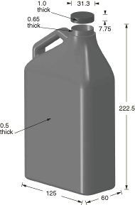

**Figure 2.3.2–2** Assembly of the bottle drop model; the water is instanced inside of the bottle.

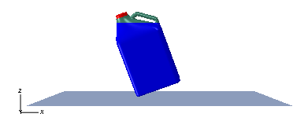

**Figure 2.3.2–3** Mesh of the bottle and cap.

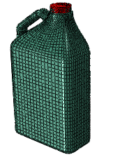

**Figure 2.3.2–4** Tetrahedral mesh to model the fluid in the bottle in the undeformed configuration.

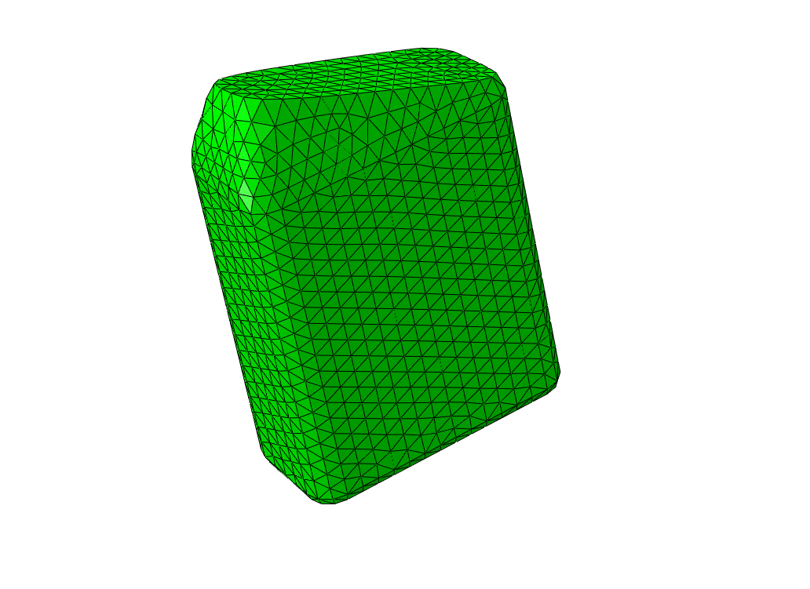

**Figure 2.3.2–5** Deformed shape plots of the CEL model at 0.01 s intervals.

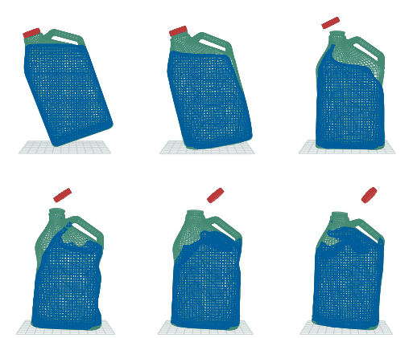

**Figure 2.3.2–6** Logarithmic strains in the bottle during deformation in the CEL analysis.

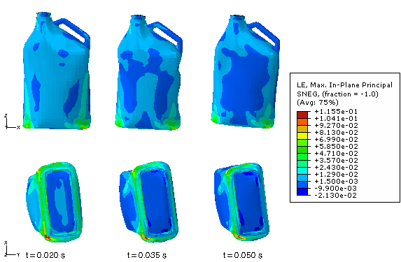

**Figure 2.3.2–7** Comparison between coupled Eulerian-Lagrangian and SPH results shortly after the impact.

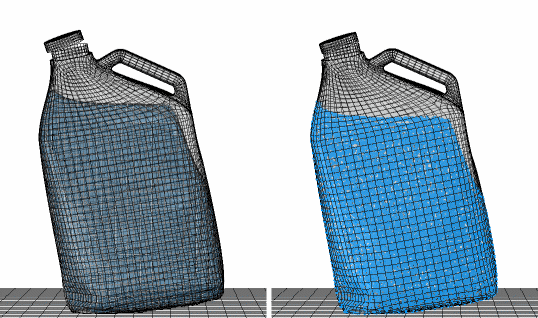

**Figure 2.3.2–8** Comparison between coupled Eulerian-Lagrangian and SPH results after full contact with the floor.

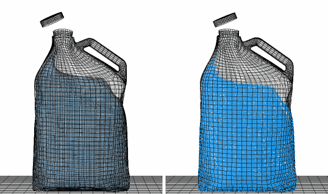

**Figure 2.3.2–9** Comparison between coupled Eulerian-Lagrangian and SPH results in the middle stages of the analysis.

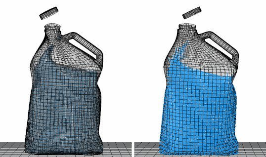

**Figure 2.3.2–10** Comparison between coupled Eulerian-Lagrangian and SPH results towards the end of the analysis.

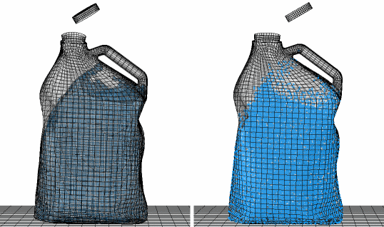

**Figure 2.3.2–11** Reaction force (filtered) in the floor.

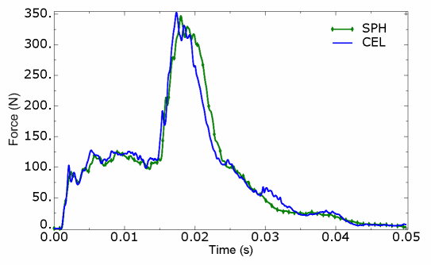

