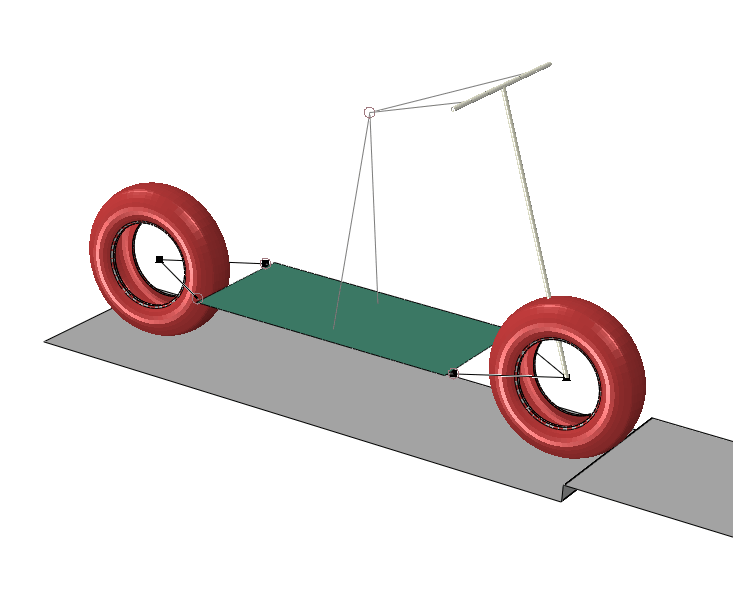
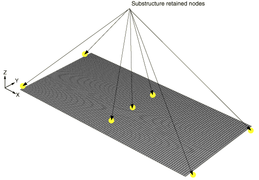
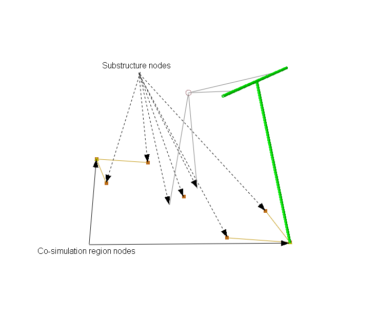
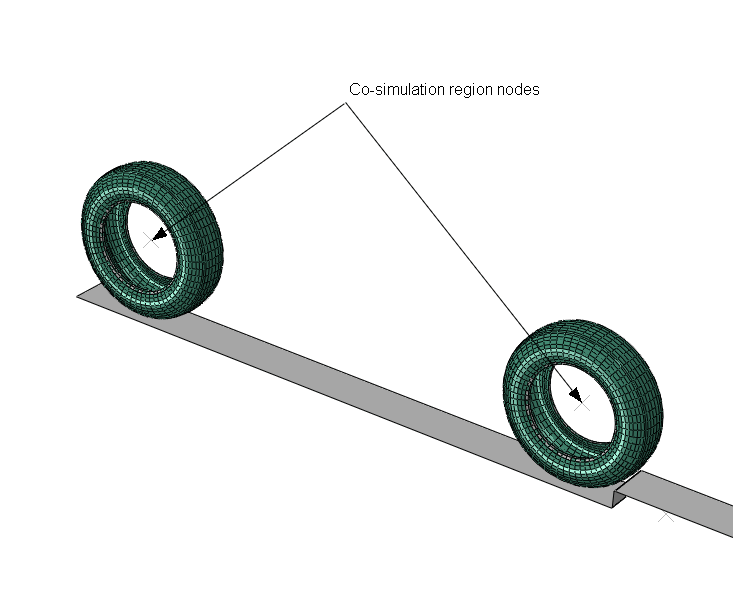
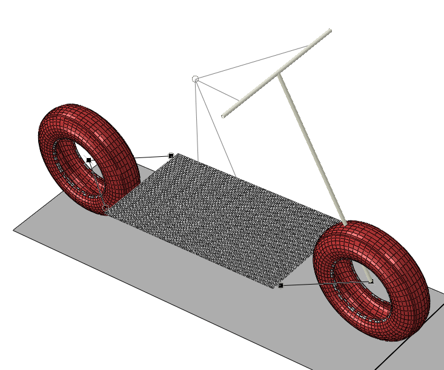
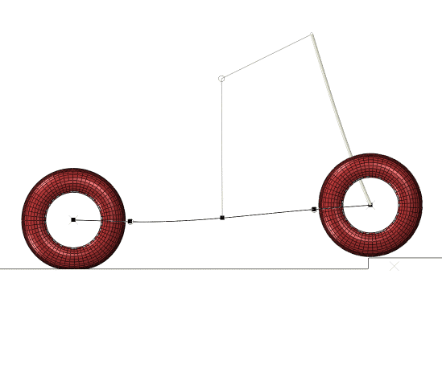
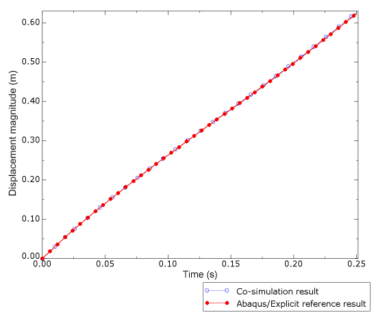
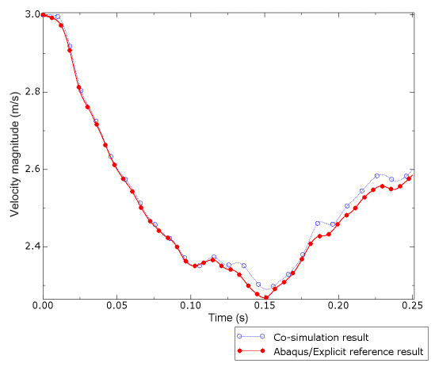
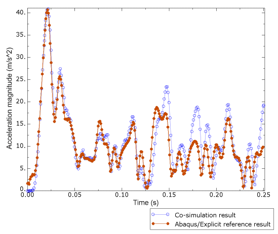

# 2.4.1 摩托车与凸块的动力冲击


**产品：** Abaqus/Standard  Abaqus/Explicit  

### 目标

本示例展示了 Abaqus/Standard 和 Abaqus/Explicit 的组合使用，以提供比单独使用 Abaqus/Standard 或 Abaqus/Explicit 更具成本效益的解决方案。展示的 Abaqus 特性和技术包括：
- Abaqus/Standard 到 Abaqus/Explicit 协同仿真，其中
- Abaqus/Standard 使用子结构技术来有效地处理承受小应变的组件建模，而该技术在 Abaqus/Explicit 中不可用，以及
- Abaqus/Explicit 用于有效地模拟高速接触相互作用。

### 应用描述

本示例考虑娱乐摩托车与凸块的冲击。分析凸块相互作用的瞬态响应用于确定摩托车骑行者感受到的加速度。通过此分析，产品设计者可以通过改变某些设计参数（如框架组件横截面特性、轮胎材料或充气压力）并观察它们对骑行者加速度的影响来做出明智的设计决策。有效使用此仿真技术需要仿真周转时间尽可能快，同时保留结果中的基本保真度。

### 几何结构

摩托车由骑行平台、带车把的框架和两个轮胎组成，如[图 2.4.1-1](ch02s04aex88.md#exa-dyn-scootergeometry)所示。摩托车总长度为 1200 mm，总高度为 800 mm。车把为直线方向。

### 材料

摩托车平台和框架管由软钢制成。轮胎为丁基橡胶材料。

### 初始条件

仿真开始时摩托车轮胎已充气，以 3 m/s 的速度向凸块行驶。

### 边界条件和载荷

重量载荷来自摩托车和骑行者。

### 相互作用

摩托车在粗糙表面行驶。该表面包括一个 7.5 cm 高的凸块，位于摩托车前方。

### Abaqus 建模方法和仿真技术

可以使用多种 Abaqus 分析方法来模拟摩托车的瞬态行为：仅使用 Abaqus/Standard、仅使用 Abaqus/Explicit，或使用 Abaqus/Standard 到 Abaqus/Explicit 协同仿真。为了说明协同仿真方法的计算成本节省，以下分析案例侧重于将协同仿真方法与 Abaqus/Explicit 专用仿真方法进行比较。

协同仿真分析的 Abaqus/Standard 模型由摩托车平台（[图 2.4.1-2](ch02s04aex88.md#exa-dyn-scooterdeckregion)）和框架（[图 2.4.1-3](ch02s04aex88.md#exa-dyn-scooterframeregion)）组成。平台使用子结构技术建模，以进一步降低求解成本。协同仿真分析的 Abaqus/Explicit 模型由轮胎和带有凸块的路面（[图 2.4.1-4](ch02s04aex88.md#exa-dyn-scootertireregion)）组成。协同仿真区域是数据将在协同仿真分析期间交换的位置，在每个模型的轮轴位置处识别。

### 分析案例摘要

| 案例 1 | 仅使用 Abaqus/Explicit 进行的参考分析。 |
| --- | --- |
| 案例 2 | 使用子循环耦合方案的协同仿真分析。 |

两个分析案例都处理相同的瞬态仿真。

### 分析类型

轮胎瞬态响应和与路面的接触使用显式动力学过程模拟。在案例 1 中，显式动力学过程也适用于模型的其余部分。摩托车框架瞬态响应使用隐式动力学过程模拟。

### 分析技术

静态稳定、子结构和导入分析技术用于本示例。

##### 静态稳定

轮胎充气使用 Abaqus/Standard 静态稳定选项。

##### 子结构

预计摩托车平台在分析过程中会经历小应变，允许使用子结构将平台建模为降低计算成本的技术。

##### 导入

轮胎在 Abaqus/Standard 静态过程中充气。轮胎的充气状态和构型被导入 Abaqus/Explicit 用于后续的瞬态分析。

### 网格设计

网格化模型如[图 2.4.1-5](ch02s04aex88.md#exa-dyn-scootermesh)所示。框架组件使用桁架和连接器单元建模。平台使用 S4R 壳单元建模。轮胎使用 C3D8I 连续体单元建模。骑行者被表示为一个点质量，通过分布耦合约束定义连接到脚部和手部位置。

### 材料模型

平台建模为简单的线性弹性材料，弹性模量为 5 GPa，泊松比为 0.3，密度为 5000 kg/m³。

轮胎建模为具有粘弹性特性的超弹性材料。轮胎材料密度为 1100 kg/m³。

| 超弹性材料常数 |
| --- |
|  | 1 MPa |
|  | 0.0 Pa |
|  | 5.085×10⁸ Pa |

| 粘弹性材料常数 |
| --- |
|  | 0.3 |
|  | 0 |
|  | 0.1 |

### 初始条件

施加 20 kPa 的初始胎压。由于从较早的静态分析导入，轮胎在静态平衡的足迹配置中开始分析。摩托车以 3 m/s 的初始速度向凸块行驶。

### 边界条件

摩托车转向组件固定在直线配置中。

### 载荷

力施加与总摩托车重量 42.4 N 和总骑行者重量 222 N 一致。为简化分析设置，不施加重力载荷；相反，重量力施加在轴位置。这种载荷方法的主要后果是忽略了骑行者导致的平台静态下垂。

### 约束

摩托车平台使用绑定约束连接到框架。

### 相互作用

接触相互作用定义了轮胎与路面和凸块的接触。

### 案例 1 Abaqus/Explicit 参考分析

此分析案例专门使用 Abaqus/Explicit 进行瞬态分析，作为比较协同仿真解决方案的结果和计算成本的参考。

### 分析类型

Abaqus/Explicit 用于瞬态分析，轮胎充气使用 Abaqus/Standard 中的静态过程进行。

### 分析步骤

使用以下分析步骤类型。

##### 静态分析

使用 Abaqus/Standard 静态过程来充气轮胎并建立轮胎足迹。

##### 显式动力学

Abaqus/Explicit 步骤不使用质量缩放。使用默认的体积粘度参数。

### 结果和讨论

仿真结果显示摩托车撞击凸块，骑行者略微向前移动，平台弯曲。

### 案例 2 使用子循环的协同仿真分析

在此案例中，Abaqus/Standard 和 Abaqus/Explicit 之间进行协同仿真，每个程序根据其自己的自动增量方案推进其仿真时间，并根据需要交换数据。协同仿真数据在每个 Abaqus/Explicit 时间增量处交换。

### 分析类型

Abaqus/Explicit 用于轮胎的瞬态分析，轮胎充气使用 Abaqus/Standard 中的静态过程进行。Abaqus/Standard 用于摩托车框架和平台的瞬态分析。

### 分析步骤

使用以下分析步骤类型。

##### 静态分析

使用 Abaqus/Standard 静态过程来充气轮胎并建立轮胎足迹。

##### 显式动力学

Abaqus/Explicit 步骤不使用质量缩放。使用默认的体积粘度参数。

##### 子结构生成

摩托车平台的子结构生成使用 100 个保留特征模，通过 Lanczos 特征值求解器获得。

##### 隐式动力学

Abaqus/Standard 瞬态动力学步骤使用 200 N 的半增量残差极限设置。

### 求解控制

协同仿真控制用于指定子循环方法。

### 运行过程

协同仿真中的分析同时运行。耦合使用 Abaqus 协同仿真执行过程实现（参见"Abaqus Analysis User's Guide 第 3.2.4 节，'Abaqus/Standard、Abaqus/Explicit 和 Abaqus/CFD 协同仿真执行'"）。

例如，使用以下命令运行 Abaqus/Standard 和 Abaqus/Explicit 作业：

```
abaqus cosimulation cosimjob=scooter 
   job=scooter_cosim_std,scooter_cosim_xpl 
   oldjob=NONE,scooter_tire_inflation
   configure=scooter_cosim_config
```

### 结果和讨论

协同仿真分析的结果出现在多个输出文件中。为了有效使用 Abaqus/Standard 和 Abaqus/Explicit 输出数据库，您应该使用 Abaqus/Viewer 叠加功能来查看组合结果。更多信息，请参见"Abaqus/CAE User's Guide 第 79 章，'叠加多个图'"。

### 结果讨论和案例比较

结果显示案例 1 计算成本更高。案例 2 提供了显著的成本改善。此外，结果表明，与参考解决方案相比，协同仿真技术的使用并未显著影响解决方案保真度。

#### 装配的最终构型

当摩托车与凸块碰撞时，整个装配离开地面并略微弯曲，如[图 2.4.1-6](ch02s04aex88.md#exa-dyn-scooterfinalconfiguration)所示。

#### 骑行者的动力响应

我们考虑骑行者舒适度指标，将骑行者节点位置处的位移、速度和加速度幅值历史联系起来。[图 2.4.1-7](ch02s04aex88.md#exa-dyn-scooterhandledisplacement)、[图 2.4.1-8](ch02s04aex88.md#exa-dyn-scooterhandlevelocity) 和[图 2.4.1-9](ch02s04aex88.md#exa-dyn-scooterhandleacceleration) 显示了这些各自的响应历史，比较案例 1 和案例 2 分析的结果。结果在应用截止频率为 100 Hz 的 Butterworth 滤波器后绘制（参见"Abaqus/CAE User's Guide 第 47.4.26 节，'对 X-Y 数据对象应用 Butterworth 滤波'"），并显示案例 1 和案例 2 工作流程之间非常好的的一致性。

#### 计算成本

[表 2.4.1-1](ch02s04aex88.md#exa-dyn-scootercpucost) 列出了两种仿真方法的相对计算成本，并清楚地表明了协同仿真在此分析中的价值。

### 文件

##### **通用文件**

[scooter_tire_inflation.inp](../eif/scooter_tire_inflation.inp)

用于充气轮胎并建立由装配重量引起的静态足迹的 Abaqus/Standard 输入文件。

[scooter_parameters.inp](../eif/scooter_parameters.inp)

所有摩托车分析的通用作业参数。

##### **案例 1 Abaqus/Explicit 参考分析**

[scooter_xpl.inp](../eif/scooter_xpl.inp)

用于建模所有组件的 Abaqus/Explicit 输入文件，从 scooter_tire_inflation.inp 结果导入充气轮胎，并模拟与凸块的瞬态冲击。

##### **案例 2 使用子循环的协同仿真分析**

**协同仿真配置**

[scooter_cosim_config.xml](../eif/scooter_cosim_config.xml)

定义子循环算法的协同仿真配置文件。

**轮胎和路面建模**

[scooter_cosim_xpl.inp](../eif/scooter_cosim_xpl.inp)

用于建模轮胎和路面的 Abaqus/Explicit 输入文件，从 scooter_tire_inflation.inp 结果导入充气轮胎，并通过与 scooter_cosim_std.inp 的协同仿真耦合来模拟与凸块的瞬态冲击。

**框架和平台建模**

[scooter_subgen.inp](../eif/scooter_subgen.inp)

用于建模平台并创建平台的子结构表示的 Abaqus/Standard 输入文件。

[scooter_cosim_std.inp](../eif/scooter_cosim_std.inp)

用于建模框架组件的 Abaqus/Standard 输入文件，引用 scooter_subgen.inp 子结构定义，并通过与 scooter_cosim_xpl.inp 的协同仿真耦合来模拟与凸块的瞬态冲击。

### 参考文献

**Abaqus Analysis User's Guide**
- ["协同仿真：概述," Abaqus Analysis User's Guide 第 17.1.1 节](../usb/usb-link.md#usb-anl-acosimulationover)
- ["准备用于协同仿真的 Abaqus 分析," Abaqus Analysis User's Guide 第 17.2.1 节](../usb/usb-link.md#usb-anl-acosimulationprep)
- ["结构到结构协同仿真," Abaqus Analysis User's Guide 第 17.3.1 节](../usb/usb-link.md#usb-anl-acosimabqtoabq)

**Abaqus Keywords Reference Guide**
- [*CO-SIMULATION](../key/key-link.md#usb-kws-hcosimulation)
- [*CO-SIMULATION CONTROLS](../key/key-link.md#usb-kws-hcosimulationcontrols)
- [*CO-SIMULATION REGION](../key/key-link.md#usb-kws-hcosimulationregion)

**Abaqus Verification Guide**
- ["Abaqus/Standard 到 Abaqus/Explicit 协同仿真," Abaqus Verification Guide 第 3.21.2 节](../ver/ver-link.md#ver-prc-abqtoabqcosimulation)

### 表格

**表 2.4.1-1** 相对 CPU 时间比较（相对于 Abaqus/Explicit 分析的 CPU 时间归一化）。
| 分析作业 | 相对 CPU 时间 |
| --- | --- |
| 协同仿真工作流程 | Abaqus/Explicit 工作流程 |
| 子结构生成 | 0.007 | N/A |
| 轮胎充气和足迹 | 0.002 | 0.002 |
| 协同仿真 Abaqus/Explicit 分析 | 0.060 | N/A |
| 协同仿真 Abaqus/Standard 分析 | 0.057 | N/A |
| 完整 Abaqus/Explicit 分析 | N/A | 1.0 |
| 总仿真成本 | 0.126 | 1.002 |

### 图形

**图 2.4.1-1** 摩托车装配几何。骑行者被建模为点质量。



**图 2.4.1-2** 平台分析区域。子结构保留节点代表摩托车框架的连接位置、骑行者脚部位置以及用于约束全局模型中绕 x 方向滚动的中心位置。



**图 2.4.1-3** 框架分析区域。



**图 2.4.1-4** 轮胎和路面分析区域。



**图 2.4.1-5** 完整摩托车装配网格。



**图 2.4.1-6** 与凸块碰撞后的变形构型。



**图 2.4.1-7** 骑行者位移幅值历史。



**图 2.4.1-8** 骑行者速度幅值历史。



**图 2.4.1-9** 骑行者加速度幅值历史。




