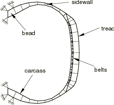
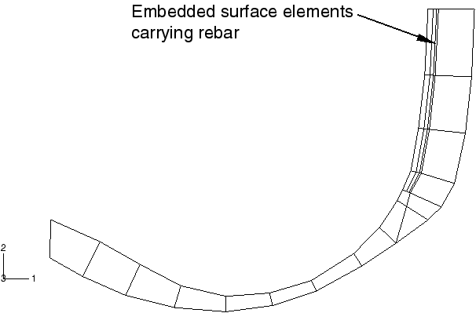
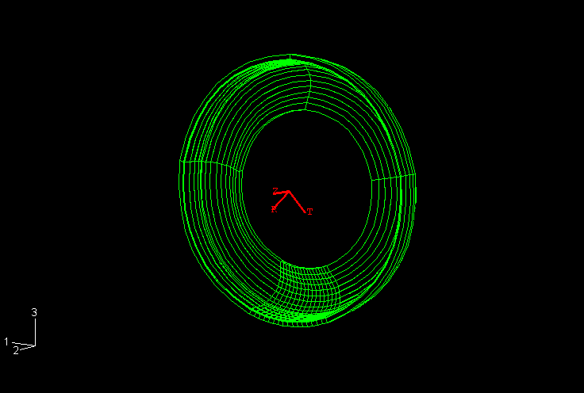
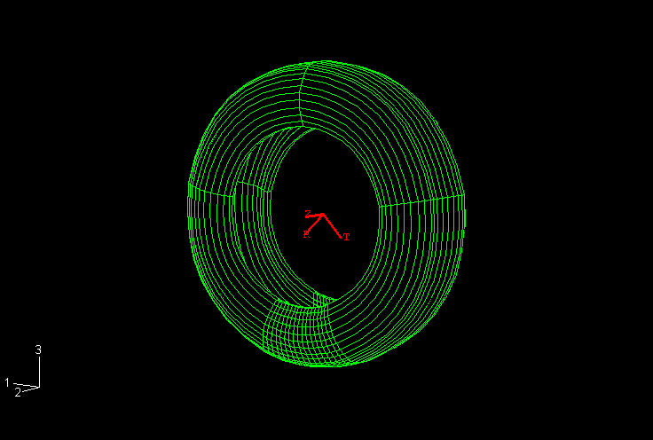
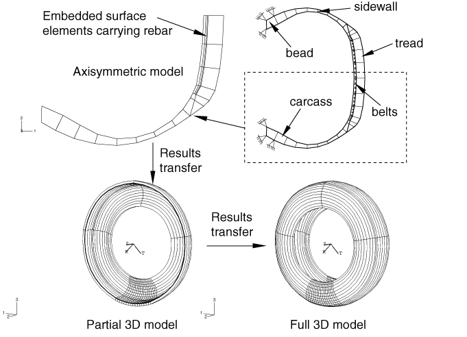
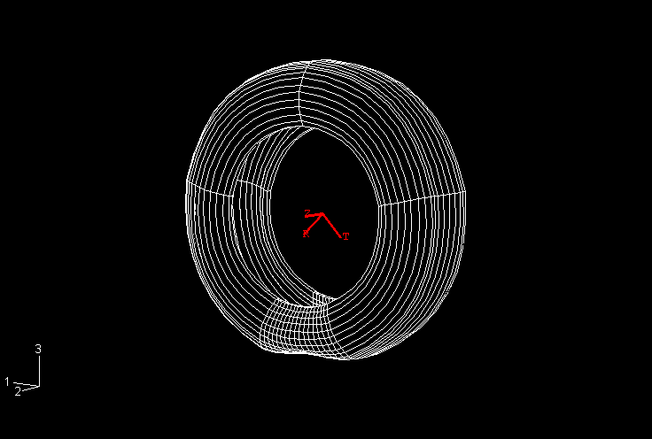

# 3.1.1 静态轮胎分析的对称结果传递

**产品：** Abaqus/Standard  

本示例说明了使用对称结果传递和对称模型生成来建模轮胎与刚性表面之间的静态相互作用。

对称模型生成（"对称模型生成，" Abaqus Analysis User's Guide 第 10.4.1 节）可用于通过围绕其旋转对称轴旋转轴对称模型来创建三维模型，或通过组合对称模型的两个部分，其中一个部分是原始模型，另一个部分是原始模型通过一条线或一个平面的反射。这两种模型生成技术都在本示例中演示。

对称结果传递（"从对称网格或部分三维网格将结果传递到完整三维网格，" Abaqus Analysis User's Guide 第 10.4.2 节）允许用户将从轴对称分析获得的解转换到具有相同几何形状的三维模型。它还允许将对称三维解转换到完整的三维模型。这两种结果传递特性都在本示例中演示。结果传递功能可以显著降低后续在加载历史中经历非对称变形的结构的分析成本。

本示例的目的是获得与平面刚性表面接触的 175 SR14 轮胎在充气压力和轴上集中载荷下的足迹解。输入文件还对轮胎与刚性滚筒的接触进行建模。这些足迹解用作"轮胎的稳态滚动分析，" 第 3.1.2 节中确定轮胎以 10 km/h 滚动时的自由滚动状态的起点，以及"基于子空间的稳态动态轮胎分析，" 第 3.1.3 节中进行频率响应分析。

### 问题描述

轮胎的不同组件如[图 3.1.1-1](ch03s01aex89.md#sxmtiretrans-xsection)所示。胎面和胎侧由橡胶制成，带束层和胎体由纤维增强橡胶复合材料构成。橡胶建模为不可压缩超弹性材料，纤维增强建模为线性弹性材料。由于带束层的放置和 20.0 方向，轮胎几何中存在少量偏斜对称。

本示例执行两个仿真。第一个仿真利用轮胎模型中的对称性并利用结果传递功能；第二个仿真不使用结果传递功能。两种方法之间的比较是在轮胎与平面刚性表面接触的情况下进行的。输入文件还对轮胎与刚性滚筒的接触进行建模。第一分析中使用的方法应用于此仿真。结果在"轮胎的稳态滚动分析，" 第 3.1.2 节中呈现。

第一个仿真分为三个独立的分析。第一个分析中，建模轮胎通过均匀内部压力的充气。由于轮胎结构的各向异性，充气载荷产生周向变形分量。得到的应力场是完整的三维的，但问题保持轴对称，即解不随周向位置变化。Abaqus 为这种情况提供了具有扭曲的轴对称单元（CGAX）。这些单元用于对充气载荷建模。由于通过轮胎轴线的垂直平面的反射对称，只需要一半的轮胎横截面进行充气分析（参见[图 3.1.1-2](ch03s01aex89.md#sxmtiretrans-axisect)）。我们称此模型为轴对称模型。

仿真的第二部分是计算足迹解，这表示轮胎在垂直静载荷（建模车辆重量）下的静态变形形状。此分析需要三维模型。该模型的有限元网格通过围绕旋转对称轴旋转轴对称横截面获得。如[图 3.1.1-3](ch03s01aex89.md#sxmtiretrans-mesh3d)所示，沿周向使用非均匀离散化。此外，轴对称解被传递到新网格，在足迹计算中作为初始或基础状态。与轴对称模型一样，此仿真只需要一半横截面，但必须沿横截面中平面施加偏斜对称边界条件，以考虑由充气载荷和轴上集中载荷引起的偏斜对称应力。我们称此模型为部分三维模型。

在此分析的最后部分，将足迹解从部分三维模型传递到完整三维模型，并达到平衡。此完整三维模型用于接下来的稳态传输示例。模型是通过组合部分三维模型的两个部分创建的，其中一个部分是第二步中使用的网格，另一个部分是部分模型通过一条线的反射。我们称此模型为完整三维模型。

执行第二个仿真，其中重复相同的加载步骤，只是整个分析使用完整三维模型进行。除了用于验证结果传递解决方案外，第二个仿真还允许我们展示 Abaqus 结果传递功能在具有旋转和/或反射对称的问题中提供的计算优势。

### 模型定义

在第一个仿真中，充气步骤在轴对称模型上执行，结果存储在结果文件（`.res`、`.mdl`、`.stt` 和 `.prt`）中。轴对称模型使用 CGAX4H 和 CGAX3H 单元离散化。带束层和帘线使用嵌入在连续体单元中的表面单元中的钢筋建模。嵌入单元技术的舍入容差用于调整嵌入单元节点的位置，使其恰好位于宿主单元边缘上。当嵌入节点因数值舍入而与宿主单元边缘偏移一小段距离时，此功能很有用。消除此类间隙可减少用于嵌入表面单元的约束方程数量，从而提高性能。轴对称结果被读入后续的足迹分析，部分三维模型通过围绕旋转对称轴旋转轴对称模型横截面由 Abaqus 生成。部分三维模型由覆盖 320° 的四个 CCL12H 和 CCL9H 圆柱单元扇区组成，轮胎的其余部分划分为 16 个 C3D8H 和 C3D6H 线性单元扇区。线性单元用于足迹区域。圆柱单元推荐用于可以覆盖大扇区但单元数量较少的区域。在足迹区域中，接触斑块期望的分辨率决定了要使用的单元数量，因此使用线性单元更具成本效益。路面（或滚筒）在部分三维模型中定义为解析刚体表面。足迹分析的结果被读入最终平衡分析，完整三维模型通过垂直线反射部分三维模型生成。反射使用的线是轮胎对称平面中的垂直线，通过旋转轴。模型通过对称线（而非对称平面）反射，以考虑轮胎的偏斜对称。解析刚体表面按在部分三维模型中的定义不变地传递到完整模型。完整模型的三维有限元网格如[图 3.1.1-4](ch03s01aex89.md#sxmtiretrans-full3d)所示。

在第二个仿真中，执行 **datacheck** 分析以将轴对称模型信息写入结果文件。在此模型中网格化了完整轮胎横截面。无需分析。在后续运行中读取轴对称模型信息，并通过围绕旋转对称轴旋转横截面由 Abaqus 生成完整三维模型。路面在完整模型中定义。完整模型的三维有限元网格与第一个分析生成的网格相同。但是，充气载荷和轴上的集中载荷被施加到完整模型，而不利用结果传递功能。

足迹计算使用零摩擦系数进行，以期望最终对轮胎进行稳态滚动分析，如"轮胎的稳态滚动分析，" 第 3.1.2 节中所解释。

由于本示例中执行的静态分析结果用于后续的时域动态示例，输入文件包括使用 Prony 系列参数直接建模橡胶的超弹性材料。这种方法使我们能够在接下来的稳态传输示例中建模粘弹性。作为定义时域粘弹性材料特性的结果，超弹性材料行为中指定的弹性特性定义了橡胶的长期行为。此外，所有静态步骤都定义为确保静态解决方案基于长期弹性模量。

### 载荷

如前几节所讨论的，轮胎上的载荷分几个步骤施加。在第一个仿真中，使用静态分析过程对轴对称轮胎模型（[tiretransfer_axi_half.inp](../eif/tiretransfer_axi_half.inp)）充气至 200.0 kPa 压力。然后将这些轴对称分析的结果传递到部分三维模型（[tiretransfer_symmetric.inp](../eif/tiretransfer_symmetric.inp)），在其中以两个顺序静态步骤计算足迹解决方案。这些静态步骤的第一步通过在刚体参考节点上施加 0.02 m 的垂直位移来建立路面与轮胎之间的初始接触。由于这是静态分析，建议使用规定位移来建立接触，而不是使用规定载荷，以避免可能因不平衡力导致的收敛困难。在第二个静态步骤中去除规定边界条件，并在刚体参考节点上施加 1.65 kN 的垂直载荷。部分三维模型中的 1.65 kN 载荷在完整三维模型中代表 3.3 kN 载荷。通过使用对称结果传递将结果从轴对称模型传递到部分三维模型。一旦建立了部分三维模型的静态足迹解，使用对称结果传递将解传递到完整三维模型（[tiretransfer_full.inp](../eif/tiretransfer_full.inp)），其中足迹解在单个静态增量中达到平衡。结果传递序列如[图 3.1.1-5](ch03s01aex89.md#sxmtiretrans-results)所示。

边界条件和载荷不会随对称结果传递一起传递；必须在新分析中仔细重新定义它们以匹配传递解决方案中的载荷和边界条件。由于数值和建模问题，二维和三维单元的单元 formulation 不相同。因此，生成的两维和三维模型之间的平衡解决方案可能存在微小差异。此外，由于对称模型中存在完整模型中不使用的对称边界条件，对称和完整三维解决方案之间可能会出现微小的数值差异。因此，建议在结果传递仿真中执行初始步骤，在该步骤中在传递解决方案与匹配从其传递结果的模型状态的载荷之间建立平衡。建议使用初始时间增量设置为总步骤时间的初始静态步骤，以允许 Abaqus/Standard 在一个增量中找到平衡。

在第二个仿真中重复相同的充气和足迹步骤。唯一的区别是整个分析在完整三维模型（[tiretransfer_full_footprint.inp](../eif/tiretransfer_full_footprint.inp)）上执行。完整三维模型使用从完整轮胎横截面轴对称模型的 **datacheck** 分析（[tiretransfer_axi_full.inp](../eif/tiretransfer_axi_full.inp)）的重启信息生成。

### 接触建模

默认接触对 formulation 在法向上是硬接触，这给出接触约束的严格强制执行。一些分析同时使用硬接触和增广拉格朗日接触来证明代码选择的默认罚刚度不会显著影响应力结果。增广拉格朗日方法可以作为修正接触压力-闭合关系定义的一部分调用。硬和增广拉格朗日接触算法在"Abaqus Analysis User's Guide 第 38.1.2 节，'Abaqus/Standard 中的接触约束强制方法'"中描述。

### 求解控制

由于三维轮胎模型具有小的加载区域，因此 forces 相当局部，默认的平均通量值用于收敛准则会产生非常严格的容差，并导致比准确解决方案所需更多的迭代。为减少分析所需的计算时间，求解控制可用于覆盖平均力和力矩的默认值。本示例使用默认控制。

### 结果和讨论

前两个仿真的结果基本相同。两种模型中的峰值 Mises 应力和位移幅值分别在 0.3% 和 0.2% 内一致。轮胎的最终变形形状如[图 3.1.1-6](ch03s01aex89.md#sxmtiretrans-deform3d)所示。每个仿真的计算成本如[表 3.1.1-1](ch03s01aex89.md#table-tiretrans-timing)所示。在完整三维模型上执行的仿真比结果传递仿真花费的时间长 2.5 倍，清楚地展示了利用对称结果传递利用模型对称性可获得的计算优势。

### 输入文件

[tiretransfer_axi_half.inp](../eif/tiretransfer_axi_half.inp)

轴对称模型，充气分析（仿真 1）。

[tiretransfer_symmetric.inp](../eif/tiretransfer_symmetric.inp)

部分三维模型，足迹分析（仿真 1）。

[tiretransfer_symmetric_auglagr.inp](../eif/tiretransfer_symmetric_auglagr.inp)

部分三维模型，使用增广拉格朗日接触的足迹分析（仿真 1）。

[tiretransfer_full.inp](../eif/tiretransfer_full.inp)

完整三维模型，最终平衡分析（仿真 1）。

[tiretransfer_full_auglagr.inp](../eif/tiretransfer_full_auglagr.inp)

完整三维模型，使用增广拉格朗日接触的最终平衡分析（仿真 1）。

[tiretransfer_axi_full.inp](../eif/tiretransfer_axi_full.inp)

轴对称模型，**datacheck** 分析（仿真 2）。

[tiretransfer_full_footprint.inp](../eif/tiretransfer_full_footprint.inp)

完整三维模型，完整分析（仿真 2）。

[tiretransfer_symm_drum.inp](../eif/tiretransfer_symm_drum.inp)

与刚性滚筒接触的轮胎的部分三维模型。

[tiretransfer_full_drum.inp](../eif/tiretransfer_full_drum.inp)

与刚性滚筒接触的轮胎的完整三维模型。

[tiretransfer_node.inp](../eif/tiretransfer_node.inp)

轴对称模型的节点坐标。

[tiretransfer_axi_half_ml.inp](../eif/tiretransfer_axi_half_ml.inp)

轴对称模型，充气分析（仿真 1），使用 Marlow 超弹性模型。

[tiretransfer_symmetric_ml.inp](../eif/tiretransfer_symmetric_ml.inp)

部分三维模型，足迹分析（仿真 1），使用 Marlow 超弹性模型。

[tiretransfer_full_ml.inp](../eif/tiretransfer_full_ml.inp)

完整三维模型，最终平衡分析（仿真 1），使用 Marlow 超弹性模型。

### 表格

**表 3.1.1-1** 足迹分析归一化 CPU 时间比较（相对于"无结果传递"分析的总时间）。
|  | 使用结果传递和对称条件 | 无结果传递 |
| --- | --- | --- |
| 充气 | 0.005(a)+0.040(b) | 0.347(e) |
| 足迹 | 0.265(c)+0.058(d) | 0.653(e) |
| 总计 | 0.368 | 1.0 |
| (a) 轴对称模型 |
| (b) 部分三维模型中的平衡步骤 |
| (c) 部分三维模型中的足迹分析 |
| (d) 完整三维模型中的平衡步骤 |
| (e) 完整三维模型 |

### 图形

**图 3.1.1-1** 轮胎横截面。

**图 3.1.1-2** 轴对称轮胎网格。

**图 3.1.1-3** 部分三维轮胎网格。

**图 3.1.1-4** 完整三维轮胎网格。

**图 3.1.1-5** 结果传递分析序列。

**图 3.1.1-6** 变形的三维轮胎（变形按因子 2 缩放）。

