# 3.1.2 轮胎的稳态滚动分析

**产品：** Abaqus/Standard  

本示例说明了在 Abaqus 中使用稳态传输（"稳态传输分析，" Abaqus Analysis User's Guide 第 6.4.1 节）来建模滚动轮胎与刚性表面之间的稳态动态相互作用。稳态传输分析使用移动参考框架，其中刚体旋转以欧拉方式描述，变形以拉格朗日方式描述。这种运动学描述将稳定的移动接触问题转换为纯空间相关模拟。因此，网格只需要在接触区域细化——稳定运动将材料输送到网格中。摩擦效应、惯性效应和材料历史效应都可以在稳态传输分析中考虑。

本分析的目的是获得 175 SR14 轮胎在平面刚性表面上以 10.0 km/h（2.7778 m/s）的地面速度行驶在不同滑移角下的自由滚动平衡解。滑移角是行驶方向与轮胎轴线法平面之间的角度。直线滚动发生在 0.0 滑移角。为了比较，我们还考虑了对轮胎在 1.5 m 直径刚性滚筒上固定位置旋转的分析。滚筒以 3.7 rad/s 的角速度旋转，因此滚筒表面上的点以 10.0 km/h（2.7778 m/s）的瞬时速度行驶。另一个案例研究了 camber 施加到自由滚动条件下的轮胎时产生的 camber 推力。这也使我们能够计算 camber 推力刚度。

对于滚动轮胎问题，施加在轴上的扭矩 *T* 为零的平衡解称为自由滚动解。具有非零扭矩的平衡解根据 *T* 的方向称为牵引解或制动解。当轮胎角速度足够小，以至于轮胎与路面之间的某些或所有接触点发生滑动，且作用在轮胎上的合成扭矩与自由滚动解的角速度方向相反时，发生制动。类似地，当轮胎角速度足够大，以至于轮胎与路面之间的某些或所有接触点发生滑动，且作用在轮胎上的合成扭矩与自由滚动解的角速度方向相同时，发生牵引。当轮胎与路面之间的所有接触点都发生滑动时，发生完全制动或完全牵引。

具有相同地面速度  的车轮在自由滚动、牵引或制动状态下会以不同的角速度  旋转。通常，组合导致自由滚动的  和  不是预先知道的。由于稳态传输分析功能要求规定旋转 spinning 速度  和行驶地面速度 ，必须以间接方式找到自由滚动解。本示例说明了一种这样的间接方法。另一种方法涉及在使用子程序 [`UMOTION`](../sub/sub-link.md#sub-xsl-umotion) 控制旋转 spinning 速度，同时通过第二个子程序 [`URDFIL`](../sub/sub-link.md#sub-xsl-urdfil) 监控求解进度。[`URDFIL`](../sub/sub-link.md#sub-xsl-urdfil) 子程序用于根据每个增量结束时轮辋处扭矩的值获得自由滚动解的估计。本示例也说明了这种方法。

此问题的有限元分析以及实验结果已由 Koishi 等人（1997）发表。

### 问题描述和模型定义

轮胎和有限元模型的描述在"静态轮胎分析的对称结果传递，" 第 3.1.1 节中给出。为了在动态分析中考虑实际轮胎偏斜对称的影响，稳态滚动分析在完整三维模型（也称为完整模型）上进行。惯性效应被忽略，因为滚动速度较低（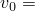 10 km/h）。

如前所述，Abaqus 中的稳态传输功能使用混合欧拉/拉格朗日方法，其中对于移动参考框架中的观察者，材料似乎流过静止网格。材料点穿过网格所遵循的路径称为流线，必须在执行稳态传输分析之前计算它们。正如"静态轮胎分析的对称结果传递，" 第 3.1.1 节中所讨论的，本示例中稳态传输分析所需的流线使用对称模型生成的旋转功能计算。

用于对本示例中橡胶建模的不可压缩超弹性材料包括时域粘弹性分量，直接使用 Prony 系列参数指定。使用简单的 1 项 Prony 系列模型。对于不可压缩材料，Abaqus 中 1 项 Prony 系列通过为剪切松弛模量比  及其相关的松弛时间  提供单个值来定义。在本示例中  = 0.3 且  = 0.1。粘弹性——即材料历史——效应包含在稳态传输步骤中，除非您正在研究材料的长期行为。有关在 Abaqus 中建模时域粘弹性的更详细讨论，请参见"Abaqus Analysis User's Guide 第 22.7.1 节，'时域粘弹性'"。

### 载荷

如"静态轮胎分析的对称结果传递，" 第 3.1.1 节中所讨论的，建议使用零摩擦系数（以便没有摩擦力通过接触表面传递）获得足迹分析。滚动轮胎的摩擦应力与静止轮胎的摩擦应力非常不同，即使轮胎以非常低的速度滚动；因此，在最后一次静态分析和第一次稳态传输分析之间可能出现解的不连续。此外，在稳态传输步骤开始时将摩擦系数从零变化到其最终值，可确保摩擦力的变化随较小的载荷增量而减小。如果 Abaqus 在尝试获得稳态滚动解时必须采取较小的载荷增量来克服收敛困难，这很重要。

一旦计算出轮胎的静态足迹解，就可以使用稳态传输解决稳态滚动接触问题。第一个仿真的目的是获得在不同 spinning 速度下的直线稳态滚动解，包括完全制动和完全牵引。我们还计算了直线自由滚动解。第二个仿真计算不同滑移角下的自由滚动解。在第一个和第二个仿真中，通过指定使用材料的长期行为来忽略材料历史效应。第三个仿真重复第一个仿真中直线稳态滚动分析的一部分；但是，如果您不指定长期材料响应，则包含材料历史效应。所有仿真都保持 10.0 km/h 的稳定地面速度。第四次仿真的目的是获得与以 3.7 rad/s 旋转的 1.5 m 刚性滚筒接触的轮胎的自由滚动解。

在第一个仿真（[rollingtire_brake_trac.inp](../eif/rollingtire_brake_trac.inp)）中，通过设置摩擦系数  到其最终值 1.0 来改变摩擦特性，并施加平移地面速度以及将导致完全制动的 spinning 角速度，在第一个稳态传输步骤中获得完全制动解。完全制动角速度的估计如下。自由滚动轮胎通常在一转中比由其中心高度 *H* 确定的距离行驶得更远，但小于由自由轮胎半径确定的距离。在本示例中自由半径为 316.2 mm，垂直偏转约为 20.0 mm，因此 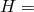 296.2 mm。使用自由半径和有效高度，估计自由滚动发生在介于  8.78 rad/s 和  9.38 rad/s 之间的角速度。较小的角速度将导致制动，较大的角速度将导致牵引。我们使用角速度  8.0 rad/s 来确保第一个稳态传输步骤中的解是完全制动解（所有接触点都在滑动，因此接触表面上总摩擦力的大小为 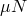）。

在全模型第二个稳态传输分析步骤中，角速度逐渐增加到  10.0 rad/s，同时保持地面速度恒定。每个载荷增量处的解是该瞬间作用在结构上的载荷的稳态解，因此在完全制动和完全牵引之间获得一系列稳态解。此分析为我们提供了自由滚动速度的初步估计。第二个仿真（rollingtire_trac_res.inp）在自由滚动条件初步估计周围执行精细搜索。

在第三个仿真（[rollingtire_slipangles.inp](../eif/rollingtire_slipangles.inp)）中，计算不同滑移角下的自由滚动解。滑移角  是行驶方向与轮胎轴线法平面之间的角度。在第一步中，将第一个仿真中的直线自由滚动解带入平衡。此步骤之后是稳态传输步骤，其中滑移角从步骤开始时的  0.0 逐渐增加到步骤结束时的  3.0，因此在不同的滑移角下获得一系列稳态解。这通过在规定的平移运动中规定行驶速度向量来实现，其分量 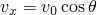 和 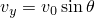，其中在第一个稳态传输步骤中  0.0，在第二个稳态传输步骤结束时  3.0。

第四次仿真（[rollingtire_materialhistory.inp](../eif/rollingtire_materialhistory.inp)）包括在完全制动和完全牵引之间的一系列稳态解，其中包含材料历史效应。

第五个仿真（rollingtire_camber.inp）分析了 camber 角度对自由滚动条件下接触斑块处侧向推力的影响。

本示例中的最后一个仿真（[rollingtire_drum.inp](../eif/rollingtire_drum.inp)）考虑轮胎与刚性旋转滚筒接触。加载序列与第一个仿真中使用的加载序列相似。然而，在此仿真中轮胎的平移速度为零，旋转角速度施加到刚性滚筒的参考节点。由于规定载荷施加到刚性滚筒参考节点以建立轮胎和滚筒之间的接触，滚筒的旋转轴在分析之前是未知的。如果定义了角速度，Abaqus 会自动将旋转轴更新到其当前位置。也可以定义刚性表面的旋转速度。在这种情况下，必须在稳态构型中定义旋转轴的位置和方向，因此必须在分析之前已知。轴的位置和方向在步骤开始时施加，并在步骤期间保持固定。当滚筒半径相对于轴位移较大时（如本示例中），在原始构型中定义轴而不显著影响结果的准确性是合理的近似。

### 结果和讨论

[图 3.1.2-1](ch03s01aex90.md#sxmrollingtire-react) 和[图 3.1.2-2](ch03s01aex90.md#sxmrollingtire-torque) 显示了在不同 spinning 速度下平行于地面的反作用力（称为滚动阻力）和轮胎轴上的扭矩 *T*。这些图比较了在平面刚性表面上滚动的轮胎与在旋转滚筒上接触的轮胎所获得的解。这些图显示，直线自由滚动 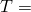 0.0 发生在约为 9.0 rad/s 的 spinning 速度。完全制动发生在小于 8.0 rad/s 的 spinning 速度，完全牵引发生在大于 9.75 rad/s 的速度。在这些 spinning 速度下，所有接触点都在滑动，滚动阻力达到极限值 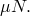。

[图 3.1.2-3](ch03s01aex90.md#sxmrollingtire-freeshear) 和[图 3.1.2-4](ch03s01aex90.md#sxmrollingtire-fulltrac) 显示了在轮胎在平面刚性表面上滚动时自由滚动和完全牵引状态下沿轮胎中心线的剪切应力。沿中心线的距离测量为相对于通过轮胎轴线的平行于地面的平面的角度。虚线是可以通过表面传递的最大或极限剪切应力 ，其中 *p* 是接触压力。这些图显示，在完全牵引期间所有接触点都在滑动。在自由滚动期间所有点都粘附。

可以通过使用 [rollingtire_brake_trac.inp](../eif/rollingtire_brake_trac.inp) 生成的结果在 9.0 rad/s 附近细化搜索，来更好地近似对应于自由滚动的角速度。文件 [rollingtire_trac_res.inp](../eif/rollingtire_trac_res.inp) 从步骤 3、增量 8（对应于 8.938 rad/s 的角速度）重新启动先前的直线滚动分析，并执行直到 9.04 rad/s 的精细搜索。[图 3.1.2-5](ch03s01aex90.md#sxmrollingtire-torqueref) 显示了在精细搜索中计算的轮胎轴上的扭矩 *T*，这导致自由滚动角速度的更精确值，约为 9.022 rad/s。此结果用于其中计算不同滑移角下自由滚动解的模型。

[图 3.1.2-6](ch03s01aex90.md#sxmrollingtire-transverse) 显示了在不同的滑移角下沿轮胎轴线测量的横向力（力沿轮胎轴线）。该图将稳态传输分析预测与纯拉格朗日分析获得的结果进行比较。拉格朗日解是通过使用 Abaqus/Explicit 执行显式瞬态分析获得的（在"稳态滚动轮胎的导入，" 第 3.1.6 节中讨论）。使用此分析技术，规定的恒定行驶速度施加到轮胎上，轮胎可以沿刚性表面自由滚动。由于需要多于一转才能获得稳态构型，因此需要沿整个周长进行精细网格划分；因此，拉格朗日解比本示例中显示的稳态解成本高得多。该图显示两种分析技术获得的结果之间良好的一致性。

[图 3.1.2-7](ch03s01aex90.md#sxmrollingtire-convection) 比较了包含和不包含材料历史效应的自由滚动解。图中的实线表示滚动阻力（沿行驶方向的平行于地面的力）；虚线表示轴上的扭矩（相对于自由半径归一化）。图显示，当包含历史效应时，自由滚动发生在较低的角速度。材料历史效应对稳态滚动解的影响在"Abaqus Benchmarks Guide 第 1.5.2 节，'与基础接触的圆盘的稳态旋转'"中详细讨论。

[图 3.1.2-8](ch03s01aex90.md#sxmrollingtire-camber) 显示了 camber 推力作为 camber 角度的函数。在零 camber 和零滑移时的侧向力称为叠片转向，是由于带束层被层间距离分开造成的轮胎不对称引起的。接触斑块离散化对曲线的不平滑性负责，44 N/degree 的总体 camber 刚度与预期水平相当接近。

[图 3.1.2-9](ch03s01aex90.md#sxmrollingtire-freeroll) 显示了当使用子程序 [`UMOTION`](../sub/sub-link.md#sub-xsl-umotion) 根据子程序 [`URDFIL`](../sub/sub-link.md#sub-xsl-urdfil) 预测的自由滚动速度施加旋转速度时，轮辋上的扭矩。当轮辋上的扭矩下降到用户指定的零扭矩容差范围内时，旋转速度保持固定，步骤完成。最初，当自由滚动旋转速度估计值超过当前旋转速度的用户指定容差时，只施加小的旋转速度增量。消息文件包含求解进度中自由滚动速度的估计和增量信息。由此发现的自由滚动条件下的角速度为 9.026 rad/s。

### 致谢

SIMULIA 衷心感谢 Hankook Tire 和 Yokohama Rubber Company 在开发本示例中使用的稳态传输功能方面的合作。SIMULIA 感谢 Yokohama Rubber Company 的 Dr. Koishi 提供本示例中使用的几何和材料特性。

### 输入文件

[rollingtire_brake_trac.inp](../eif/rollingtire_brake_trac.inp)

完全制动和牵引分析的三维完整模型。

[rollingtire_trac_res.inp](../eif/rollingtire_trac_res.inp)

精细制动和牵引分析的三维完整模型。

[rollingtire_slipangles.inp](../eif/rollingtire_slipangles.inp)

滑移角分析的三维完整模型。

[rollingtire_camber.inp](../eif/rollingtire_camber.inp)

Camber 分析的三维完整模型。

[rollingtire_materialhistory.inp](../eif/rollingtire_materialhistory.inp)

具有材料历史效应的三维完整模型。

[rollingtire_drum.inp](../eif/rollingtire_drum.inp)

在刚性滚筒上滚动的模拟的三维完整模型。

[rollingtire_freeroll.inp](../eif/rollingtire_freeroll.inp)

用于直接方法找到自由滚动解的三维完整模型。

[rollingtire_freeroll.f](../eif/rollingtire_freeroll.f)

用于找到自由滚动解的用户子程序文件。

### 参考文献

Koishi, M., K. Kabe, and M. Shiratori, "Tire Cornering Simulation using Explicit Finite Element Analysis Code," 16th annual conference of the Tire Society at the University of Akron, 1997.

### 图形

**图 3.1.2-1** 不同角速度下的滚动阻力。

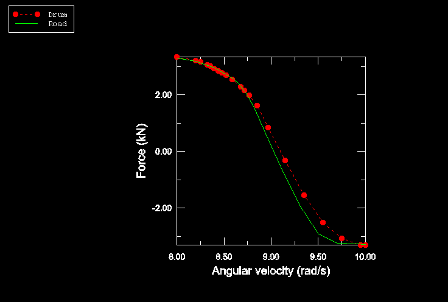

**图 3.1.2-2** 不同角速度下的扭矩。

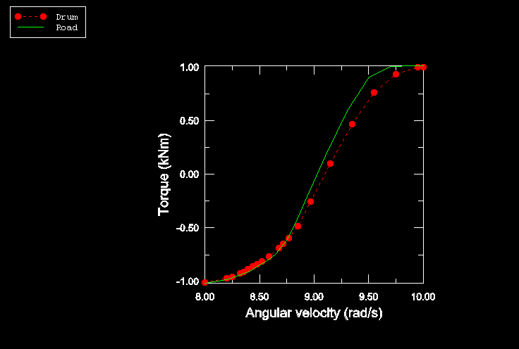

**图 3.1.2-3** 轮胎中心线上的剪切应力（自由滚动）。

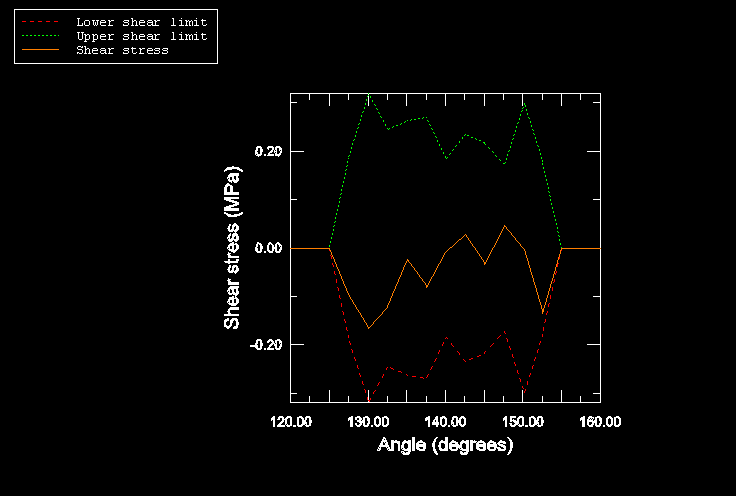

**图 3.1.2-4** 轮胎中心线上的剪切应力（完全牵引）。

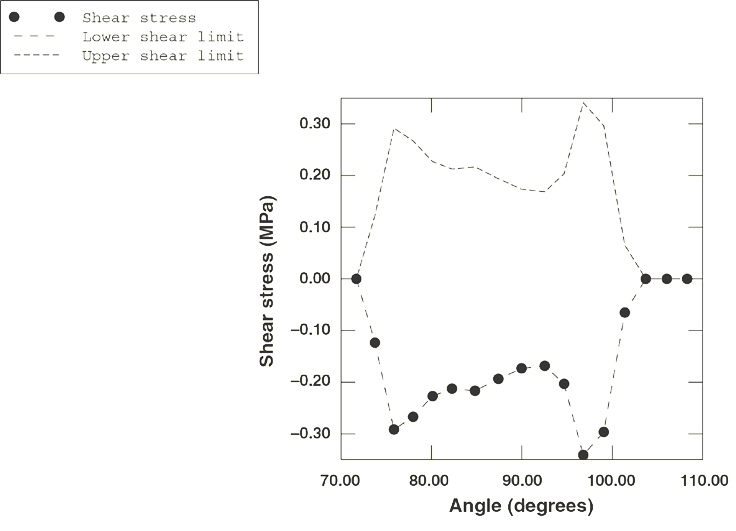

**图 3.1.2-5** 不同角速度下的扭矩（精细搜索）。

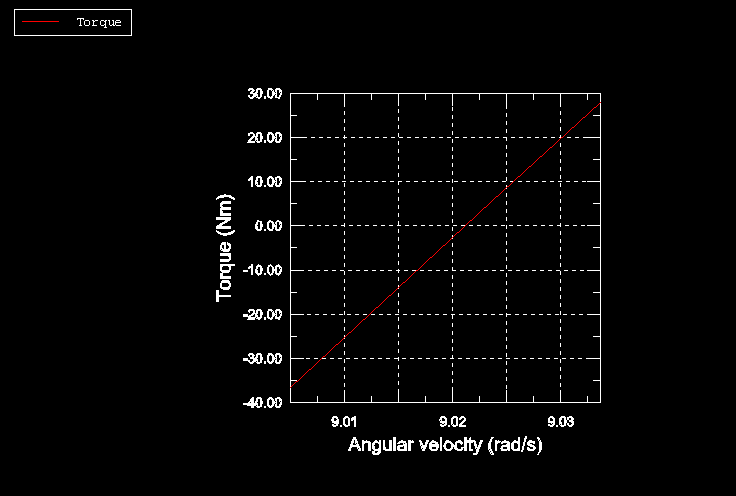

**图 3.1.2-6** 横向力作为滑移角的函数。

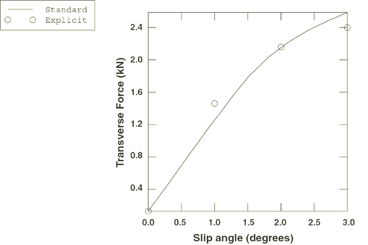

**图 3.1.2-7** 滚动阻力和归一化扭矩作为角速度的函数（*R*=0.3162 m）。

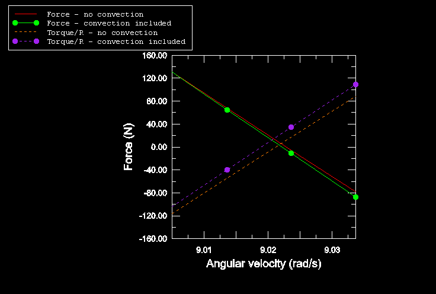

**图 3.1.2-8** Camber 推力作为 camber 角的函数。

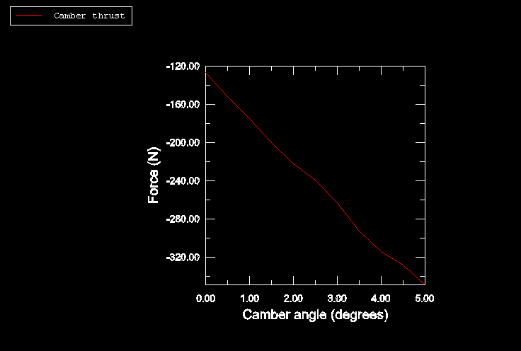

**图 3.1.2-9** 直接方法找到自由滚动解时轮辋上的扭矩。

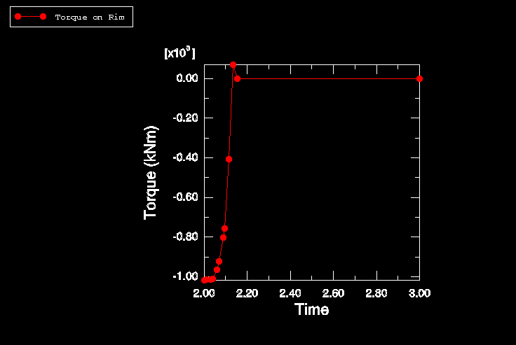

