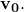

# 3.1.2 Steady-state rolling analysis of a tire

**Product: **Abaqus/Standard  

This example illustrates the use of steady-state transport in Abaqus (["Steady-state transport analysis," Section 6.4.1 of the Abaqus Analysis User's Guide](../usb/usb-link.md#usb-anl-asteadystatetransport)) to model the steady-state dynamic interaction between a rolling tire and a rigid surface. A steady-state transport analysis uses a moving reference frame in which rigid body rotation is described in an Eulerian manner and the deformation is described in a Lagrangian manner. This kinematic description converts the steady moving contact problem into a pure spatially dependent simulation. Thus, the mesh need be refined only in the contact region—the steady motion transports the material through the mesh. Frictional effects, inertia effects, and history effects in the material can all be accounted for in a steady-state transport analysis.

The purpose of this analysis is to obtain free rolling equilibrium solutions of a 175 SR14 tire traveling at a ground velocity of 10.0 km/h (2.7778 m/s) at different slip angles on a flat rigid surface. The slip angle is the angle between the direction of travel and the plane normal to the axle of the tire. Straight line rolling occurs at a 0.0 slip angle. For comparison purposes we also consider an analysis of the tire spinning at a fixed position on a 1.5 m diameter rigid drum. The drum rotates at an angular velocity of 3.7 rad/s, so that a point on the surface of the drum travels with an instantaneous velocity of 10.0 km/h (2.7778 m/s). Another case presented examines the camber thrust arising from camber applied to a tire at free rolling conditions. This also enables us to calculate a camber thrust stiffness.

An equilibrium solution for the rolling tire problem that has zero torque, *T*, applied around the axle is referred to as a free rolling solution. An equilibrium solution with a nonzero torque is referred to as either a traction or a braking solution depending upon the sense of *T*. Braking occurs when the angular velocity of the tire is small enough such that some or all of the contact points between the tire and the road are slipping and the resultant torque on the tire acts in an opposite sense from the angular velocity of the free rolling solution. Similarly, traction occurs when the angular velocity of the tire is large enough such that some or all of the contact points between the tire and the road are slipping and the resultant torque on the tire acts in the same sense as the angular velocity of the free rolling solution. Full braking or traction occurs when all the contact points between the tire and the road are slipping.

A wheel in free rolling, traction, or braking will spin at different angular velocities, , for the same ground velocity,  Usually the combination of  and  that results in free rolling is not known in advance. Since the steady-state transport analysis capability requires that both the rotational spinning velocity, , and the traveling ground velocity, , be prescribed, the free rolling solution must be found in an indirect manner. One such indirect approach is illustrated in this example. An alternate approach involves controlling the rotational spinning velocity using user subroutine [`UMOTION`](../sub/sub-link.md#sub-xsl-umotion) while monitoring the progress of the solution through a second user subroutine [`URDFIL`](../sub/sub-link.md#sub-xsl-urdfil). The [`URDFIL`](../sub/sub-link.md#sub-xsl-urdfil) subroutine is used to obtain an estimate of the free rolling solution based on the values of the torque at the rim at the end of each increment. This approach is also illustrated in this example.

A finite element analysis of this problem, together with experimental results, has been published by Koishi et al. (1997).

### Problem description and model definition

A description of the tire and finite element model is given in ["Symmetric results transfer for a static tire analysis," Section 3.1.1](ch03s01aex89.md). To take into account the effect of the skew symmetry of the actual tire in the dynamic analysis, the steady-state rolling analysis is performed on the full three-dimensional model, also referred to as the full model. Inertia effects are ignored since the rolling speed is low ( 10 km/h).

As stated earlier, the steady-state transport capability in Abaqus uses a mixed Eulerian/Lagrangian approach in which, to an observer in the moving reference frame, the material appears to flow through a stationary mesh. The paths that the material points follow through the mesh are referred to as streamlines and must be computed before a steady-state transport analysis can be performed. As discussed in ["Symmetric results transfer for a static tire analysis," Section 3.1.1](ch03s01aex89.md), the streamlines needed for the steady-state transport analyses in this example are computed using the revolve functionality for symmetric model generation.

The incompressible hyperelastic material used to model the rubber in this example includes a time-domain viscoelastic component, which is specified directly using the Prony series parameters. A simple 1-term Prony series model is used. For an incompressible material a 1-term Prony series in Abaqus is defined by providing a single value for the shear relaxation modulus ratio, , and its associated relaxation time, . In this example  = 0.3 and  = 0.1. The viscoelastic—i.e., material history—effects are included in a steady-state transport step unless you are investigating the long-term behavior of the material. See ["Time domain viscoelasticity," Section 22.7.1 of the Abaqus Analysis User's Guide](../usb/usb-link.md#usb-mat-ctimevisco), for a more detailed discussion of modeling time-domain viscoelasticity in Abaqus. 

### Loading

As discussed in ["Symmetric results transfer for a static tire analysis," Section 3.1.1](ch03s01aex89.md), it is recommended that the footprint analyses be obtained with a friction coefficient of zero (so that no frictional forces are transmitted across the contact surface). The frictional stresses for a rolling tire are very different from the frictional stresses in a stationary tire, even if the tire is rolling at very low speed; therefore, discontinuities may arise in the solution between the last static analysis and the first steady-state transport analysis. Furthermore, varying the friction coefficient from zero at the beginning of the steady-state transport step to its final value at the end of the steady-state transport step ensures that the changes in frictional forces reduce with smaller load increments. This is important if Abaqus must take a smaller load increment to overcome convergence difficulties while trying to obtain the steady-state rolling solution. 

Once the static footprint solution for the tire has been computed, the steady-state rolling contact problem can be solved using steady-state transport. The objective of the first simulation in this example is to obtain the straight line, steady-state rolling solutions, including full braking and full traction, at different spinning velocities. We also compute the straight line, free rolling solution. In the second simulation free rolling solutions at different slip angles are computed. In the first and second simulations material history effects are ignored by specifying that the long-term behavior of the material is to be used. The third simulation repeats a portion of the straight line, steady-state rolling analysis from the first simulation; however, material history effects are included if you do not specify a long-term material response. A steady ground velocity of 10.0 km/h is maintained for all the simulations. The objective of the fourth simulation is to obtain the free rolling solution of the tire in contact with a 1.5 m rigid drum rotating at 3.7 rad/s.

In the first simulation ([rollingtire_brake_trac.inp](../eif/rollingtire_brake_trac.inp)) the full braking solution is obtained in the first steady-state transport step by setting the friction coefficient, , to its final value of 1.0 by changing friction properties and applying the translational ground velocity together with a spinning angular velocity that will result in full braking. An estimate of the angular velocity corresponding to full braking is obtained as follows. A free rolling tire generally travels farther in one revolution than determined by its center height, *H*, but less than determined by the free tire radius. In this example the free radius is 316.2 mm and the vertical deflection is approximately 20.0 mm, so  296.2 mm. Using the free radius and the effective height, it is estimated that free rolling occurs at an angular velocity between  8.78 rad/s and  9.38 rad/s. Smaller angular velocities would result in braking, and larger angular velocities would result in traction. We use an angular velocity  8.0 rad/s to ensure that the solution in the first steady-state transport step is a full braking solution (all contact points are slipping, so the magnitude of the total frictional force across the contact surface is ).

In the second steady-state transport analysis step of the full model, the angular velocity is increased gradually to  10.0 rad/s while the ground velocity is held constant. The solution at each load increment is a steady-state solution to the loads acting on the structure at that instant so that a series of steady-state solutions between full braking and full traction is obtained. This analysis provides us with a preliminary estimate of the free rolling velocity. The second simulation (rollingtire_trac_res.inp) performs a refined search around the first estimate of free rolling conditions.

In the third simulation ([rollingtire_slipangles.inp](../eif/rollingtire_slipangles.inp)) the free rolling solutions at different slip angles are computed. The slip angle, , is the angle between the direction of travel and the plane normal to the axle of the tire. In the first step the straight line, free rolling solution from the first simulation is brought into equilibrium. This step is followed by a steady-state transport step where the slip angle is gradually increased from  0.0 at the beginning of the step to  3.0 at the end of the step, so a series of steady-state solutions at different slip angles is obtained. This is accomplished by prescribing a traveling velocity vector with components  and  in the prescribed translational motion, where  0.0 in the first steady-state transport step and  3.0 at the end of the second steady-state transport step.

The fourth simulation ([rollingtire_materialhistory.inp](../eif/rollingtire_materialhistory.inp)) includes a series of steady-state solutions between full braking and full traction in which the material history effects are included.

The fifth simulation (rollingtire_camber.inp) analyzes the effect of camber angle on the lateral thrust at the contact patch under free rolling conditions.

The final simulation in this example ([rollingtire_drum.inp](../eif/rollingtire_drum.inp)) considers a tire in contact with a rigid rotating drum. The loading sequence is similar to the loading sequence used in the first simulation. However, in this simulation the translational velocity of the tire is zero, and a rotational angular velocity is applied to the reference node of the rigid drum. Since a prescribed load is applied to the rigid drum reference node to establish contact between the tire and drum, the rotation axis of the drum is unknown prior to the analysis. Abaqus automatically updates the rotation axis to its current position if the angular velocity is defined. The rotational velocity of the rigid surface can also be defined. In that case the position and orientation of the axis of revolution must be defined in the steady-state configuration and, therefore, must be known prior to the analysis. The position and orientation of the axis are applied at the beginning of the step and remain fixed during the step. When the drum radius is large compared to the axle displacement, as in this example, it is a reasonable approximation to define the axle in the original configuration without significantly affecting the accuracy of the results. 

### Results and discussion

[Figure 3.1.2--1](ch03s01aex90.md#sxmrollingtire-react) and [Figure 3.1.2--2](ch03s01aex90.md#sxmrollingtire-torque) show the reaction force parallel to the ground (referred to as rolling resistance) and the torque, *T*, on the tire axle at different spinning velocities. The figures compare the solutions obtained for a tire rolling on a flat rigid surface with those for a tire in contact with a rotating drum. The figures show that straight line free rolling,  0.0, occurs at a spinning velocity of approximately 9.0 rad/s. Full braking occurs at spinning velocities smaller than 8.0 rad/s, and full traction occurs at velocities larger than 9.75 rad/s. At these spinning velocities all contact points are slipping, and the rolling resistance reaches the limiting value  

[Figure 3.1.2--3](ch03s01aex90.md#sxmrollingtire-freeshear) and [Figure 3.1.2--4](ch03s01aex90.md#sxmrollingtire-fulltrac) show shear stress along the centerline of the tire surface in the free rolling and full traction states for the case where the tire is rolling along a flat rigid surface. The distance along the centerline is measured as an angle with respect to a plane parallel to the ground passing through the tire axle. The dashed line is the maximum or limiting shear stress, , that can be transmitted across the surface, where *p* is the contact pressure. The figures show that all contact points are slipping during full traction. During free rolling all points stick.

A better approximation to the angular velocity that corresponds to free rolling can be made by using the results generated by [rollingtire_brake_trac.inp](../eif/rollingtire_brake_trac.inp) to refine the search about an angular velocity of 9.0 rad/s. The file [rollingtire_trac_res.inp](../eif/rollingtire_trac_res.inp) restarts the previous straight line rolling analysis from Step 3, Increment 8 (corresponding to an angular velocity of 8.938 rad/s) and performs a refined search up to 9.04 rad/s. [Figure 3.1.2--5](ch03s01aex90.md#sxmrollingtire-torqueref) shows the torque, *T*, on the tire axle computed in the refined search, which leads to a more precise value for the free rolling angular velocity of approximately 9.022 rad/s. This result is used for the model where the free rolling solutions at different slip angles are computed.

[Figure 3.1.2--6](ch03s01aex90.md#sxmrollingtire-transverse) shows the transverse force (force along the tire axle) measured at different slip angles. The figure compares the steady-state transport analysis prediction with the result obtained from a pure Lagrangian analysis. The Lagrangian solution is obtained by performing an explicit transient analysis using Abaqus/Explicit (discussed in ["Import of a steady-state rolling tire," Section 3.1.6](ch03s01aex94.md)). With this analysis technique a prescribed constant traveling velocity is applied to the tire, which is free to roll along the rigid surface. Since more than one revolution is necessary to obtain a steady-state configuration, fine meshing is required along the full circumference; hence, the Lagrangian solution is much more costly than the steady-state solutions shown in this example. The figure shows good agreement between the results obtained from the two analysis techniques.

[Figure 3.1.2--7](ch03s01aex90.md#sxmrollingtire-convection) compares the free rolling solutions with and without material history effects included. The solid lines in the diagram represent the rolling resistance (force parallel to the ground along the traveling direction); and the broken lines, the torque (normalized with respect to the free radius) on the axle. The figure shows that free rolling occurs at a lower angular velocity when history effects are included. The influence of material history effects on a steady-state rolling solution is discussed in detail in ["Steady-state spinning of a disk in contact with a foundation," Section 1.5.2 of the Abaqus Benchmarks Guide](../bmk/bmk-link.md#bmk-anl-spinningdisk).

[Figure 3.1.2--8](ch03s01aex90.md#sxmrollingtire-camber) shows the camber thrust as a function of camber angle. The lateral force at zero camber and zero slip is referred to as ply-steer and arises due to the asymmetry in the tire caused by the separation of the belts by the interply distance. Discretization of the contact patch is responsible for the non-smooth nature of the curve, and an overall camber stiffness of 44 N/degree is reasonably close to expected levels.

[Figure 3.1.2--9](ch03s01aex90.md#sxmrollingtire-freeroll) shows the torque on the rim as the rotational velocity is applied with user subroutine [`UMOTION`](../sub/sub-link.md#sub-xsl-umotion), based on the free rolling velocity predicted in user subroutine [`URDFIL`](../sub/sub-link.md#sub-xsl-urdfil). As the torque on the rim falls to within a user-specified tolerance of zero torque, the rotational velocity is held fixed and the step completed. Initially, when the free rolling rotational velocity estimates are beyond a user-specified tolerance of the current rotational velocity, only small increments of rotational velocity are applied. The message file contains information on the estimates of free rolling velocity and the incrementation as the solution progresses. The angular velocity thus found for free rolling conditions is 9.026 rad/s.

### Acknowledgments

SIMULIA gratefully acknowledges Hankook Tire and Yokohama Rubber Company for their cooperation in developing the steady-state transport capability used in this example. SIMULIA thanks Dr. Koishi of Yokohama Rubber Company for supplying the geometry and material properties used in this example.

### Input files

[rollingtire_brake_trac.inp](../eif/rollingtire_brake_trac.inp)

Three-dimensional full model for the full braking and traction analyses.

[rollingtire_trac_res.inp](../eif/rollingtire_trac_res.inp)

Three-dimensional full model for the refined braking and traction analyses.

[rollingtire_slipangles.inp](../eif/rollingtire_slipangles.inp)

Three-dimensional full model for the slip angle analysis.

[rollingtire_camber.inp](../eif/rollingtire_camber.inp)

Three-dimensional full model for the camber analysis.

[rollingtire_materialhistory.inp](../eif/rollingtire_materialhistory.inp)

Three-dimensional full model with material history effects.

[rollingtire_drum.inp](../eif/rollingtire_drum.inp)

Three-dimensional full model for the simulation of rolling on a rigid drum.

[rollingtire_freeroll.inp](../eif/rollingtire_freeroll.inp)

Three-dimensional full model for the direct approach to finding the free rolling solution.

[rollingtire_freeroll.f](../eif/rollingtire_freeroll.f)

User subroutine file used to find the free rolling solution.

### Reference

Koishi,  M., K. Kabe, and M. Shiratori, “Tire Cornering Simulation using Explicit Finite Element Analysis Code,” 16th annual conference of the Tire Society at the University of Akron, 1997.

### Figures

**Figure 3.1.2–1** Rolling resistance at different angular velocities.

**Figure 3.1.2–2** Torque at different angular velocities.

**Figure 3.1.2–3** Shear stress along tire center (free rolling).

**Figure 3.1.2–4** Shear stress along tire center (full traction).

**Figure 3.1.2–5** Torque at different angular velocities (refined search).

**Figure 3.1.2–6** Transverse force as a function of slip angle.

**Figure 3.1.2–7** Rolling resistance and normalized torque as a function of angular velocity (*R*=0.3162 m).

**Figure 3.1.2–8** Camber thrust as a function of camber angle.

**Figure 3.1.2–9** Torque on the rim for the direct approach to finding the free rolling solution.

