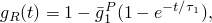
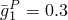
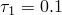
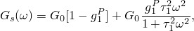
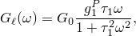
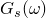
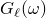
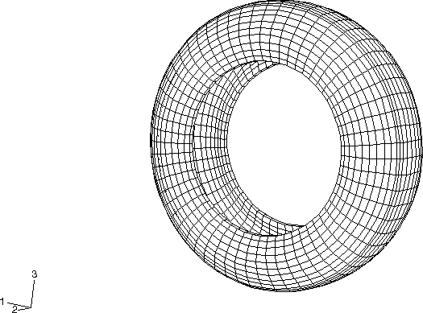
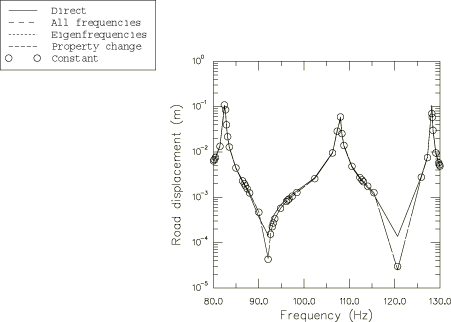
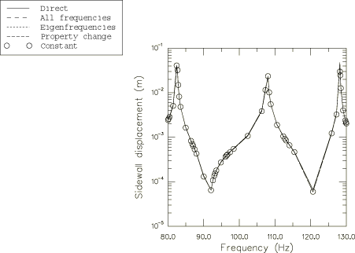

# 3.1.3 基于子空间的稳态动态轮胎分析

**产品：** Abaqus/Standard  

本示例说明了使用基于子空间的稳态动态分析来建模轮胎在静态足迹解周围的频率响应。

基于子空间的稳态动态分析（"基于子空间的稳态动态分析，" Abaqus Analysis User's Guide 第 6.3.9 节）是一种分析过程，可用于计算承受谐波激励的系统的稳态动态响应。它通过直接在由无阻尼系统的特征模集合所跨越的减缩维子空间上投影稳态动态方程的直接求解来完成。如果子空间的维数小于原始问题的维数（即，如果使用相对较少数量的特征模），子空间方法可以提供比直接求解稳态分析更经济有效的替代方案。

本分析的目的是获得承受谐波载荷激励的 175 SR14 轮胎在足迹解周围的频率响应，如"静态轮胎分析的对称结果传递，" 第 3.1.1 节中所讨论的。使用对称结果传递和对称模型生成来生成足迹解，作为稳态动力学计算的基础状态。

### 问题描述

"静态轮胎分析的对称结果传递，" 第 3.1.1 节中给出了所建模轮胎的描述。在本示例中，我们利用轮胎模型中的对称性，并利用 Abaqus 中的结果传递功能来计算与"静态轮胎分析的对称结果传递，" 第 3.1.1 节中讨论的方式相同的完整三维模型的足迹解。

一旦计算出足迹解，就执行几个稳态动态步骤。同时使用直接求解稳态动态分析和基于子空间的稳态动态分析。除了用于验证子空间投影结果外，直接稳态过程还允许我们展示 Abaqus 中子空间投影功能提供的计算优势。

### 模型定义

本分析中使用的模型与"静态轮胎分析的对称结果传递，" 第 3.1.1 节中讨论的第一个仿真中使用的模型基本相同，轴对称模型使用 CGAX4H 和 CGAX3H 单元，带束层和胎体使用连续体单元中的钢筋。此外，使用[图 3.1.3-1](ch03s01aex91.md#sxmtiredynamic-umesh3d)所示的均匀离散化，而不是沿周向的非均匀离散化。

用于对橡胶建模的不可压缩超弹性材料包括由 1 项 Prony 系列的 dimensionless 剪切松弛模量描述的粘弹性分量：

具有松弛系数  和松弛时间 。由于材料是不可压缩的，体积行为与时间无关。此材料的时域描述必须写在频域中以执行稳态动态分析。通过应用傅立叶变换，时相关剪切模量的表达式可以写成频域形式如下：

其中  是储能模量， 是损耗模量， 是角频率。如果定义了 Prony 系列参数，Abaqus 将自动执行从时域到频域的转换。有关频域粘弹性的更详细讨论，请参见"Abaqus Analysis User's Guide 第 22.7.1 节，'时域粘弹性'"。

### 载荷

计算足迹解的加载序列与"静态轮胎分析的对称结果传递，" 第 3.1.1 节中讨论的相同，轴对称模型在 [tiredynamic_axi_half.inp](../eif/tiredynamic_axi_half.inp) 中，部分三维模型在 [tiredynamic_symmetric.inp](../eif/tiredynamic_symmetric.inp) 中，完整三维模型在 [tiredynamic_freqresp.inp](../eif/tiredynamic_freqresp.inp) 中。由于在计算足迹解的静态步骤中考虑了几何非线性，因此以足迹解的非线性变形形状为参考执行稳态动态分析（线性摄动过程）。

使用基于子空间的稳态动态分析执行轮胎的第一次频率响应分析。激励是由于通过其参考节点施加到解析刚体表面的 200 N 谐波垂直载荷。频率从 80 Hz 扫描到 130 Hz。轮胎轮辋在整个分析过程中保持固定。在执行子空间分析之前，在特征频率提取步骤中计算用于子空间投影的特征模。在频率步骤中提取前 20 个特征对，计算的特征值范围为 50 到 185 Hz。

可以通过在特征模提取步骤中包含与频率相关材料特性——即粘弹性——相关的一些刚度来提高子空间分析的准确性。通常，如果材料响应在感兴趣频率范围内没有显著变化，则可以将频率提取设置为在频率范围中心的频率评估属性。否则，运行多个 separate frequency analyses over smaller frequency ranges 将获得更准确的结果。在本示例中，执行单个频率扫描以在 105 Hz 评估属性。

子空间投影方法相对于基于模态的技术（"基于模态的稳态动态分析，" Abaqus Analysis User's Guide 第 6.3.8 节）提供的主要优势是它允许直接将频率相关材料特性（如粘弹性）包含在分析中。然而，在组装投影方程中存在涉及成本，并且在决定子空间解和直接解之间时必须考虑此成本。Abaqus 提供了四种方法来控制投影子空间方程重新计算的频率。这些方法是：在分析中的每个频率处计算投影方程，仅在特征频率处重新计算投影方程，仅在刚度和/或阻尼特性已更改用户指定百分比时重新计算投影方程，以及仅在稳态动态步骤中指定的频率范围中心计算一次投影方程。在每个频率处计算投影方程通常是最准确的选项；然而，在每个频率处重新计算投影方程的相关计算开销可能会显著降低子空间方法相对于直接解的成本效益。仅在频率范围中心计算一次投影方程是最便宜的选择，但只有当材料特性不强烈依赖频率时才应选择它。通常，四种子空间投影方法的准确性和成本与问题高度相关。在本示例问题中，讨论了所有四种子空间投影方法的结果和计算费用。

将各种子空间分析的结果与直接求解稳态动态分析的结果进行比较。

### 结果和讨论

每个子空间分析都利用特征频率提取步骤中提取的所有 20 个模态。[图 3.1.3-2](ch03s01aex91.md#sxmtiredynamic-frequ3) 显示了路面参考节点垂直位移的频率响应图，用于直接解以及使用上述每种子空间投影方法的四种子空间解。类似地，[图 3.1.3-3](ch03s01aex91.md#sxmtiredynamic-frequ2) 显示了轮胎胎侧节点水平位移的频率响应图，用于相同的五次分析。如[图 3.1.3-2](ch03s01aex91.md#sxmtiredynamic-frequ3) 和[图 3.1.3-3](ch03s01aex91.md#sxmtiredynamic-frequ2)所示，所有四种子空间投影方法产生几乎相同的解；除了在 92 和 120 Hz 处垂直位移的微小差异外，子空间投影解也与直接解非常吻合。[表 3.1.3-1](ch03s01aex91.md#table-tiredynamic-timing) 中显示的计时结果显示，子空间投影方法相对于直接解可节省 CPU 时间。

### 输入文件

[tiredynamic_axi_half.inp](../eif/tiredynamic_axi_half.inp)

轴对称模型，充气分析。

[tiredynamic_symmetric.inp](../eif/tiredynamic_symmetric.inp)

部分三维模型，足迹分析。

[tiredynamic_freqresp.inp](../eif/tiredynamic_freqresp.inp)

完整三维模型，稳态动态分析。

[tiredynamic_axi_half_ml.inp](../eif/tiredynamic_axi_half_ml.inp)

轴对称模型，使用 Marlow 超弹性模型的充气分析。

[tiredynamic_symmetric_ml.inp](../eif/tiredynamic_symmetric_ml.inp)

部分三维模型，使用 Marlow 超弹性模型的足迹分析。

[tiredynamic_freqresp_ml.inp](../eif/tiredynamic_freqresp_ml.inp)

完整三维模型，使用 Marlow 超弹性模型的稳态动态分析。

[tiretransfer_node.inp](../eif/tiretransfer_node.inp)

轴对称模型的节点坐标。

### 表格

**表 3.1.3-1** 归一化 CPU 时间比较（相对于直接求解分析），用于从 80 Hz 到 130 Hz 的频率扫描和特征频率提取步骤。
| 直接求解分析方法 | 归一化 CPU 时间 |
| --- | --- |
| 子空间（所有频率处投影） | 0.89 |
| 子空间（特征频率处投影） | 0.54 |
| 子空间（特性变化时投影） | 0.49 |
| 子空间（计算一次投影） | 0.36 |
| 直接 | 1.0 |
| 特征频率提取 | 0.073 |

### 图形

**图 3.1.3-1** 均匀三维轮胎网格。

**图 3.1.3-2** 由于施加到参考节点的 200 N 垂直谐波点载荷，路面垂直位移的频率响应。

**图 3.1.3-3** 由于施加到参考节点的 200 N 垂直谐波点载荷，胎侧水平位移的频率响应。

