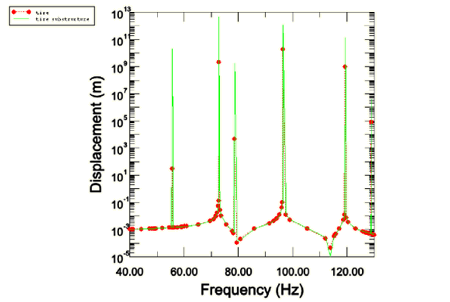

# 3.1.4 轮胎子结构的稳态动态分析

**产品：** Abaqus/Standard  

本示例说明了在 Abaqus 中使用子结构功能（"定义子结构，" Abaqus Analysis User's Guide 第 10.1.2 节）从承受充气和足迹载荷的轮胎创建子结构。使用轮胎子结构的情况在车辆动态分析中经常看到，在这些分析中，使用子结构而不是整个轮胎模型可以节省大量成本。由于轮胎行为非常非线性，因此必须将预载引起的变化 built into the substructure。这是子结构必须在预加载状态下生成的原因。讨论了创建涉及接触的预载子结构的一些特殊考虑。

### 问题描述和模型定义

"静态轮胎分析的对称结果传递，" 第 3.1.1 节中给出了所用轮胎模型的描述。在此问题中，充气和足迹预载在一系列通用分析步骤中施加，与"静态轮胎分析的对称结果传递，" 第 3.1.1 节中讨论的相同。使用对称模型生成和对称结果传递来利用结构和载荷的对称性。胎圈区域的节点绑定到代表轮辋的刚体。

子结构的保留节点包括轮辋节点和足迹中的所有节点。为了增强子结构的动态响应，这些界面 degrees of freedom 通过与前 20 个固定界面特征模 associated generalized degrees of freedom 来增强。根据载荷的性质，可能需要增加广义 degrees of freedom 的数量以覆盖足够的频率范围。由于添加额外频率提取步骤而产生的额外成本被子结构增强的动态响应所抵消。

### 载荷

充气载荷 200 kPa 施加在 [substructtire_axi_half.inp](../eif/substructtire_axi_half.inp) 中包含的轴对称半轮胎模型中。随后是在 [substructtire_symmetric.inp](../eif/substructtire_symmetric.inp) 中给出的三维半轮胎模型上施加 1650 N 的足迹载荷；随后，结果被传递到具有完整足迹载荷 3300 N 的完整轮胎模型。所有这些步骤都使用 NLGEOM=YES 参数运行，因此当生成子结构时，所有预载效应（包括应力刚化）都被考虑在内。

为了保留参与足迹接触约束的 degrees of freedom，有必要用边界条件替换接触约束。这在获得足迹解后通过将保留节点固定在变形状态并移除足迹斑块和路面表面之间的接触对来实现。没有此更改，接触约束会在子结构刚度中产生大的刚度项，这些刚度项可能在使用 level 产生非物理行为。子结构的力学响应 unchanged because the tire is held in its deformed state by a fixed boundary condition。这些保留 degrees of freedom 上的边界条件随后在子结构生成步骤中释放，在该步骤中它们被集中载荷替换。为了执行这些步骤，有必要获得与路面接触的节点列表。因此，子结构在预载分析后的重启分析中生成。这使得可以构建在预加载结束时与路面接触的节点列表。有必要在子结构生成之前的分析中激活单元移除，以启用接触约束的移除。

为了增强子结构的动态响应，包含多个约束特征模作为广义 degrees of freedom。这些约束特征模是从所有保留 degrees of freedom 被约束的特征频率提取步骤中获得的。在本示例中，计算了对应于 50 到 134 Hz 频率范围的前 20 个特征模。在足迹中有 67 个节点，一个具有 six degrees of freedom 的轮辋节点，以及 20 个广义 degrees of freedom，子结构有 227 个 degrees of freedom。

在使用 level，形成轮胎模型中足迹斑块的节点被约束到一个节点。在 40 到 130 Hz 的一系列频率上，分析子结构对谐波足迹载荷的稳态响应。

### 结果和讨论

子结构的稳态动态分析与使用整个轮胎模型运行类似分析相比相对便宜。频率扫描的结果如[图 3.1.4-1](ch03s01aex92.md#sxmsubstructtire-u3)所示，比较了子结构的响应与整个轮胎模型的响应。所有轮胎模型中的共振都被子结构捕获。这个结果表明，虽然轮胎的静态响应用于为保留 degrees of freedom 凝聚刚度和质量，但相对较少的广义 degrees of freedom 可以充分增强子结构的动态响应。但是，在考虑总成本时，必须考虑计算约束特征模的相关费用。

本示例中用于比较的轮胎模型与"静态轮胎分析的对称结果传递，" 第 3.1.1 节中使用的模型相同，只有一个区别。摩擦在稳态动力学步骤之前的步骤中被激活，以在足迹中的节点上激活接触切向方向上的约束，从而产生与子结构模型中足迹节点上施加的约束等效的约束。

### 输入文件

[substructtire_axi_half.inp](../eif/substructtire_axi_half.inp)

轴对称模型，充气分析。

[substructtire_symmetric.inp](../eif/substructtire_symmetric.inp)

部分三维模型，足迹分析。

[substructtire_full.inp](../eif/substructtire_full.inp)

完整三维模型，最终平衡分析。

[substructtire_generate.inp](../eif/substructtire_generate.inp)

子结构生成分析。

[substructtire_dynamic.inp](../eif/substructtire_dynamic.inp)

具有稳态动态分析的使用级模型。

### 图形

**图 3.1.4-1** 由于单位垂直谐波载荷，路面节点的垂直响应。

