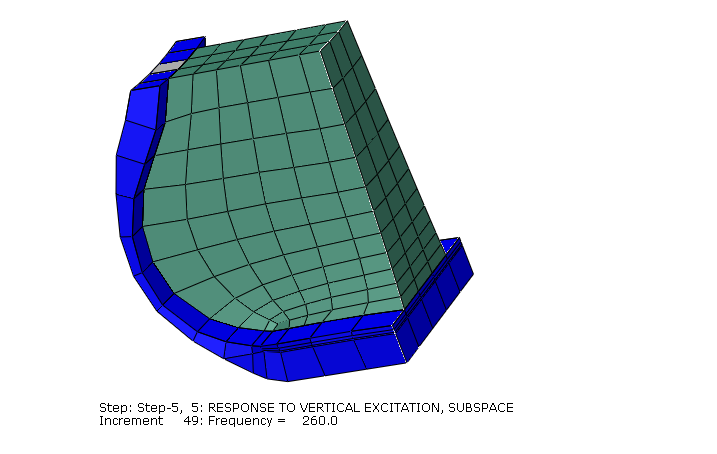
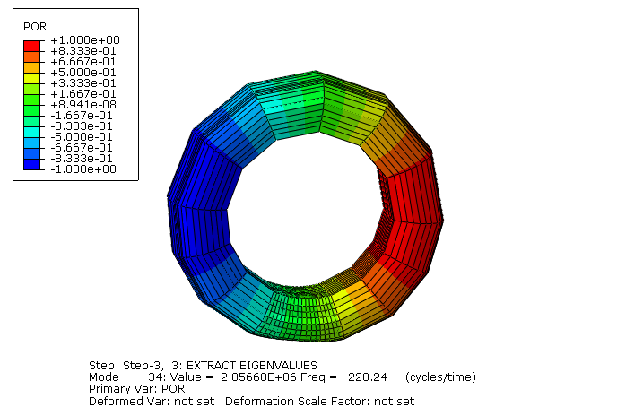
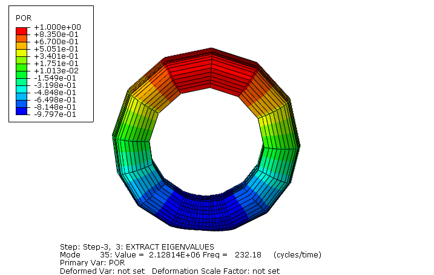
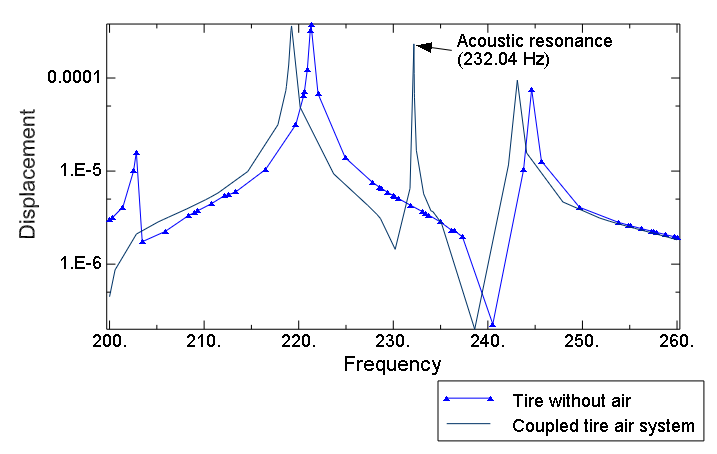
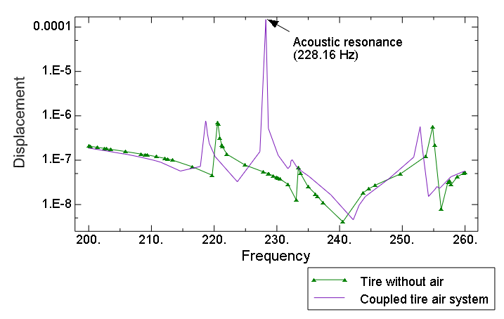
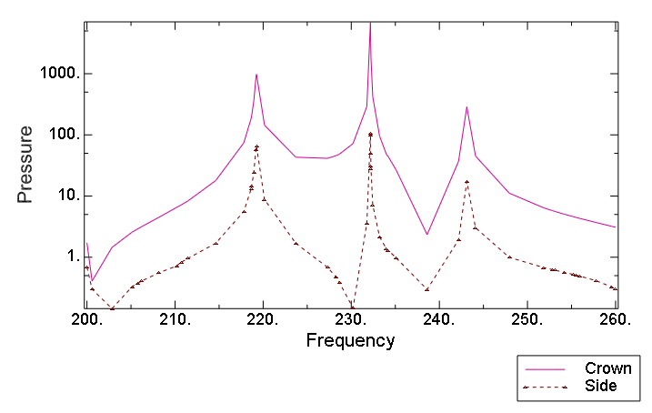
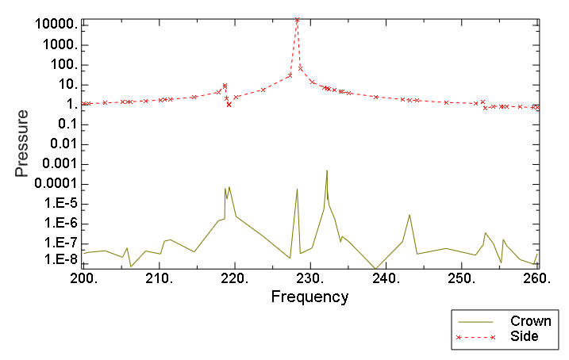
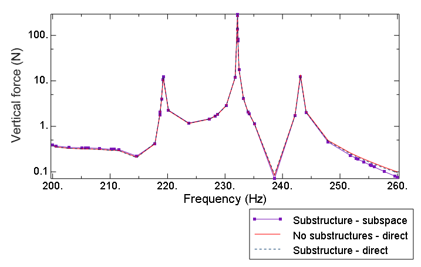

# 3.1.5 Coupled acoustic-structural analysis of a tire filled with air

**Product: **Abaqus/Standard  

The air cavity resonance in a tire is often a significant contributor to the vehicle interior noise, particularly when the resonance of the tire couples with the cavity resonance. The purpose of this example is to study the acoustic response of a tire and air cavity subjected to an inflation pressure and footprint load. This example further demonstrates how the ALE adaptive mesh domain can be used to update an acoustic mesh when structural deformation causes significant changes to the geometry of the acoustic domain. The effect of rolling motion is ignored; however, the rolling speed can have a significant influence on the coupled acoustic-structural response. This effect is investigated in detail in ["Dynamic analysis of an air-filled tire with rolling transport effects," Section 3.1.9](ch03s01aex97.md).

The acoustic elements in Abaqus model only small-strain dilatational behavior through pressure degrees of freedom and, therefore, cannot model the deformation of the fluid when the bounding structure undergoes large deformation. Abaqus solves the problem of computing the current configuration of the acoustic domain by periodically creating a new acoustic mesh. The new mesh uses the same topology (elements and connectivity) throughout the simulation, but the nodal locations are adjusted periodically so that the deformation of the structural-acoustic boundary does not lead to severe distortion of the acoustic elements. The calculation of the updated nodal locations is based on adaptive mesh smoothing. 

### Problem description

A detailed description of the tire model is provided in ["Symmetric results transfer for a static tire analysis," Section 3.1.1](ch03s01aex89.md). We model the rubber as an incompressible hyperelastic material and include damping in the structure by specifying a 1-term Prony series viscoelastic material model with a relaxation modulus of 0.3 and relaxation time of 0.1 s. We define the model in the frequency domain with a direct specification of the Prony series parameters since we want to include the damping effects in a steady-state dynamic simulation.

The air cavity in the model is defined as the space enclosed between the interior surface of the tire and a cylindrical surface of the same diameter as the diameter of the bead. A segment of the tire is shown in [Figure 3.1.5--1](ch03s01aex93.md#tireacou-deflection). The values of the bulk modulus and the density of air are taken to be 426 kPa and 3.6 kg/m3, respectively, and represent the properties of air at the tire inflation pressure.

The simulation assumes that both the road and rim are rigid. We further assume that the contact between the road and the tire is frictionless during the preloading analyses. However, we use a nonzero friction coefficient in the subsequent coupled acoustic-structural analyses. 

### Model definition

 We use a tire model that is identical to that used in the simulation described in ["Symmetric results transfer for a static tire analysis," Section 3.1.1](ch03s01aex89.md). The air cavity is discretized using linear acoustic elements and is coupled to the structural mesh using a surface-based tie constraint with the slave surface defined on the acoustic domain. We model the rigid rim by applying fixed boundary conditions to the nodes on the bead of the tire, while the interaction between the air cavity and rim is modeled by a traction-free surface; i.e., no boundary conditions are prescribed on the surface. 

Symmetric model generation and symmetric results transfer, together with a static analysis procedure, are used to generate the preloading solution, which serves as the base state in the subsequent coupled acoustic-structural analyses. 

In the first coupled analysis we compute the eigenvalues of the tire and air cavity system. This analysis is followed by a direct-solution and a subspace-based steady-state dynamic analysis in which we obtain the response of the tire-air system subjected to harmonic excitation of the spindle. 

A coupled structural-acoustic substructure analysis is performed as well. Frequency-dependent viscoelastic material properties are evaluated at 230 Hz, which is the middle of the frequency range of the steady-state dynamic analysis. The viscoelastic material contributions to the stiffness and structural damping operator are taken into account. They are assumed to be constant with respect to frequency. A substructure is generated using mixed-interface dynamic modes (see ["Defining the retained degrees of freedom" in "Defining substructures," Section 10.1.2 of the Abaqus Analysis User's Guide](../usb/usb-link.md#usb-anl-asuperelementdef-retaineddofs)). A retained degree of freedom that is loaded in the steady-state dynamic analysis is not constrained during the eigenmode extraction. Usually this modeling technique provides a more accurate solution than that obtained using the traditional Craig-Bampton substructures with the fixed-interface dynamic modes.

### Loading

The loading sequence for computing the footprint solution is identical to that discussed in ["Symmetric results transfer for a static tire analysis," Section 3.1.1](ch03s01aex89.md). The simulation starts with an axisymmetric model, which includes the mesh for the air cavity. Only half the cross-section is modeled. The inflation pressure is applied to the structure using a static analysis. In this example the application of pressure does not cause significant changes to the geometry of the air cavity, so it is not necessary to update the acoustic mesh. However, we perform adaptive mesh smoothing after the pressure is applied to illustrate that the updated geometry of the acoustic domain is transferred to the three-dimensional model when symmetric results transfer is used. 

The axisymmetric analysis is followed by a partial three-dimensional analysis in which the footprint solution is obtained. The footprint load is established over several load increments. The deformation during each load increment causes significant changes to the geometry of the air cavity. We update the acoustic mesh by performing 5 mesh sweeps after each converged structural load increment using an ALE adaptive mesh domain. At the end of this analysis sequence we activate friction between the tire and road by changing the friction properties. This footprint solution, which includes the updated acoustic domain, is transferred to a full three-dimensional model. This model is used to perform the coupled analysis. In the first coupled analysis we extract the eigenvalues of the undamped system, followed by a direct-solution steady-state dynamic analysis in which we apply a harmonic excitation to the reference node of the rigid surface that is used to model the road. We apply two load cases: one in which the excitation is applied normal to the road surface and one in which the excitation is applied parallel to the road surface along the rolling (fore-aft) direction.

We want to compute the response of the coupled system in the frequency range in which we expect the air cavity to contribute to the overall acoustic response. We consider the response near the first eigenfrequency of the air cavity only, which has a wavelength that is equal to the circumference of the tire. Using a value of 344 m/s for the speed of sound and an air cavity radius of 0.240 m (the average of the minimum and maximum radius of the air cavity), we estimate this frequency to be approximately 230 Hz. We extract the eigenvalues and perform the steady-state dynamic analysis in the frequency range between 200 Hz to 260 Hz. In the eigenvalue extraction analysis, stiffness contributions from the frequency-dependent viscoelasticity material model are evaluated at a frequency of 230 Hz. In the direct-solution and subspace-based steady-state dynamic analyses, frequency-dependent contributions to the stiffness and damping are evaluated at every frequency point.

The same inflation and loading steps were used for the substructure analysis. In the substructure analysis, the frequency-dependence of viscoelastic material properties cannot be taken into account. Only a vertical excitation load case is considered. 

### Results and discussion

[Figure 3.1.5--1](ch03s01aex93.md#tireacou-deflection) shows the updated acoustic mesh near the footprint region. The geometric changes associated with the updated mesh are taken into account in the coupled acoustic-structural analyses.

The eigenvalues of the air cavity, the tire, and the coupled tire-air system are tabulated in [Table 3.1.5--1](ch03s01aex93.md#table-tireacou-1). The resonant frequencies of the uncoupled air cavity are computed using the original configuration. We obtain two acoustic modes at frequencies of 228.58 Hz and 230.17 Hz. These frequencies correspond to two identical modes rotated 90 with respect to each other, as shown in [Figure 3.1.5--2](ch03s01aex93.md#tireacou-fore-aft-mode) and [Figure 3.1.5--3](ch03s01aex93.md#tireacou-vertical-mode); the magnitudes of the frequencies are different since we have used a nonuniform mesh along the circumferential direction. We refer to the two modes as the fore-aft mode and the vertical mode, respectively. These eigenfrequencies correspond very closely to our original estimate of 230 Hz. The table shows that these eigenfrequencies occur at almost the same magnitude in the coupled system, indicating that the coupling has a very small effect on the acoustic resonance. The difference between the two vertical modes is larger than the difference between the fore-aft modes. This can be attributed to the geometry changes associated with structural loading. The coupling has a much stronger influence on the structural modes than on the acoustic modes, but we expect the coupling to decrease as we move away from the 230 Hz range.

[Figure 3.1.5--4](ch03s01aex93.md#tireacou-u3) to [Figure 3.1.5--7](ch03s01aex93.md#tireacou-pfa) show the response of the structure to the spindle excitation. [Figure 3.1.5--4](ch03s01aex93.md#tireacou-u3) and [Figure 3.1.5--5](ch03s01aex93.md#tireacou-u1) compare the response of the coupled tire-air system to the response of a tire without the air cavity. [Figure 3.1.5--6](ch03s01aex93.md#tireacou-pv) and [Figure 3.1.5--7](ch03s01aex93.md#tireacou-pfa) show the acoustic pressure measured in the crown and side of the air. We draw the following conclusions from these figures. The frequencies at which resonance is predicted by the steady-state dynamic analysis correspond closely to the eigenfrequencies. However, not all the eigenmodes are excited by the spindle excitations. For example, the fore-aft mode is not excited by vertical loading. Similarly, the vertical mode is not excited by fore-aft loading. In addition, only some of the structural modes are excited by the spindle loads, while others are suppressed by material damping. These figures further show that the air cavity resonance has a very strong influence on the behavior of the coupled system and that the structural resonance of the coupled tire-air system occurs at different frequencies than the resonance of the tire without air. As expected, this coupling effect decreases as we move further away from the cavity resonance frequency. 

The eigenfrequencies obtained in the substructure analysis are identical to the eigenfrequencies obtained in the equivalent analysis without substructures. The reaction force obtained at the road reference node is also compared to the reaction force at the same node in the equivalent analysis without substructures. As shown in [Figure 3.1.5--8](ch03s01aex93.md#tireacou-reacforc) the results for the two steady-state dynamics steps in the substructure analysis are virtually identical, and they compare well, in general, with the reaction force obtained in the nonsubstructure analysis. The observed small differences are due to modal truncation and the fact that constant material properties are used to generate the substructure.

### Input files

[tire_acoustic_axi.inp](../eif/tire_acoustic_axi.inp)

Axisymmetric model, inflation analysis.

[tire_acoustic_rev.inp](../eif/tire_acoustic_rev.inp)

Partial three-dimensional model, footprint analysis.

[tire_acoustic_refl.inp](../eif/tire_acoustic_refl.inp)

Full three-dimensional model, eigenvalue extraction and frequency response analyses.

[tire_substracous_gen.inp](../eif/tire_substracous_gen.inp)

Substructure generation analysis.

[tire_substracous_dyn.inp](../eif/tire_substracous_dyn.inp)

Substructure usage analysis (eigenvalue extraction and frequency response analyses).

[tiretransfer_node.inp](../eif/tiretransfer_node.inp)

Nodal coordinates for the axisymmetric tire mesh.

[tire_acoustic_air.inp](../eif/tire_acoustic_air.inp)

Mesh data for the axisymmetric acoustic mesh.

### Table

**Table 3.1.5–1** Eigenfrequencies in the 200–260 Hz frequency range.
| Mode | Air cavity | Tire | Coupled tire-air |
| --- | --- | --- | --- |
| 1 |  | 202.83 | 199.06 |
| 2 |  | 208.95 | 205.73 |
| 3 |  | 212.55 | 210.67 |
| 4 |  | 220.53 | 218.64 |
| 5 |  | 221.30 | 219.24 |
| 6 | 228.58 |  | 228.24 |
| 7 | 230.17 |  | 232.18 |
| 8 |  | 233.42 | 232.24 |
| 9 |  | 236.49 | 234.19 |
| 10 |  | 244.63 | 243.12 |
| 11 |  | 254.84 | 252.84 |
| 12 |  | 257.56 | 255.51 |

### Figures

**Figure 3.1.5–1** Deformation of tire and air in the footprint region. 

**Figure 3.1.5–2** Fore-aft acoustic mode. 

**Figure 3.1.5–3** Vertical acoustic mode. 

**Figure 3.1.5–4** Vertical road displacement due to vertical excitation load. 

**Figure 3.1.5–5** Horizontal road displacement due to horizontal excitation load. 

**Figure 3.1.5–6** Acoustic pressure due to vertical excitation load. 

**Figure 3.1.5–7** Acoustic pressure due to horizontal excitation load. 

**Figure 3.1.5–8** Vertical reaction force due to vertical excitation load. 

