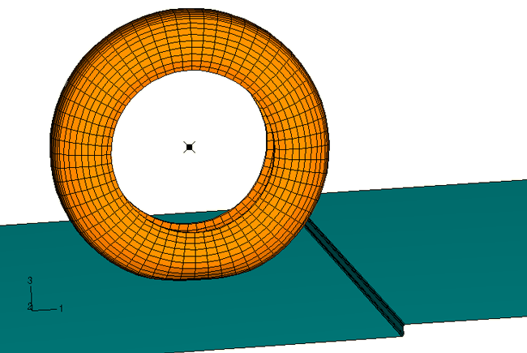
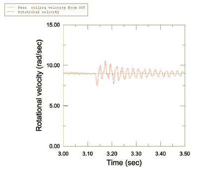
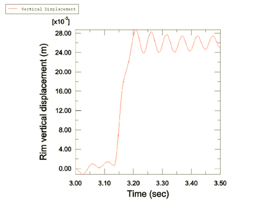
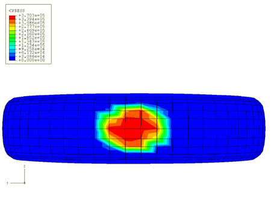
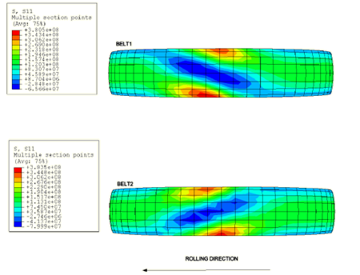
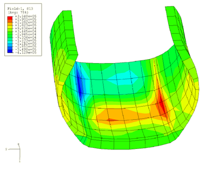

# 3.1.6 稳态滚动轮胎的结果导入

**产品：**Abaqus/Explicit

本示例说明了在Abaqus中使用结果传递功能（"在Abaqus/Explicit和Abaqus/Standard之间传递结果"，《Abaqus分析用户手册》第9.2.2节）从Abaqus/Standard稳态传递分析导入结果到Abaqus/Explicit以模拟瞬态滚动的应用。瞬态滚动过程中的载荷示例包括轮胎与障碍物的碰撞或车辆加速。本问题分析了轮胎与路缘的碰撞。由于显式动态过程需要小的稳定时间增量，且在模拟准静态和稳态载荷时涉及较大的时间尺度，因此在Abaqus/Standard中模拟准静态充气载荷和稳态滚动比在Abaqus/Explicit中进行这些模拟能显著节省成本。此外，在Abaqus/Explicit中获得稳态滚动模拟的成本随滚动速度增加而增加，而在Abaqus/Standard中成本与滚动速度的大小无关。

### 问题描述与模型定义

本例中使用的模型与"静态轮胎分析的对称结果传递"（第3.1.1节）中所使用的模型略有不同。由于只能导入Abaqus/Standard和Abaqus/Explicit共用的单元，因此在本例中使用减缩积分实体单元，胎圈区域的节点连接到表示轮辋的刚性单元。[图3.1.6-1]显示了轮胎与路缘（0.025 m高的台阶）碰撞前的状态。瞬态滚动分析涉及大的刚体旋转，因此在显式动态分析中需要使用非默认的二阶精确运动学公式。此外，建议对Abaqus/Standard和Abaqus/Explicit的所有导入分析使用增强的沙漏控制方案。在轴对称分析中使用截面控制来指定增强的沙漏控制方案。

充气和接地印迹预载荷通过一系列通用分析步施加，与"静态轮胎分析的对称结果传递"（第3.1.1节）中所述相同。使用对称模型生成和对称结果传递来利用结构和载荷的对称性（见《Abaqus分析用户手册》第10.4.1节"对称模型生成"和第10.4.2节"从对称网格或部分三维网格向完整三维网格传递结果"）。

轮胎节点与道路接触时的重复动态碰撞是轮辋反作用力中高频噪声的不可避免来源。基体的粘弹性特性提供了足够的阻尼来减少这种高频噪声。在这种情况下不需要材料阻尼（质量比例或刚度比例）。从稳态传递分析导入的粘弹性应力贡献被传递到Abaqus/Explicit分析中。

### 载荷

在[importrolling_axi_half.inp](../eif/importrolling_axi_half.inp)中，对轴对称半轮胎模型施加200 kPa的充气载荷。随后在[importrolling_symmetric.inp](../eif/importrolling_symmetric.inp)中对三维半轮胎模型施加1650 N的接地载荷，然后将结果传递到完整轮胎模型，完整接地载荷为3300 N。

滚动分析包括将轮胎滚动至自由滚动条件。与"轮胎稳态滚动分析"（第3.1.2节）一样，对轮胎施加10 km/h的平移速度。轮胎的自由滚动速度通过一个独立分析确定，类似于"轮胎稳态滚动分析"（第3.1.2节）中所述的分析。自由滚动条件对应的滚动速度为8.9759 rad/s。本例考虑了惯性载荷，因为目标是将结果导入瞬态动态分析，在该分析中应考虑碰撞过程中的惯性效应。橡胶基体的粘弹性效应也被包含在内，因为粘弹性是轮胎中存在的主要阻尼机制。

在瞬态动态分析过程中，轮胎以10 km/h的预定速度向前移动，车辆载荷施加到轮辋参考节点上。轮胎可以绕车轴自由旋转。道路和轮辋参考节点的所有其他自由度被固定。

### 结果与讨论

结果被导入，分析从时间*t*=3秒开始。[图3.1.6-2]中轮辋处的旋转速度图表明，分析开始时的振荡在可接受的范围内。在导入后约轮胎旋转四分之一圈时（约*t*=3.13秒）启动与路缘的碰撞。[图3.1.6-3]显示了轮辋参考节点的垂直响应，显示了碰撞后轮胎的振荡。瞬态动态解中接触斑块和带层应力的压力分布与Abaqus/Standard的直接稳态解吻合良好。[图3.1.6-4]显示了接地面积上的压力，[图3.1.6-5]显示了带层中的应力。[图3.1.6-6]显示了碰撞过程中的剪切应力图，表明最大应力如预期那样出现在胎肩区域。

### 输入文件

[importrolling_axi_half.inp](../eif/importrolling_axi_half.inp)

轴对称模型，充气分析。

[importrolling_symmetric.inp](../eif/importrolling_symmetric.inp)

半对称三维模型，充气和接地分析。

[importrolling_full.inp](../eif/importrolling_full.inp)

完整三维模型，充气和接地分析。

[importrolling_roll.inp](../eif/importrolling_roll.inp)

稳态自由滚动解。

[importrolling_xpl.inp](../eif/importrolling_xpl.inp)

导入和瞬态动态分析。

### 图表

**图3.1.6-1** 轮胎与路缘碰撞前的状态。

**图3.1.6-2** 轮辋处的旋转速度。

**图3.1.6-3** 轮辋参考节点的垂直响应。

**图3.1.6-4** 接地面积上的压力。

**图3.1.6-5** 带层中的应力。

**图3.1.6-6** 与路缘碰撞过程中胎肩区域的剪切应力。

