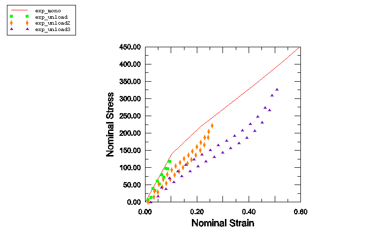
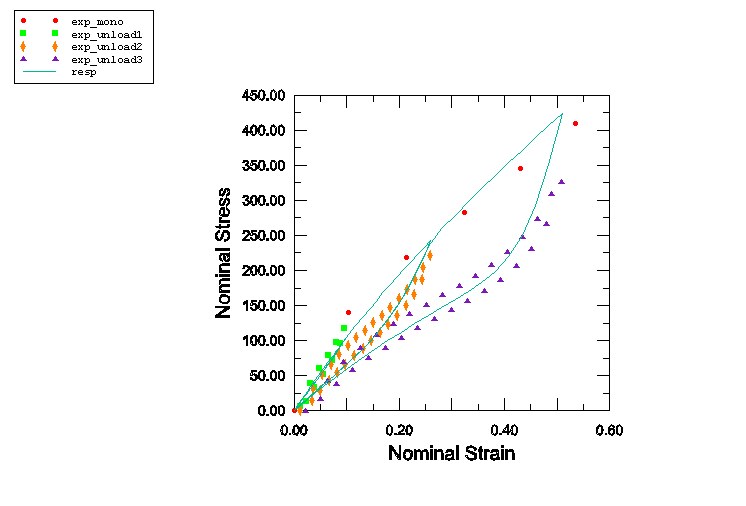
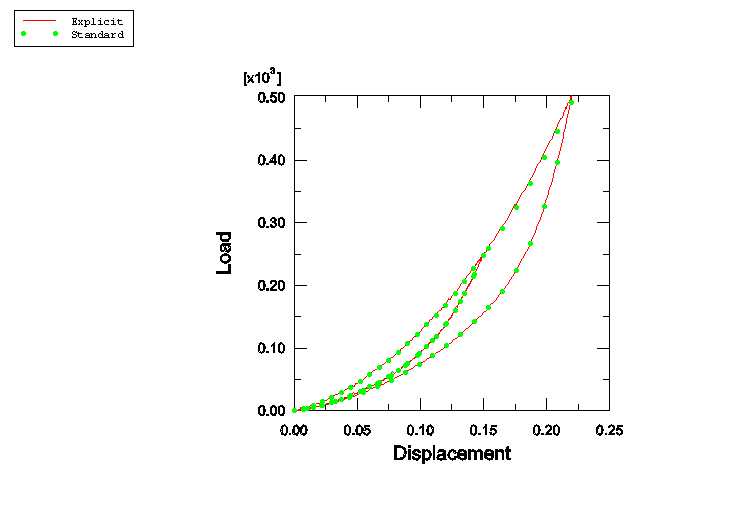
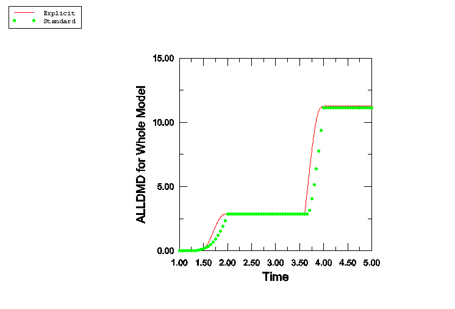
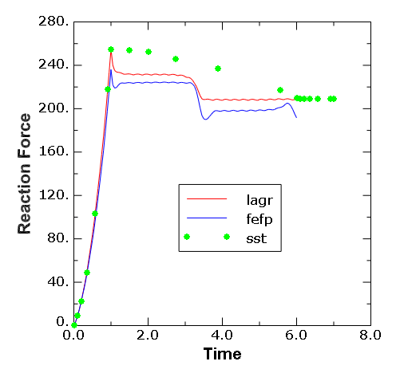
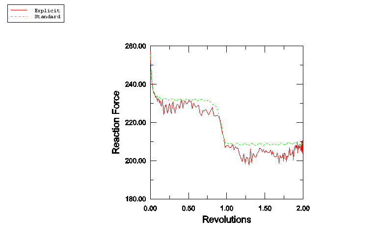
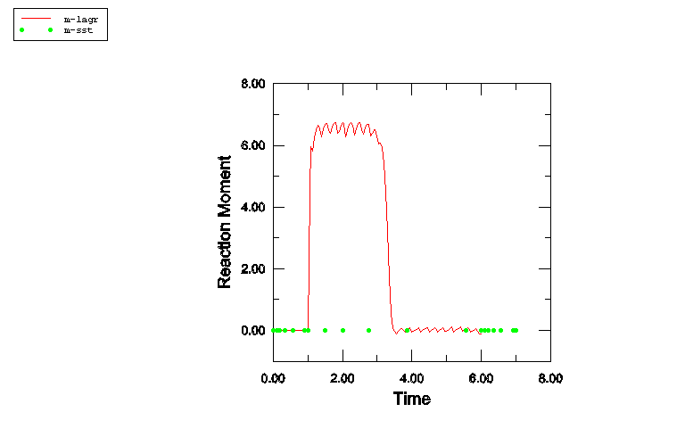
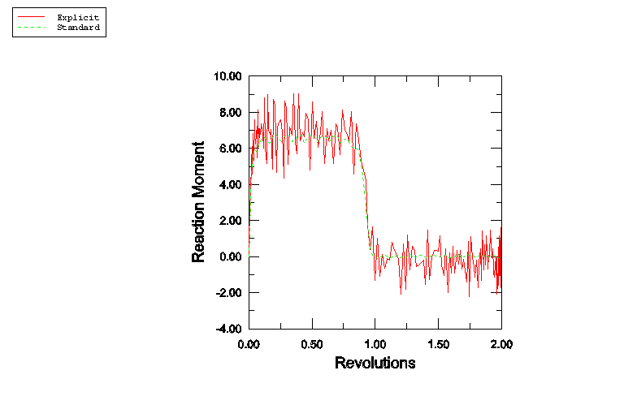
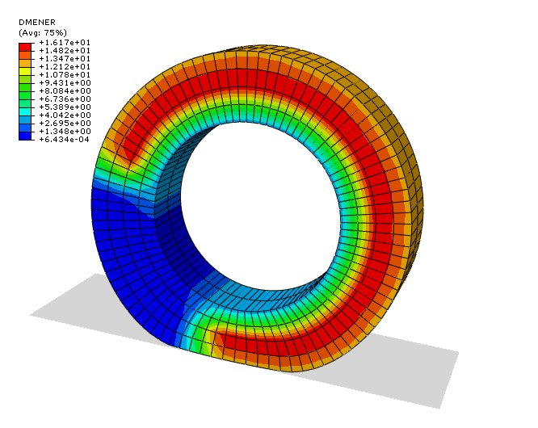

# 3.1.7 具有Mullins效应和永久变形的实心圆盘分析

**产品：**Abaqus/Standard  Abaqus/Explicit

本示例说明了使用Mullins效应来模拟实心橡胶圆盘与刚性表面之间的静态和稳态滚动相互作用。Mullins效应（《Abaqus分析用户手册》第22.6.1节）与超弹性材料模型结合使用，用于模拟在某些填充弹性体中观察到的从某一变形水平卸载时的应力软化现象。本示例的一个变体还包括永久变形的建模（《类橡胶材料中的永久变形》第23.7.1节）。

### 问题描述

本示例分为三个部分。第一部分涉及实验数据的校准，以确定Mullins效应的材料系数。第二部分描述了实心圆盘在接触代表道路的平面刚性表面时产生的循环变形引起的静态响应。这种测试通常在轮胎行业进行，以研究应力软化对轮胎载荷-挠度行为的影响。第三部分是第二部分问题的延续，研究变形圆盘的滚动解。滚动建模使用两种方法：一种涉及圆盘网格旋转的拉格朗日方法，以及Abaqus/Standard中利用更多欧拉方法的稳态传递功能来获得滚动圆盘的稳态解。本示例还说明了Abaqus中的增强沙漏控制能力和永久变形建模。

### 材料特性校准

使用Mullins效应材料模型的第一步是校准测试数据。[图3.1.7-1]显示了一套典型的填充橡胶单轴拉伸测试数据。这些数据代表轮胎行业使用的一类橡胶材料，由Cooper Tire and Rubber Company提供。标记为`exp_mono`的粗曲线表示橡胶材料的主要行为，该行为可从单调测试中获得，测试到一定的变形水平。这些数据通过一组单轴测试数据和超弹性材料模型的定制来提供给Abaqus，指定材料常数应从该测试数据计算。在本例中，使用Yeoh材料模型来校准主要材料行为。当可用的测试数据有限时（如本例情况），降阶多项式模型（如Yeoh模型）能提供更好的拟合。卸载-再加载数据（用于校准Mullins效应系数）以三个不同最大应变水平的稳定加载/卸载循环数据形式提供。尽管Abaqus中的Mullins效应模型预测从给定最大应变水平进行卸载和再加载时沿同一条曲线发生，但实际材料通常表现出循环行为。事实上，从给定最大应变水平的卸载/再加载循环也显示前几个循环中存在渐进损伤的证据。然而，经过几个循环后，行为趋于稳定。卸载-再加载数据可以以所有不同最大应变水平的加载/卸载循环的数据点形式提供给Abaqus，也可以仅以稳定循环的数据点形式提供。在本例中选择了稳定循环，因为所考虑的结构预期会经历重复的循环加载。标记为`exp_unload1`、`exp_unload2`和`exp_unload3`的曲线分别代表最大标称应变水平为0.099、0.26和0.51时的稳定卸载/再加载循环。上述数据使用三组单轴测试数据输入（每个最大应变水平一组），以及由测试数据定义的Mullins效应。

对于包含永久变形的模型，数据使用金属塑性材料定义指定，以便在加载时获得比纯超弹性材料更软的响应。这些模型还包括上述讨论的Mullins效应材料模型。

在设计研究期间，分析师可能希望使用稳定循环的加载部分、稳定循环的卸载部分或两者的平均值来校准Mullins效应参数。这可以通过创建三个数据文件轻松完成，这些文件分别包含稳定循环数据的加载、卸载以及加载和卸载部分。随后，任何一个文件都可以通过外部文件引用从输入文件中引用。在本例中，考虑到循环加载而非主要是单调加载，加载和卸载数据都用于校准；因此，研究的是平均行为。

[图3.1.7-2]显示了Abaqus校准后的响应以及测试数据。粗实线表示循环加载和卸载到三个最大应变水平（已提供测试数据）的数值响应（最低最大应变水平下的响应在此图比例下不可见，因为损伤相对较小）。如图所示，Abaqus中的模型用单条曲线近似每个应变水平下的稳定循环。该图还说明模型无法捕捉任何应变水平下前几个循环中的渐进损伤。因此，虽然从给定应变水平卸载的数值结果从主曲线开始，但稳定循环测试结果的最大应力可能略低于测得的主要材料行为。

可以通过对单元素进行单轴加载/卸载测试来获得数值响应。或者，可以通过使用模型定义数据请求并仅执行**datacheck**运行来获得主要和卸载-再加载行为的数值响应。在后一种情况下，Abaqus计算的响应与实验数据一起打印到数据（`.dat`）文件中。这些表格数据可以在Abaqus/CAE中绘制用于比较和评估目的。也可以使用Abaqus/CAE中可用的自动化材料评估工具来评估主要材料行为。

### 实心圆盘对循环变形的静态响应

由前几节所述橡胶材料制成的实心圆盘承受循环变形。在校准期间确定的Yeoh模型系数与值一起使用，引入材料中少量可压缩性。这些值是基于橡胶的初始体积模量实测值获得的。圆盘外径为3英寸，内径为1.75英寸，厚度为0.7英寸。圆盘的内表面完全约束。外表面最初定义为刚好接触平面刚性表面。圆盘与刚性表面之间的摩擦系数假定为零。在分析过程中，刚性表面被向上推动0.15英寸，回到原始位置，然后再次向上推动0.22英寸，然后被推回到原始位置。上述变形历史构成两个位移控制的变形循环。分析使用Abaqus/Standard和Abaqus/Explicit进行。创建轴对称模型来定义圆盘的几何形状。使用一阶减缩积分砖单元（C3D8R元素）配合增强沙漏控制，通过对称模型生成创建三维圆盘模型。Abaqus/Explicit模型通过从Abaqus/Standard导入模型定义来创建。Abaqus/Standard分析的第一步是一个无事操作步，用于将初始状态导入Abaqus/Explicit。

[图3.1.7-3]显示了刚性体参考节点处的力与位移关系。此图中的两个循环对应于前面讨论的两个变形循环。在第一个循环期间，由于与Mullins效应相关的损伤，卸载响应比加载响应更软。在第二个加载循环中，响应与第一循环的卸载段相同，直到达到0.15英寸的位移。超过此点后，响应是第一循环原始加载段的延续。因此，载荷-位移行为与Mullins效应的预期行为一致。

[图3.1.7-4]显示了由于损伤而在整个模型中耗散的能量历史。能量耗散在第一循环的加载段增加，因为材料在变形过程中经历越来越多的损伤。在第一循环的卸载段和第二循环的加载段（直到0.15英寸的位移），没有发生额外损伤。因此，总耗散保持不变。对于超过0.15英寸的额外位移，发生了更多损伤。这导致总损伤能量进一步增加。在最终卸载循环中，损伤能量再次保持不变。

Abaqus/Explicit分析中的加载使用位移边界条件进行，振幅使用平滑步长定义来减少响应中的噪声。因此，Abaqus/Standard和Abaqus/Explicit模拟之间的位移时间历史不同，尽管两次分析中的总位移量相同。因此，两次分析之间的损伤耗散时间历史显示斜率响应的一些差异。然而，在每个阶段结束时，两种情况下的总耗散是相同的。

### 实心圆盘的滚动响应

圆盘的几何形状和材料与之前描述的相同，只是圆盘的内表面不像静态问题那样完全约束。相反，内表面上的所有节点使用运动耦合约束连接到位于圆盘中心的节点（轴节点）。这便于对轴节点施加角速度或位移来模拟拉格朗日方法中的滚动，以及测量轴处的反作用力和力矩。与静态问题相比，滚动问题的网格更精细。具体而言，在圆盘厚度方向上使用两个单元。第一步是一个无事操作步，便于从Abaqus/Standard到Abaqus/Explicit导入初始状态。此步之后是静态步，其中刚性表面被压向圆盘0.15英寸的距离。下一步涉及加载的圆盘在刚性表面上的滚动，以两种方式完成。第一种是拉格朗日分析，其中以2.5弧度/秒的角速度施加到圆盘的轴节点。在本例中，结构在一个完整revolution后达到稳态。在后续的循环中不会发生额外损伤。因此，总时间选择为使圆盘完成两圈。拉格朗日分析的一个变体包括使用金属塑性材料定义对永久变形进行建模。在第二种分析中，滚动使用Abaqus/Standard中的稳态传递功能进行模拟。两种情况都忽略摩擦和惯性效应。

稳态传递功能直接获得圆盘在刚性表面上的稳态滚动解。由于Mullins效应，滚动解的应力状态可能与非滚动静态解的应力状态有很大不同。因此，直接从非滚动静态解获取稳态滚动解的尝试可能导致用于求解整体非线性系统的牛顿方案收敛问题。由于损伤（从而状态不连续性）与角滚动速度无关，因此在稳态传递步期间的时间增量削减无法克服收敛困难。可以通过在实际分析之前的额外稳态传递步中逐渐引入损伤来解决此类收敛困难。在本例中，这是通过在静态加载步之后跟随一个稳态传递步来实现的，该步具有小的滚动角速度0.25弧度/秒，并且Mullins效应在步的时间周期内逐渐增加。此步之后是另一个稳态传递步，角速度为2.5弧度/秒，MULLINS参数设置为STEP，这提供了我们想要获得的结果。

拉格朗日模拟也在Abaqus/Explicit中进行。监测动能以确保问题保持基本准静态。圆盘的循环通过使用平滑步长定义的振幅在轴节点处施加旋转位移（对应于两个完整圈）来完成。可压缩性参数选择为5×10⁵，比实际值高一个数量级，以获得相对较高的时间增量，从而相对较低的运行时间。

[图3.1.7-5]比较了Abaqus/Standard中拉格朗日和稳态滚动分析在轴节点处的反作用力时间历史。没有永久变形的拉格朗日问题结果（标记为`lagr`的曲线）表明，反作用力在加载步期间增加，在圆盘第一圈期间减少。反作用力的减少是由于材料中的损伤导致整体应力降低。在圆盘的第二圈期间，反作用力保持恒定，因为没有发生额外损伤。包括永久变形的拉格朗日问题结果（标记为`fefp`的曲线）显示与前者相比更软的行为，并清楚地表明实心圆盘在刚性表面上滚动时在接触区域存在永久变形。稳态滚动结果（标记为`sst`）在第一个稳态传递步（逐渐增加Mullins效应）期间显示反作用力的逐渐过渡。在第二个稳态传递步期间，反作用力保持在前一步结束时达到的值保持恒定。该曲线还说明与Mullins效应相关的损伤与角旋转速度无关。在0.25和2.5弧度/秒的角速度下，反作用力保持相同。如果Mullins效应不是在第一个稳态传递步逐渐施加的，滚动和静态状态之间的不连续可能导致收敛困难。

[图3.1.7-6]从不同角度展示了相同的结果，该图显示了Abaqus/Standard和Abaqus/Explicit的反作用力与圈数的关系。反作用力在第一圈减少，在第二圈保持恒定（除了Abaqus/Explicit分析中的噪声）。

[图3.1.7-7]显示了拉格朗日和解态滚动解决方案之间在轴节点处的反作用力矩时间历史的比较。拉格朗日结果标记为`m-lagr`，而稳态滚动结果标记为`m-sst`。如果材料是纯超弹性的（无损伤），接触力关于包含轴且垂直于刚性表面的平面对称；因此，旋转圆盘不需要扭矩。然而，由于与Mullins效应相关的损伤，接触力不对称，因为材料颗粒在第一圈期间通过接触区域过渡。这导致拉格朗日分析结果中第一圈的反作用力矩。该力矩在第二圈减小到零。稳态滚动结果不包括第一圈的瞬态解；因此，它们在所有时间都显示零力矩。[图3.1.7-8]从不同角度显示了相同的结果。在该图中，反作用力矩作为Abaqus/Standard和Abaqus/Explicit圈数的函数绘制。

[图3.1.7-9]显示了损伤能量耗散的等值线图，该图对应于圆盘第一圈约四分之三时刻材料点处的损伤。该图表明已经通过接触区域的材料中存在损伤，而尚未通过接触区域的材料中没有损伤。这对应于约四分之三圆盘材料的损伤。剩余四分之一仍然是未损伤的，因为它尚未经历任何变形。完整的圆盘将在第一圈结束时受到损伤，损伤状态在第二圈期间保持不变。

### 结果与讨论

结果在各单独章节中讨论，清楚展示了材料中损伤的不同影响。

### 输入文件

[mullins_calibrate.inp](../eif/mullins_calibrate.inp)

用于校准材料模型的单元测试。

[mullins_axi_tire.inp](../eif/mullins_axi_tire.inp)

用于静态非滚动问题的轴对称模型。

[mullins_full_tire.inp](../eif/mullins_full_tire.inp)

用于静态非滚动问题的完整三维模型。

[mullins_full_tire_xpl.inp](../eif/mullins_full_tire_xpl.inp)

用于静态非滚动问题的完整三维模型（使用Abaqus/Explicit的准静态模拟）。

[mullins_axi_tire_ref.inp](../eif/mullins_axi_tire_ref.inp)

用于滚动问题的细化轴对称模型。

[mullins_full_tire_roll_lag.inp](../eif/mullins_full_tire_roll_lag.inp)

用于拉格朗日滚动问题的完整三维模型。

[mullins_full_tire_roll_lag_xpl.inp](../eif/mullins_full_tire_roll_lag_xpl.inp)

用于拉格朗日滚动问题的完整三维模型（使用Abaqus/Explicit的准静态模拟）。

[mullins_full_tire_roll_sst.inp](../eif/mullins_full_tire_roll_sst.inp)

用于稳态滚动问题的完整三维模型。

[mullins_calibrate_testdata.inp](../eif/mullins_calibrate_testdata.inp)

用于校准Mullins效应系数的单轴测试数据。

[mullins_hepl_axi_tire_ref.inp](../eif/mullins_hepl_axi_tire_ref.inp)

用于永久变形滚动问题的轴对称参考模型。

[mullins_hepl_full_tire_roll_lag.inp](../eif/mullins_hepl_full_tire_roll_lag.inp)

用于带永久变形的拉格朗日滚动问题的完整三维模型。

### 图表

**图3.1.7-1** 用于校准Mullins效应的测试数据。

**图3.1.7-2** Mullins效应的校准。

**图3.1.7-3** 静态非滚动解的力与位移关系。

**图3.1.7-4** 静态非滚动解的整个模型损伤能量历史。

**图3.1.7-5** 滚动解的反作用力时间历史。

**图3.1.7-6** 反作用力与圈数的关系。

**图3.1.7-7** 滚动解的反作用力矩时间历史。

**图3.1.7-8** 反作用力矩与圈数的关系。

**图3.1.7-9** 损伤能量的等值线图。

