# 3.1.8 在Abaqus/Standard中使用自适应网格进行胎面磨损模拟

**产品：**Abaqus/Standard

本示例说明了在Abaqus/Standard中使用自适应网格作为稳态滚动轮胎胎面磨损建模技术的一部分。分析密切遵循"轮胎稳态滚动分析"（第3.1.2节）中使用的方法，首先建立接地印迹，然后建立稳态滚动轮胎的状态。然后按照稳态传递步，在该步中计算磨损率并外推到步的持续时间，在这个稳态过程中提供对磨损瞬态过程的近似考虑。

### 问题描述与模型定义

除另有说明外，本例中使用的轮胎和有限元模型的描述与"稳态滚动轮胎的导入"（第3.1.6节）中所述相同。由于本分析的重点是胎面磨损，胎面建模更为详细。此外，在胎面区域使用线性弹性材料模型，以避免在自适应网格过程期间平移超弹性材料状态变量的困难。

175 SR14轮胎的轴对称半模型如图[图3.1.8-1]所示。橡胶基体用CGAX4和CGAX3单元建模。增强层用SFMGAX1单元建模，携带钢筋层。使用嵌入式单元约束将增强层嵌入橡胶基体。胎面用弹性模量为6 MPa、泊松比为0.49的弹性材料建模。轮胎的其余部分用超弹性材料模型建模。多项式应变能势使用的系数为C10=10⁶，C01=0.0，D1=2×10⁻⁸。用于建模胎体纤维的钢筋层方向为0°（相对于径向方向），拉压弹性模量为9.87 GPa。压缩模量设置为拉伸模量的1/100。使用Marlow超弹性模型来指定此类材料定义的标称应力-标称应变数据。带层纤维材料的拉伸弹性模量为172.2 GPa。压缩模量设置为拉伸模量的1/100。带层中的纤维相对于环向（周向）方向以+20°和-20°定向。

三维模型首先通过使用对称模型生成，将轴对称半模型旋转360°，生成如图[图3.1.8-2]所示的部分三维模型。在接地区域应用聚焦网格。然后将部分三维模型关于一条线反射，生成完整三维模型。然后将结果从接地印迹模拟结束时（部分三维模型）传递（见[图3.1.8-2]）。

#### 胎面磨损计算中自适应网格的局限性

自适应网格的使用必然对用于本例的轮胎模型施加以下限制：
- 目前不支持圆柱单元与自适应网格，因此本模型中未使用。
- 自适应网格通常对超弹性材料模型表现不佳，因为变形梯度状态变量的平移不准确。因此，胎面使用弹性材料定义。
- 包含钢筋层的嵌入式单元不能在自适应网格域内使用。
- 自由表面上的自适应网格平滑发生在由单元几何特征决定的方向上，这可能并不总是与或容易实现磨损方向的描述。因此，如下所述，通常需要做额外的工作来明确描述磨损方向。

### 载荷

分析分五个阶段进行，从轴对称模型开始，到使用对称模型生成创建的完整三维模型结束。前四个步骤密切遵循"轮胎稳态滚动分析"（第3.1.2节）中使用的方法。

1. 轴对称充气：200 kPa的充气压力施加到轮胎内部，同时在中间平面上施加对称条件。
2. 部分模型的三维接地分析：轴对称半模型绕轴线旋转。
3. 整体模型的三维接地分析：部分三维模型关于一条线反射，生成完整三维模型。
4. 稳态传递：然后在30 km/h下对生成的完整模型进行稳态传递分析。为轮胎指定25 rad/s的角速度。这些条件对应于制动状态。在此步骤中考虑惯性效应和粘弹性。
5. 胎面磨损模拟：最后一步进行胎面磨损模拟，其中轮胎速度保持恒定，磨损根据在轮胎周边耗散摩擦能计算并施加。在此次模拟中也考虑惯性效应和粘弹性。此步骤运行持续时间为3.6×10⁶秒，模拟轮胎以30 km/h行驶30,000公里。

最后一步使用磨损模型，该模型基于轮胎的稳态滚动预测磨损或表面烧蚀率。我们有兴趣预测由于此磨损率导致的轮胎配置变化；因此，我们必须引入一些建模假设，使稳态过程中的瞬态效应成为可能。

所做的基本假设是，稳态传递步时间可以被解释为以当前角速度滚动的实际时间持续。我们认为，磨损导致的配置变化仅对任何时候的滚动轮胎解决方案产生很小的影响；因此，结果在每个步时刻都保持稳态意义。有了这个假设，我们可以同时考虑两个不同时间尺度的效应：较短轮胎转动时间尺度和较长轮胎寿命时间尺度。

### 磨损模型

为了说明磨损过程，采用了一个简单的磨损模型，基于磨损率是局部接触压力和滑移率线性函数的假设。虽然我们可以局部计算这些量，但由于稳态传递中使用的欧拉公式，它们必须应用于胎面流线来模拟整个轮胎周长的磨损。

#### 磨损率计算

用于此模拟的磨损本构模型是Archard模型的一种形式，

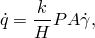

其中是体积材料损失或磨损率；k是无量纲磨损系数；H是材料硬度；P是界面正压力；A是界面面积；是界面滑移率。这里我们可以看到，术语描述了摩擦能量耗散率。对于轮胎橡胶，我们假设磨损系数k=1.11×10⁻⁴，材料硬度H=2 GPa。

以下开发的目标是材料消退或烧蚀率的表达式，它可以应用于节点来模拟磨损。首先，考虑轮胎上的一条带，其中这条带的中心线由轮胎胎面上的一条表面流线上的节点序列定义。然后，该中心线由与每个节点相关的表面流域的两侧限定。所有此类"流带"的组合构成了轮胎表面参与轮胎-道路接触相互作用的总和。我们期望磨损均匀地发生在这条流带上；因此，我们为整个带表示磨损率，

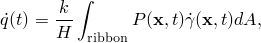

其中t是时间，是当前配置位置。由于我们使用欧拉稳态传递过程，我们现在可以用时间无关的形式重写这个表达式，

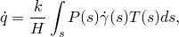

其中s是沿流线的位置，是位置s处流带的宽度。我们还可以将表示为局部材料消退率的函数，

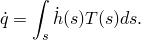

在一个离散形式中将这两个表达式相等，得到以下沿流线的求和表达式：

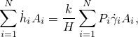

其中是节点消融速度，是节点接触面积。这个方程意味着通常沿流线不是均匀的，这是流带宽度在进入和离开轮胎接地区域时变化的结果。然而，因为我们从接地区域消融节点只是为了保持磨损轮胎配置的合理整体形状，我们将接受均匀节点消融速度的假设。这使得能够使用以下表达式计算：

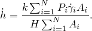

再次使用流带宽度变化可以忽略不计的假设，和认识到节点接触面积，使得不需要使用接触面积的更简单表达式：

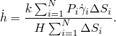

#### 磨损过程实现

有了磨损率的这个表达式（以表面消融速度形式），磨损现在可以在稳态传递分析中应用。用户子程序`UMESHMOTION`用于指定位于轮胎外表面的节点处的消融速度向量。`UMESHMOTION`定义自适应网格约束速度，与自适应网格结合使用，自适应网格是一种在每个收敛增量结束时应用的网格平滑技术。通过用户子程序指定的消融速度应用于胎面表面节点，自适应网格平滑调整内部胎面区域的节点以保持形状良好的网格。

为了在每个胎面流线上积累磨损量，必须在用户子程序中记录沿流线的节点编号方案。该记录在一组公共块变量中。公共块记录属于节点集`NADAPT`（[图3.1.8-4]）且位于完整模型参考截面（θ=0）的节点。公共块变量还包括为对称模型生成指定的节点编号偏移量，与参考截面定义一起，完全描述了胎面表面节点编号。需要在外部公共块中定义以下变量：
- `nStreamlines`：参考截面（完整模型）应用磨损的节点数。
- `nGenElem`：沿流线模型中的扇区数或单元划分数。
- `nRevOffset`：作为旋转对称模型定义一部分指定的节点偏移量。
- `nReflOffset`：作为反射对称模型定义一部分指定的节点偏移量。（如果模型未被反射，则将此参数设置为零）。
- `jslnodes`：包含参考截面所有可能经历磨损的节点所需节点信息的数组。这是一个大小为(2, `nStreamlines`)的数组。对于每个流线，第一个分量是该特定流线在参考截面处的"根节点"（以下讨论中的节点a）的节点号。第二个分量是提供磨损方向的节点（以下讨论中的节点b）。此第二个分量仅对胎面角节点必要。将其设置为定义磨损方向的参考截面处节点的编号。对于不位于胎面角的节点，将第二个数组分量设置为零。磨损将沿与这些位于胎面角远离的节点的局部3方向相反的方向施加。

磨损表达式中的变量使用实用程序例程`GETVRN`和`GETVRMAVGATNODE`从分析数据库访问。P从输出变量CSTRESS访问；从前变量CDISP访问；和从前变量COORD访问的流线节点坐标确定。

#### 磨损运动方向

然后将磨损率作为网格约束向量变量的分量施加。此变量使用在局部坐标系`ALOCAL`中定义的默认网格平滑运动传入用户子程序，该坐标系反映了当前节点处表面法线的度量。3方向定义为外向法线方向，基于节点附近单元面法线的平均值。在大多数情况下，将磨损描述为导致消融或节点后退（与此方向相反）就足够了。然而，在胎面角处，此平均法线不能提供准确的磨损方向。[图3.1.8-5]显示了适当的法线，计算如下：假设a是胎面上的一个角节点。可以识别沿胎面边缘的节点b。在这种情况下，磨损方向由向量ab给出。通过知道a和b的坐标，可以计算全局坐标系中的磨损，并旋转到局部坐标系（`ALOCAL`）方向。

### 结果与讨论

轮胎模型运行持续时间为3.6×10⁶秒，或1000小时，相当于以30 km/h运行30,000公里。[图3.1.8-6]显示了包括磨损影响的最终胎面轮廓。[图3.1.8-7]显示了新轮胎和磨损后配置中接触压力和接触压力误差指标的接地分布。

### 输入文件

[treadwear_axi.inp](../eif/treadwear_axi.inp)

轴对称模型，充气分析。

[treadwear_rev.inp](../eif/treadwear_rev.inp)

部分三维模型，接地分析。

[treadwear_refl.inp](../eif/treadwear_refl.inp)

完整三维模型，接地分析。

[treadwear_roll.inp](../eif/treadwear_roll.inp)

完整三维模型，稳态滚动分析。

[treadwear_wear_straight.inp](../eif/treadwear_wear_straight.inp)

完整三维模型，稳态滚动磨损分析。

[treadwear_wear_slip.inp](../eif/treadwear_wear_slip.inp)

完整三维模型，带滑移的稳态滚动磨损分析。

[treadwear.f](../eif/treadwear.f)

`UMESHMOTION`用户子程序。

### 参考

Archard, J. F., "Contact and Rubbing of Flat Surfaces," Journal of Applied Physics, vol. 24, pp. 981–988, 1953.

### 图表

**图3.1.8-1** 轮胎的轴对称截面。

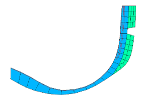

**图3.1.8-2** 部分三维模型。

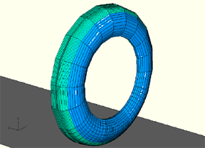

**图3.1.8-3** 完整三维模型。

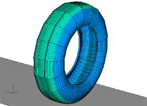

**图3.1.8-4** 属于特定扇区节点集`NADAPT`的节点（`NADAPT`包括所有这些扇区中的所有此类节点）。

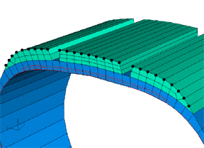

**图3.1.8-5** 胎面角处的磨损方向。

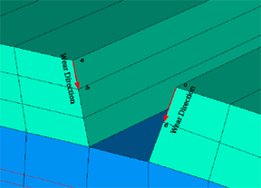

**图3.1.8-6** 未磨损和磨损配置的胎面轮廓。

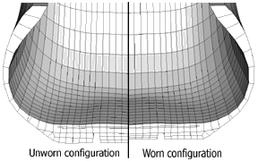

**图3.1.8-7** 未磨损和磨损配置中接地接触压力和接触压力误差指标。

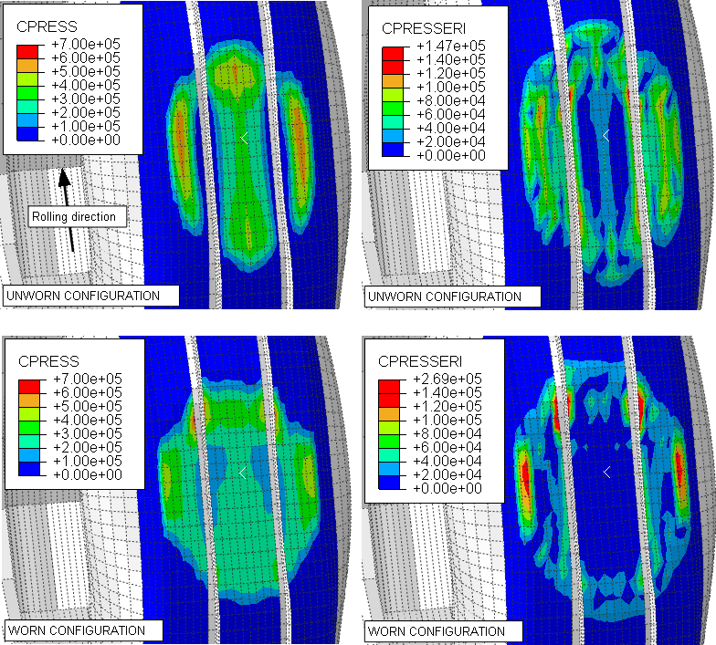

