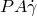
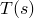
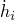
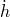
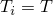
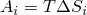
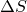

# 3.1.8 Tread wear simulation using adaptive meshing in Abaqus/Standard

**Product: **Abaqus/Standard  

This example illustrates the use of adaptive meshing in Abaqus/Standard as part of a technique to model tread wear in a steady rolling tire. The analysis follows closely the techniques used in ["Steady-state rolling analysis of a tire," Section 3.1.2](ch03s01aex90.md), to establish first the footprint and then the state of the steady rolling tire. These steps are then followed by a steady-state transport step in which a wear rate is calculated and extrapolated over the duration of the step, providing an approximate consideration of the transient process of wear in this steady-state procedure.

### Problem description and model definition

With some exceptions, noted here, the description of the tire and finite element model is the same as that given in ["Import of a steady-state rolling tire," Section 3.1.6](ch03s01aex94.md). Since the focus of this analysis is tread wear, the tread is modeled in more detail. In addition, a linear elastic material model is used in the tread region to avoid difficulties advecting the hyperelastic material state during the adaptive meshing procedure.

The axisymmetric half-model of the 175 SR14 tire is shown in [Figure 3.1.8--1](ch03s01aex96.md#exa-veh-treadwear-crosssection). The rubber matrix is modeled with CGAX4 and CGAX3 elements. The reinforcement is modeled with SFMGAX1 elements that carry rebar layers. An embedded element constraint is used to embed the reinforcement layers in the rubber matrix. The tread is modeled with an elastic material of elastic modulus 6 MPa and Poisson’s ratio 0.49. The rest of the tire is modeled with the hyperelastic material model. The polynomial strain energy potential is used with coefficients C10=106, C01=0.0, and D1=2  10–8. The rebar layers used to model the carcass fibers are oriented at 0 to the radial direction and have an elastic modulus of 9.87 GPa. The modulus in compression is set to 1/100th of the modulus in tension. The Marlow hyperelastic model is used to specify the nominal stress-nominal strain data for such a material definition. The elastic modulus in tension of the material of the belt fibers is 172.2 GPa. The modulus in compression is set to 1/100th of the modulus in tension. The fibers in the belts are oriented at +20 and 20 with respect to the hoop (circumferential) direction.

The three-dimensional model is created by first revolving the axisymmetric half-model, using symmetric model generation, by 360 to generate the partial three-dimensional model shown in [Figure 3.1.8--2](ch03s01aex96.md#exa-veh-treadwear-partial3d). A focused mesh is applied at the footprint region. The partial three-dimensional model is then reflected about a line to generate the full three-dimensional model. The results are then transferred from the end of the footprint simulation for the partial three-dimensional model (see [Figure 3.1.8--2](ch03s01aex96.md#exa-veh-treadwear-partial3d)).

#### Adaptive meshing limitations in tire wear calculations

The use of adaptive meshing necessarily places the following restrictions on the tire model used for this example:
- Cylindrical elements are currently not supported with adaptive meshing and are not used in this model.
- Adaptive meshing generally performs poorly with hyperelastic material models, due to the inaccurate advection of deformation gradient state variables. The tread, therefore, is modeled with an elastic material definition.
- Embedded elements including rebar layers cannot be used within the adaptive mesh domain.
- Adaptive mesh smoothing on free surfaces occurs in directions determined by features of the element geometry, which may not always be consistent with or easily enable description of wear directions. As a result, as discussed below, you will generally have to do additional work to explicitly describe the direction of wear.

### Loading

The analysis is conducted in five stages, beginning with an axisymmetric model and ending with a full three-dimensional model created using symmetric model generation. The first four steps follow closely those used in ["Steady-state rolling analysis of a tire," Section 3.1.2](ch03s01aex90.md).

1. Axisymmetric inflation: An inflation pressure of 200 kPa is applied to the interior of the tire, while symmetry conditions are imposed at the midplane.
2. Three-dimensional footprint analysis of the partial model: The axisymmetric half-model is revolved around the axle axis.
3. Three-dimensional footprint analysis of the whole model: The partial three-dimensional model is reflected about a line to generate the full three-dimensional model.
4. Steady-state transport: The generated full model is then subjected to a steady-state transport analysis at 30 km/h. An angular velocity of 25 rad/s is specified for the tire. These conditions correspond to a state of braking. Inertia effects and viscoelasticity are taken into account during this step.
5. Tread wear simulation: The tread wear simulation is conducted in the final step, in which the velocity of the tire is held constant and the wear is computed from the frictional energy dissipated and applied around the periphery of the tire. Inertia effects and viscoelasticity are taken into account during this simulation as well. This step is run for a duration of 3.6 106s, simulating 30,000 kilometers of travel of the tire at 30 km/h.

The final step uses a wear model, which predicts a wear, or surface ablation, rate based on the steady rolling of the tire. We are interested in predicting tire configuration changes as a result of this wear rate; hence, we must introduce some modeling assumptions that enable modeling of a transient effect in a steady-state procedure.

The basic assumption made is that the steady-state transport step time can be interpreted as a real-time duration of rolling at the current angular velocity. We consider that the configuration changes due to wear have only a minor effect on the rolling tire solution at any time; hence, the results remain valid in a steady-state sense at each time through the step. With this assumption we can simultaneously consider effects at two disparate time scales: the shorter tire revolution time scale and the longer tire life time scale.

### Wear model

To illustrate the wear process, a simple wear model is employed based on the assumption that the wear rate is a linear function of the local contact pressure and slip rate. Although we can calculate these quantities locally, due to the Eulerian formulation used in steady-state transport they must be applied over tread streamlines to model the wear of the entire tire perimeter.

#### Wear rate calculation

The wear constitutive model employed for this simulation is a form of the Archard model, 

where  is the volumetric material loss, or wear, rate; *k* is a nondimensional wear coefficient;  *H* is the material hardness; *P* is the interface normal pressure; *A* is the interface area; and  is the interface slip rate. Here we can see that the terms  describe a frictional energy dissipation rate. For tire rubber we assume a wear coefficient *k* =  1.11 10–4 and a material hardness *H* = 2 GPa.

The goal of the following development is an expression for a material recession, or ablation, rate , which can be applied to a node to simulate wear. First, consider a ribbon around the tire, where the centerline of this ribbon is defined by a sequence of nodes comprising one of the surface streamlines on the tire’s tread. This centerline is then bounded on either side by the tributary region of the surface associated with each node. The combination of all such “stream ribbons” then comprises the total surface of the tire involved in tire-to-road contact interactions. We expect the wear to occur uniformly over this stream ribbon; hence, we express a wear rate for the entire ribbon, 

where *t* is the time and  is the current configuration position. Since we are using the Eulerian steady-state transport procedure, we can now rewrite this expression in a time-independent form, 

 where *s* is a position along the streamline and  is the width of the stream ribbon at position *s*. We can also express  as a function of the local material recession rate, 

 Equating these two expressions in a discrete form results in the following expression, summed over a streamline: 

where  is a nodal ablation velocity and  is the nodal contact area. This equation implies that  is generally not uniform along the streamline, which follows as a consequence of the stream ribbon width varying as it enters and leaves the tire footprint. Since, however, we are ablating nodes away from the footprint region solely to maintain a reasonable general shape of the worn tire configuration, we will accept the assumption of a uniform nodal ablation velocity. This enables the following expression for :

  Using again the assumption that the variation in stream ribbon width can be neglected, , and recognizing that the nodal contact area  enables a simpler expression that does not require the use of contact areas:

#### Wear process implementation

With this expression for wear rate in the form of a surface ablation velocity, the wear can now be applied in a steady-state transport analysis. User subroutine [`UMESHMOTION`](../sub/sub-link.md#sub-xsl-umeshmotion) is used to specify the ablation velocity vectors at the nodes that are on the exterior surface of the tire. [`UMESHMOTION`](../sub/sub-link.md#sub-xsl-umeshmotion) defines adaptive mesh constraint velocities and is used in conjunction with adaptive meshing, a mesh smoothing technique applied at the end of each converged increment. The ablation velocities specified through the user subroutine are applied at the tread surface nodes, and adaptive mesh smoothing adjusts nodes in the interior tread region to maintain a well-shaped mesh.

To accumulate wear quantities around each tread streamline, the nodal numbering scheme along the streamlines must be recorded in the user subroutine. This record is made in a set of common block variables. The common block records nodes that belong to node set `NADAPT` ([Figure 3.1.8--4](ch03s01aex96.md#exa-veh-treadwear-nadapt)) and that lie at the reference cross-section (0) of the full model. The common block variables also include the node numbering offsets specified for symmetric model generation, which, together with the reference cross-section definitions, completely describe the tread surface node numbering. The following variables need to be defined in the external common block:
- `nStreamlines`: The number of nodes at the reference section (full model) at which wear is applied.
- `nGenElem`: The number of sectors or element divisions along the streamline in the model.
- `nRevOffset`: The node offset specified as part of the definition of a revolved symmetric model.
- `nReflOffset`: The node offset specified as part of the definition of a reflected symmetric model. (Set this parameter equal to zero if the model is not reflected).
- `jslnodes`: The array that contains the required nodal information for all nodes potentially undergoing wear at the reference section. This is an array of size (2, `nStreamlines`). For each streamline the first component is the node number of the "root node" (node *a* in the following discussion), which is the node on that particular streamline at the reference section. The second component is the node that provides the wear direction (node *b* in the following discussion). This second component is necessary only for the tread corner nodes. Set it equal to the number of the node at the reference section that defines the wear direction. For nodes that are not located at tread corners, set the second array component equal to zero. The wear will be applied opposite to the local 3-direction for these nodes located away from tread corners.

The variables in the expression for wear are accessed from the analysis database using the utility routines `GETVRN` and `GETVRMAVGATNODE`. *P* is accessed from output variable CSTRESS;  from variable CDISP; and the  are determined from streamline nodal coordinates, accessed from variable COORD.

#### Wear motion directions

The wear rate, , is then applied as the components of the mesh constraint vector variable `ULOCAL`. This variable is passed into the user subroutine with default mesh smoothing motions defined in a local coordinate system `ALOCAL`, which reflects a measure of the surface normal at the current node. The 3-direction is defined as the direction of the outward normal and is based on an average of element facet normals near the node. Under most circumstances it is sufficient to describe wear as resulting in ablation, or nodal recession, opposite to this direction. At the tread corners, however, this average normal does not provide an accurate wear direction. The appropriate normal is shown in [Figure 3.1.8--5](ch03s01aex96.md#exa-veh-tieadwear-weardirection) and is computed as follows: Suppose *a* is a corner node on the tread. It is possible to identify a node *b* that lies along the edge of the tread. In this case the wear direction is given by the vector *ab*. By knowing the coordinates of *a* and *b*, the wear can be calculated in the global coordinate system and rotated into the local coordinate system (`ALOCAL`) directions.

### Results and discussion

The tire model is run for a duration of 3.6  106 s, or 1000 hours, the equivalent of 30,000 kilometers of operation at 30 km/h. [Figure 3.1.8--6](ch03s01aex96.md#exa-veh-treadwear-wornprofile) shows the resulting tread profile including the effects of wear. [Figure 3.1.8--7](ch03s01aex96.md#exa-veh-treadwear-footprint) shows the footprint distributions of the contact pressure and the contact pressure error indicator for a new tire and one in the as-worn configuration.

### Input files

[treadwear_axi.inp](../eif/treadwear_axi.inp)

Axisymmetric model, inflation analysis.

[treadwear_rev.inp](../eif/treadwear_rev.inp)

Partial three-dimensional model, footprint analysis.

[treadwear_refl.inp](../eif/treadwear_refl.inp)

Full three-dimensional model, footprint analysis.

[treadwear_roll.inp](../eif/treadwear_roll.inp)

Full three-dimensional model, steady rolling analysis.

[treadwear_wear_straight.inp](../eif/treadwear_wear_straight.inp)

Full three-dimensional model, steady rolling wear analysis.

[treadwear_wear_slip.inp](../eif/treadwear_wear_slip.inp)

Full three-dimensional model, steady rolling wear analysis with slip.

[treadwear.f](../eif/treadwear.f)

`UMESHMOTION` user subroutine.

### Reference

Archard,  J. F., “Contact and Rubbing of Flat Surfaces,” Journal of Applied Physics, vol. 24, pp. 981–988, 1953.

### Figures

**Figure 3.1.8–1** Axisymmetric cross-section of the tire.

**Figure 3.1.8–2** Partial three-dimensional model.

**Figure 3.1.8–3** Full three-dimensional model.

**Figure 3.1.8–4** Nodes belonging to node set `NADAPT` at a particular sector (`NADAPT` includes all such nodes from all the sectors).

**Figure 3.1.8–5** Wear directions at tread corners.

**Figure 3.1.8–6** Tread profile, in the unworn and worn configurations.

**Figure 3.1.8–7** Footprint contact pressure and contact pressure error indicator, in the unworn and worn configurations.

