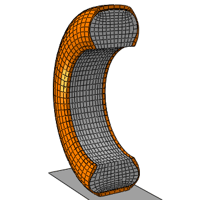
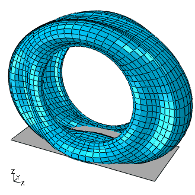
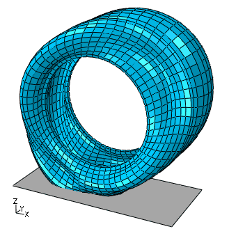
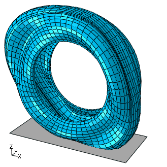
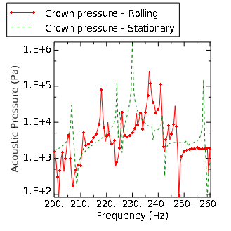
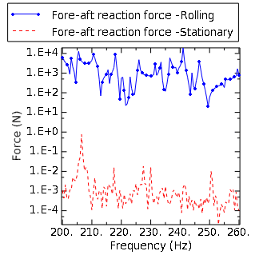
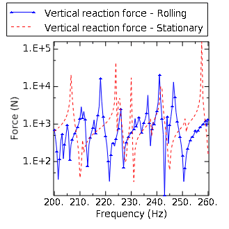

# 3.1.9 具有滚动传递效应的充气轮胎动态分析

**产品：**Abaqus/Standard

本示例扩展了"充气轮胎的耦合声-结构分析"（第3.1.5节）中的分析，将滚动传递效应纳入轮胎和空气。声腔建模为轴对称模型的一部分，该模型被充气、旋转、反射并变形以获得接地印迹，方式与上述示例一致。

本示例的目的是检查在承受充气压力和接地载荷后，稳态滚动传递对轮胎和空气腔声响应的影响。轮胎中的空气腔共振通常是车辆内部噪声的重要贡献者，特别是当轮胎共振与腔共振耦合时。然而，这种耦合共振现象受流体和固体中旋转运动的影响。

### 问题描述

轮胎模型的详细描述在"静态轮胎分析的对称结果传递"（第3.1.1节）中提供。我们将橡胶建模为不可压缩超弹性材料。本例中忽略材料中的粘弹性。

模型中的空气腔定义为轮胎内表面与与bead相同直径的圆柱表面之间的空间。轮胎模型的横截面如图[图3.1.9-1]所示。空气的体积模量和密度分别取为426 kPa和3.6 kg/m³，代表轮胎充气压力下空气的特性。

模拟假设道路和轮辋都是刚性的。我们进一步假设在预加载分析期间，道路和轮胎之间的接触是无摩擦的。然而，我们在后续的耦合声-结构分析中使用非零摩擦系数。

为了评估滚动运动对耦合轮胎-空气系统动力学的影响，我们首先生成静止轮胎的动态结果。在后续分析中，轮胎和空气被设置成滚动运动，并获得相应的动态结果。

### 模型定义

我们使用的轮胎横截面与"静态轮胎分析的对称结果传递"（第3.1.1节）中所述模拟使用的横截面相同。空气腔使用线性声学单元离散化，并通过基于表面的绑定约束耦合到结构网格，奴隶表面定义在声学域上。我们通过对轮胎bead上的节点施加固定边界条件来模拟刚性轮辋，而空气腔和轮辋之间的相互作用通过牵引自由表面建模；即，未在表面上规定边界条件。

我们首先创建轮胎和空气半横截面的轴对称网格，然后将其旋转到半对称。对称模型生成和对称结果传递与静态分析过程一起用于生成预加载解，该解作为后续耦合声-结构分析的基态。

在第一个耦合分析中，我们将旋转的轮胎和空气模型反射到完整的三维配置中。然后我们计算静止轮胎和空气腔系统的实特征值。在频率提取步骤期间，边界条件自动在轮胎-道路界面的接触法线方向上施加。对于粘附的点，固定边界条件也施加在切线方向上。滑动的点在切线方向上可以自由移动。此分析之后是直接稳态动态分析，在该分析中我们获得轮胎-空气系统承受道路施加的谐运动的响应。

在第二个耦合分析中，反射模型从第一步重新启动，在建立接地平衡配置之后。稳态传递过程用于获得轮胎在60 km/h时的自由滚动状态。传递速度的大小在单独分析中独立确定。在此步骤中，声流速度表示声介质也处于旋转运动中。假设轮胎内部的空气与轮胎以相同的角速度旋转。直接稳态分析与静止情况使用的参数相似，并重复进行。

还包括使用具有声流速度效应的子结构进行的额外分析。

### 载荷

计算接地解的载荷序列与"静态轮胎分析的对称结果传递"（第3.1.1节）中所述相同。模拟从包含空气腔网格的轴对称模型开始。只对半横截面进行建模。充气压力使用静态分析施加到结构上。在本例中，压力施加不会导致空气腔几何形状的重大变化，因此无需更新声学网格。然而，我们在压力施加后执行自适应网格平滑，以说明当使用对称结果传递时，声学域的更新几何形状被传递到三维模型。

轴对称分析之后是反射——对称三维分析，在该分析中获得接地解。接地载荷在多个载荷增量中建立。每个载荷增量期间的变形导致空气腔几何形状的重大变化。我们使用自适应网格域在每个收敛结构载荷增量后执行五次网格扫描来更新声学网格。在此分析序列结束时，使用对摩擦属性的更改来激活轮胎和道路之间的摩擦。这个接地解（包括更新的声学域）被传递到完整的三维模型。此模型用于执行耦合分析。在第一个耦合分析中，我们提取无阻尼系统的特征值，然后是直接解稳态动态分析，在该分析中我们对用于模拟道路的刚性表面参考节点施加谐激励。

在静止和滚动分析中，我们在与"充气轮胎的耦合声-结构分析"（第3.1.5节）（200至260 Hz）相同的频率范围内计算耦合系统的响应。该频带包含前后方向和垂直声模式的固有频率，分别为225.67 Hz和230.94 Hz。

模型通过直接解稳态动态步中在道路参考节点上规定的边界条件进行激励。向橡胶施加少量刚度比例阻尼以避免在固有频率处计算无界响应。

### 结果与讨论

耦合轮胎-空气系统的特征频率受滚动运动的影响。通常，我们期望在静止耦合轮胎-空气系统中观察到的模式转换为对应于向前和向后波传播的一对模式。这并不总是发生在复杂系统中，因为静止模式并非都以类似程度受滚动运动影响。然而，上述模式分裂可以在几个结构模式和腔的基本声学模式中观察到。对于位于轮胎车轴上的非旋转参考框架中的观察者（类似于稳态传递过程使用的参考框架），这些模式表现为沿轮胎周长顺时针和逆时针传播的波。对应于向前波传播的模式频率增加，而对应于向后波传播的模式频率降低。静止轮胎的模式表现为静态振动。静止情况的共振频率使用实值频率提取过程计算。复频率过程将产生与静止情况几乎相同的结果，因为本例中使用的阻尼相对较低。然而，对于滚动分析，必须使用复频率过程来使用由于旋转的所有单元贡献获得准确结果。在[表3.1.9-1]中，展示了一对结构模式和声学模式在滚动情况下分裂为一对对应模式的示例。结构模式是圆周阶数为2的径向模式。如果没有接地载荷，静止情况将预测这些模式的相同频率；然而，对于旋转轮胎仍将观察到分裂。这些模式如图[图3.1.9-2]、[图3.1.9-3]和[图3.1.9-4]所示。在径向模式中观察到类似的行为。

[图3.1.9-5]、[图3.1.9-6]和[图3.1.9-7]显示了结构对主轴处施加垂直运动的响应。[图3.1.9-5]比较了静止情况和60 km/h滚动情况下耦合轮胎-空气系统在顶部的声学响应。[图3.1.9-6]显示了前后反作用力，[图3.1.9-7]显示了垂直反作用力。

这些图进一步表明，固体的滚动运动对耦合系统的行为有非常强烈的影响，空气的滚动运动在观察到的频率范围内也产生了类似强烈的效应。特别是，影响反作用力的共振发生在静止和滚动情况下的不同频率上。当引入滚动时，反作用力频率响应图中观察到的共振也会增殖，因为沿滚动方向和相反方向传播的波相对于观察者以不同速度传播。对于静止轮胎，道路的垂直激励会产生可忽略的前后反作用力。然而，在滚动轮胎的情况下，垂直激励引起的前后反作用力是显著的。

当使用具有声流速度效应的子结构时，也可以显示相同的效果。轮胎模型使用更粗的网格，按照相同的操作模式：轴对称模型，然后是旋转、反射，以及用于滚动轮胎的稳态传递分析。子结构在200-250 Hz频率范围内使用直接稳态动态过程。对于完整有限元模型（代替子结构），也可以观察到相同的反作用力分裂共振。

### 输入文件

[sst_acoustic_axi.inp](../eif/sst_acoustic_axi.inp)

轴对称模型，充气分析。

[sst_acoustic_rev.inp](../eif/sst_acoustic_rev.inp)

部分三维模型，接地分析。

[sst_acoustic_refl.inp](../eif/sst_acoustic_refl.inp)

完整三维模型，耦合声-结构分析，无传递效应。

[sst_acoustic_roll100.inp](../eif/sst_acoustic_roll100.inp)

完整三维模型，耦合声-结构分析，传递效应在中等速度。

[tiretransfer_node.inp](../eif/tiretransfer_node.inp)

轴对称轮胎网格的节点坐标。

[tire_acoustic_air.inp](../eif/tire_acoustic_air.inp)

轴对称声学网格的网格数据。

[sst_acoustic_axi_sm.inp](../eif/sst_acoustic_axi_sm.inp)

粗轴对称模型，充气分析。

[sst_acoustic_rev_sm.inp](../eif/sst_acoustic_rev_sm.inp)

粗部分三维模型。

[sst_acoustic_refl_sm.inp](../eif/sst_acoustic_refl_sm.inp)

粗完整三维模型，耦合声-结构分析，无传递效应。

[sst_acoustic_roll_sm.inp](../eif/sst_acoustic_roll_sm.inp)

粗完整三维模型，耦合声-结构分析，传递效应在中等速度。

[P_tire_acoustic_air.inp](../eif/P_tire_acoustic_air.inp)

轴对称声学网格的粗网格数据。

[substracous_afv_sm_gen.inp](../eif/substracous_afv_sm_gen.inp)

包括声流频率提取和子结构生成。

[substracous_afv_sm_use.inp](../eif/substracous_afv_sm_use.inp)

使用子结构的直接稳态分析。

### 表格

**表3.1.9-1** 特征值分裂示例。
| 模式描述 | 静止耦合空气-轮胎 | 滚动耦合空气-轮胎 |
| --- | --- | --- |
| 结构（径向，圆周阶数2） | 95.467 Hz, 99.474 Hz | 86.69 Hz, 103.77 Hz |
| 声学（声腔基本模式） | 225.67 Hz, 230.94 Hz | 218.48 Hz, 237.31 Hz |

### 图表

**图3.1.9-1** 轮胎和空气的横截面。

**图3.1.9-2** 静止情况的径向模式，95.46 Hz。

**图3.1.9-3** 滚动情况反向的径向模式，86.7 Hz（角度90°处的值）。

**图3.1.9-4** 滚动情况前向的径向模式，103.8 Hz（角度90°处的值）。

**图3.1.9-5** 由于施加垂直运动在顶部产生的声压。

**图3.1.9-6** 由于道路位移激励的前后反作用力。

**图3.1.9-7** 由于道路位移激励的垂直反作用力。

