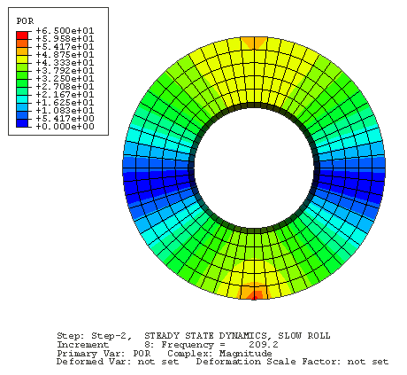
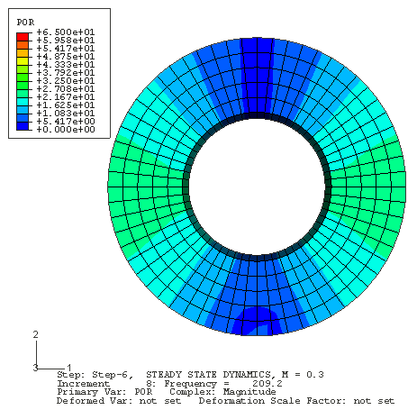
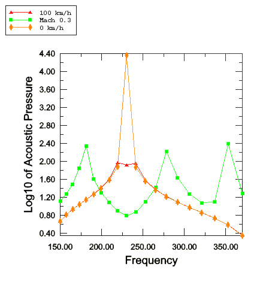

# 3.1.10 Acoustics in a circular duct with flow

**Product: **Abaqus/Standard  

This example illustrates the use of the symmetric model generation and symmetric results transfer capabilities to create an acoustic model and the use of the steady-state transport capability in Abaqus to specify a rotational velocity in acoustic media and to analyze the acoustic field subject to the effects of rotational flow. A tire-shaped acoustic cavity is analyzed.

### Problem description and model definition

The model is a simplified version of the acoustic cavity in a vehicle tire. The cross-section of the cavity is established using axisymmetric elements, and these elements are assigned material properties corresponding to air. A dummy step is used to establish the various files used in the subsequent three-dimensional analysis steps.

The complete toroidal cavity is created using a revolved symmetric model definition to form a circumferentially uniform mesh of 60 segments around the circle. Steady-state dynamic, eigenfrequency extraction, and complex frequency extraction procedures use the acoustic flow velocity to include the effects of the rotational flow. 

The air cavity is analyzed at rest, at 28.0 radians per second (corresponding to 100 kilometers per hour), and at 320 radians per second (corresponding to Mach 0.3 at the outer edge of the cavity).

The steady-state dynamic results are computed at frequencies between 150 and 370 Hz. For the complex analyses, modes are requested between 45 and 1000 Hz.

### Loading

 In the time-harmonic dynamic analysis, a unit imaginary concentrated volumetric acceleration acoustic load is applied to a pair of nodes at the base of the torus. No boundary conditions are applied.

 In the real and complex frequency analyses, no acoustic loads or boundary conditions are applied.

### Results and discussion

Results from the steady-state dynamic analysis show the effect of the rotating flow on the acoustic pressure field. Strong effects in the field develop as speed increases. 

Results from the real frequency analysis show some effect of the rotating flow on the acoustic pressure modes and the frequencies. However, real frequency analysis ignores the important convective term in the formulation, which is complex-valued. Consequently, real frequency analysis of rotating acoustic media should be regarded as a preliminary step for the complex frequency computation, and the results of the real frequency analysis should not be assigned much physical significance. Complex frequency analysis uses the entire, unsymmetric complex acoustic element formulation. The complex contributions are, however, antisymmetric; therefore, the resulting resonant frequencies computed by the complex frequency procedure are pure imaginary; that is, there is no real part of the eigenvalues associated with gain or loss of energy. This is consistent with the physics of acoustics in rotating media. The effect of the flow on the eigenvalues is evident in the apparent splitting of the resonances as speed increases.

### Input files

[exa_acrotflowaxi.inp](../eif/exa_acrotflowaxi.inp)

Axisymmetric model.

[exa_acrotflow3dssdd.inp](../eif/exa_acrotflow3dssdd.inp)

Full three-dimensional model, steady-state dynamic analysis.

[exa_acrotflow3dfreq.inp](../eif/exa_acrotflow3dfreq.inp)

Full three-dimensional model, real and complex frequency analysis.

### Figures

**Figure 3.1.10–1** Steady-state dynamic response at 209 Hz, very low flow velocity.

**Figure 3.1.10–2** Steady-state dynamic response at 209 Hz, flow velocity of Mach 0.3.

**Figure 3.1.10–3** Steady-state dynamic response at node 13204, flow velocities from slow to Mach 0.3.

