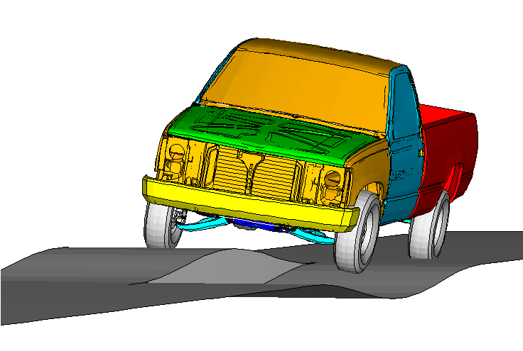
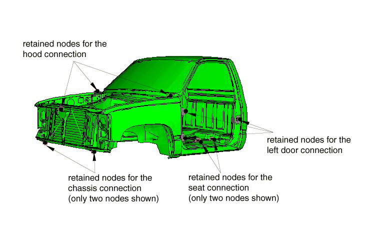
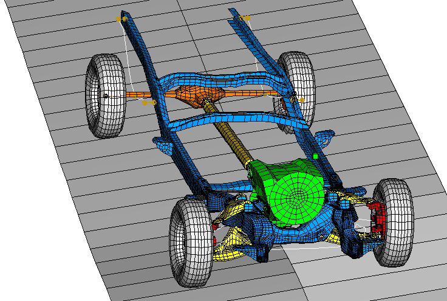
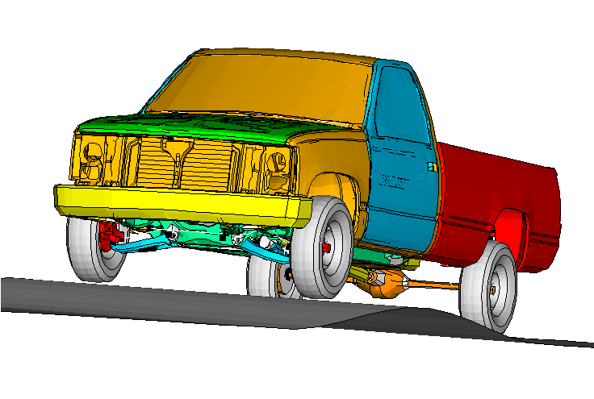
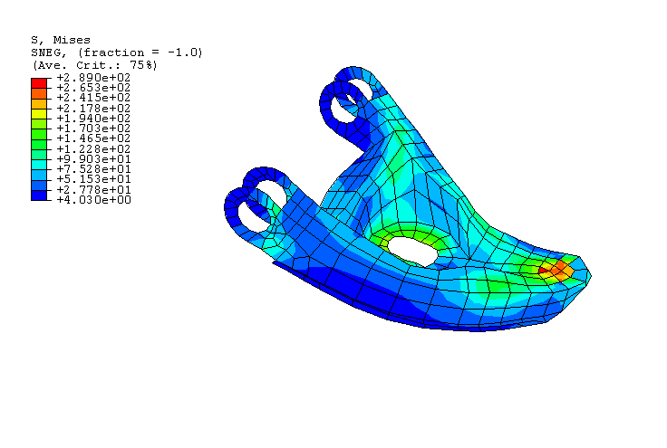
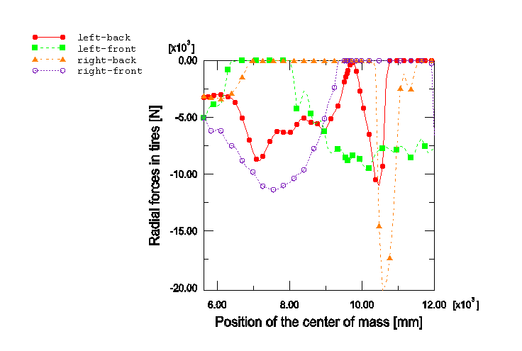
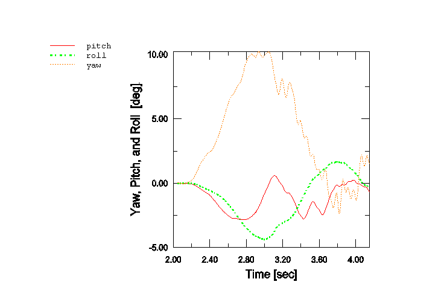

# 3.2.2 皮卡车模型的子结构分析

**产品：**Abaqus/Standard

本示例说明了在Abaqus中使用子结构功能来有效模拟详细皮卡车模型在道路凸起上行驶的车辆动力学。"皮卡车惯性relief"（第3.2.1节）中描述的皮卡车模型几何被用于本示例。该模型被组织为连接在一起的各个部件的集合。然后为可能发生大运动但可以合理假设为小应变弹性变形的每个部件创建子结构（例如车架）。可能发生非线性变形的几个部件（例如后悬架的板簧或前部的稳定杆）使用通常的通用非线性建模选项进行建模。使用耦合约束为每个部件创建连接点。然后使用适当的连接器元件将部件连接在一起。使用简化的CALSPAN轮胎模型（通过用户子程序`UEL`实现）来模拟轮胎中的径向力。车辆通过重力静态加载，在平坦道路上动态加速，然后驶过凸起。如果没有子结构中的应力恢复，子结构分析估计比没有子结构的等效分析快120倍。

### 几何和材料

[图3.2.2-1]中描绘了在本示例中讨论的1994款雪佛兰C1500皮卡车模型，该模型正在越过反对称凸起。模型几何、单元连接性和材料特性来自乔治·华盛顿大学国家碰撞分析中心的公共有限元模型档案。使用的材料在"皮卡车惯性relief"（第3.2.1节）中描述。

该模型被组织为连接在一起的各个部件的集合。除了大刚体运动外仅发生小变形的多数部件被定义为子结构。为以下部件创建子结构：车架、前悬架的每个A臂、每个车轮、后桥、传动轴、发动机/变速箱、驾驶室、每个车门、发动机罩、座椅、前保险杠、货箱和燃油箱。

每个子结构的保留节点数主要由其与相邻部件的连接点决定，[图3.2.2-2]中以驾驶房子结构为例说明。该子结构有20个关联点用于将驾驶室连接到模型中的其他部件。驾驶室底部有6个保留节点（连接到车架）；每个车门有3个保留节点用于发动机罩连接（两个铰链和发动机罩锁）；每个车门有3个保留节点用于车门连接（两个铰链在前，锁在后）；座椅连接有4个保留节点；以及车辆重心处保留一个节点，用于偏航、俯仰和横滚测量目的。

几个部件变形过大，不能被视为子结构，使用常规单元进行建模。后部的板簧和前部的稳定杆都用梁单元建模。前制动组件被建模为刚体。

部件之间的连接使用连接器元件进行建模。JOIN和REVOLUTE连接器用于模拟以下部件之间的铰链：A臂和车架、车门和驾驶室、发动机罩和驾驶室、车轮和转向节、板簧和车架。具有适当定义的连接器弹性、连接器阻尼和连接器摩擦行为的CARTESIAN和CARDAN连接用于定义一些衬套连接（例如发动机支架）。两个UNIVERSAL连接器用于模拟传动轴在前部到变速箱的连接以及在后部到差速器的连接。BEAM连接器用于模拟部件之间的刚性连接。施加到AXIAL连接器的相对运动可用分量用于锁定（或打开）车门和发动机罩。施加到SLOT连接器的相对运动可用分量通过移动转向齿条来指定转向。支柱使用AXIAL连接进行建模，方法是指定近似非线性弹性和阻尼。[图3.2.2-3]中显示了一些悬架相关部件。

轮胎中的径向力使用简化的CALSPAN轮胎模型（Frik，Leister和Schwartz，1993）进行近似建模，通过用户子程序`UEL`实现。考虑600 N/mm的径向刚度。

### 模型

对于所有分析，首先找到重力加载静态平衡配置。由于给定网格几何对应于重力加载平衡位置，并且没有悬架弹簧和轮胎的预应力数据可用，因此必须计算预应力力。为此，首先使用悬架弹簧的人工特性和人工边界条件执行单独的静态应力分析，如下所示。车辆在四个车轮轴（轮胎`UEL`将连接的位置）处用垂直方向上的边界条件支撑，并在重心处固定以防止平面内刚体运动（自由度1、2和6）。在这次独立分析中，悬架弹簧的刚度被人为地提高一千倍，以最小化变形。然后施加重力载荷以获得悬架组件中的平衡应力和车轮轴处的反作用力。

在感兴趣的分析中（具有现实特性和边界条件），从人工静态步骤获得的应力和反作用力分别用作悬架弹簧组件中的初始应力和轮胎中的预应力。运行静态重力加载步骤以获得平衡配置。此平衡配置与给定的初始几何形状仅略有不同（车轮轴横向移动约两毫米）。因此，悬架弹簧和轮胎中的初始应力状态准确地代表了静态平衡，车辆已准备好进行动态加载。

车辆模型被规定初始速度，然后在直接积分隐式动态步骤中加速（0.5 g）到所需速度（5 m/s或7 m/s）。一旦达到"巡航"速度，卡车模型就在对称或反对称凸起（0.2 m高，5.0 m长）上行驶。

### 结果与讨论

在[图3.2.2-4]中，显示了卡车以7 m/s（25.2 km/h）的速度向前移动并"跳过"对称凸起的快照。车轮失去与地面的接触，然后再次落在道路上（未显示）。

更多结果针对卡车越过反对称凸起的情况呈现（见[图3.2.2-1]）。为左下A臂子结构恢复应力，并在前车轮在凸起上行驶3.2 m后显示在[图3.2.2-5]中（有关如何在子结构上显示结果的信息，请参阅Dassault Systèmes知识库中"可视化Abaqus中子结构内梁和壳单元单元结果元素的脚本"，网址www.3ds.com/support/knowledge-base）。轮胎上的径向力如图[图3.2.2-6]所示，从前轮胎即将越过凸起时开始。零径向力表示轮胎已脱离接触。在其重心处连接到模型的CARDAN连接器记录到的偏航、俯仰和横滚角度如图[图3.2.2-7]所示。

当比较完成此类分析所需的总时间时，使用子结构而不是常规可变形元件的优势变得明显。尚未执行使用常规元件的完整分析，因为完成上述任何分析大约需要5个CPU天。通过运行几个增量来估计每次迭代所需的时间，然后将每次迭代的时间乘以完成分析所需的迭代总数来进行估计。使用这些估计，子结构分析比常规网格分析快120倍，具体取决于为每个子结构执行的恢复量。

**abaqus substructurecombine**执行程序可以将两个子结构输出数据库的模型和结果数据合并到单个输出数据库中。更多信息，请参阅《Abaqus分析用户手册》第3.2.22节"组合子结构的输出"。要组合子结构输出数据库，必须请求至少一帧场输出。

### 输入文件

[tr_entire_truck_in_phase.inp](../eif/tr_entire_truck_in_phase.inp)

卡车越过同相凸起的子结构全局分析。

[tr_entire_truck_anti_phase.inp](../eif/tr_entire_truck_anti_phase.inp)

卡车越过反对称凸起的子结构全局分析。

[tr_road_antiphase.inp](../eif/tr_road_antiphase.inp)

反对称道路轮廓定义。

[tr_road_inphase.inp](../eif/tr_road_inphase.inp)

同相道路轮廓定义。

[tr_all_nodes.inp](../eif/tr_all_nodes.inp)

所有节点定义。

[tr_parameters.inp](../eif/tr_parameters.inp)

[*PARAMETER*](../key/key-link.md#usb-kws-mparameter)定义。

[tr_materials.inp](../eif/tr_materials.inp)

材料定义。

[tr_materials_plastic_irl.inp](../eif/tr_materials_plastic_irl.inp)

材料定义。

[tr_initial_stress.inp](../eif/tr_initial_stress.inp)

板簧的初始应力定义。

[tr_lock_doors_and_hood.inp](../eif/tr_lock_doors_and_hood.inp)

保持车门和发动机罩锁定的[*CONNECTOR MOTION*](../key/key-link.md#usb-kws-hconnectormotion)。

[tr_substruct_recovery.inp](../eif/tr_substruct_recovery.inp)

子结构的输出定义。

[tr_brake_front_left.inp](../eif/tr_brake_front_left.inp)

左前制动组件的[*RIGID BODY*](../key/key-link.md#usb-kws-mrigidbody)定义。

[tr_brake_front_right.inp](../eif/tr_brake_front_right.inp)

右前制动组件的[*RIGID BODY*](../key/key-link.md#usb-kws-mrigidbody)定义。

[tr_parameters_inphase.inp](../eif/tr_parameters_inphase.inp)

同相分析的[*PARAMETER*](../key/key-link.md#usb-kws-mparameter)定义。

[tr_parameters_antiphase.inp](../eif/tr_parameters_antiphase.inp)

反对称分析的[*PARAMETER*](../key/key-link.md#usb-kws-mparameter)定义。

[tr_readme.inp](../eif/tr_readme.inp)

运行作业的步骤说明。

##### **用户子程序**

[exa_tr_radial_uel.f](../eif/exa_tr_radial_uel.f)

用于定义轮胎模型的`UEL`。

##### **子结构生成文件**

[tr_chassis_gen.inp](../eif/tr_chassis_gen.inp)

车架。

[tr_retained_chassis.inp](../eif/tr_retained_chassis.inp)

车架的保留节点。

[tr_susp_lower_arm_left_gen.inp](../eif/tr_susp_lower_arm_left_gen.inp)

左下A臂。

[tr_susp_lower_arm_right_gen.inp](../eif/tr_susp_lower_arm_right_gen.inp)

右下A臂。

[tr_susp_upper_arm_left_gen.inp](../eif/tr_susp_upper_arm_left_gen.inp)

左上A臂。

[tr_susp_upper_arm_right_gen.inp](../eif/tr_susp_upper_arm_right_gen.inp)

右上A臂。

[tr_rear_axle_gen.inp](../eif/tr_rear_axle_gen.inp)

后桥。

[tr_retained_rear_axle.inp](../eif/tr_retained_rear_axle.inp)

后桥的保留节点。

[tr_engine_gen.inp](../eif/tr_engine_gen.inp)

发动机和变速箱。

[tr_driveshaft_gen.inp](../eif/tr_driveshaft_gen.inp)

传动轴。

[tr_cabin_gen.inp](../eif/tr_cabin_gen.inp)

驾驶室和前挡泥板。

[tr_retained_cabin.inp](../eif/tr_retained_cabin.inp)

驾驶室的保留节点。

[tr_hood_gen.inp](../eif/tr_hood_gen.inp)

发动机罩。

[tr_door_left_gen.inp](../eif/tr_door_left_gen.inp)

左车门。

[tr_door_right_gen.inp](../eif/tr_door_right_gen.inp)

右车门。

[tr_seat_gen.inp](../eif/tr_seat_gen.inp)

座椅。

[tr_bed_gen.inp](../eif/tr_bed_gen.inp)

货箱。

[tr_fuel_tank_gen.inp](../eif/tr_fuel_tank_gen.inp)

燃油箱。

[tr_bumper_gen.inp](../eif/tr_bumper_gen.inp)

前保险杠。

[tr_wheel_back_left_gen.inp](../eif/tr_wheel_back_left_gen.inp)

左后轮。

[tr_wheel_back_right_gen.inp](../eif/tr_wheel_back_right_gen.inp)

右后轮。

[tr_wheel_front_left_gen.inp](../eif/tr_wheel_front_left_gen.inp)

左前轮。

[tr_wheel_front_right_gen.inp](../eif/tr_wheel_front_right_gen.inp)

右前轮。

##### **单元定义**

[tr_rear_susp_leaf_springs.inp](../eif/tr_rear_susp_leaf_springs.inp)

后板簧悬架。

[tr_stabilizer_elts.inp](../eif/tr_stabilizer_elts.inp)

前稳定杆。

[tr_steering_rods_elts.inp](../eif/tr_steering_rods_elts.inp)

转向杆和转向齿条。

[tr_chassis_elts.inp](../eif/tr_chassis_elts.inp)

车架。

[tr_susp_lower_arm_left_elts.inp](../eif/tr_susp_lower_arm_left_elts.inp)

左下A臂。

[tr_susp_lower_arm_right_elts.inp](../eif/tr_susp_lower_arm_right_elts.inp)

右下A臂。

[tr_susp_upper_arm_left_elts.inp](../eif/tr_susp_upper_arm_left_elts.inp)

左上A臂。

[tr_susp_upper_arm_right_elts.inp](../eif/tr_susp_upper_arm_right_elts.inp)

右上A臂。

[tr_rear_axle_elts.inp](../eif/tr_rear_axle_elts.inp)

后桥。

[tr_engine_elts.inp](../eif/tr_engine_elts.inp)

发动机和变速箱。

[tr_driveshaft_elts.inp](../eif/tr_driveshaft_elts.inp)

传动轴。

[tr_cabin_elts.inp](../eif/tr_cabin_elts.inp)

驾驶室和前挡泥板。

[tr_hood_elts.inp](../eif/tr_hood_elts.inp)

发动机罩。

[tr_door_left_elts.inp](../eif/tr_door_left_elts.inp)

左车门。

[tr_door_right_elts.inp](../eif/tr_door_right_elts.inp)

右车门。

[tr_seat_elts.inp](../eif/tr_seat_elts.inp)

座椅。

[tr_bed_elts.inp](../eif/tr_bed_elts.inp)

货箱。

[tr_fuel_tank_elts.inp](../eif/tr_fuel_tank_elts.inp)

燃油箱。

[tr_bumper_elts.inp](../eif/tr_bumper_elts.inp)

前保险杠。

[tr_wheel_back_left_elts.inp](../eif/tr_wheel_back_left_elts.inp)

左后轮。

[tr_wheel_back_right_elts.inp](../eif/tr_wheel_back_right_elts.inp)

右后轮。

[tr_wheel_front_left_elts.inp](../eif/tr_wheel_front_left_elts.inp)

左前轮。

[tr_wheel_front_right_elts.inp](../eif/tr_wheel_front_right_elts.inp)

右前轮。

##### **多点约束定义**

[tr_chassis_mpc.inp](../eif/tr_chassis_mpc.inp)

车架。

[tr_engine_mpc.inp](../eif/tr_engine_mpc.inp)

发动机和变速箱。

[tr_cabin_mpc.inp](../eif/tr_cabin_mpc.inp)

驾驶室和前挡泥板。

[tr_hood_mpc.inp](../eif/tr_hood_mpc.inp)

发动机罩。

[tr_door_left_mpc.inp](../eif/tr_door_left_mpc.inp)

左车门。

[tr_door_right_mpc.inp](../eif/tr_door_right_mpc.inp)

右车门。

[tr_seat_mpc.inp](../eif/tr_seat_mpc.inp)

座椅。

[tr_fuel_tank_mpc.inp](../eif/tr_fuel_tank_mpc.inp)

燃油箱。

[tr_bumper_mpc.inp](../eif/tr_bumper_mpc.inp)

前保险杠。

##### **耦合定义**

[tr_chassis_coup.inp](../eif/tr_chassis_coup.inp)

车架。

[tr_susp_lower_arm_left_coup.inp](../eif/tr_susp_lower_arm_left_coup.inp)

左下A臂。

[tr_susp_lower_arm_right_coup.inp](../eif/tr_susp_lower_arm_right_coup.inp)

右下A臂。

[tr_susp_upper_arm_left_coup.inp](../eif/tr_susp_upper_arm_left_coup.inp)

左上A臂。

[tr_susp_upper_arm_right_coup.inp](../eif/tr_susp_upper_arm_right_coup.inp)

右上A臂。

[tr_rear_axle_coup.inp](../eif/tr_rear_axle_coup.inp)

后桥。

[tr_engine_coup.inp](../eif/tr_engine_coup.inp)

发动机和变速箱。

[tr_driveshaft_coup.inp](../eif/tr_driveshaft_coup.inp)

传动轴。

[tr_cabin_coup.inp](../eif/tr_cabin_coup.inp)

驾驶室和前挡泥板。

[tr_hood_coup.inp](../eif/tr_hood_coup.inp)

发动机罩。

[tr_door_left_coup.inp](../eif/tr_door_left_coup.inp)

左车门。

[tr_door_right_coup.inp](../eif/tr_door_right_coup.inp)

右车门。

[tr_seat_coup.inp](../eif/tr_seat_coup.inp)

座椅。

[tr_bed_coup.inp](../eif/tr_bed_coup.inp)

货箱。

[tr_fuel_tank_coup.inp](../eif/tr_fuel_tank_coup.inp)

燃油箱。

[tr_bumper_coup.inp](../eif/tr_bumper_coup.inp)

前保险杠。

[tr_wheel_back_left_coup.inp](../eif/tr_wheel_back_left_coup.inp)

左后轮。

[tr_wheel_back_right_coup.inp](../eif/tr_wheel_back_right_coup.inp)

右后轮。

[tr_wheel_front_left_coup.inp](../eif/tr_wheel_front_left_coup.inp)

左前轮。

[tr_wheel_front_right_coup.inp](../eif/tr_wheel_front_right_coup.inp)

右前轮。

##### **连接器定义**

[tr_conn_aarms_left.inp](../eif/tr_conn_aarms_left.inp)

左A臂。

[tr_conn_aarms_right.inp](../eif/tr_conn_aarms_right.inp)

右A臂。

[tr_conn_brake_left.inp](../eif/tr_conn_brake_left.inp)

左前制动组件。

[tr_conn_brake_right.inp](../eif/tr_conn_brake_right.inp)

右前制动组件。

[tr_conn_steering_rods.inp](../eif/tr_conn_steering_rods.inp)

转向杆。

[tr_conn_stabilizer.inp](../eif/tr_conn_stabilizer.inp)

稳定杆。

[tr_conn_leaf_springs.inp](../eif/tr_conn_leaf_springs.inp)

板簧。

[tr_conn_engine.inp](../eif/tr_conn_engine.inp)

发动机和变速箱。

[tr_conn_driveshaft.inp](../eif/tr_conn_driveshaft.inp)

传动轴。

[tr_conn_cabin_to_chassis.inp](../eif/tr_conn_cabin_to_chassis.inp)

驾驶室到车架。

[tr_conn_hood.inp](../eif/tr_conn_hood.inp)

发动机罩。

[tr_conn_door_left.inp](../eif/tr_conn_door_left_inp)

左车门。

[tr_conn_door_right.inp](../eif/tr_conn_door_right_inp)

右车门。

[tr_conn_seat.inp](../eif/tr_conn_seat.inp)

座椅。

[tr_conn_bed.inp](../eif/tr_conn_bed.inp)

货箱。

[tr_conn_fuel_tank.inp](../eif/tr_conn_fuel_tank.inp)

燃油箱。

[tr_conn_bumper.inp](../eif/tr_conn_bumper.inp)

前保险杠。

[tr_conn_wheels_back.inp](../eif/tr_conn_wheels_back.inp)

后轮。

[tr_conn_wheels_front.inp](../eif/tr_conn_wheels_front.inp)

前轮。

### 参考

Frik, S., G. Leister, and W. Schwartz, "Simulation of the IAVSD Road Vehicle Benchmark Bombardier Iltis with FASIM, MEDYNA, NEWEUL, and SIMPACK," in Multibody Computer Codes in Vehicle System Dynamics, Ed. W. Kortum and R. S. Sharp, February 1993.

### 图表

**图3.2.2-1** 越过反对称（左右）凸起的子结构卡车模型。

**图3.2.2-2** 驾驶室的子结构网格。

**图3.2.2-3** 车架、悬架和动力系统相关部件。

**图3.2.2-4** 越过对称（左右）凸起的子结构卡车模型。

**图3.2.2-5** 左下A臂中的恢复应力。

**图3.2.2-6** 卡车越过反对称凸起的轮胎径向力。

**图3.2.2-7** 卡车越过反对称凸起的偏航、俯仰和横滚。

