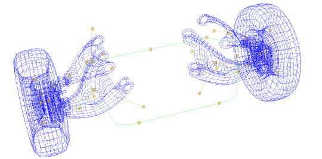
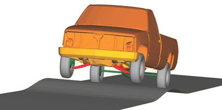
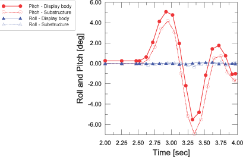

# 3.2.3 Display body analysis of a pick-up truck model

**Product: **Abaqus/Standard  

This example illustrates the use of the display body capability in Abaqus to simulate efficiently the vehicle dynamics of a detailed pick-up truck model driving over a symmetric road bump. The pick-up truck model geometry is described in ["Inertia relief in a pick-up truck," Section 3.2.1](ch03s02aex99.md). The model is organized as a collection of several parts, twenty-two of which are converted to display bodies. The display bodies are connected using connectors. Several parts that may deform nonlinearly (e.g., the leaf springs for the rear suspension and the stabilizer bar in the front) are modeled using beam elements. The mass, center of mass, and rotary inertia are computed for every part by running a datacheck analysis on separate models, each containing one part. A mass and a rotary inertia element are then created at the reference point of the display body. The reference point of each display body is connected to its attachment points using connector elements. A simplified CALSPAN tire model is used to model the radial forces in the tires via user subroutine [`UEL`](../sub/sub-link.md#sub-xsl-uel). The vehicle is loaded statically by gravity, accelerated in a dynamic step on a flat road, and run over bumps. The results are then compared to corresponding analyses with substructures as in ["Substructure analysis of a pick-up truck model," Section 3.2.2](ch03s02aex100.md).

### Geometry and materials

 The problem discussed here is a model of a pick-up truck (1994 Chevrolet C1500). The model geometry, element connectivity, and material properties are obtained from the Public Finite Element Model Archive of the National Crash Analysis Center at George Washington University. The materials used are described in ["Inertia relief in a pick-up truck," Section 3.2.1](ch03s02aex99.md).

The model is organized as a collection of individual parts connected together. Most parts that undergo only small deformations in addition to a large rigid body motion are defined as display bodies; their deformation can be neglected since only the overall motion of the vehicle is of interest. A display body is created for each of the following parts: the chassis, each of the four A-arms of the front suspension, each of the four wheels, the rear axle, the driveshaft, the engine/transmission, the cabin, each of the two doors, the hood, the seat, the front bumper, the truck bed, and the fuel tank. 

The number of attachment points for each display body is determined by its connection points with neighboring parts. The display bodies of the front-wheel assembly are shown connected at attachment nodes in [Figure 3.2.3--1](ch03s02aex101.md#sxmtruck-displaybody-connector).

Several parts deform nonlinearly and are modeled using regular elements. For example, the leaf springs in the rear and the stabilizer bar in the front are modeled with beam elements.

To create the display bodies with appropriate attachment points and realistic material properties, the following steps are taken:

1. A datacheck analysis is run on every part with deformable elements to determine its mass, rotary inertia, and center of mass.
2. An instance of this part is used to create a display body.
3. A reference node created at the center of mass for this part is also used as the reference node for the corresponding display body.
4. A mass element and a rotary inertia element are created at the reference node.
5. The reference node is then connected to the attachment points of the part using either BEAM or CARTESIAN and CARDAN connectors with stiff elastic properties.

The connections between the attachment points of two display bodies are modeled using connector elements. JOIN and REVOLUTE connectors are used to model the hinges between each of the following parts: the A-arms and chassis, the doors and cabin, the hood and cabin, the wheels and knuckles, and the leaf springs and chassis. CARTESIAN and CARDAN connections with connector elasticity, connector damping, and connector friction behaviors are used to define some of the bushing connections (e.g., the engine mounts). Two UNIVERSAL connectors are used to model the driveshaft connections to the transmission in the front and to the differential in the back. BEAM connectors are used to model rigid connections between parts. In cases where the BEAM connectors form a closed loop, the model becomes overconstrained. In such situations CARTESIAN and CARDAN connectors with elasticity are used instead of some of the BEAM connectors. A connector motion is applied to an AXIAL connector to lock (or open) the doors and the hood. For steering the vehicle, a connector motion is applied to a SLOT connector and is used to specify the steering for the steering rack. The struts are modeled using an AXIAL connection by specifying approximate nonlinear elasticity and damping. 

The radial forces in the tires are modeled approximately using a simplified CALSPAN tire model (Frik, Leister, and Schwartz, 1993) implemented via user subroutine [`UEL`](../sub/sub-link.md#sub-xsl-uel). A radial stiffness of 600 N/mm is considered. Friction is not accounted for in this user subroutine.

### Models

The analysis is performed using the technique described in ["Substructure analysis of a pick-up truck model," Section 3.2.2](ch03s02aex100.md).

### Results and discussion

In [Figure 3.2.3--2](ch03s02aex101.md#sxmtruck-displaybody-inphasebumps) a snapshot of the truck moving forward with a velocity of 7 m/sec (25.2 km/h) and going over a symmetric bump is shown. The wheels lose contact with the ground and then land again on the road (not shown). 

The pitch and roll angles recorded using a CARDAN connector attached to the model at its center of mass are shown in [Figure 3.2.3--3](ch03s02aex101.md#sxmtruck-displaybody-roll-pitch). The pitch angles are almost the same for the display body model and the substructure model (see ["Substructure analysis of a pick-up truck model," Section 3.2.2](ch03s02aex100.md)) of a truck going over a symmetric bump with a difference of 1 degree. The difference is due to the fact that the display body model uses several CARTESIAN and CARDAN connectors with elasticity to remove overconstraints. These connectors introduce some compliance. The roll angles are almost zero for both models.

The advantage of using substructures or display bodies instead of regular deformable elements becomes obvious when the total times needed to complete these types of analyses are compared. It is estimated that a full analysis using regular elements would take approximately 5 days to complete. It is estimated that the substructure analysis is up to 120 times faster than the regular mesh analysis, depending on the amount of recovery performed for each substructure. If the total substructure generation and analysis time for the substructure model is compared to the analysis time for the display body model, the display body model runs 5 times faster than the substructure model. If only the analysis times are compared for both models, the display body model runs 2.5 times faster than the substructure model.

### Input files

[tr_entire_truck_in_phase_db.inp](../eif/tr_entire_truck_in_phase_db.inp)

Display body model of the truck going over in-phase bumps.

[tr_parameters_db.inp](../eif/tr_parameters_db.inp)

Parameter definitions.

[tr_materials_db.inp](../eif/tr_materials_db.inp)

All material definitions.

[tr_initial_stress_db.inp](../eif/tr_initial_stress_db.inp)

Initial stress definition for the leaf springs.

[tr_lock_doors_and_hood_db.inp](../eif/tr_lock_doors_and_hood_db.inp)

Connector motion that keeps the doors and the hood locked.

[exa_tr_radial_uel_db.f](../eif/exa_tr_radial_uel_db.f)

[`UEL`](../sub/sub-link.md#sub-xsl-uel) used to define the tire model.

### Reference

Frik,  S., G. Leister, and W. Schwartz, “Simulation of the IAVSD Road Vehicle Benchmark Bombardier Iltis with FASIM, MEDYNA, NEWEUL, and SIMPACK,” in Multibody Computer Codes in Vehicle System Dynamics, Ed. W. Kortum and R. S. Sharp, February 1993.

### Figures

**Figure 3.2.3–1** Display bodies of the front-wheel assembly connected at attachment nodes.

**Figure 3.2.3–2** Display body truck model going over symmetric (left-right) bumps.

**Figure 3.2.3–3** Comparison of the pitch and roll angles for the display body and substructure models of the truck going over symmetric bumps.

