# 3.2.4 Continuum modeling of automotive spot welds

**Product: **Abaqus/Explicit  

### Objectives

This example demonstrates the following Abaqus features and techniques:
- using three-dimensional continuum elements and intricate material models (elastic-plastic and damage constitutive behavior) to reproduce experimentally observed load-displacement curves (courtesy of BMW) of tested spot weld specimens; and
- demonstrating how virtual experiments allow for the generation of load-displacement data of structural components from readily available geometric and material data. The load-displacement curves can be used subsequently in calibrating connector behavior (not discussed in this section) for efficient use in large-scale models, such as full-vehicle analyses.

Since the material data are highly proprietary, the input files provided below contain fictitious material data. The material data used in the input files were obtained from the actual material data by subjecting it to a number of transformations that preserve the trends in the overall shape of the curves without revealing the exact material behavior. Moreover, the stiffness of the testing machine referenced in this section is fictitious. However, the results published in this example use the actual data for comparison with the physical tests. For these reasons, you will not obtain the force-deflection curves or deformed configurations published in this section when you run the associated input files.

### Application description

The use of spot welds for the bonding of metal sheets is an extremely common practice in the automobile industry. The number of such bonds in a typical vehicle is on the order of several thousand. The use of Abaqus connector elements to model spot welds in full-vehicle analyses leads to efficient finite element models that are able to capture the structural response of these local features with optimal computational effort; however, load-displacement curves required for the modeling of spot welds may not be readily available. Furthermore, the number of experimental tests required for the proper calibration of a complete set of spot weld pairs in a vehicle can be prohibitive since the mechanical response of these local mechanisms is dependent on both the geometric data, such as the thickness of the metal plates and the radius of the spot weld, and the material properties of the plates being welded. Virtual testing can generate the necessary modeling parameters when experimental data are not available. In this example we model a range of failure mechanisms typically observed in spot welds. These virtual experiments are compared with laboratory-obtained data (courtesy of BMW).

### Geometry

The geometry of the patented test specimens used (Hahn et al., 1996, and Hahn and Rohde, 2004) is shown in [Figure 3.2.4--1](ch03s02aex102.md#exa-spotweld-specimen-pull) and [Figure 3.2.4--2](ch03s02aex102.md#exa-spotweld-specimen-peel). A single spot weld of radius 2.65 mm connects two steel plates that are 1.4 mm thick. These steel plates are 50 mm long and are bent over radii of 4.0 mm.

### Materials

All specimens used in this study are made of galvanized high-strength steel H340LAD+Z100. This material behaves in an elastic-plastic manner during the initial loading stages. As the material is further loaded, it can either display a ductile damage response (caused by growth and coalescence of voids) or it can display a shear failure mechanism (caused by the formation and growth of cracks within shear bands). For confidentiality reasons, the material data published in the input files associated with this section are fictitious. The data were obtained by transforming the actual material test data to preserve the overall trends in the behavior without revealing the true material behavior.

### Boundary conditions and loading

A photo of the testing machine (Hahn et al., 2000) is shown in [Figure 3.2.4--3](ch03s02aex102.md#exa-spotweld-zwick1001). In the physical tests the vertical sides of the specimens were longer than those shown in [Figure 3.2.4--1](ch03s02aex102.md#exa-spotweld-specimen-pull) and [Figure 3.2.4--2](ch03s02aex102.md#exa-spotweld-specimen-peel), and they were rigidly clamped in the clamping device (not shown) of the tensile testing machine. In the analysis these clamping conditions are modeled by fixing the bottom edges of the specimens and imposing a constant velocity of 0.15 m/s along the top edges in the vertical global 3-direction. For the physical tests and analysis, a hinge is located 400 mm from the top edges of the specimens along the vertical global 3-direction allowing the fixed edges to rotate about the horizontal axis. During the pull and peeling tests the specimens are aligned so the top edges are initially orthogonal to the vertical direction, whereas during the shear test the edges are initially parallel to the vertical direction. The combined stiffness of the loading piston and restraints used in the analysis is 50 kN/mm in pull and peeling tests and 35  kN/mm in shear tests. For confidentiality reasons both values are fictitious, but they approximate the compliance of the actual testing machine used in the physical tests.

### Abaqus modeling approaches and simulation techniques

A total of 18 different simulations were performed corresponding to the three test cases (pull test, shear test, and peeling test). Each of the simulations was solved with a coarse mesh and a fine mesh using three different scaling factors for the thermal influence modeling, as discussed below.

### Summary of analysis cases

| Case 1 | Pull test. |
| --- | --- |
| Case 2 | Shear test. |
| Case 3 | Peeling test. |

The sections that follow discuss analysis considerations that apply to all cases, except where noted otherwise.

### Mesh design

All simulations were performed with 8-node, linear brick, reduced integration elements (C3D8R). The density of the meshes increases toward the center of the plate where most of the deformation occurs. Each test was performed with a coarse mesh using four elements through the thickness of each plate and a fine mesh using six elements through the thickness of each plate. The coarse mesh and fine mesh used for the pull and shear tests are shown in [Figure 3.2.4--4](ch03s02aex102.md#exa-spotweld-pullth) and [Figure 3.2.4--5](ch03s02aex102.md#exa-spotweld-pullth-fine), respectively. [Figure 3.2.4--6](ch03s02aex102.md#exa-spotweld-peelingth) shows the initial undeformed configuration of the coarse mesh used in the peeling test simulation, while [Figure 3.2.4--7](ch03s02aex102.md#exa-spotweld-peelingth-fine) shows the initial configuration of the fine mesh. The same meshes are used for the pull and shear tests since they are based on the same model geometry. 

### Material model

For confidentiality reasons, some but not all details of the Abaqus models used for constitutive behavior and progressive damage analysis are discussed below. For guidelines on obtaining the material parameters from experimental data, see ["Progressive failure analysis of thin-wall aluminum extrusion under quasi-static and dynamic loads," Section 2.1.16](ch02s01aex77.md).

##### Elastic-plastic behavior

Werner et al. (2004) have shown that correct modeling of the elastic-plastic deformation of spot welds is a prerequisite for realistic predictions of subsequent failure mechanisms. The authors showed that by taking into consideration material property changes in the weld nugget they could obtain different failure modes involving peeling or shearing failure of the spot weld. Furthermore, they suggested the use of hardness measurements as a possible indicator for the change in properties of the welded material. The change in hardness between the center of a spot weld and at a distance far away from the center depends on the material grades joined, as well as their thicknesses.

In this example we assume both the elastic and the plastic behavior to be isotropic with the yield surface described by a Mises yield function (see ["Inelastic behavior," Section 23.1.1 of the Abaqus Analysis User's Guide](../usb/usb-link.md#usb-mat-cplastic)). Different hardening curves are considered to encapsulate thermal effects near the spot weld. For simplicity, the specimen is partitioned into three zones corresponding to the different thermal exposures observed in the vicinity of the spot weld during the welding process. Different scaling factors for the stress-strain curves are used in the three zones as derived from hardness measurements. The geometry of each zone can be prescribed according to the welding process parameters. The scaling of the yield curve is accomplished with the use of a field variable defined as constant throughout each region, and we test three scaling magnitudes for each test. For confidentiality reasons the scaling factors given below are fictitious, but they reflect the trends of the elastic-plastic behavior near the spot weld:
- A baseline configuration, where the original material properties (no scaling) are assigned to the specimens in all three zones. While this choice is not realistic, it provides an extreme solution for comparison purposes.
- A second configuration uses a scaling of 1.2 of the yield curve in Zone 1 and a scaling of 1.1 in Zone 2.
- A third configuration uses a scaling of 1.4 of the yield curve in Zone 1 and a scaling of 1.2 in Zone 2.

These three scaling factor configurations help us to understand the effect of the thermal influence zone in capturing the correct behavior, as discussed below. 

##### Damage initiation and evolution

The failure of aluminum-alloy sheets and thin-walled extrusions results from one or more of the following mechanisms (Hooputra et al., 2004): nucleation, growth, and coalescence of voids; shear bands; and necking. Damage due to initiation, growth, and coalescence of voids leads to ductile failure in metals; the formation of cracks within shear bands leads to shear failure. Abaqus offers phenomenological damage initiation criteria for both of these mechanisms. The ductile criterion is specified by providing the equivalent plastic strain at the onset of ductile damage as a function of stress triaxiality and strain rate. Similarly, the shear criterion is specified by providing the equivalent plastic strain at the onset of shear damage as a function of shear stress ratio and strain rate (see ["Damage initiation for ductile metals," Section 24.2.2 of the Abaqus Analysis User's Guide](../usb/usb-link.md#usb-mat-cdamageinitductile)). The actual damage initiation criterion data were provided by BMW but for confidentiality reasons, the data were transformed to preserve the overall trends without revealing the actual material behavior.

Damage evolution occurs once the damage initiation criteria are satisfied and further loading is applied. A plastic displacement–based linear damage evolution law is used for each damage initiation criterion. The value of the plastic displacement at which the damage variable reaches 1.0 (complete degradation) is taken as 0.1, based on data from independent base material testing. The default maximum degradation rule is used, and the elements are removed from the mesh once the maximum degradation has occurred (see ["Maximum degradation and choice of element removal" in "Damage evolution and element removal for ductile metals," Section 24.2.3 of the Abaqus Analysis User's Guide](../usb/usb-link.md#usb-mat-cdamageevol-deletion)). Damage initiation and evolution are assumed to be the same in all three thermal influence zones described above, a simplifying modeling assumption.

### Initial conditions

As discussed in the material model section above, a field variable is used to scale the yield surface and capture the thermal effects of the welding process on the yield strength. 

### Boundary conditions

 The specimens are loaded by fixing their bottom edges and imposing a constant velocity of 0.15 m/s along the top edges in the vertical global 3-direction. 

### Constraints

The top and bottom edges are constrained by kinematic couplings to model the rigid clamping in the testing devices. A TRANSLATOR connection is used to model the stiffness of the loading apparatus.

### Interactions

General frictionless contact is defined between all surfaces, an appropriate approximation since friction forces are small when compared with the forces in the weld nugget.

### Analysis steps

All simulations consist of one explicit dynamic step. All analyses consider geometric nonlinearity and utilize mass scaling to model quasi-static loading conditions (see ["Mass scaling," Section 11.6.1 of the Abaqus Analysis User's Guide](../usb/usb-link.md#usb-anl-amassscaling)).

### Output requests

Field output requests include the following quantities: displacement, stress, strain, element status, and damage initiation criteria variables. The history output request consists of displacement, velocity, acceleration, and reaction force at the reference points of the kinematic coupling constraints. Energy output variables are requested for the entire model.

### Discussion of results and comparison of cases

The results presented in this example compare the actual material data with the physical test data. For confidentiality reasons, the actual material data are not published in the associated input files. Hence, you will not obtain the results below when you run the input files provided.

The Mises stress contour and final deformed shapes of the pull, shear, and peeling tests with the coarse mesh and baseline material (no scaling of the yield curve) are depicted in [Figure 3.2.4--8](ch03s02aex102.md#exa-spotweld-pull-mises), [Figure 3.2.4--9](ch03s02aex102.md#exa-spotweld-shear-mises), and [Figure 3.2.4--10](ch03s02aex102.md#exa-spotweld-peeling-mises), respectively. The final deformed shape in pull and peeling tests show good qualitative agreement with experimental results provided by BMW. Shear test results predict failure of the spot weld rather than on the surrounding plate, regardless of the amount of scaling that was applied to the yield curve. This behavior was seen in some but not all experimental results, and it does not seem to influence the overall bearing capacity of the structure in shear. 

The load-displacement history obtained from the simulations is compared with the experimental results in [Figure 3.2.4--11](ch03s02aex102.md#exa-spotweld-pullxy-coarse) to [Figure 3.2.4--16](ch03s02aex102.md#exa-spotweld-peelingxy-fine). A good match is observed for the pull and shear tests with the yield curve scaled by 1.2 in Zone 1. Results obtained with the baseline material underpredict the peak load capacity, and results obtained with the 1.4 scaling overpredict the peak load of the structures. The thermal zone scaling does not have a significant impact on the qualitative character of the loading curves. Good mesh convergence is also observed, indicating that acceptable results can be obtained even with the coarse mesh discretization.

Results obtained for the peeling test do not show such good agreement with the experimental results provided to SIMULIA by BMW; even the baseline material simulation results overpredict the peak load capacity. This overstiff behavior is shown even in the purely elastic levels of deformation (in very early deformation stages), which indicates that modeling of the loading apparatus for this loading configuration may be inexact (data not available).

In conclusion, the results from both the quasi-static spot weld connector simulations match the experimental pull and shear data very well. Changes in the material properties induced by the welding process are not essential to the capture of the peak loads during the spot weld failure.

### Input files

##### **Case 1a: Pull test, coarse mesh**

[spotweld_pu_cm.inp](../eif/spotweld_pu_cm.inp)

Input file to create and analyze the model (baseline material).

[spotweld_pu_cm_1p2.inp](../eif/spotweld_pu_cm_1p2.inp)

Input file to create and analyze the model (spot weld yield surface scaled by a factor of 1.2).

[spotweld_pu_cm_1p4.inp](../eif/spotweld_pu_cm_1p4.inp)

Input file to create and analyze the model (spot weld yield surface scaled by a factor of 1.4).

##### **Case 1b: Pull test, fine mesh**

[spotweld_pu_fm.inp](../eif/spotweld_pu_fm.inp)

Input file to create and analyze the model (baseline material).

[spotweld_pu_fm_1p2.inp](../eif/spotweld_pu_fm_1p2.inp)

Input file to create and analyze the model (spot weld yield surface scaled by a factor of 1.2).

[spotweld_pu_fm_1p4.inp](../eif/spotweld_pu_fm_1p4.inp)

Input file to create and analyze the model (spot weld yield surface scaled by a factor of 1.4).

##### **Case 2a: Shear test, coarse mesh**

[spotweld_sh_cm.inp](../eif/spotweld_sh_cm.inp)

Input file to create and analyze the model (baseline material).

[spotweld_sh_cm_1p2.inp](../eif/spotweld_sh_cm_1p2.inp)

Input file to create and analyze the model (spot weld yield surface scaled by a factor of 1.2).

[spotweld_sh_cm_1p4.inp](../eif/spotweld_sh_cm_1p4.inp)

Input file to create and analyze the model (spot weld yield surface scaled by a factor of 1.4).

##### **Case 2b: Shear test, fine mesh**

[spotweld_sh_fm.inp](../eif/spotweld_sh_fm.inp)

Input file to create and analyze the model (baseline material).

[spotweld_sh_fm_1p2.inp](../eif/spotweld_sh_fm_1p2.inp)

Input file to create and analyze the model (spot weld yield surface scaled by a factor of 1.2).

[spotweld_sh_fm_1p4.inp](../eif/spotweld_sh_fm_1p4.inp)

Input file to create and analyze the model (spot weld yield surface scaled by a factor of 1.4).

##### **Case 3a: Peeling test, coarse mesh**

[spotweld_pe_cm.inp](../eif/spotweld_pe_cm.inp)

Input file to create and analyze the model (baseline material).

[spotweld_pe_cm_1p2.inp](../eif/spotweld_pe_cm_1p2.inp)

Input file to create and analyze the model (spot weld yield surface scaled by a factor of 1.2).

[spotweld_pe_cm_1p4.inp](../eif/spotweld_pe_cm_1p4.inp)

Input file to create and analyze the model (spot weld yield surface scaled by a factor of 1.4).

##### **Case 3b: Peeling test, fine mesh**

[spotweld_pe_fm.inp](../eif/spotweld_pe_fm.inp)

Input file to create and analyze the model (baseline material).

[spotweld_pe_fm_1p2.inp](../eif/spotweld_pe_fm_1p2.inp)

Input file to create and analyze the model (spot weld yield surface scaled by a factor of 1.2).

[spotweld_pe_fm_1p4.inp](../eif/spotweld_pe_fm_1p4.inp)

Input file to create and analyze the model (spot weld yield surface scaled by a factor of 1.4).

##### **Auxiliary files**

[spotweld_material.inp](../eif/spotweld_material.inp)

Input file with material model data.

[spotweld_cm_part.inp](../eif/spotweld_cm_part.inp)

Input file with part data for Case 1a and Case 2a.

[spotweld_cm_assembl.inp](../eif/spotweld_cm_assembl.inp)

Input file with assembly data for Case 1a and Case 2a.

[spotweld_fm_part.inp](../eif/spotweld_fm_part.inp)

Input file with part data for Case 1b and Case 2b.

[spotweld_fm_assembl.inp](../eif/spotweld_fm_assembl.inp)

Input file with assembly data for Case 1b and Case 2b.

[spotweld_pe_cm_part.inp](../eif/spotweld_pe_cm_part.inp)

Input file with part data for Case 3a.

[spotweld_pe_cm_assembl.inp](../eif/spotweld_pe_cm_assembl.inp)

Input file with assembly data for Case 3a.

[spotweld_pe_fm_part.inp](../eif/spotweld_pe_fm_part.inp)

Input file with part data for Case 3b.

[spotweld_pe_fm_assembl.inp](../eif/spotweld_pe_fm_assembl.inp)

Input file with assembly data for Case 3b.

### References

**Abaqus Analysis User's Guide**
- ["Mass scaling," Section 11.6.1 of the Abaqus Analysis User's Guide](../usb/usb-link.md#usb-anl-amassscaling)
- ["Progressive damage and failure," Section 24.1.1 of the Abaqus Analysis User's Guide](../usb/usb-link.md#usb-mat-cdamageoverview)

**Abaqus Keywords Reference Guide**
- [*DAMAGE INITIATION](../key/key-link.md#usb-kws-mdamageinitiation)
- [*DAMAGE EVOLUTION](../key/key-link.md#usb-kws-mdamageevolution)

**Abaqus Verification Guide**
- ["Progressive damage and failure of ductile metals," Section 2.2.21 of the Abaqus Verification Guide](../ver/ver-link.md#ver-mat-damage)

**Other**

- Hahn, O., J.R. Kurzok, and M. Oeter, "Test specification for KS-2 specimen," Laboratory of Materials and Joint Technology, University of Paderborn, 2000.
- Hahn, O., and A. Rohde, "Procedures to manufacture specimen and specimen clamping device," Patent Nr. 19522247 B4, April 15, 2004.
- Hahn, O., A. Rohde, and D. Gieske, "Specimen and specimen clamping device for use in tensile testing machines," Patent Nr. 19510366 C1, August 22, 1996.
- Hooputra, H., H. Gese, H. Dell, and H. Werner, "A Comprehensive Failure Model for Crashworthiness Simulation of Aluminium Extrusions," International Journal of Crashworthiness, vol. 9, pp. 449--463, 2004.
- Werner, H., H. Hooputra, H. Dell, and H. Gese, "A Phenomenological Failure Model for Sheet Metals and Extrusions," Annual Review Meeting and Workshop, Impact and Crashworthiness Laboratory, Massachusetts Institute of Technology, 2004.

### Figures

**Figure 3.2.4–1** Pull and shear test specimen geometry.

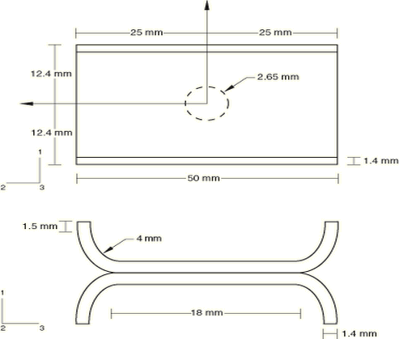

**Figure 3.2.4–2** Peeling test specimen geometry.

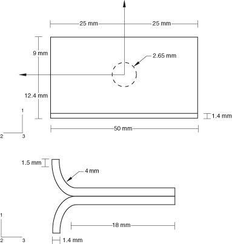

**Figure 3.2.4–3** Experimental setup.

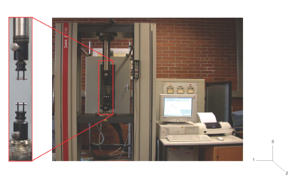

**Figure 3.2.4–4** Pull and shear tests: coarse mesh and thermal influence zones.

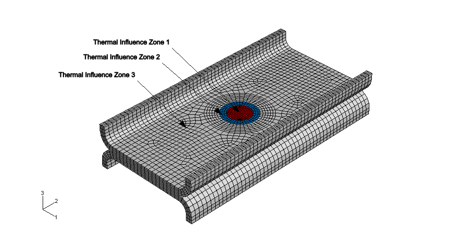

**Figure 3.2.4–5** Pull and shear tests: fine mesh and thermal influence zones.

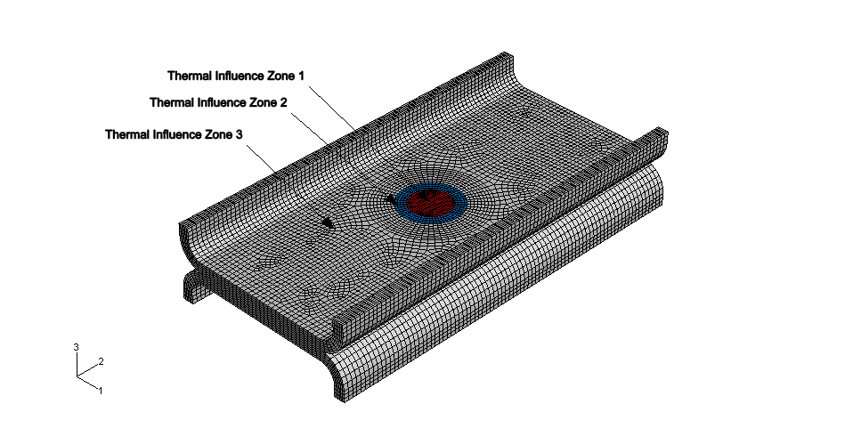

**Figure 3.2.4–6** Peeling test: coarse mesh and thermal influence zones.

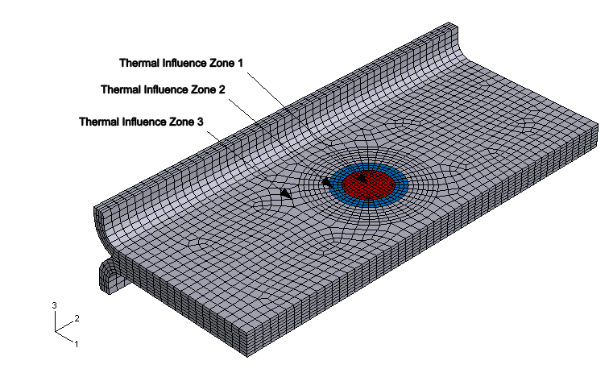

**Figure 3.2.4–7** Peeling test: fine mesh and thermal influence zones.

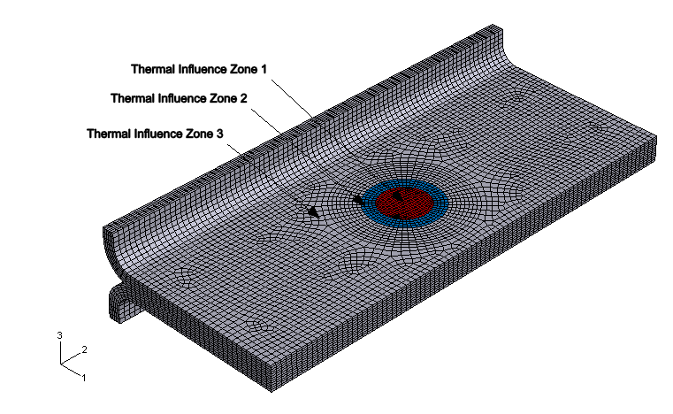

**Figure 3.2.4–8** Pull test, coarse mesh, baseline material (no yield curve scaling): final deformed shape of specimen and Mises stress contours.

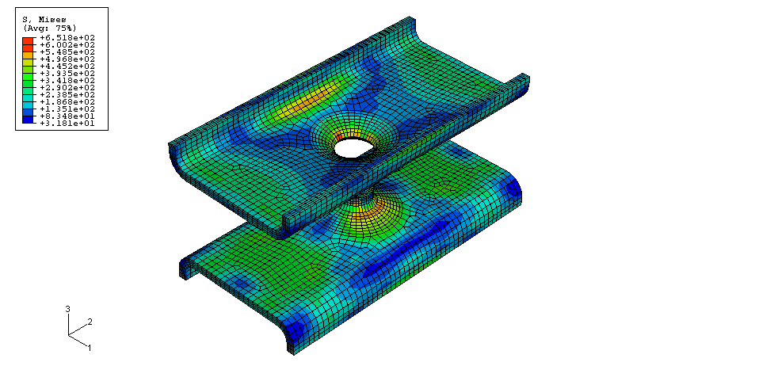

**Figure 3.2.4–9** Shear test, coarse mesh, baseline material (no yield curve scaling): final deformed shape of specimen and Mises stress contours.

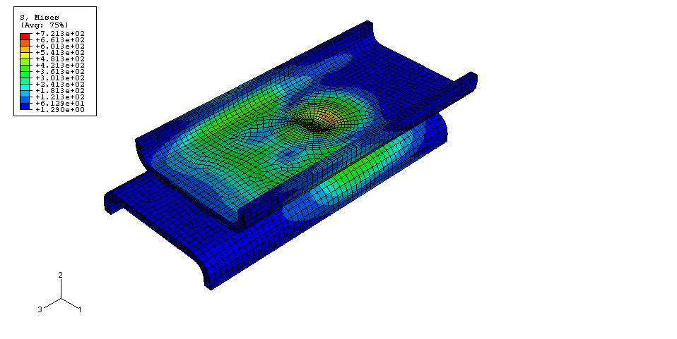

**Figure 3.2.4–10** Peeling test, coarse mesh, baseline material (no yield curve scaling): final deformed shape of specimen and Mises stress contours.

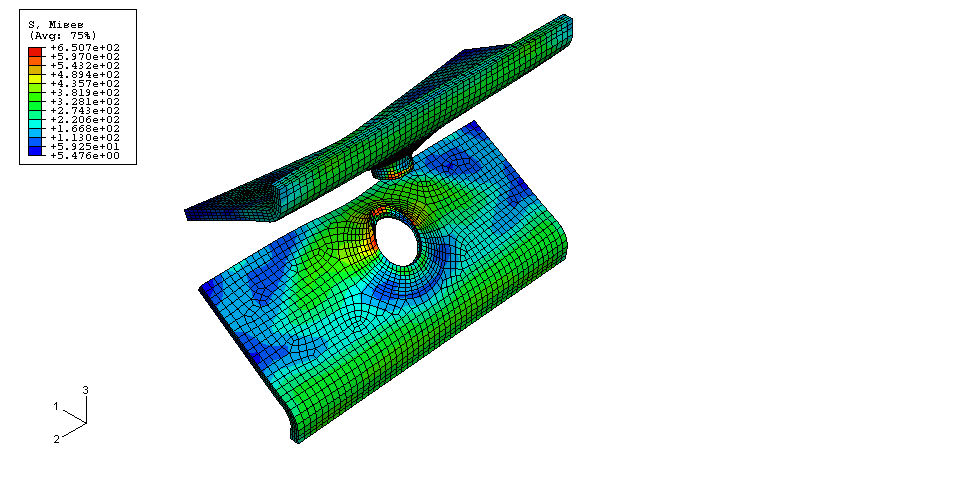

**Figure 3.2.4–11** Pull test with coarse mesh: comparison of reaction force versus imposed displacement for different yield surface scaling. Experimental result courtesy of BMW.

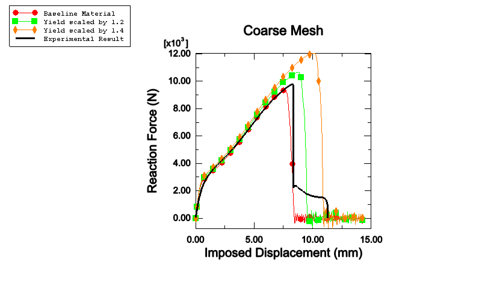

**Figure 3.2.4–12** Pull test with fine mesh: comparison of reaction force versus imposed displacement for different yield surface scaling. Experimental result courtesy of BMW.

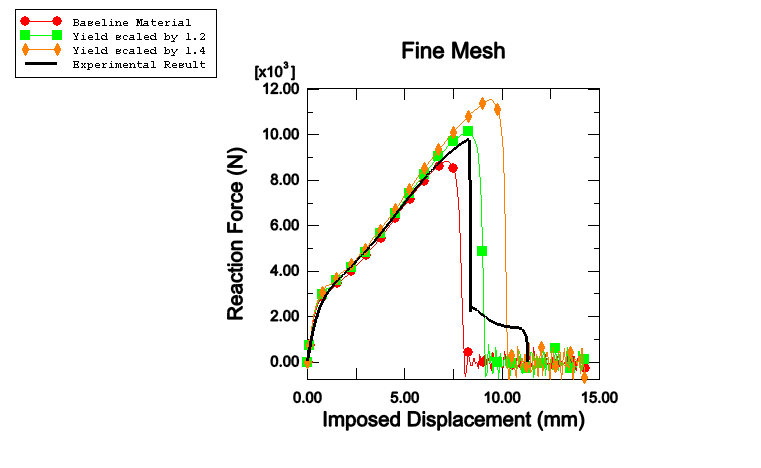

**Figure 3.2.4–13** Shear test with coarse mesh: comparison of reaction force versus imposed displacement for different yield surface scaling. Experimental result courtesy of BMW.

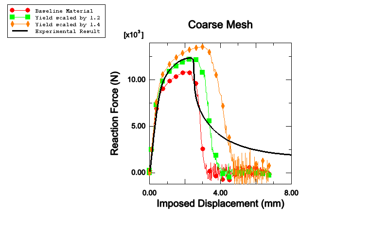

**Figure 3.2.4–14** Shear test with fine mesh: comparison of reaction force versus imposed displacement for different yield surface scaling. Experimental result courtesy of BMW.

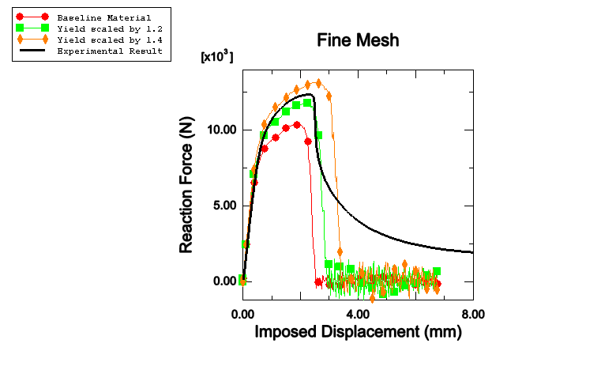

**Figure 3.2.4–15** Peeling test with coarse mesh: comparison of reaction force versus imposed displacement for different yield surface scaling. Experimental result courtesy of BMW.

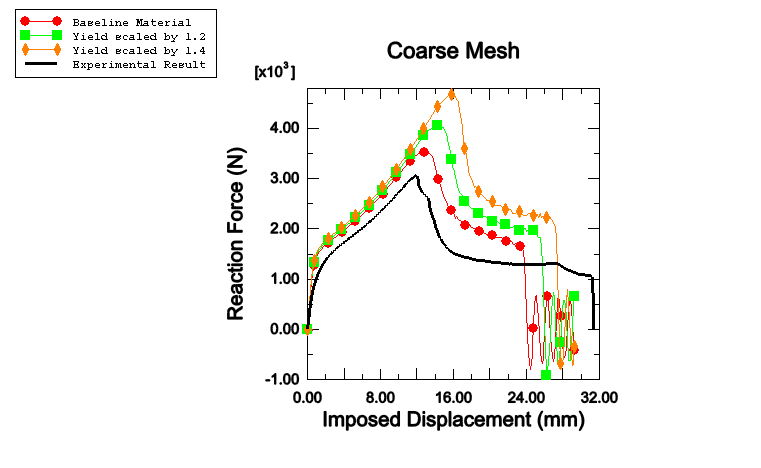

**Figure 3.2.4–16** Peeling test with fine mesh: comparison of reaction force versus imposed displacement for different yield surface scaling. Experimental result courtesy of BMW.

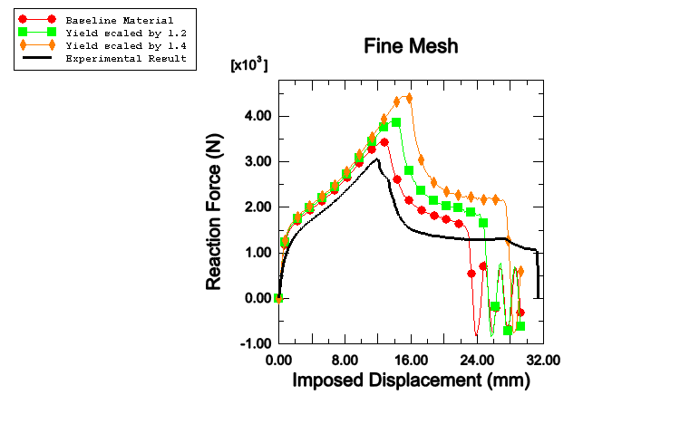

