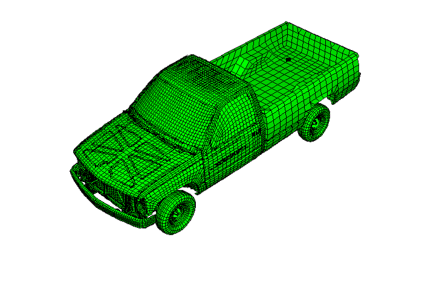
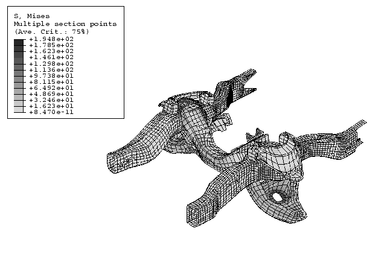
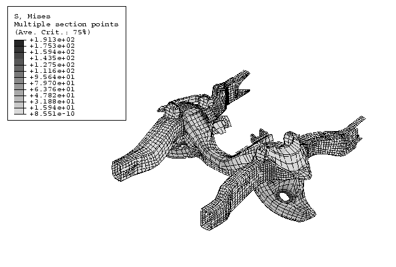

# 3.2.1 皮卡车的惯性relief

**产品：**Abaqus/Standard

本示例说明了如何在Abaqus/Standard的静态分析中执行惯性relief（"惯性relief"，《Abaqus分析用户手册》第11.1.1节）。问题涉及使一辆以50.0 km/h（13.89 m/s）的初始速度行驶的皮卡车通过施加制动载荷停下来。惯性relief在此处用于在静态分析中提供反对模型中规定的制动载荷的惯性力。解提供了皮卡车的刚体减速度和静态应力。为了比较，以相同的初始速度和制动载荷执行动态分析。

### 问题描述与模型定义

使用约55,000个单元对1994款雪佛兰C1500皮卡车进行建模（见[图3.2.1-1]）。该模型来自乔治·华盛顿大学国家碰撞分析中心的公共有限元模型档案。有限元模型被转换为Abaqus/Standard输入文件，并添加了一些缺失的约束以进行分析。该模型由各种部件组成——如驾驶室、货箱、车门等——这些部件用壳单元、三维梁单元和三维实体单元进行网格划分。部件通过连接器单元、耦合单元和多点约束连接在一起。

卡车模型中使用的材料被理想化为弹性或弹塑性。对材料特性进行了适当调整，以考虑各种部件的未建模特征，如发动机、变速箱等的内部细节。[表3.2.1-1]和[表3.2.1-2]给出了材料特性及其使用部件的摘要。

刚体定义用于制动器和制动组件，以利用这些部件相对于其他部件的高刚度。连接器单元用于模拟governing various parts之间相对运动的运动约束（见"皮卡车模型的子结构分析"第3.2.2节了解更多详情）。

卡车有限元模型的定向使得正1方向从卡车后部指向前部，正2方向从乘客（右侧）指到驾驶员（左侧），正3方向向上。在这个系统中，制动载荷作为集中力施加在各个车轮轴上，方向为负1方向。

为简化分析，轮胎和道路表面之间的正常接触通过弹簧单元建模，弹簧单元的一个节点连接到车轮轴，另一个节点在3方向上被固定防止位移，并在其他方向上运动耦合到车轮轴。假设轮胎和道路表面之间的摩擦不存在。这允许卡车在1和2方向上自由平移，并在3方向上自由旋转；弹簧节点的约束防止了3方向的平移以及1和2方向的旋转。

### 载荷

执行单独的静态分析以获得在施加重力载荷下的正确初始配置和应力分布。此分析的详细信息在"皮卡车模型的子结构分析"（第3.2.2节）中说明。这给了我们感兴趣分析的基础状态。

通过假设卡车是一个刚体，在施加制动后行驶20 m后停下来，计算以13.89 m/s速度行驶的卡车总制动载荷。这给出了卡车在1方向上4.82 m/s²的减速度。有限元分析计算的卡车总质量为1.72×10³ kg，制动力（或制动载荷）的总惯性力为8.30 kN。假设前制动器提供总阻力的75%，后制动器提供剩余的25%，则每个前轮的制动载荷为3.11 kN，每个后轮的制动载荷为1.04 kN。施加到卡车的四个制动载荷在静态分析中通过惯性relief载荷进行平衡。惯性relief载荷表示（否则在静态分析中未建模的）从卡车行驶速度到完全停止的恒定减速度的动态效应。

由于卡车在1和2方向上可以自由平移，并在3方向上可以旋转，因此在这三个方向上执行惯性relief。其他方向按前节所述通过边界条件进行约束。

为了比较，在重力载荷下的初始静态平衡之后，也执行瞬态动态分析，其中卡车从零速度加速到13.89 m/s的最终均匀速度。这个动态分析步骤之后是另一个动态分析步骤，其中施加制动载荷使卡车完全停止。制动载荷在0.5秒内从零平滑地增加到最大值，然后保持恒定2.88秒——以4.82 m/s²的平均减速度将卡车从13.89 m/s的初始速度制动到静止所需的时间。为了最小化分析时间，在动态分析中对所有可变形的部件使用子结构，但车架和悬架组件除外，它们被建模为完全可变形的，因为它们是显示显着应力的部件。

### 结果与讨论

具有制动载荷的皮卡车模型惯性relief的结果显示卡车在1方向上以4.83 m/s²减速。由于质量分布不对称，卡车在重心处绕3方向有0.01 rad/s²的角加速度。车轮轴处的垂直位移（前车轮轴下沉约0.7 mm，后车轮轴上升约0.7 mm，轮胎与道路表面保持接触）表明卡车由于制动作用而向前倾斜。[图3.2.1-2]中显示的Mises应力图表明最大应力发生在悬架组件以及悬架组件连接到车架的区域。活动屈服标志和等效塑性应变的图（未显示）表明卡车的任何部件都没有塑性屈服。

瞬态动态分析的结果表明，在完全制动载荷施加后，平均减速度约为4.94 m/s²（在1方向上），绕3方向的平均角加速度为0.03 rad/s²。卡车在制动载荷步骤中向前倾斜，前车轮轴下沉约0.7 mm，后车轮轴上升约0.7 mm。动态分析的Mises应力（如图[图3.2.1-3]所示）显示与惯性relief获得的分布相似的分布。车架或悬架组件中没有塑性屈服。

惯性relief依赖于正在加载的物体可以自由平移和作为刚体旋转的假设。因此，在自由方向上不允许外部或内部约束（例外情况是施加了静定边界条件且所有可用方向都被视为惯性relief方向的情况除外）。在像皮卡车这样的复杂模型中，具有各种运动约束和大的几何变化，必须确保包含惯性relief的步骤的基础状态收敛到严格的残余容差。如果未收敛到严格容差，基础状态中的不平衡力和力矩将作为内部约束作用于刚体运动。因此，这种不平衡的力和力矩可能阻止几何线性或非线性分析的收敛。在本例中，解控制收紧惯性relief步骤之前的重力载荷步骤中的收敛容差。

惯性relief和卡车动态分析结果的比较表明，惯性relief是获取某些加载情况下动态系统稳态响应的一种经济替代方案。例如，在这个制动分析中，带有惯性relief的静态分析比通用可变形瞬态动态模拟快约10倍。

### 输入文件

[irltr_brake_irl.inp](../eif/irltr_brake_irl.inp)

重力载荷和初始应力的静态平衡分析，然后是带制动载荷的惯性relief。

[irltr_brake_dyn.inp](../eif/irltr_brake_dyn.inp)

重力载荷和初始应力的静态平衡分析，然后是动态加速到均匀速度和用制动载荷减速。

模型数据包含在多个较小的文件中，并在主输入文件中引用。引用文件名在"皮卡车模型的子结构分析"（第3.2.2节）中给出。

### 表格

**表3.2.1-1** 卡车模型中使用的弹塑性材料特性。
| 弹塑性材料名称 | 特性 | 部件名称 |
| --- | --- | --- |
| *E* (N/m²) |  |  (N/m²) |  (kg/m³) |
| 钢 | 2.1×10¹¹ | 0.3 | 2.7×10⁸ | 7.89×10³ | 车架纵梁（车架）、发动机油箱、散热器安装罩、车轮罩、驾驶室、货箱、风扇中心、燃油箱、后轮辋、转向支撑、电池托盘、座椅导轨、散热器外罩 |
| 钢 | 2.1×10¹¹ | 0.3 | 3.5×10⁸ | 7.89×10³ | 发动机安装、散热器安装、散热器安装罩、车门、驾驶室铰链 |
| 塑料 | 2.8×10⁹ | 0.3 | 4.5×10⁷ | 1.2×10³ | 风扇盖 |
| 玻璃 | 7.6×10¹⁰ | 0.3 | 1.38×10⁸ | 2.5×10³ | 车窗、挡风玻璃 |
| 塑料 | 3.4×10⁹ | 0.3 | 1.0×10⁸ | 1.1×10³ | 散热器侧块 |
| 塑料 | 3.4×10⁹ | 0.3 | 1.0×10⁸ | 7.1×10³ | 仪表板内部 |

**表3.2.1-2** 卡车模型中使用的弹性材料特性。
| 弹性材料名称 | 特性 | 部件名称 |
| --- | --- | --- |
| *E* (N/m²) |  |  (kg/m³) |
| 钢 | 2.1×10¹¹ | 0.3 | 7.89×10³ | A臂安装座、风扇、车门锁横梁、头枕连接横梁、散热器安装横梁、油底壳横梁、后桥、传动轴、转向、A臂-轮辋连接器、A臂-纵梁连接器、货箱-纵梁连接器、仪表板支撑、转向柱、纵梁连接器、制动器、变速箱CV接头、前轮辋 |
| 钢 | 1.2×10¹¹ | 0.3 | 3.89×10³ | 发动机变速箱 |
| 钢 | 2.1×10¹⁰ | 0.3 | 1.82×10³ | 发动机前部 |
| 钢 | 2.1×10¹¹ | 0.3 | 2.5×10³ | 车门锁 |
| 橡胶 | 2.461×10⁹ | 0.323 | 8.0598×10³ | 轮胎 |
| 钢 | 2.1×10¹¹ | 0.3 | 3.5765×10³ | 后悬架 |
| 钢 | 2.1×10¹¹ | 0.3 | 2.089×10⁴ | 制动组件 |
| 钢 | 2.1×10¹¹ | 0.3 | 6.911×10³ | 制动组件 |
| 橡胶-金属复合 | 2.1×10¹¹ | 0.3 | 1.96×10³ | 电池 |
| 泡沫 | 2.0×10⁹ | 0.3 | 2.527×10² | 座椅底部 |
| 泡沫 | 2.0×10⁹ | 0.3 | 7.55×10² | 座椅顶部 |
| 泡沫 | 2.0×10⁹ | 0.3 | 1.69×10² | 座椅头枕 |

### 图表

**图3.2.1-1** 1994款雪佛兰C1500皮卡车的有限元模型。

**图3.2.1-2** 惯性relief的前车架和A臂组件中的Mises应力。

**图3.2.1-3** 动态分析的前车架和A臂组件中的Mises应力。

