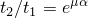
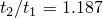

# 3.3.1 Seat belt analysis of a simplified crash dummy

**Product: **Abaqus/Explicit  

Automotive seat belts dramatically reduce the risk of vehicle occupant injury in the case of collision. This example illustrates the use of Abaqus in analyzing a simplified crash dummy restrained by a complete seat belt system as a moving vehicle comes to a sudden stop. The seat belt system includes:
- the webbing sliding through D-rings attached to the car frame;
- one retractor that models spool locking, tension preloading, and spool effects; and
- one pretensioner that tightens the seat belt.

 Several SLIPRING connectors strung together are used to model the belt webbing passing through the rings. The RETRACTOR and HINGE connection types are used to model the retractor and pretensioner.

### Geometry and materials

As shown in [Figure 3.3.1--1](ch03s03aex103.md#sxmseatbelt-overall), the model consists of several distinct entities: the dummy, the seat belt, the retractor, and the seat. The modeling strategy consists of applying an initial velocity for the dummy of approximately 45 miles per hour while the seat and the seat belt attachment points to the car frame are held fixed with boundary conditions, thus emulating a vehicle that comes to a sudden stop.

#### Dummy

A very simple dummy model is used (none of the limbs are modeled). The dummy model has two distinct parts: the lower torso and the upper torso. The lower torso is modeled with rigid surface elements. The upper torso is modeled in the same fashion except in the chest area. The human body compliance is modeled approximately by meshing a region in the chest area using deformable shell elements. In addition, four CARTESIAN and CARDAN connectors with nonlinear elastic and damping behavior are inserted between four nodes around the chest area and four nodes belonging to the rigid back of the upper torso. The upper and lower torsos overlap over a small region around the waist area, and general contact is used to model the contact interactions between them. The approximate mass of the dummy is 35 kilograms.

#### Seat

The seat modeling is minimal since the focus of this example is to illustrate the seat belt modeling technique. Only one solid element with crushable foam material properties is used to model the lower part of the seat. The back support is not modeled.

#### Seat belt webbing passing through rings

The seat belt is modeled primarily using several SLIPRING connectors strung together. To model the contact interactions between the belt and the chest and lap areas accurately, membrane elements are used to model short portions of the belt in these regions. [Figure 3.3.1--2](ch03s03aex103.md#sxmseatbelt-seatbeltonly) shows the seat belt arrangement. The node numbers associated with the connector elements are also illustrated. The seat belt is defined starting from the right side of the figure (adjacent to the B-pillar in the car) and moving to the chest area, the waist-level click-in buckle, the lap area, and finally the attachment to the car bottom floor, as follows:
- Three SLIPRING connectors are used between nodes 8300228, 8300237, 8300243, and 8300247. In this order the four nodes correspond to the exit point from the retractor at the bottom of the B-pillar, the trim exit point along the B-pillar, the shoulder-level ring at the top of the B-pillar, and the connection point with the membrane-mesh region of the belt at the top of the chest area. The three SLIPRING connectors model the belt as it flows and stretches through these points. As outlined in ["Connector element library," Section 31.1.4 of the Abaqus Analysis User's Guide](../usb/usb-link.md#usb-elm-econnectorlibrary), the SLIPRING connection type activates the nodal material flow degree of freedom (10) at these four nodes. Material can flow freely between the three elements but cannot flow through the connection point with the membrane-meshed area at node 8300247. Hence, a boundary condition on this degree of freedom is specified at this node.
- The membrane-meshed area between nodes 8300247 and 8300248 models the contact with the chest area of the dummy accurately.
- Two SLIPRING connectors are used between nodes 8300248, 8300251, and 8300253. In this order the three nodes correspond to the connection point with the membrane-mesh region of the belt at the bottom of the chest area, the ring of the waist-level click-in buckle, and the connection point with the membrane-meshed region of the belt at the left side of the lap area. Since no material flow occurs at the connection points with the membrane-meshed regions, boundary conditions on degree of freedom 10 are specified at nodes 8300248 and 8300253.
- The membrane-meshed area between nodes 8300253 and 8300254 models the contact with the lap area of the dummy accurately.
- One SLIPRING connector is used between nodes 8300254 and 8301398. These two nodes correspond to the connection point with the membrane-mesh region of the belt at the right side of the lap area and the attachment point to the car frame. Boundary conditions on degree of freedom 10 are specified at both nodes.

The stretching of the belt is governed by the specified nonlinear elastic connector behavior. 

#### Retractor

The retractor device is located at the bottom of the B-pillar. It is modeled using a RETRACTOR connector in parallel with several HINGE connectors as illustrated in [Figure 3.3.1--3](ch03s03aex103.md#sxmseatbelt-retractor). The connections are as follows:
- The RETRACTOR connector is connected to the first SLIPRING connector along the B-pillar at node 8300228. It converts the material flow at this node into a rotation about a local axis oriented along the longitudinal direction of the car.
- Several HINGE connectors model the various mechanisms in the retractor device. Their axes are all parallel to each other and are oriented along the longitudinal direction of the car. - The preload HINGE applies a small pretension elastic force typically given by a weak torsional elastic spring. Its purpose is to eliminate the slack in the belt. - The spool lock HINGE uses a connector lock definition to lock the almost-free rotation of the spool's axle if the velocity of the belt material exiting the retractor exceeds a certain threshold. - The spool effect HINGE is attached to the car frame and uses a connector plasticity definition to model the compression effects of the spool. This is accomplished via a tension-versus-spooled-out-material curve.

The spool effect is inactive until the spool lock connector locks; hence, the two HINGE connectors are placed in series. The preload is applied at all times and, therefore, is placed in parallel with the two other HINGE connectors.

#### Pretensioner

The pretensioner device is attached to the car frame in the vicinity of the waist-level click-in buckle. It is modeled using a SLIPRING connector and a RETRACTOR and a HINGE connector in parallel as illustrated in [Figure 3.3.1--4](ch03s03aex103.md#sxmseatbelt-pretensioner). The connections are as follows:
- The pretensioner spool (HINGE) connector is attached to the car frame. It uses an amplitude-delayed connector motion definition to specify the rate at which the belt material flows into the pretensioner device.
- The RETRACTOR connector converts the specified motion in the HINGE connector into a material flow that is expelled from the following SLIPRING connector.
- The SLIPRING connector models the stiff cable to which the waist buckle is attached. Its length shortens as the pretensioner device is being triggered.
- A PIN-type MPC is used to connect the node associated with the waist-level click-in ring that slides over the seat belt (node 8300251) with the buckle it clicks into (node 8300351). By using the additional node 8300351, the material flows associated with the pretensioner SLIPRING and the SLIPRINGs of the adjacent seat belt segments are prevented from interacting with each other.

### Models

Frictionless as well as frictional seat belt models are analyzed using Abaqus/Explicit. 

### Results and discussion

The undeformed and deformed shapes (*t*=0.0215 seconds) for the model are shown in [Figure 3.3.1--5](ch03s03aex103.md#smx-seatbelt-undeformed) and [Figure 3.3.1--6](ch03s03aex103.md#smx-seatbelt-deformed), respectively. Results for belt tensions and material flow in and out of the shoulder level slipring are shown in [Figure 3.3.1--7](ch03s03aex103.md#smx-belttension-nofric) and [Figure 3.3.1--8](ch03s03aex103.md#smx-belttension-ratio). At this junction SLIPRING connector elements 8888803 and 8888804 share a common node 8300243. For the frictionless analysis the normalized belt tensions are shown in [Figure 3.3.1--7](ch03s03aex103.md#smx-belttension-nofric). As expected, the two tension histories are the same. For the frictional case, the ratio of the belt tension in adjacent belt segments is shown in [Figure 3.3.1--8](ch03s03aex103.md#smx-belttension-ratio). For the case when the belt is slipping, the ratio of the belt tension is given by , where  and  are the tensions in the adjacent SLIPRING connector elements, μ is the coefficient of friction, and α is the angle between the two adjacent sliprings. For the seat belt model with friction where μ=0.1 and α=1.718132 radians, the ratio of the belt tension is . As shown in [Figure 3.3.1--8](ch03s03aex103.md#smx-belttension-ratio), the ratio agrees well with the analytical result. Near the end of the analysis (≈19 milliseconds) the ratio of the belt tension drops from this value. [Figure 3.3.1--8](ch03s03aex103.md#smx-belttension-ratio) shows that the normalized accumulated slip remains constant for the remainder of the analysis; hence, we can conclude that the ratio drops because the belt starts sticking. [Figure 3.3.1--9](ch03s03aex103.md#smx-seatbelt-matflow) shows that the material flows across node 8300243, which is the second node of connector element 8888803 and the first node of connector element 8888804, are identical as expected.

### Input files

[seatbelt_xpl.inp](../eif/seatbelt_xpl.inp)

Analysis of a frictionless seat belt–restrained simplified dummy using Abaqus/Explicit.

[seatbelt_fric_xpl.inp](../eif/seatbelt_fric_xpl.inp)

Analysis of a frictional seat belt–restrained simplified dummy using Abaqus/Explicit.

### Figures

**Figure 3.3.1–1** Seat belt and dummy arrangement.

**Figure 3.3.1–2** Seat belt arrangement.

**Figure 3.3.1–3** Retractor model.

**Figure 3.3.1–4** Pretensioner model.

**Figure 3.3.1–5** Dummy and seat belt system in the undeformed configuration.

**Figure 3.3.1–6** Dummy and seat belt system in the deformed configuration.

**Figure 3.3.1–7** Normalized belt tension of adjacent frictionless sliprings.

**Figure 3.3.1–8** Ratio of belt tension of adjacent sliprings with friction and the normalized accumulated slip.

**Figure 3.3.1–9** Normalized material flow across node between adjacent sliprings.

