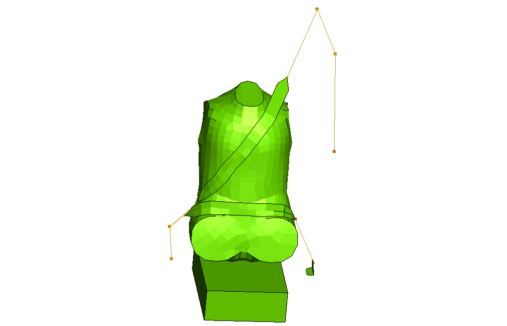
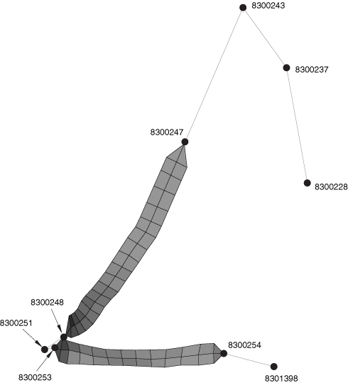
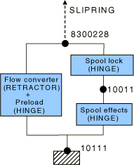
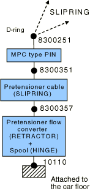
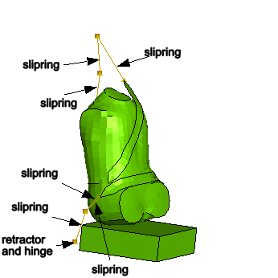
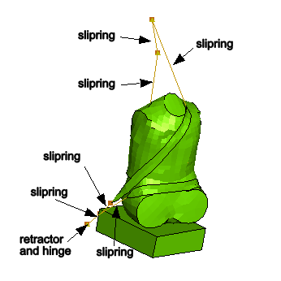
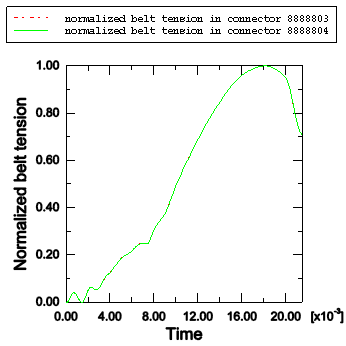
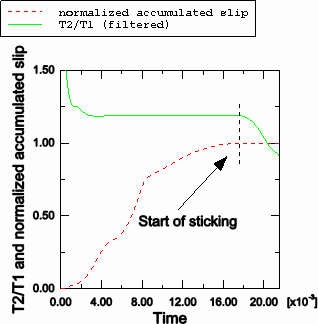
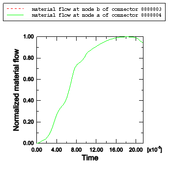

# 3.3.1 简化碰撞假人的安全带分析

**产品：**Abaqus/Explicit

汽车安全带在碰撞情况下显着降低车辆乘员受伤的风险。本示例说明了使用Abaqus分析简化碰撞假人的完整安全带系统约束的乘用车突然停止的情况。安全带系统包括：
- 通过连接到车身的D形环滑动的织带；
- 一个卷收器，模拟卷筒锁定、张力预加载和卷筒效应；和
- 一个预紧器，用于收紧安全带。

几个SLIPRING连接器串在一起来模拟穿过环的安全带织带。RETRACTOR和HINGE连接类型用于模拟卷收器和预紧器。

### 几何和材料

如图[图3.3.1-1]所示，模型由几个不同的实体组成：假人、安全带、卷收器和座椅。建模策略是向假人施加约45英里/小时的初始速度，而座椅和安全带连接到车身的固定点用边界条件固定，从而模拟车辆突然停止。

#### 假人

使用了一个非常简单的假人模型（没有建模四肢）。假人模型有两个不同的部分：下躯干和上躯干。下躯干用刚性表面单元建模。上躯干的建模方式相同，但在胸部区域除外。人体顺应性通过使用可变形壳单元对胸部区域进行网格划分来近似建模。此外，四个具有非线性弹性和阻尼行为的CARTESIAN和CARDAN连接器插入在胸部区域周围的四个节点和属于上躯干刚性背部的四个节点之间。上躯干和下躯干在腰部区域周围的一小区域重叠，使用一般接触来模拟它们之间的接触相互作用。假人的近似质量为35公斤。

#### 座椅

座椅建模是最小的，因为本示例的重点是说明安全带建模技术。只使用一个具有可压碎泡沫材料特性的实体单元来建模座椅的下部。不建模靠背支撑。

#### 穿过环的安全带织带

安全带主要使用几个串在一起的SLIPRING连接器建模。为了准确模拟安全带与胸部和大腿区域之间的接触相互作用，膜单元用于在这些区域对安全带的短部分进行建模。[图3.3.1-2]显示了安全带布置。还说明了与连接器单元关联的节点编号。安全带定义从图的右侧开始（靠近车身B柱），移动到胸部区域、腰部LevelClick-in搭扣、大腿区域，最后连接到车身底部地板，如下：
- 三个SLIPRING连接器用于节点8300228、8300237、8300243和8300247之间。按此顺序，四个节点对应于：B柱底部的卷收器出口点、沿B柱的装饰出口点、B柱顶部的肩部Level环，以及胸部区域顶部与织带膜网格区域的连接点。三个SLIPRING连接器模拟织带流过和拉伸通过这些点。如《Abaqus分析用户指南》第31.1.4节"连接器单元库"所述，SLIPRING连接类型在这些四个节点处激活节点材料流自由度（10）。材料可以在这三个单元之间自由流动，但不能通过节点8300247处膜网格区域的连接点流动。因此，在此节点上规定了该自由度上的边界条件。
- 节点8300247和8300248之间的膜网格区域准确模拟与假人胸部区域的接触。
- 两个SLIPRING连接器用于节点8300248、8300251和8300253之间。按此顺序，三个节点对应于：织带膜网格区域在胸部底部的连接点、腰部LevelClick-in搭扣的环，以及织带膜网格区域在大腿左侧的连接点。由于在膜网格区域的连接点处没有材料流动，因此在节点8300248和8300253上规定了自由度10上的边界条件。
- 节点8300253和8300254之间的膜网格区域准确模拟与假人大腿区域的接触。
- 一个SLIPRING连接器用于节点8300254和8301398之间。这两个节点对应于：大腿右侧织带膜网格区域的连接点，以及连接到车身的连接点。在两个节点上都规定了自由度10上的边界条件。

织带的伸长由规定的非线性弹性连接器行为控制。

#### 卷收器

卷收器装置位于B柱底部。它使用RETRACTOR连接器和几个并联的HINGE连接器建模，如图[图3.3.1-3]所示。连接如下：
- RETRACTOR连接器连接到沿B柱的第一个SLIPRING连接器在节点8300228处。它将该节点处的材料流转换为绕沿车身纵向方向的局部轴的旋转。
- 几个HINGE连接器模拟卷收器装置中的各种机制。它们的轴都相互平行，并沿车身的纵向方向定向。- 预加载HINGE施加一个小的预张力弹性力，通常由弱扭转弹性弹簧给出。其目的是消除织带中的松弛。- 卷筒锁HINGE使用连接器锁定定义来锁定卷筒轴的几乎自由旋转（如果退出卷收器的织带材料速度超过某个阈值）。- 卷筒效应HINGE连接到车身，并使用连接器塑性定义来模拟卷筒的压缩效应。这是通过张力与卷筒材料曲线实现的。

卷筒效应在卷筒锁连接器锁定之前是不活跃的；因此，两个HINGE连接器串联放置。预加载始终施加，因此与另外两个HINGE连接器并联放置。

#### 预紧器

预紧器装置安装在车身B柱附近的腰部Level Click-in搭扣处。它使用SLIPRING连接器以及并联的RETRACTOR和HINGE连接器建模，如图[图3.3.1-4]所示。连接如下：
- 预紧器卷筒（HINGE）连接器连接到车身。它使用振幅延迟的连接器运动定义来指定织带材料流入预紧器装置的速率。
- RETRACTOR连接器将HINGE连接器中的指定运动转换为从以下SLIPRING连接器排出的材料流。
- SLIPRING连接器模拟刚性电缆，腰部搭扣连接到此电缆。当预紧器装置被触发时，其长度缩短。
- PIN型MPC用于连接与腰部Level Click-in环（节点8300251）滑过安全带的节点和卡扣进入的搭扣（节点8300351）。通过使用附加节点8300351，防止了预紧器SLIPRING和相邻安全带段的SLIPRING之间的材料流相互作用。

### 模型

使用Abaqus/Explicit分析了无摩擦和有摩擦的安全带模型。

### 结果与讨论

模型的未变形和变形形状（t=0.0215秒）分别如图[图3.3.1-5]和[图3.3.1-6]所示。安全带张力和肩部Level slipring进出的材料流结果如图[图3.3.1-7]和[图3.3.1-8]所示。在这个 junction，SLIPRING连接器单元8888803和8888804共享一个公共节点8300243。对于无摩擦分析，归一化安全带张力如图[图3.3.1-7]所示。正如所料，两个张力历史相同。对于摩擦情况，相邻安全带段中的安全带张力比值如图[图3.3.1-8]所示。当安全带打滑时，安全带张力比值由给出，其中和是相邻SLIPRING连接器单元中的张力，μ是摩擦系数，α是两个相邻slipper之间的角度。对于摩擦系数μ=0.1和α=1.718132弧度的安全带模型，安全带张力比值为。如图[图3.3.1-8]所示，比值与分析结果吻合良好。在分析接近尾声时（≈19毫秒），安全带张力比值从这个值下降。图[图3.3.1-8]显示归一化累积滑移在分析剩余时间内保持恒定；因此，我们可以得出结论，比值下降是因为安全带开始粘附。图[图3.3.1-9]显示材料流过节点8300243（这是连接器单元8888803的第二个节点和连接器单元8888804的第一个节点），它们如预期那样相同。

### 输入文件

[seatbelt_xpl.inp](../eif/seatbelt_xpl.inp)

使用Abaqus/Explicit分析无摩擦安全带约束的简化假人。

[seatbelt_fric_xpl.inp](../eif/seatbelt_fric_xpl.inp)

使用Abaqus/Explicit分析有摩擦安全带约束的简化假人。

### 图表

**图3.3.1-1** 安全带和假人布置。

**图3.3.1-2** 安全带布置。

**图3.3.1-3** 卷收器模型。

**图3.3.1-4** 预紧器模型。

**图3.3.1-5** 未变形配置中的假人和安全带系统。

**图3.3.1-6** 变形配置中的假人和安全带系统。

**图3.3.1-7** 相邻无摩擦slipperings的归一化安全带张力。

**图3.3.1-8** 有摩擦的相邻slipperings的安全带张力比值和归一化累积滑移。

**图3.3.1-9** 相邻slipperings之间节点处的归一化材料流。

