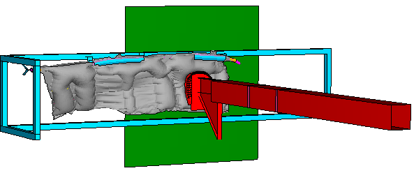
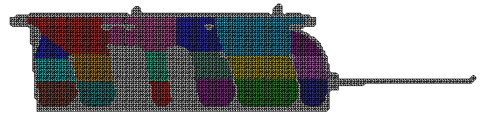
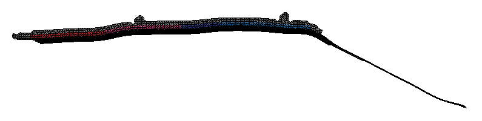
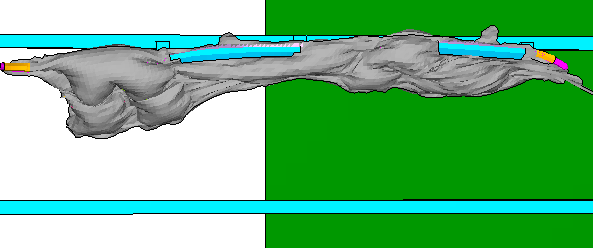
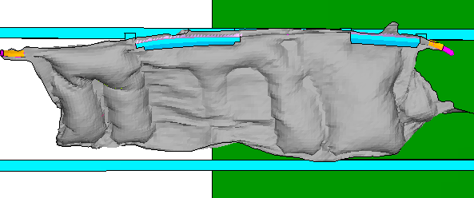
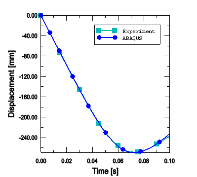
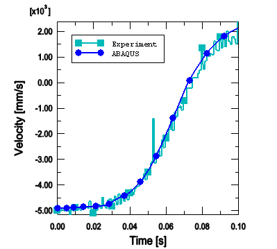
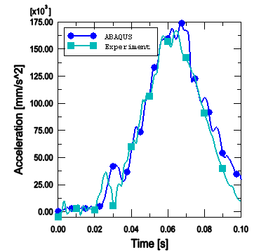

# 3.3.2 Side curtain airbag impactor test

**Product: **Abaqus/Explicit  

This example problem illustrates the use of surface-based fluid cavities in a multi-chambered automotive airbag inflation analysis using Abaqus/Explicit. Airbags are supplemental safety devices that minimize the chance of an occupant striking the interior of a vehicle during a crash. The proper deployment of the airbag within a fraction of a second after a collision is detected is crucial to ensure the safety of the occupant. This example describes the modeling and validation of a side curtain airbag impactor test simulation against experimental results. 

### Geometry and model

The side curtain airbag model described in this example was provided by Autoliv GmbH. The model setup is shown in [Figure 3.3.2--1](ch03s03aex104.md#exa-airbag-model), which shows an impactor hitting the deployed side curtain airbag. The airbag is divided into 18 chambers to approximate the nonuniform distribution of the gases across the airbag and the gradients in pressure observed during the complex unfolding of the airbag. The temperature and pressure are considered to be uniform in each chamber at any point of time. Each airbag chamber is modeled as a surface-based fluid cavity. The surface-based fluid cavity capability provides a coupling between the pressure exerted by the contained gas on the chamber boundary and the deformation of the gas-filled chamber. The individual chambers are separated by fictitious partitions modeled with surface elements, which represent the area of fluid exchange between the different chambers.  The airbag has three inflators located in chambers 1, 6, and 9 that are used to inflate the airbag. The inflators are activated at different times using inflation time amplitude definitions associated with the activation of fluid inflator definitions. The inflators inject a mixture of 6 gas species, with the molecular fraction, mass flow rate, and temperature of the individual species defined as functions of time. The gas species behave as ideal gases with an adiabatic temperature update. Leakage of the gases to the environment through the airbag fabric is modeled by specifying a discharge coefficient (ratio of the effective leakage area to the total airbag surface area) of 0.0003 for fluid exchange from each airbag chamber. In addition, the loss of heat energy to the environment is also considered by providing the heat energy flow rate as a function of the temperature difference across the airbag fabric. 

The external skin of the airbag is represented by 3-node membrane elements (M3D3) and uses a nonlinear elastic definition of the fabric material model. The fabric material model is calibrated by specifying the uniaxial behavior of the fibers in the warp and weft directions as well as the shear behavior of the fabric. The behavior of the fibers has been defined such that they offer negligible resistance to compression until a certain compressive strain limit beyond which they begin to offer finite resistance to compression to prevent excessive deformations of the fabric elements. Bilinear shear behavior is defined reflecting an initial shear modulus of =9.44 N/mm2 and  a modulus of =47.2 N/mm2 at angles greater than 60 to prevent severe shear deformation. In addition, a small amount of stiffness proportional damping is applied. A reference mesh (initial metric) is defined to specify the unfolded stress-free configuration of the airbag. 

The unstressed reference configuration of the airbag is defined using the initial reference mesh for membrane elements. The initial folded configuration and the reference configuration are used to account for the wrinkles that arise from the airbag folding process. The reference mesh and the folded airbag configuration are shown in [Figure 3.3.2--2](ch03s03aex104.md#exa-airbag-refmesh) and [Figure 3.3.2--3](ch03s03aex104.md#exa-airbag-folded), respectively. The fabric material is defined such that any initial compressive strains along the yarn directions will cause compressive stresses in the yarn. Alternatively, the initial compressive strains along the yarn directions can be recovered stress free.

The general contact algorithm is used to consider self-contact between the airbag fabric layers as well as contact with surrounding structures during the inflation of the airbag. 

The impactor is modeled as a rigid body with a total mass of 7.2 kg and is given an initial velocity of 4500 mm/s towards the deploying airbag. The mass and velocity of the impactor reflect human head mass and velocities typically observed in vehicle side impacts, respectively.

### Results and discussion

 The airbag at different stages of deployment is shown in [Figure 3.3.2--4](ch03s03aex104.md#exa-airbag-8ms) (8 ms) and [Figure 3.3.2--5](ch03s03aex104.md#exa-airbag-16ms) (16 ms). [Figure 3.3.2--6](ch03s03aex104.md#exa-airbag-impactordisp), [Figure 3.3.2--7](ch03s03aex104.md#exa-airbag-impactorvel), and [Figure 3.3.2--8](ch03s03aex104.md#exa-airbag-impactoraccel) show the time history of displacement, velocity, and acceleration of the impactor as it impacts the airbag, along with comparisons to experimental results. These plots demonstrate the close correlation between Abaqus/Explicit simulation results and physical test results. 

### Input files

[sidecurtain_airbag_fabric.inp](../eif/sidecurtain_airbag_fabric.inp)

Side curtain airbag impactor test.

[sidecurtain_airbag_refmesh.inp](../eif/sidecurtain_airbag_refmesh.inp)

Reference mesh for the side curtain airbag.

### Figures

**Figure 3.3.2–1** Model setup showing the fully deployed airbag (*t*=80 ms).

**Figure 3.3.2–2** Airbag reference configuration.

**Figure 3.3.2–3** Folded airbag configuration.

**Figure 3.3.2–4** Deformed configuration at 8 ms.

**Figure 3.3.2–5** Deformed configuration at 16 ms.

**Figure 3.3.2–6** Time history of displacement of the impactor.

**Figure 3.3.2–7** Time history of velocity of the impactor.

**Figure 3.3.2–8** Time history of acceleration of the impactor.

