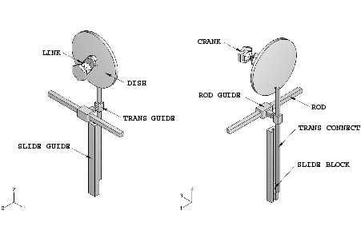
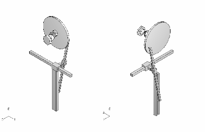
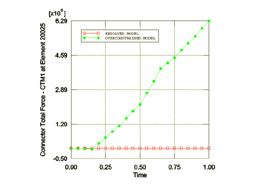
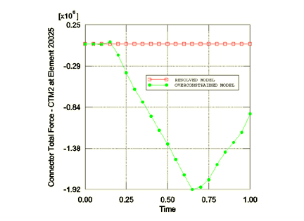

# 4.1.1 Resolving overconstraints in a multi-body mechanism model


**Product: **Abaqus/Standard  

An overconstraint occurs when multiple consistent or inconsistent kinematic constraints are applied to the same degree of freedom. Overconstraints may lead to inaccurate solutions or prevent convergence. A large number of overconstraint situations are detected and eventually resolved automatically either in the preprocessor or during an Abaqus/Standard analysis (see ["Overconstraint checks," Section 35.6.1 of the Abaqus Analysis User's Guide](../usb/usb-link.md#usb-cni-aoverconstraintchecks)). The vast majority of the overconstraints that are not resolved by the preprocessor are detected by the equation solver. The following symptoms identify such overconstrained models in Abaqus/Standard:
- Zero-pivot warning messages issued in the message (`.msg`) file indicating that the system of equations is rank deficient.
- Unreasonably large reaction forces.
- Very large time average forces in the message file.
- A displacement solution that violates the imposed constraints.

By default, overconstraint checks are performed continuously by the equation solver during the analysis. Abaqus/Standard does not resolve these overconstraints. Instead, detailed messages describing the modeling features that generated the overconstraint are issued to help the user resolve the problems. The message first identifies the nodes involved in either a consistent or an inconsistent overconstraint by using zero pivot information from the Gauss elimination in the solver (see ["Direct linear equation solver," Section 6.1.5 of the Abaqus Analysis User's Guide](../usb/usb-link.md#usb-anl-asolveroverview)). A detailed message containing constraint information is then issued.

### Geometry and model

This example deals with resolving overconstraints in the multi-body mechanism model shown in [Figure 4.1.1--1](ch04s01aex105.md#mmech-model-annot). The model consists of nine rigid bodies interconnected with connector elements (["Connectors: overview," Section 31.1.1 of the Abaqus Analysis User's Guide](../usb/usb-link.md#usb-elm-econnectoroverview)). The bodies named in the figure are connected as follows:
- `LINK` is connected to both `CRANK` and `DISH` using two CVJOINT (JOIN + CONSTANT VELOCITY) connector elements. Each of these rigid bodies spins about its own axis.
- `TRANS CONNECT` is connected to `DISH` using a JOIN connector element, which acts like a pin connection. `TRANS CONNECT` is also constrained to translate along the direction defined by `TRANS GUIDE` using a TRANSLATOR (SLOT + ALIGN) connector element between the two. In addition, `TRANS CONNECT` is attached to `SLIDE BLOCK` using a HINGE (JOIN + REVOLUTE) connection with the hinge axis oriented along the global *Z*-direction.
- `SLIDE BLOCK` in turn is constrained to slide along `SLIDE GUIDE` using a TRANSLATOR (SLOT + ALIGN) connector element.
- `TRANS GUIDE` and `ROD GUIDE` are connected using a CYLINDRICAL (SLOT + REVOLUTE) connector element.
- `ROD` is allowed to slide in `ROD GUIDE` using a TRANSLATOR (SLOT + ALIGN) connector element.

These connections enable the deformed configuration shown in [Figure 4.1.1--2](ch04s01aex105.md#mmech-model-displ). See ["Crank mechanism," Section 4.1.2](ch04s01aex106.md), for another example using this model.

### Loading and boundary conditions

Reference nodes 10009 of rigid body `ROD` and 10006 of rigid body `SLIDE GUIDE` are fixed completely. In addition, translations and rotations along the global *X*- and *Y*-directions are constrained at reference nodes 10001 of rigid body `DISH` and 10003 of rigid body `CRANK`. The mechanism is actuated using a boundary condition to prescribe a rotation of 360 about the global *Z*-direction at reference node 10001 (rigid body `DISH`) in a static step.

### Understanding overconstraint messages

When Abaqus/Standard attempts to find a solution for this model, two zero pivots are identified in the first increment of the analysis suggesting that there are two overconstraints in the model. These overconstraints have to be identified and removed to render the model properly constrained. One way to identify possible overconstraints in the case of simple models is to count the number of degrees of freedom and constraints. There are nine rigid bodies in the model with a total of 54 degrees of freedom. There are 21 constraints specified using a boundary condition. The connector elements enforce additional constraints: three TRANSLATOR connection types enforce 5 constraints each, two CVJOINT connection types enforce 4 constraints each, one CYLINDRICAL connection type enforces 4 constraints, one HINGE connection type enforces 5 constraints, and one JOIN connection type enforces 3 constraints. Thus, the number of constraints enforced by connector elements is 35. Consequently, there are two (21 + 35 – 54) constraints too many in the model, corresponding to the number of zero pivots identified by the equation solver.

To help the user identify the constraints that should be removed, the following message is produced in the message file outlining the chains of constraints that generated the first overconstraint:

```
***WARNING: SOLVER PROBLEM.  ZERO PIVOT WHEN PROCESSING ELEMENT 20025 
INTERNAL NODE 1 D.O.F. 4

OVERCONSTRAINT CHECKS: An overconstraint was detected at one of the Lagrange
multipliers associated with element 20025. There are multiple constraints
applied directly or chained constraints that are applied indirectly to this
element. The following is a list of nodes and chained constraints
between these nodes that most likely lead to the detected overconstraint.

LAGRANGE MULTIPLIER: 2321 <-> 863: connector element 20025 type SLOT ALIGN 
                     constraining 2 translations and 3 rotations 
..2321 -> 10007: *RIGID BODY (or *COUPLING - KINEMATIC)
....10007 -> 3159: *RIGID BODY (or *COUPLING - KINEMATIC)
......3159 -> 3031: connector element 20030 type SLOT REVOLUTE constraining
                    2 translations and 2 rotations 
........3031 -> 10008: *RIGID BODY (or *COUPLING - KINEMATIC)
..........10008 -> 3134: *RIGID BODY (or *COUPLING - KINEMATIC)
............3134 -> 2824: connector element 20035 type SLOT ALIGN constraining
                          2 translations and 3 rotations 
..............2824 -> 10009: *RIGID BODY (or *COUPLING - KINEMATIC)
................10009 -> *BOUNDARY in degrees of freedom 1  2  3  4  5  6 
..863 -> 10004: *RIGID BODY (or *COUPLING - KINEMATIC)
....10004 -> 427: *RIGID BODY (or *COUPLING - KINEMATIC)
......427 -> 3157: connector element 20010 type JOIN constraining 3 translations 
........3157 -> 10001: *RIGID BODY (or *COUPLING - KINEMATIC)
..........10001 -> 780: *RIGID BODY (or *COUPLING - KINEMATIC)
............780 -> 3156: connector element 20005 type
                         JOIN CONSTANT VELOCITY constraining
                         3 translations and 1 rotations 
..............3156 -> 10002: *RIGID BODY (or *COUPLING - KINEMATIC)
................10002 -> 781: *RIGID BODY (or *COUPLING - KINEMATIC)
..................781 -> 3155: connector element 20001 type
                               JOIN CONSTANT VELOCITY constraining
                               3 translations and 1 rotations 
....................3155 -> 10003: *RIGID BODY (or *COUPLING - KINEMATIC)
......................10003 -> *BOUNDARY in degrees of freedom 1  2  4  5  6 
..........10001 -> *BOUNDARY in degrees of freedom  1  2  4  5 
....10004 -> 3158: *RIGID BODY (or *COUPLING - KINEMATIC)
......3158 -> 1539: connector element 20015 type JOIN REVOLUTE constraining
                    3 translations and 2 rotations 
........1539 -> 10005: *RIGID BODY (or *COUPLING - KINEMATIC)
..........10005 -> 1575: *RIGID BODY (or *COUPLING - KINEMATIC)
............1575 -> 2027: connector element 20020 type SLOT ALIGN
                          constraining 2 translations and 3 rotations 
..............2027 -> 10006: *RIGID BODY (or *COUPLING - KINEMATIC)
................10006 -> *BOUNDARY in degrees of freedom 1  2  3  4  5  6 

Please analyze these constraint loops and remove unnecessary constraints.
```

The zero pivot warning message identifies an internal node (Lagrange multiplier) associated with the identified zero pivot. A typical line contains information pertaining to one constraint. The following line from the output:
```
LAGRANGE MULTIPLIER: 2321 <-> 863: connector element 20025 type SLOT ALIGN
                     constraining 2 translations and 3 rotations
```

identifies that the Lagrange multiplier associated with the zero pivot enforces one of the five constraints (SLOT and ALIGN) associated with connector element 20025 between user-defined nodes 2321 and 863. Each of the subsequent lines conveys information related to one constraint in the chains of constraints originating at the zero pivot node or in chains adjacent to them. For example, the line
```
....10007 -> 3159: *RIGID BODY (or *COUPLING - KINEMATIC)
```

informs the user that there is a rigid body constraint between nodes 10007 and 3159, while the line
```
................10009 -> *BOUNDARY in degrees of freedom 1  2  3  4  5  6
```

states that there is a boundary condition fixing degrees of freedom 1 through 6 at node 10009.

Indentation levels are used to help in identifying the links in a chain of constraints. A detailed explanation of the chains is printed at the first occurrence of an overconstraint in the message file. Using this methodology, the following chains of constraints starting from the two nodes involved in the Lagrange multiplier constraint are identified:

```
Lagrange multiplier: 2321 --> 10007 --> 3159 --> 3031 --> 10008 --> 3134 --> 2824
--> 10009 --> *BOUNDARY

Lagrange multiplier: 863 --> 10004 --> 427 -> 3157 --> 10001 --> 780 --> 3156
--> 10002 --> 781 --> 3155 --> 10003 --> *BOUNDARY

Lagrange multiplier: 863 --> 10004 --> 427 -> 3157 --> 10001 --> *BOUNDARY

Lagrange multiplier: 863 --> 10004 --> 3158 --> 1539 --> 10005 --> 1575 --> 2027
--> 10006 --> *BOUNDARY
```

If any of the chains terminates in a free end (meaning the chain does not form a closed loop or end in a constraint), the chain does not have any contribution in generating the overconstraint. In the example above, all the identified chains terminate in a constraint and, therefore, may contribute to the overconstraint.

A second zero pivot is generated by the same Lagrange multiplier associated with internal node 1 of connector element 20025 at degree of freedom 5. The chains associated with the zero pivot caused at degree of freedom 5 are identical to the ones at degree of freedom 4 and are not repeated in the message file.

### Correcting the overconstrained model

A node set containing all the nodes in the chains of constraints associated with a particular zero pivot is generated automatically and can be displayed in the Visualization module.

In most overconstrained models there are many ways to resolve the overconstraints. The most obvious solution in the example above is to eliminate the unnecessary connector constraints. Upon investigation we see that two rotation constraints associated with the `TRANS CONNECT` rigid body are enforced by the SLOT + ALIGN connector element between the `TRANS CONNECT` and `TRANS GUIDE` bodies (nodes 2321 and 863) as well as by the JOIN + REVOLUTE connector element between the `TRANS CONNECT` and `SLIDE BLOCK` bodies (nodes 3158 and 1539), which renders the model overconstrained. Without affecting the intended kinematic behavior of the system, the JOIN + REVOLUTE connector can be replaced by a JOIN connector, enforcing only three displacement constraints and removing the two extra constraints on these degrees of freedom.

It is important to analyze the chains of constraints carefully and remove constraints properly rather than relax any two arbitrary constraints. For example, removing any two boundary conditions would neither produce the desired kinematic behavior nor remove the overconstraints.

An alternative solution is to add flexibility to some of the rigid bodies or constraints, which can be achieved by either making the `TRANS CONNECT` rigid body elastic or using appropriate combinations of CARTESIAN and CARDAN (EULER or ROTATION as well) connectors together with flexible connections (specified using connector elasticity behavior) to enforce some of the kinematic constraints in an approximate manner.

### Results and discussion

As mentioned earlier, an additional method of identifying overconstraints is to plot the reaction forces at the constrained degrees of freedom. These forces are unreasonably large in the overconstrained model even though the displacement solution looks acceptable. In this model a plot of connector reaction forces (CRF) for element 20025 (TRANSLATOR connector between nodes 863 and 2321 of rigid bodies `TRANS GUIDE` and `TRANS CONNECT`, respectively) shows that they are unreasonably large. Once the overconstraints are resolved and the analysis is rerun, there are no zero pivots generated in the message file and the connector reaction forces become very small (approximately 106 magnitude) as expected. Comparisons of the connector reaction forces shown in [Figure 4.1.1--3](ch04s01aex105.md#mmech-plot-ctm1) and [Figure 4.1.1--4](ch04s01aex105.md#mmech-plot-ctm2) suggest that the model is properly constrained.

One other option for resolving the overconstraints is to relax some of the constraints associated with the TRANSLATOR (SLOT + ALIGN) connector for which zero pivots were identified. A CARDAN connection type with connector elasticity behavior could be used instead of the ALIGN connector. Alternatively, the HINGE constraint attached to the `SLIDE BLOCK` rigid body could be relaxed by using JOIN and CARDAN connection types with connector elasticity behavior for the CARDAN components.

### Input files

[mbmech_overconst.inp](../eif/mbmech_overconst.inp)

Overconstrained multi-body mechanism model.

[mbmech_overconst_crig.inp](../eif/mbmech_overconst_crig.inp)

Overconstrained multi-body mechanism model using the [*CONNECTOR ELASTICITY](../key/key-link.md#usb-kws-mconnectorelasticity), RIGID option.

[mbmech_resolved.inp](../eif/mbmech_resolved.inp)

Multi-body mechanism model with overconstraints resolved.

[mbmech_resolved_crig.inp](../eif/mbmech_resolved_crig.inp)

Multi-body mechanism model with overconstraints resolved using the [*CONNECTOR ELASTICITY](../key/key-link.md#usb-kws-mconnectorelasticity), RIGID option.

[mbmech_nodedefs.inp](../eif/mbmech_nodedefs.inp)

Node definitions used in the overconstrained and resolved models.

[mbmech_elemdefs.inp](../eif/mbmech_elemdefs.inp)

Element definitions used in the overconstrained and resolved models.

[mbmech_rigbdefs.inp](../eif/mbmech_rigbdefs.inp)

Rigid body definitions used in the overconstrained and resolved models.

[mbmech_conndefs_oc.inp](../eif/mbmech_conndefs_oc.inp)

Connector element definitions used in the overconstrained model.

[mbmech_conndefs_res.inp](../eif/mbmech_conndefs_res.inp)

Connector element definitions used in the resolved model.

[mbmech_cardan_elas.inp](../eif/mbmech_cardan_elas.inp)

Multi-body mechanism model with the HINGE connector element replaced by a JOIN + CARDAN connection and the [*CONNECTOR ELASTICITY](../key/key-link.md#usb-kws-mconnectorelasticity) option. This model uses parts and assemblies; the connector elements are defined at the assembly level.

[mbmech_cardan_elas_parts.inp](../eif/mbmech_cardan_elas_parts.inp)

Node, element, and rigid body definitions for all parts used in mbmech_cardan_elas.inp.

### Figures

**Figure 4.1.1–1** Model of the multi-body mechanism.



**Figure 4.1.1–2** Displaced configuration of the mechanism.



**Figure 4.1.1–3** Comparison between time histories of CTM1 in element 20025 for the overconstrained and corrected models.



**Figure 4.1.1–4** Comparison between time histories of CTM2 in element 20025 for the overconstrained and corrected models.




