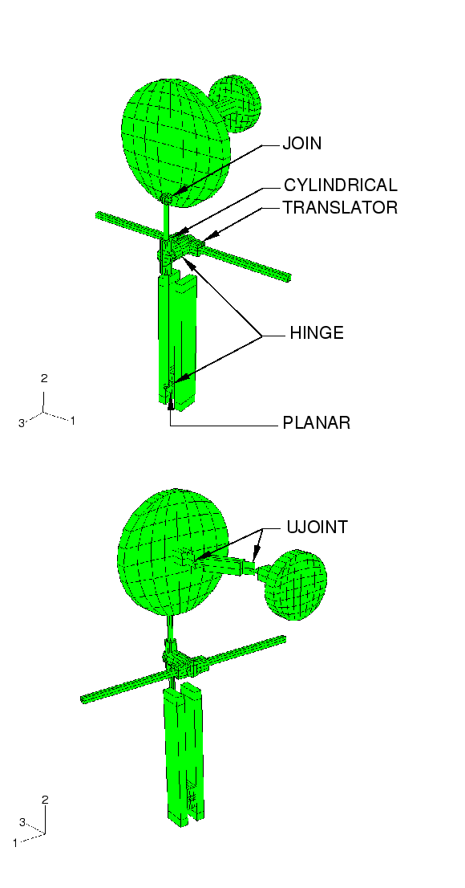
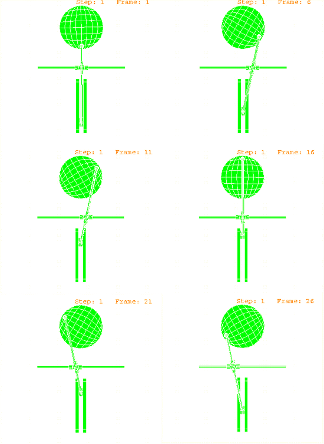

# 4.1.2 Crank mechanism

**Products: **Abaqus/Standard  Abaqus/Explicit  

This example illustrates the use of connector elements to model kinematic constraints between rigid bodies in a multi-body mechanism.

### Problem description

The crank mechanism considered here transmits a rotational motion through two universal joints and then converts the rotation into translational motion of two slides. The mechanism is modeled using nine rigid components attached with eight connector elements. The various kinematic constraints modeled with connector elements include TRANSLATOR, which allows relative translation along a line but no rotations; HINGE, which allows one relative rotation and fixes relative translations; CYLINDRICAL, which allows relative translation along a line and relative rotation about that line; JOIN, which fixes relative translations but leaves the rotations free; PLANAR, which keeps a point on a plane and allows only relative rotations about the normal to that plane; and UJOINT, which fixes the relative translations and enforces a universal constraint on the relative rotations. The complete model is shown in [Figure 4.1.2--1](ch04s01aex106.md#exxrigmultimech-model).

The axes of rotation of the small and large disks are parallel but offset. A constant angular velocity of the small disk is specified about its axis with a velocity boundary condition on its rigid body reference node. All other degrees of freedom of the rigid body reference node are fixed. The rotational motion of the small disk is transmitted to the large disk through two UJOINT connections and a rigid link. A UJOINT connection, or a universal rotation constraint with shared translational degrees of freedom, between two nonaligned shafts will not transmit constant angular velocity. However, two symmetrically placed universal constraints, as here, will produce constant angular velocity coupling between the two disks. The large disk is connected to a rigid circular rod with a JOIN connection. A JOIN connection is equivalent to a ball-and-socket or a spherical joint. The circular rod connects through a sleeve to a flat block. The rod and sleeve constraint is modeled with a CYLINDRICAL connection, which allows the sleeve to translate along and rotate about the rod. The attachment of the circular rod to the flat block is a HINGE connection, which allows only a single relative rotation about the shared hinge axis. The flat block, in turn, is assumed to slide between two fixed parallel plates. This sliding constraint is modeled with a PLANAR (SLIDE-PLANE and REVOLUTE) connection. The sleeve on the circular rod is connected to a square-section sleeve on the square rod with a HINGE connection. The square rod is fixed in space. The square-section sleeve slides along the square bar without rotating. This sliding constraint is modeled with a TRANSLATOR connection.

A Python script is included that reproduces the model using the Scripting Interface in Abaqus/CAE. The script imports the parts from an ACIS file and creates the constraints and connectors that define the dynamics of the mechanism. The script creates both an Abaqus/Standard and an Abaqus/Explicit model that are ready to be submitted for analysis from the Job module.

 Models with frictional interactions, plasticity, and damage in connectors are created by editing the input files without friction to introduce the friction, plasticity, or damage definitions.

A model that includes sensors and actuation via user subroutine [`VUAMP`](../sub/sub-link.md#sub-xsl-vuamp) is also included to illustrate a means to model control engineering aspects in multibody analyses. Assuming that an electric motor provides the rotational input to the system, the intent is to shut off this motor (and complete the step) as the horizontal traveling head completes one full cycle. The amplitude properties can be defined in the input file or directly within the user subroutine.

### Results and discussion

[Figure 4.1.2--2](ch04s01aex106.md#exxrigmultimech-timehis) shows the position of the mechanism at various times. By visual inspection it can be observed that the connector elements are enforcing the correct kinematic constraints.

In this model there are nine rigid bodies with 6 degrees of freedom each, accounting for 54 rigid body degrees of freedom. The eight connector elements eliminate 33 rigid body degrees of freedom through kinematic constraints (enforced via Lagrange multipliers) as itemized in [Table 4.1.2--1](ch04s01aex106.md#conn-dofs). Hence, the model has 21 rigid body degrees of freedom to be specified as boundary conditions or determined by the solution. In this case all remaining rigid body degrees of freedom are specified as boundary conditions, with the *z*-component of angular velocity specified for the small disk and 20 additional fixed boundary conditions used.

### Files

[rigmultimech_std.inp](../eif/rigmultimech_std.inp)

Abaqus/Standard analysis.

[rigmultimech_std_sensor.inp](../eif/rigmultimech_std_sensor.inp)

Abaqus/Standard analysis with sensors and actuation via user subroutine [`UAMP`](../sub/sub-link.md#sub-xsl-uamp) in uamp_rigmultimech.f.

[uamp_rigmultimech.f](../eif/uamp_rigmultimech.f)

Abaqus/Standard user subroutine [`UAMP`](../sub/sub-link.md#sub-xsl-uamp) to specify amplitudes.

[rigmultimech_exp.inp](../eif/rigmultimech_exp.inp)

Abaqus/Explicit analysis.

[rigmultimech_std_fric.inp](../eif/rigmultimech_std_fric.inp)

Abaqus/Standard analysis with friction.

[rigmultimech_exp_fric.inp](../eif/rigmultimech_exp_fric.inp)

Abaqus/Explicit analysis with friction.

[rigmultimech_std_plas.inp](../eif/rigmultimech_std_plas.inp)

Abaqus/Standard analysis with plasticity.

[rigmultimech_exp_plas.inp](../eif/rigmultimech_exp_plas.inp)

Abaqus/Explicit analysis with plasticity.

[rigmultimech_exp_dam.inp](../eif/rigmultimech_exp_dam.inp)

Abaqus/Explicit analysis with damage.

[rigmultimech_exp_sensor.inp](../eif/rigmultimech_exp_sensor.inp)

Abaqus/Explicit analysis with sensors and actuation via user subroutine [`VUAMP`](../sub/sub-link.md#sub-xsl-vuamp) in vuamp_rigmultimech.f. The amplitude properties are defined in the user subroutine.

[vuamp_rigmultimech.f](../eif/vuamp_rigmultimech.f)

Abaqus/Explicit user subroutine [`VUAMP`](../sub/sub-link.md#sub-xsl-vuamp) to specify amplitudes for rigmultimech_exp_sensor.inp.

[rigmultimech_exp_sensor_props.inp](../eif/rigmultimech_exp_sensor_props.inp)

Abaqus/Explicit analysis with sensors and actuation via user subroutine [`VUAMP`](../sub/sub-link.md#sub-xsl-vuamp) in vuamp_rigmultimech_props.f.

[vuamp_rigmultimech_props.f](../eif/vuamp_rigmultimech_props.f)

Abaqus/Explicit user subroutine [`VUAMP`](../sub/sub-link.md#sub-xsl-vuamp) to specify amplitudes for rigmultimech_exp_sensor_props.inp. The amplitude properties are defined in the input file.

[rigmultimech_bulk.inp](../eif/rigmultimech_bulk.inp)

Node and element bulk data for the rigid bodies.

[rigmultimech.py](../eif/rigmultimech.py)

Python script that creates both an Abaqus/Standard and an Abaqus/Explicit model using Abaqus/CAE. The script imports the parts from an ACIS file named `rigmultimech.sat`.

[rigmultimech.sat](../eif/rigmultimech.sat)

ACIS file containing the geometry of the model.

### Table

**Table 4.1.2–1** Rigid body degrees of freedom eliminated by kinematic constraints.
| Connection type | Number of kinematic constraints | Total rigid body DOFs eliminated from model |
| --- | --- | --- |
| UJOINT (2) | 4 | 8 |
| JOIN | 3 | 3 |
| CYLINDRICAL | 4 | 4 |
| HINGE (2) | 5 | 10 |
| SLIDE-PLANE and REVOLUTE | 3 | 3 |
| TRANSLATOR | 5 | 5 |
|  | Total eliminated: 33 |

### Figures

**Figure 4.1.2–1** Rigid mechanism model.

**Figure 4.1.2–2** Time history of the motion of the mechanism during the first revolution.

