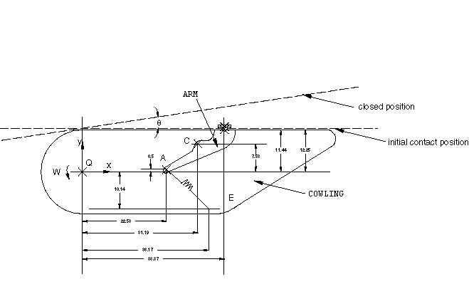
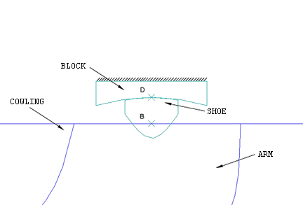
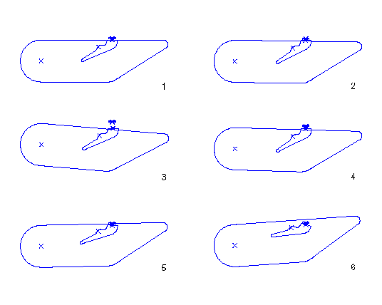
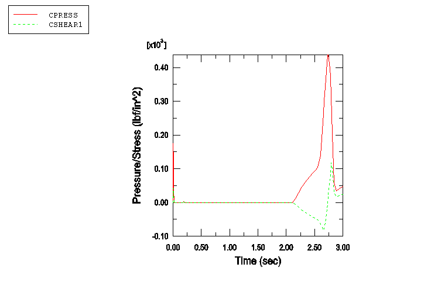

# 4.1.3 Snubber-arm mechanism

**Product: **Abaqus/Standard  

This example illustrates the use of connector elements to model a snubbing mechanism (i.e., two solids coming into contact).

### Geometry and model

A snubber is used to cushion the closing of a cowling on an aircraft. The cowling opens and closes by applying a torque about the *Z*-axis at a fixed point (the origin, Q, in [Figure 4.1.3--1](ch04s01aex107.md#snubber-undef)). The snubber-arm assembly is attached to the cowling at point C. The snubber arm is constrained at point A by a spring and is allowed to rotate relative to the cowling about point C. The other end of the spring is attached to the cowling at point E. A shoe is attached to the snubber arm at point B and contacts with a block as the cover closes, as shown in detail in [Figure 4.1.3--2](ch04s01aex107.md#snubber-undef-zoom). The shoe is allowed to pivot about point B. The spring retains the snubber arm against a stop on the cowling with an initial force of 50 lbs when the cover is open. The shoe contacts the block as the cover closes.

A small rotational spring (10 lb/rad) keeps the shoe from rotating relative to the snubber arm while the shoe is not in contact with the block. The block is fixed to the ground. As the shoe comes into contact, the two surfaces slide relative to each other. The coefficient of friction between the block and the shoe is 0.5.

The closing speed of the cowling is slow enough so that inertia effects can be neglected. [Figure 4.1.3--1](ch04s01aex107.md#snubber-undef) shows the position of the mechanism when the shoe and the block make initial contact. The cowling rotates five more degrees about point Q after the block and the shoe make initial contact.

### Model interactions

The bodies named in [Figure 4.1.3--1](ch04s01aex107.md#snubber-undef) and [Figure 4.1.3--2](ch04s01aex107.md#snubber-undef-zoom) are connected as follows:
- `ARM` is connected to `COWLING` at point C using JOIN and ROTATION connector elements. The rotation is constrained using a connector stop to prevent `ARM` from rotating past the stop.
- The spring connecting `ARM` to `COWLING` is modeled using an AXIAL connector element defined between points A and E. The pre-tension in the spring is modeled using reference lengths and angles to be used in specifying connector constitutive behavior.
- `SHOE` is connected to `ARM` at point B using JOIN and ROTATION connector elements. The small rotational spring is modeled using connector elasticity behavior.

All bodies in the model are modeled using display bodies connected to the relevant connector nodes. `SHOE` (deformable elements) and `BLOCK` (rigid surface) make exception to this rule to allow contact interaction definition between these bodies. Some models include friction and plasticity effects in the connectors.

### Results and discussion

[Figure 4.1.3--3](ch04s01aex107.md#snubber-def-3) shows the displaced configurations of the mechanism as the cowling is rotated. As the cowling opens, the spring pulls on the arm at point C until the arm is stopped. After contact is established, when the cowling is closing, the rotation of the arm increases the tension in the spring. During a flight this mechanism allows the absorption of vibrations between the cowling and the aircraft.

Such analyses allow one to study not only the dynamics of the snubber-arm mechanism but also the contact interaction between the block and the shoe. [Figure 4.1.3--4](ch04s01aex107.md#snubber-res) shows the contact pressure and frictional shear stress at a node located at the center of the shoe contact surface. Over time the coefficient of friction between the shoe and the block will decrease. Knowledge of the contact characteristics between the block and the shoe is a critical component of the design of the mechanism.

### Input files

[snubber_model.py](../eif/snubber_model.py)

Python replay file for constructing the snubber-arm mechanism model in Abaqus/CAE.

[snubber.inp](../eif/snubber.inp)

Snubber-arm mechanism model.

[snubber_surf.inp](../eif/snubber_surf.inp)

Snubber-arm mechanism model with surface-to-surface contact.

[snubber_fric.inp](../eif/snubber_fric.inp)

Snubber-arm mechanism model with friction.

[snubber_plas.inp](../eif/snubber_plas.inp)

Snubber-arm mechanism model with connector plasticity.

### Figures

**Figure 4.1.3–1** Undeformed configuration of the snubber-arm mechanism.

**Figure 4.1.3–2** Undeformed configuration of the shoe and the block.

**Figure 4.1.3–3** Displaced configurations of the mechanism.

**Figure 4.1.3–4** Contact pressure and frictional shear stress at the center of the shoe contact surface.

