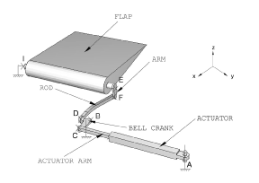
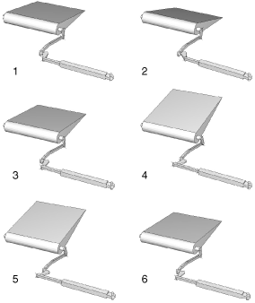
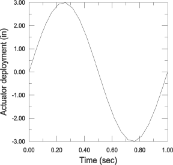

# 4.1.4 Flap mechanism

**Products: **Abaqus/Standard  Abaqus/Explicit  

This example illustrates the use of connector elements to model a three-dimensional trailing edge mechanism.

### Geometry and model

The complete model of the flap is shown in [Figure 4.1.4--1](ch04s01aex108.md#flap-undef). An actuator rotates a bell crank through the deployment of an actuator arm. The bell crank pushes and pulls a connecting rod that attaches to the arm of the flap.

The flap is connected to a rigid shaft on the aircraft wing structure at points E and I. An arm on the shaft is attached to the rod at point F. The other end of the rod attaches to a bell crank at point D. The bell crank is attached to the airplane so that it can rotate about point B. The axis of rotation of the bell crank passes through point B and is parallel to the global *Z*-axis. The rotation of the bell crank is driven by the deployment of the actuator arm. The actuator system attaches to the bell crank at point C. The other end of the actuator system is attached to the aircarft structure at point A and is allowed to compensate for the change of angle caused by the rotation of the bell crank.

A load is applied at the center of gravity of the flap so that it is colinear and oriented along the global *Z*-axis.

### Model interactions

The bodies named in [Figure 4.1.4--1](ch04s01aex108.md#flap-undef) are connected as follows:
- `ACTUATOR` is connected to the ground at point A using a HINGE connector element. `ACTUATOR` and `ACTUATOR ARM` are connected using a TRANSLATOR connector element. The available component of relative motion in the translated connector element is used to modify the configuration of the actuator system as a function of time.
- `BELL CRANK` is physically attached to the ground with a hinge connection at point B. The axis of rotation of the hinge connection is parallel to the global *Z*-axis. However, using a HINGE connector element to attach `BELL CRANK` to the ground would overconstrain the model. Because of the connections used between point A and point C, point C is already constrained to travel in the global *X--Y* plane. Because the position of point B has to remain fixed in space, the rotation of `BELL CRANK` about the -axis is already constrained. As a result, only three translations and the rotation of `BELL CRANK` about the -axis need to be constrained to realize the hinge connection. `BELL CRANK` is, thus, attached to the ground using JOIN and UNIVERSAL connector elements at point B. The UNIVERSAL connection is used to constrain the relative rotation of `BELL CRANK` with respect to the ground about the -axis.
- `ROD` is connected to `BELL CRANK` at point D and to `ARM` at point F using JOIN connector elements. A CARDAN connector element is added at point F between `ROD` and `ARM` to introduce an elastic behavior to prevent the free rotation of `ROD` around its axis.
- `FLAP` and `ARM` are connected by a WELD connector element at point E. `FLAP` is attached to the ground using a HINGE connection at point I.

All bodies in the model are visualized using display bodies connected to the relevant connector nodes. Separate models in Abaqus/Standard and Abaqus/Explicit include friction, plasticity, and damage in the connectors.

### Results and discussion

The amplitude curve used to drive the deployment of the actuator arm is shown in [Figure 4.1.4--3](ch04s01aex108.md#flap-act-dep). [Figure 4.1.4--2](ch04s01aex108.md#flap-def5) shows the configuration of the flap mechanism at intermediate instants as it is actuated. As the actuator system is deployed, the flap rotates around the -axis to modify the aerodynamics of the wing.

### Input files

[flap_model.py](../eif/flap_model.py)

Python replay file for constructing the flap mechanism model in Abaqus/CAE.

[flap.inp](../eif/flap.inp)

Abaqus/Standard flap mechanism model.

[flap_fric.inp](../eif/flap_fric.inp)

Abaqus/Standard flap mechanism model with friction.

[flap_exp_fric.inp](../eif/flap_exp_fric.inp)

Abaqus/Explicit flap mechanism model with friction.

[flap_plas.inp](../eif/flap_plas.inp)

Abaqus/Standard flap mechanism model with plasticity.

[flap_exp_plas.inp](../eif/flap_exp_plas.inp)

Abaqus/Explicit flap mechanism model with plasticity.

[flap_exp_plas_dam.inp](../eif/flap_exp_plas_dam.inp)

Abaqus/Explicit flap mechanism model with plasticity and damage.

### Figures

**Figure 4.1.4–1** Undeformed configuration of the flap mechanism.

**Figure 4.1.4–2** Deformed configurations of the flap mechanism.

**Figure 4.1.4–3** Translator connector motion.

