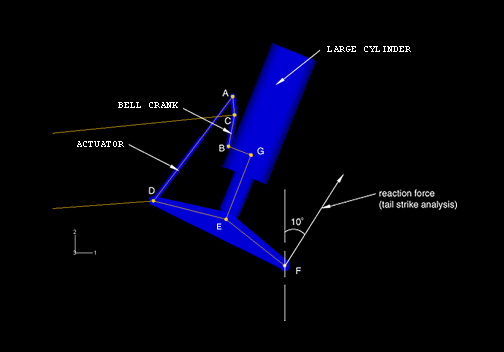
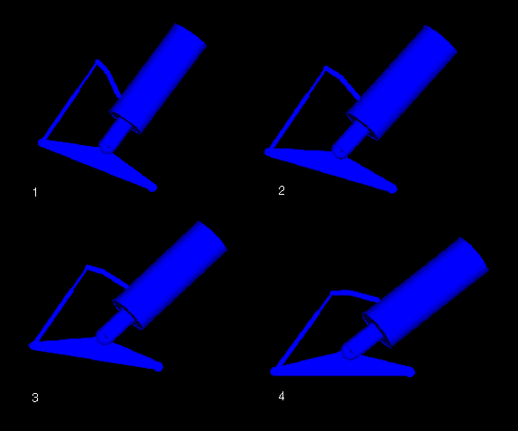
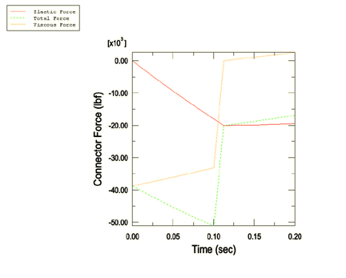
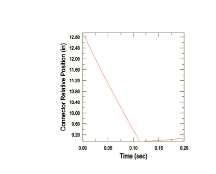

# 4.1.5 Tail-skid mechanism

**Products: **Abaqus/Standard  Abaqus/Explicit  

This example illustrates the use of connector elements to model the tail-skid mechanism of an airplane.

### Geometry and model

The complete model of the tail-skid mechanism is shown in [Figure 4.1.5--1](ch04s01aex109.md#exxtailskidmech-model). It consists of a bell crank, an actuator, a tail-skid arm, and a large cylinder. The bell crank is connected to the actuator at point A and to the large cylinder at point B. The tail-skid arm is connected to the actuator at point D and to the large cylinder at point E. The large cylinder is a compressible single-use cartridge designed to absorb energy in the unlikely event of a tail strike. As such, it behaves like a compression-only linear spring with a stiffness *K*=875600 N/m (*K*=5000 lb/in) and a damping coefficient *C*=175100 N/m sec (*C*=1000 lb/in sec). The bell crank pivots about point C to move the large cylinder. The whole mechanism is attached to the aircraft frame through points C and D. All point locations are listed in [Table 4.1.5--1](ch04s01aex109.md#tableforpointlocations).

Two types of analyses are of interest: the deployment and stowage kinematics analysis and the tail strike analysis. In the kinematics analysis the actuator contracts a distance of 145.8 mm (5.74 in), which will rotate the bell crank and move the mechanism from the deployed to the stowage position. The large cylinder does not compress during stowage or deployment. The tail strike analysis simulates the over-rotation of an aircraft during takeoff. In this analysis the tail-skid arm strikes the ground at a speed of 1.839 m/s (6.0 ft/s) at point F when it is at the deployed position. The strike creates a force acting at an angle of 10 degrees with respect to the 2-axis as a result of friction between the airplane and the runway. During the strike the large cylinder is compressed a maximum distance of 101.6 mm (4.0 in) to absorb energy before it bottoms out. The mass and inertia of the tail-skid components are assumed to be negligible. The body of the airplane is assumed to be rigid, has a mass of 6193 kg (270000 lb), and a mass moment of inertia of 2220 kg m2 (1.5e8 lb in2) relative to the 3-axis. The center of gravity of the airplane is located at –18.06 m, –1.422 m, 0.0 m (–711.0 in, –56 in, 0.0 in); it is not shown in the model because the dimension of the aircraft is much larger than the mechanism.

### Model interaction

The correct behavior of the tail-skid mechanism is modeled by defining appropriate connectors between the discrete points in [Figure 4.1.5--1](ch04s01aex109.md#exxtailskidmech-model). For visualization purposes, display bodies are attached to those points to model the bell crank, actuator, tail-skid arm, and large cylinder.
- The actuator behavior is modeled using an AXIAL connector between points A and C.
- The large cylinder behavior is modeled by the combination of an AXIAL connector and a SLIDE-PLANE connector between points E and G.
- The bell crank is connected to the large cylinder by a HINGE (REVOLUTE+JOIN) connector and to the actuator by a JOIN connector.
- The tail-skid arm is connected to the actuator and the large cylinder at points D and E, respectively, using two HINGE connectors.

The tail-skid mechanism is then connected to the aircraft frame at points C and D using two HINGE connectors. The air frame is modeled with two BEAM connectors connecting points C and D to the center of gravity of the airplane. Since both the actuator and the large cylinder consist of two display bodies, additional connectors are necessary to constrain the relative motion between them. For this purpose a SLIDE-PLANE connector element and an ALIGN connector element are defined between points A and D, and an ALIGN connector element is defined between points D and G.

In the kinematics analysis the position of the aircraft is fixed; the contraction of the actuator, which is realized through prescribed connector displacement of the AXIAL connector, moves the mechanism from the deployed to the stowage position. In the tail strike analysis the over-rotation of the airplane is modeled by allowing the airplane to be in free motion and applying an initial rotating velocity to it. During the strike the direction of the reaction of the ground to the airplane is assumed to remain fixed. As a result the reaction force is modeled by applying a fixed boundary condition at point F in a local coordinate system that will generate a reaction at an angle of 10 degrees with the 2-axis. The actuator is fixed during the strike, while the large cylinder is compressed. The large cylinder will absorb energy until it stops after being compressed 4 inches. This physical behavior of the large cylinder is modeled using the connector elasticity, connector damping, and connector stop behaviors. Separate models include friction, plasticity, and damage in the connectors.

In Abaqus/Explicit the tail strike analysis is repeated with a user-defined element in addition to the axial connector between points A and D. The element is modeled to mimic the elastic behavior of an axial connector; the damping and locking behavior are still defined through the axial connector acting in parallel with the user-defined element.

### Results and discussion

A sequence of the deformed tail-skid mechanisms in the kinematics analysis is shown in [Figure 4.1.5--2](ch04s01aex109.md#exxtailskidmech-timehist). By visual inspection it can be observed that the connector elements are enforcing the correct kinematic constraints. Some of the numerical results for the tail strike analysis are shown in [Figure 4.1.5--3](ch04s01aex109.md#exxtailskidmech-force) and [Figure 4.1.5--4](ch04s01aex109.md#exxtailskidmech-stop). [Figure 4.1.5--3](ch04s01aex109.md#exxtailskidmech-force) shows the total, elastic, and viscous force of the AXIAL connector that models the mechanical behavior of the large cylinder. [Figure 4.1.5--4](ch04s01aex109.md#exxtailskidmech-stop) shows the relative distance between points G and D. The sudden changes of the connector force and displacement shown in both figures are due to the large cylinder reaching its maximum contraction (modeled using connector stops) during tail strike.

### Input files

[tail_kinematics.inp](../eif/tail_kinematics.inp)

Kinematics analysis.

[tail_strike.inp](../eif/tail_strike.inp)

Tail strike analysis.

[tail_strike_fric.inp](../eif/tail_strike_fric.inp)

Tail strike analysis with friction.

[tail_strike_exp_fric.inp](../eif/tail_strike_exp_fric.inp)

Abaqus/Explicit tail strike analysis with friction.

[tail_strike_exp_fric_plas_dam.inp](../eif/tail_strike_exp_fric_plas_dam.inp)

Abaqus/Explicit tail strike analysis with friction, plasticity, and damage.

[tail_kinematics_model.py](../eif/tail_kinematics_model.py)

Python replay file for constructing the kinematics model using Abaqus/CAE.

[tail_strike_model.py](../eif/tail_strike_model.py)

Python replay file for constructing the tail strike model using Abaqus/CAE.

[vuel_tail_strike_exp_fric.inp](../eif/vuel_tail_strike_exp_fric.inp)

Abaqus/Explicit tail strike analysis with a user-defined element modeling the elastic behavior of one of the axial connectors. The element is defined in user subroutine vuel_axial_connector3d.f.

[vuel_axial_connector3d.f](../eif/vuel_axial_connector3d.f)

User subroutine [`VUEL`](../sub/sub-link.md#sub-xsl-vuel) to model the axial connector.

### Table

**Table 4.1.5–1** Point locations in the deployed position.
| Point | X | Y | Z |
| --- | --- | --- | --- |
| A | 14.95 | 19.62 | 0.00 |
| B | 14.15 | 10.24 | 0.00 |
| C | 15.29 | 16.13 | 0.00 |
| D | 0.00 | 0.00 | 0.00 |
| E | 13.69 | 3.49 | 0.00 |
| F | 24.72 | 12.24 | 0.00 |

### Figures

**Figure 4.1.5–1** Tail-skid mechanism model (the deployed position).

**Figure 4.1.5–2** Intermediate positions of the tail-skid mechanism during tail strike.

**Figure 4.1.5–3** Elastic and damping forces of the connector modeling the large cylinder.

**Figure 4.1.5–4** Relative displacement of the connector modeling the large cylinder.

