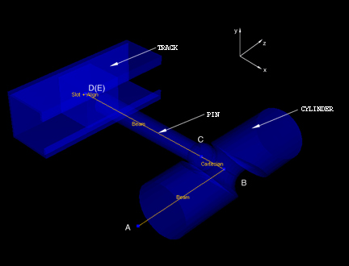
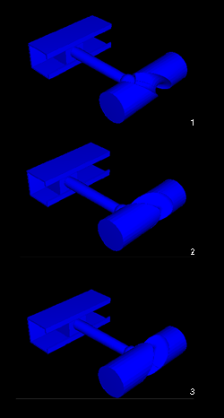
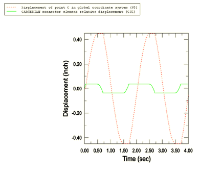

# 4.1.6 Cylinder-cam mechanism

**Product: **Abaqus/Explicit  

This example illustrates the use of connector elements to model a cylinder-cam mechanism.

### Geometry and model

The cylinder-cam mechanism is shown in [Figure 4.1.6--1](ch04s01aex110.md#exxcylcammech-connec). The solid aluminum cylinder is lying on the *Z*-axis and has a slot around its circumference. The centerline of the slot is defined by a plane intersecting the cylinder at 45 degrees. The slot has a radius of 7.62 mm (0.30 in) and a depth of 7.62 mm (0.30 in). A pin with a spherical end of radius 6.35 mm (0.25 in) is set into the slot. The pin is constrained to be parallel to the *X*-axis and remains in the *X*–*Z* plane. Because of the difference in radii, there is a 1.27 mm (0.05 in) gap between the slot and the pin head. As the cylinder rotates about the *Z*-axis, the pin travels in a track that is parallel to the cylinder. The pin has a weight of 13.34 N (3.0 lbf).

The cylinder rotates with a speed of 30 rpm, which drives the pin back and forth in the track. Resistance to the motion is caused by the friction between the pin and the track. The tolerance mismatch due to the pin head being smaller than the slot is considered in the model.

### Model interactions

As shown in [Figure 4.1.6--1](ch04s01aex110.md#exxcylcammech-connec), the track, the pin, and the cylinder are modeled using display bodies. The bodies in [Figure 4.1.6--1](ch04s01aex110.md#exxcylcammech-connec) are connected as follows:
- MASS and ROTARYI elements are attached to each display body through BEAM connector elements to account for the inertia of each part in the model.
- The interaction between `PIN` and `TRACK` is modeled using ALIGN+SLOT connectors between point D and point E. The friction dissipation effects between `PIN` and `TRACK` are taken into account using connector damping behavior.
- The interaction between `PIN` and `CYLINDER` is modeled by defining a CARTESIAN connector element between point B and point C. The 1.27 mm (0.05 in) gap between the pin and the slot is modeled using a connector stop. The local coordinate system of the CARTESIAN connector element (used to measure the displacement of point C relative to point B) is attached at point B to `CYLINDER` and has its 2--3 plane lying in the plane of the slot. The connector stop is defined along component 1 of the connector element. A displacement of 1.27 mm (0.05 in) of the pin relative to the center of the slot along the *Z*-axis corresponds to a displacement of point C relative to point B of 0.898 mm (0.035 in) in the connector local coordinate system. The connector stop is, thus, defined at a distance of 0.898 mm (0.035 in) in the positive and negative 1-directions of the CARTESIAN connector element.

### Results and discussion

[Figure 4.1.6--2](ch04s01aex110.md#exxcylcammech-pos) shows the positions of the mechanism as the cylinder is rotated. The time histories of the displacement of point C in the global coordinate system and the displacement of point C relative to point B in the CARTESIAN connector local coordinate system are shown in [Figure 4.1.6--3](ch04s01aex110.md#exxcylcammech-disp). In the connector local coordinate system, point C travels a maximum distance of 0.035 in relative to point B. This corresponds to the value given in the connector stop definition. When `PIN` and `CYLINDER` are in contact, the displacement of point C relative to point B in the connector local coordinate system remains constant, and the cylinder forces the pin to translate. When contact is lost, the connector relative displacement varies with time, and the motion of the pin stops as a result of damping.

### Files

[cylcammech.inp](../eif/cylcammech.inp)

Abaqus/Explicit analysis.

[cylcammech.py](../eif/cylcammech.py)

Python script that creates an Abaqus/Explicit model using Abaqus/CAE. The script imports the parts from an ACIS file named `cylcammech.sat`.

[cylcammech.sat](../eif/cylcammech.sat)

ACIS file containing the geometry of the model.

### Figures

**Figure 4.1.6–1** Cylinder-cam mechanism.

**Figure 4.1.6–2** Displaced positions of the mechanism.

**Figure 4.1.6–3** Time histories of the displacement of the pin head (Point C).

