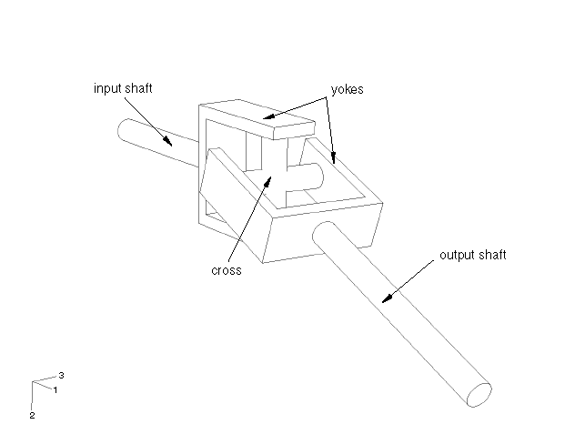
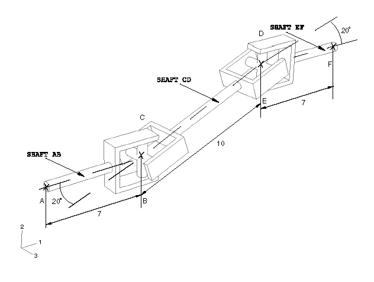
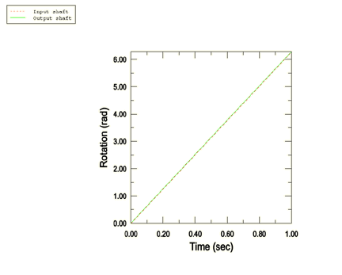

# 4.1.7 Driveshaft mechanism

**Products: **Abaqus/Standard  Abaqus/Explicit  

This example illustrates the use of connectors to model a driveshaft mechanism.

### Geometry and model

Driveshaft mechanisms are important components of motor vehicles. These mechanisms often contain universal joints that are used to carry motion from one shaft to another where the two shafts are not perfectly aligned. A typical universal joint assembly is shown in [Figure 4.1.7--1](ch04s01aex111.md#ujoint). The joint consists of a cross that carries needle roller bearings at the four extremities. The bearing cups are attached to yokes, two on the input shaft and two on the output shaft. The universal joint is not a constant velocity joint. If the input and output shafts are not aligned, the uniform rotation of the input shaft will result in a nonuniform rotation of the output shaft. When the input shaft is rotated at constant velocity, the output shaft will accelerate and decelerate twice per revolution (a pulsation effect).

The driveshaft mechanism in this example problem consists of three shafts, `SHAFT AB` (the input shaft), `SHAFT CD` (the center shaft), and `SHAFT EF` (the output shaft). `SHAFT AB` is connected to `SHAFT CD` through a universal joint that connects B and C. `SHAFT CD` is connected to `SHAFT EF` through a universal joint that connects D and E. B31 beam elements are used to model the shafts. `SHAFT AB` and `SHAFT EF` have a length of 7 units each, and `SHAFT CD` is 10 units long. `SHAFT AB` and `SHAFT EF` are coplanar and parallel to each other. `SHAFT CD` is also coplanar to `SHAFT AB` and `SHAFT EF` but is inclined to `SHAFT AB` and `SHAFT EF` at an angle of 20 degrees. `SHAFT AB`, `SHAFT CD`, and `SHAFT EF` are circular in cross-section; and the radius of their cross-section is 0.1 units. The universal joints connecting B and C and connecting D and E are modeled using CONN3D2 elements.

The variation of angular motion between the input and output shafts can be avoided. The pulsation effect between the input shaft and the center shaft can be compensated entirely by the pulsation effect between the center shaft and the output shaft if the universal joints are oriented properly with respect to each other. A sufficient condition for the input/output velocity ratio to be constant is that the directions normal to the crosses of the universal joints be colinear. The configuration of the shafts is illustrated in [Figure 4.1.7--2](ch04s01aex111.md#ujoint2). In this figure we can see that the crosses lie in parallel planes. This will guarantee a constant input/output velocity ratio.

### Model interactions

All the degrees of freedom except the rotational degree of freedom about the beam axis are fixed at A and F. A prescribed rotation of 360 degrees is specified at A. No other boundary conditions are specified. The bodies in [Figure 4.1.7--2](ch04s01aex111.md#ujoint2) are connected as follows:
- `SHAFT AB` is connected to `SHAFT CD` with a UJOINT connector element (Joint 1).
- `SHAFT CD` is connected to `SHAFT EF` with a UJOINT connector element (Joint 2).

Because the rotary motion of one shaft is to be transmitted to another shaft that is not colinear, separate coordinate orientation systems are created and used to connect the connector nodes for each UJOINT connector connecting the shafts. The coordinate systems used to define Joint 2 are the systems used to define Joint 1 rotated by 90 degrees about the global 1-axis. This ensures proper orientation of the joint crosses and a constant input/output velocity ratio. Separate models for Abaqus/Standard and Abaqus/Explicit include friction in the connectors.

### Results and discussion

The rotation of `SHAFT AB` about its axis leads to a rotation of `SHAFT EF` about its axis. The rotation of the input and output shafts about their axis is plotted in [Figure 4.1.7--3](ch04s01aex111.md#rotation). We can see that the motion of these shafts is perfectly synchronized.

### Input files

[driveshaft_model.py](../eif/driveshaft_model.py)

Python replay file for constructing the driveshaft mechanism model in Abaqus/CAE.

[driveshaft.inp](../eif/driveshaft.inp)

Abaqus/Standard driveshaft mechanism model.

[driveshaft_fric.inp](../eif/driveshaft_fric.inp)

Abaqus/Standard driveshaft mechanism model with friction.

[driveshaft_exp_fric.inp](../eif/driveshaft_exp_fric.inp)

Abaqus/Explicit driveshaft mechanism model with friction.

### Figures

**Figure 4.1.7–1** Universal joint.

**Figure 4.1.7–2** Configuration of the driveshaft mechanism.

**Figure 4.1.7–3** Rotation of the input and output shafts about the global 1-axis.

