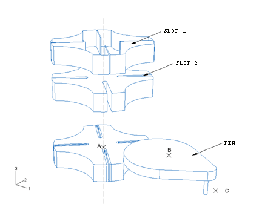
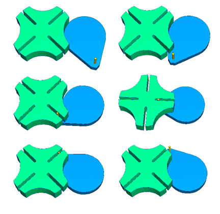
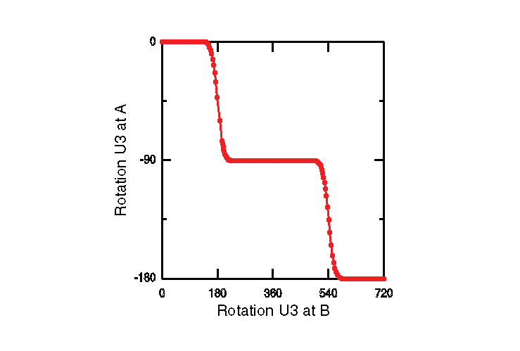

# 4.1.8 Geneva mechanism

**Product: **Abaqus/Standard  

This example illustrates the use of connector elements to model a Geneva mechanism, which converts continuous rotary motion into intermittent rotary motion. 

### Geometry and model

The Geneva mechanism is essentially a timing device. It is used in counting instruments and other applications where a continuous rotary motion needs to be converted to an intermittent rotary motion. For example, it is used in clocks to limit the number of winding rotations of the clock spring and in movie film projectors to move the film frame by frame. The Geneva mechanism consists of a rotating body with a protruding pin and another rotating body with slots into which the pin slides.

In this example problem the mechanism consists of three bodies named `PIN`, `SLOT1`, and `SLOT2`, as illustrated in [Figure 4.1.8--1](ch04s01aex112.md#geneva-connectors). `SLOT1` is an analytical rigid surface that overlays `SLOT2`. `SLOT2` is modeled as a display body. `SLOT1` and `SLOT2` are rigidly joined to each other at point A so as to allow them to rotate in unison about A. `SLOT2` has a radius of 3.0 units and is 1.0 units thick. The pin is constrained to be rigid. The thickness of the rigid part of `PIN` is 0.5 units. The rigid portion of `PIN` has a reference point B, and `PIN` is allowed to rotate about B. Distance AB is 4.24264 units in the model. The protruding portion of `PIN` is located at a distance of 3.0 units from reference point B, and its length is 1.0 units. The rigid portion of `PIN` has a radius of 3.0 units.

### Model interactions

The contact between `PIN` and `SLOT1` takes place through a single slave node located at C, the center of the protruding portion of `PIN`. As a result, the slots in `SLOT1` (used for contact evaluation) are 0.05 units wide, whereas the slots in `SLOT2` (used for display purposes only) are 0.25 units wide. The slots have a length of about 2.0 units to allow for the pin to slide. This contact is considered to be frictionless.

All the degrees of freedom at A and B, except the rotational degrees of freedom about the 3-axis, are fixed. A rotation of 720 degrees about the 3-axis is prescribed at B over three steps.

An EULER connector is constructed connecting A, the reference point of `SLOT1`, to the ground. The connector damping and connector friction behaviors are used to introduce damping and friction in the EULER connector. Damping and friction will prevent rigid body motion of `SLOT1` and `SLOT2` after the pin has left the slot.

### Results and discussion

The protruding portion of `PIN` enters the slots in `SLOT1` as `PIN` is rotated. This interaction between `PIN` and `SLOT1` results in the rotation of `SLOT1` and `SLOT2`, and they rotate 90 degrees for every complete 360 degree rotation of `PIN`. [Figure 4.1.8--2](ch04s01aex112.md#geneva-animation) shows the configuration of the bodies of the Geneva mechanism at some intermediate instants during the analysis. [Figure 4.1.8--3](ch04s01aex112.md#geneva-history) shows a plot of the U3 rotation of `SLOT1` at A as a function of the U3 rotation of `PIN` at B.

### Input files

[geneva_model.py](../eif/geneva_model.py)

Python replay file for constructing the Geneva mechanism model in Abaqus/CAE.

[geneva.inp](../eif/geneva.inp)

Geneva mechanism model.

### Figures

**Figure 4.1.8–1** Exploded view of the Geneva mechanism. 

**Figure 4.1.8–2** Configurations of the Geneva mechanism for increasing values of `PIN` rotation.

**Figure 4.1.8–3** Plot of the U3 rotation of `SLOT1` at A as a function of the U3 rotation of `PIN` at B. Rotation values are in degrees.

