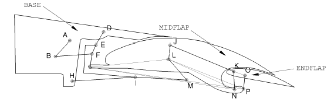
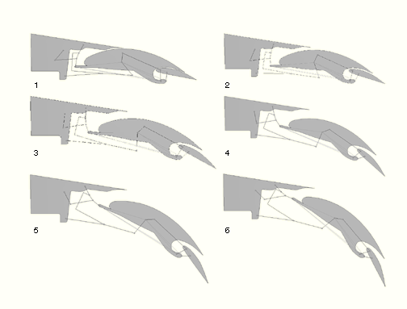

# 4.1.9 Trailing edge flap mechanism

**Product: **Abaqus/Standard  

This example illustrates the use of connectors to model the deployment of a trailing edge flap mechanism in an aircraft.

### Geometry and model

The trailing edge flap mechanism is a critical component of an aircraft. The shape and positioning of the trailing edge flaps are important determinants of the aircraft's lift and aerodynamic behavior.

The trailing edge flap structure in this example problem consists of three flaps, `BASE`, `MIDFLAP`, and `ENDFLAP`; and these flaps are connected to each other by arms, which are rigid links pinned to the flaps at different points. The configuration of the flaps is illustrated in [Figure 4.1.9--1](ch04s01aex113.md#edgeflap-undeformed). There are nine arms used in the model: `ARM AB`, `ARM BF`, `ARM DEFG`, `ARM EI`, `ARM HIM`, `ARM JK`, `ARM MLJ`, `ARM NK`, and `ARM PO`. `BASE`, `MIDFLAP`, and `ENDFLAP` are modeled as display bodies; and the arms are modeled as rigid truss members. `MIDFLAP` and `ENDFLAP` are deployed by rotating `ARM AB` pinned on `BASE` at point A.

### Model interactions

The bodies in [Figure 4.1.9--1](ch04s01aex113.md#edgeflap-undeformed) are connected as follows:
- JOIN connector elements are used to connect the arms at their endpoints to `BASE`, `MIDFLAP`, and `ENDFLAP`. The endpoints of some arms are connected to other arms instead of being connected to the flaps. `ARM AB` is connected to `ARM BF` at B. `ARM BF` and `ARM EI` are connected to `ARM DEFG` at F and E, respectively. `ARM EI` and `ARM MLJ` are connected to `ARM HIM` at I and M, respectively. `ARM MLJ` is connected to `ARM JK` at J, and `ARM MLJ` is connected to `MIDFLAP` at L, which is not one of the endpoints of `ARM MLJ`.
- LINK connector elements are used to rigidly fix the positions of the pivot points on the flaps. These link connectors are called `LINK GL`, `LINK GN`, `LINK GP`, `LINK KO`, `LINK LN`, and `LINK LP`. These additional link connectors are necessary to support `BASE`, `MIDFLAP`, and `ENDFLAP` because these flaps are modeled as display bodies and not as deformable or rigid bodies. `LINK GL`, `LINK GN`, `LINK GP`, `LINK LN`, and `LINK LP` are used to position points G, L, N, and P on `MIDFLAP`; and `LINK KO` is used to position points K and O on `ENDFLAP`.

To deploy the flap, we fix `BASE` in space by fixing points A, D, and H and rotate `ARM AB` 90 degrees about point A. One analysis models plasticity effects in some of the connectors.

### Results and discussion

The rotation of `ARM AB` results in the deployment of `MIDFLAP` and `ENDFLAP`. [Figure 4.1.9--2](ch04s01aex113.md#edgeflap-animations) contains a series of illustrations showing the positions of the flaps at the beginning and end of the analysis and also at some intermediate instants.

### Input files

[edgeflap_model.py](../eif/edgeflap_model.py)

Python replay file for constructing the trailing edge flap mechanism model in Abaqus/CAE.

[edgeflap.inp](../eif/edgeflap.inp)

Trailing edge flap mechanism model.

[edgeflap_plas.inp](../eif/edgeflap_plas.inp)

Trailing edge flap mechanism model with connector plasticity.

### Figures

**Figure 4.1.9–1** Undeformed configuration of the trailing edge flap mechanism.

**Figure 4.1.9–2** Deformed configurations of the trailing edge flap mechanism.

