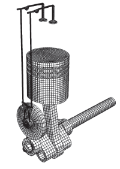
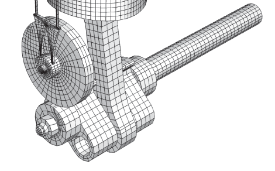
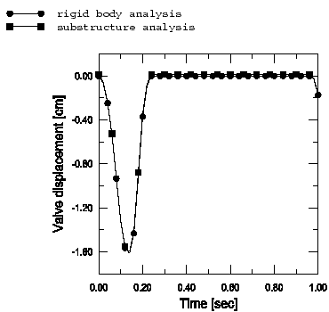
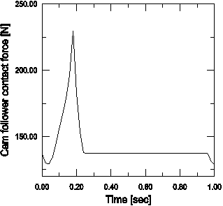
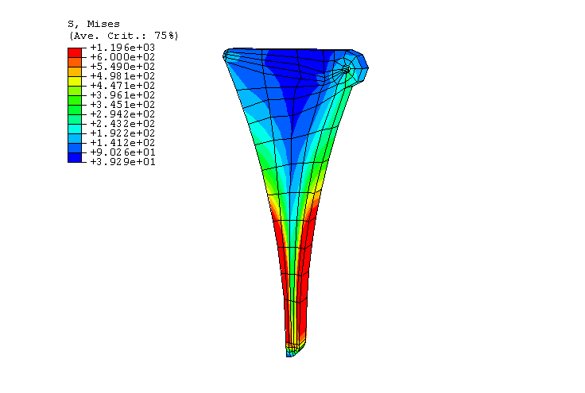
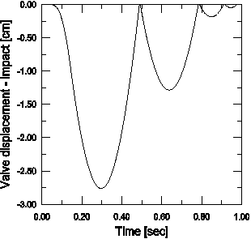

# 4.1.10 Substructure analysis of a one-piston engine model

**Product: **Abaqus/Standard  

This example illustrates the use of the substructure capability in Abaqus to model efficiently multi-body systems that undergo large motions but exhibit only small linear deformations. The models also illustrate how to switch between a full-mesh representation of a part, a substructure representation, and a rigid body representation of the same part depending on the modeling needs. Both static and dynamic analyses are performed, and the results are compared between the various models. 

### Geometry and material

The multi-body system discussed here is the simplified one-piston engine model depicted in [Figure 4.1.10--1](ch04s01aex114.md#sxmonepiston-mesh) and in the detail shown in [Figure 4.1.10--2](ch04s01aex114.md#sxmonepiston-meshdet). The model consists of several parts that are constrained together using connector elements. Each part is modeled either as a fully deformable regular mesh, a rigid body, or a substructure. The connections between parts are idealized using coupling constraints and connector elements. On each part a coupling constraint is used to constrain a few nodes near the connection points so that the connection forces get distributed to a finite area, much like in the physical model. The reference nodes in the coupling constraint are then used to define appropriate connector elements between neighboring parts that enforce the desired kinematic linkage between bodies.

The two parts of the crankshaft are rigidly connected using a BEAM connector element. The connecting rod between the crankshaft and the piston's head has HINGE connections at both ends. The gear transmission (2:1 gear ratio) between the crankshaft and the valve-cam is modeled using an equation constraint between two rotational degrees of freedom. An analytically defined rigid surface is used to model the contact surface of the cam. This surface is rigidly attached to the larger gear used to spin the cam. The contact between the cam followers and the cam is modeled using a single node on each cam follower's tip defined using a node-based surface. The connections between cam followers and push rods and between push rods and valve rockers are modeled using JOIN connectors. The valve rockers use HINGE connections about fixed points in space (the engine block is not modeled). The valve rockers are pushing against the spring loaded valves. The valve springs are precompressed and are defined using CARTESIAN connectors together with the reference lengths and angles for constitutive response and the connector elasticity behavior. The valve seats and the cylinders are not modeled. Steel material properties are used for all parts. The model is actuated by fixing the available components of relative motion to spin the right end of the crankshaft for a little more than two full revolutions. In some of the analyses the connector friction behavior is used to model frictional effects in the connector elements. Plasticity effects are specified in connectors in some of the analyses.

### Models

The following three models are considered:

1. All parts are modeled using regular meshes (no substructures or rigid bodies). This is the largest model and could include the most modeling options, including nonlinear material modeling options (e.g., plasticity), if desired. A large computation time is needed to complete the analysis.
2. All parts are modeled as rigid bodies. While much less computational time is needed to complete this analysis, this model cannot compute stresses in the various parts. However, it reveals very useful information about the overall kinematics/dynamics of the model. Reaction forces at support points and connector output variables (such as connector reaction forces or elastic forces in the valve springs) are also predicted accurately.
3. Some parts (crankshaft, connection rod, piston head, cam, and cam followers) are modeled as substructures. The remainder of the parts (push rods, valve rockers, and valves) are modeled as rigid bodies. This model is very efficient in obtaining both overall kinematic/dynamic information as well as the stresses and strains in the selected parts.

The input files are organized so that one can very easily switch (just by changing a few lines) between the different models.

Before the global analysis can be run, the substructure for each part must be generated. To minimize the computational effort in the global analysis, the minimum necessary number of retained nodal degrees of freedom is chosen. The reference nodes of all coupling constraints must be retained since the parts are connected through these nodes. In addition, since the parts will undergo large rotations during the analysis, at least three nonaligned nodes must be retained at the substructure generation level to allow for the precise calculation of the rigid body motion of each part (see ["Defining substructures," Section 10.1.2 of the Abaqus Analysis User's Guide](../usb/usb-link.md#usb-anl-asuperelementdef)). Since for most parts only two nodes in the coupling constraint are defined (most parts are connected at only two points), an additional node not aligned with the nodes in the coupling constraint is also retained for most substructures. Because of the small number of retained nodes the global analysis is very efficient. For these particular choices it runs faster than the model when all parts are modeled as rigid.

The reduced mass matrix for each substructure is generated by selecting the eigenmodes during the substructure generation. To improve the representation of the substructure's dynamic behavior in the global analysis, six dynamic modes, which are extracted using an eigenfrequency extraction preload step, are included during the substructure generation during eigenmode selection. The substructures are loaded by gravity in the vertical direction by requesting that the substructure's gravity load vectors be calculated during penetration and by specifying a distributed load at the substructure usage level. 

### Results and discussion

Both static and direct-integration implicit dynamic analyses are conducted. The vertical displacements of the valves and the contact forces on the cam followers are monitored. 

In [Figure 4.1.10--3](ch04s01aex114.md#sxmonepiston-valve) the vertical displacement of the valve on the left is depicted for a static analysis. The valve descends (“opens”) in the beginning of the cycle and then “closes” for most of the analysis. Since the crankshaft rotates a little more than two revolutions, the valve starts opening again in the end. The normal contact force between the left cam follower and the cam is shown in [Figure 4.1.10--4](ch04s01aex114.md#sxmonepiston-contact). A sharp peak is encountered when the valve “opens,” while the contact force stays constant when the valve is “closed.” Since the valve seats are not modeled, the “closed” positions for the rigid body model and for the substructure model are slightly different due to elastic deformation of the cam followers in the latter case. The stresses in the left cam follower are depicted in [Figure 4.1.10--5](ch04s01aex114.md#sxmonepiston-stress) for an intermediate position of the crankshaft. The stresses are recovered when output is obtained from the substructure. 

Since the inertia forces of the moving parts are relatively small when compared to the compression forces in the valve springs, the contact forces and the valve displacements in the direct-integration implicit dynamic analyses are similar to those in the static analysis. However, if the valve spring stiffness is chosen to be very small (such as would happen if the spring failed), the inertial effects become very important and contact between the cam and the cam follower could be lost. In [Figure 4.1.10--6](ch04s01aex114.md#sxmonepiston-valveimp) the valve displacement is depicted for such a case. Contact is established only intermittently between the two parts (corresponding to zero valve displacement). For most of the time the two parts are not contacting each other, and the valve displacement is completely different from the intended behavior.

The **abaqus substructurecombine** execution procedure combines model and results data from two substructure output databases into a single output database. For more information, see ["Combining output from substructures," Section 3.2.22 of the Abaqus Analysis User's Guide](../usb/usb-link.md#usb-int-dsubstructurecombineproc).

### Input files

[crank_substr_sta.inp](../eif/crank_substr_sta.inp)

[*STATIC](../key/key-link.md#usb-kws-hstatic) substructure global analysis.

[crank_substr_dyn.inp](../eif/crank_substr_dyn.inp)

[*DYNAMIC](../key/key-link.md#usb-kws-hdynamic) substructure global analysis.

[crank_substr_sta_fric.inp](../eif/crank_substr_sta_fric.inp)

[*STATIC](../key/key-link.md#usb-kws-hstatic) substructure global analysis with frictional effects.

[crank_substr_dyn_fric.inp](../eif/crank_substr_dyn_fric.inp)

[*DYNAMIC](../key/key-link.md#usb-kws-hdynamic) substructure global analysis with frictional effects.

[crank_substr_dynimp.inp](../eif/crank_substr_dynimp.inp)

[*DYNAMIC](../key/key-link.md#usb-kws-hdynamic) substructure impact analysis (softer valve springs).

[crank_rb_sta.inp](../eif/crank_rb_sta.inp)

[*STATIC](../key/key-link.md#usb-kws-hstatic) analysis with rigid bodies only (no substructures).

[crank_all_def_sta.inp](../eif/crank_all_def_sta.inp)

[*STATIC](../key/key-link.md#usb-kws-hstatic) regular mesh analysis.

[crank_all_def_dyn.inp](../eif/crank_all_def_dyn.inp)

[*DYNAMIC](../key/key-link.md#usb-kws-hdynamic) regular mesh analysis.

[crank_shaft_gen.inp](../eif/crank_shaft_gen.inp)

Substructure generation for the right half of the shaft.

[crank_shaft2_gen.inp](../eif/crank_shaft2_gen.inp)

Substructure generation for the left half of the shaft.

[crank_conrod_gen.inp](../eif/crank_conrod_gen.inp)

Substructure generation for the connection rod.

[crank_head_gen.inp](../eif/crank_head_gen.inp)

Substructure generation for the piston's head.

[crank_cam_gen.inp](../eif/crank_cam_gen.inp)

Substructure generation for the cam.

[crank_camfollow1_gen.inp](../eif/crank_camfollow1_gen.inp)

Substructure generation for the first cam follower.

[crank_camfollow2_gen.inp](../eif/crank_camfollow2_gen.inp)

Substructure generation for the second cam follower.

[crank_conn_gr_ref_nodes.inp](../eif/crank_conn_gr_ref_nodes.inp)

Connector, ground, and reference node definitions.

[crank_small_mass.inp](../eif/crank_small_mass.inp)

Small masses used to avoid numerical singularities in [*DYNAMIC](../key/key-link.md#usb-kws-hdynamic) analyses.

[crank_materials.inp](../eif/crank_materials.inp)

Material properties.

[crank_shaft_nodes.inp](../eif/crank_shaft_nodes.inp)

Node definitions for the right half of the shaft.

[crank_shaft_elts.inp](../eif/crank_shaft_elts.inp)

Element definitions for the right half of the shaft.

[crank_shaft_coupling.inp](../eif/crank_shaft_coupling.inp)

[*COUPLING](../key/key-link.md#usb-kws-mcoupling) definitions for the right half of the shaft.

[crank_shaft2_nodes.inp](../eif/crank_shaft2_nodes.inp)

Node definitions for the left half of the shaft.

[crank_shaft2_elts.inp](../eif/crank_shaft2_elts.inp)

Element definitions for the left half of the shaft.

[crank_shaft2_coupling.inp](../eif/crank_shaft2_coupling.inp)

[*COUPLING](../key/key-link.md#usb-kws-mcoupling) definitions for the left half of the shaft.

[crank_conrod_nodes.inp](../eif/crank_conrod_nodes.inp)

Connecting rod node definitions.

[crank_conrod_elts.inp](../eif/crank_conrod_elts.inp)

Connecting rod element definitions.

[crank_conrod_coupling.inp](../eif/crank_conrod_coupling.inp)

Connecting rod [*COUPLING](../key/key-link.md#usb-kws-mcoupling) definitions.

[crank_head_nodes.inp](../eif/crank_head_nodes.inp)

Piston head node definitions.

[crank_head_elts.inp](../eif/crank_head_elts.inp)

Piston head element definitions.

[crank_head_coupling.inp](../eif/crank_head_coupling.inp)

Piston head [*COUPLING](../key/key-link.md#usb-kws-mcoupling) definitions.

[crank_cam_nodes.inp](../eif/crank_cam_nodes.inp)

Cam node definitions.

[crank_cam_elts.inp](../eif/crank_cam_elts.inp)

Cam element definitions.

[crank_cam_coupling.inp](../eif/crank_cam_coupling.inp)

Cam [*COUPLING](../key/key-link.md#usb-kws-mcoupling) definitions.

[crank_camfollow1_nodes.inp](../eif/crank_camfollow1_nodes.inp)

Node definitions for the first cam follower.

[crank_camfollow1_elts.inp](../eif/crank_camfollow1_elts.inp)

Element definitions for the first cam follower.

[crank_camfollow1_coupling.inp](../eif/crank_camfollow1_coupling.inp)

[*COUPLING](../key/key-link.md#usb-kws-mcoupling) definitions for the first cam follower.

[crank_camfollow2_nodes.inp](../eif/crank_camfollow2_nodes.inp)

Node definitions for the second cam follower.

[crank_camfollow2_elts.inp](../eif/crank_camfollow2_elts.inp)

Element definitions for the second cam follower.

[crank_camfollow2_coupling.inp](../eif/crank_camfollow2_coupling.inp)

[*COUPLING](../key/key-link.md#usb-kws-mcoupling) definitions for the second cam follower.

[crank_valves_nodes.inp](../eif/crank_valves_nodes.inp)

 Node definitions for the crank valves.

[crank_valves_elts.inp](../eif/crank_valves_elts.inp)

Element definitions for the crank valves.

[crank_valvelifters_nodes.inp](../eif/crank_valvelifters_nodes.inp)

Node definitions for the crank valve lifters.

[crank_valvelifters_elts.inp](../eif/crank_valvelifters_elts.inp)

Element definitions for the crank valve lifters.

[crank_tierods_nodes.inp](../eif/crank_tierods_nodes.inp)

Node definitions for the tie rods.

[crank_tierods_elts.inp](../eif/crank_tierods_elts.inp)

Element definitions for the tie rods.

### Figures

**Figure 4.1.10–1** Mesh used for the complete one-piston model.

**Figure 4.1.10–2** Detail of the mesh used for the one-piston model.

**Figure 4.1.10–3** Valve displacement in static analyses.

**Figure 4.1.10–4** Cam follower contact force in a substructure static analysis.

**Figure 4.1.10–5** Cam follower stresses in a substructure static analysis.

**Figure 4.1.10–6** Valve displacement in a substructure direct-integration implicit dynamic analysis with very soft valve spring stiffness.

