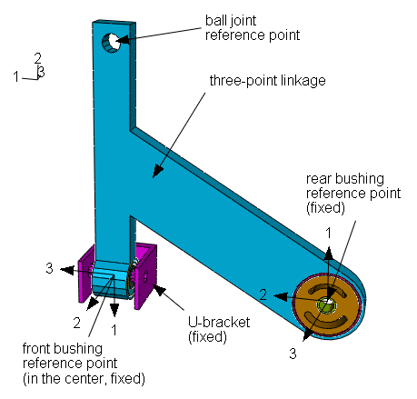
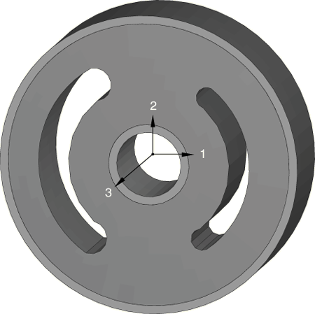
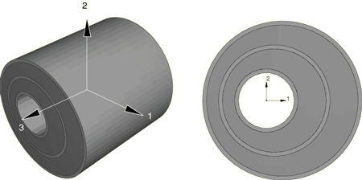
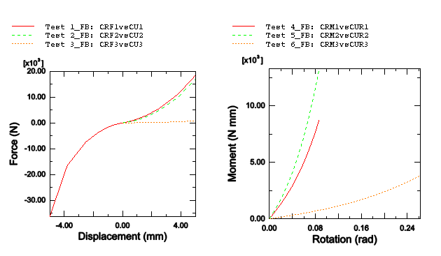
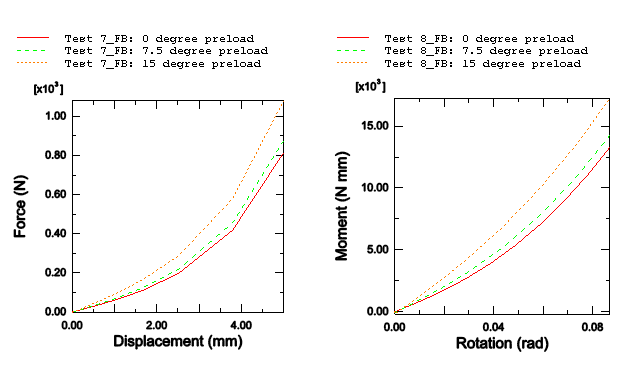
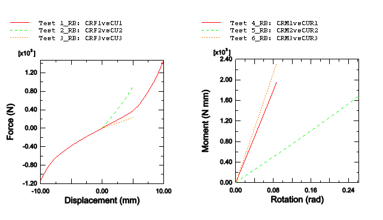
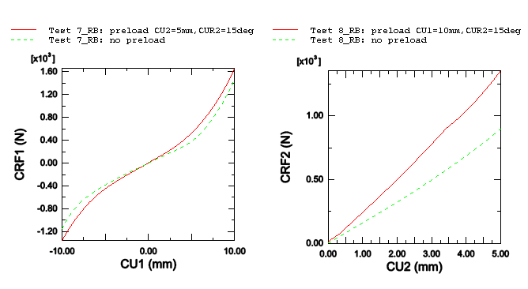
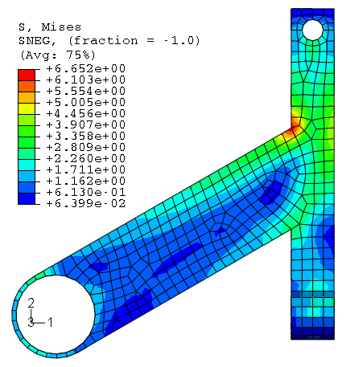
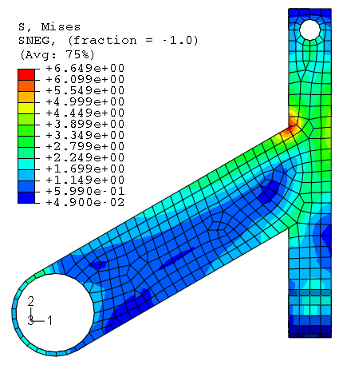
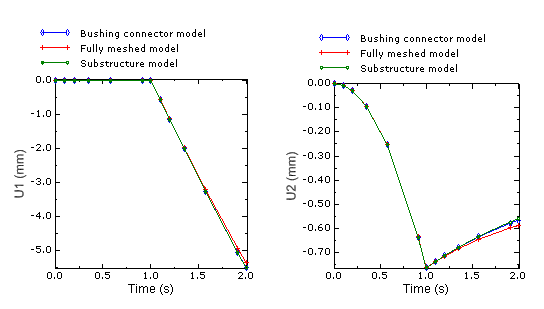

# 4.1.11 Application of bushing connectors in the analysis of a three-point linkage

**Products: **Abaqus/Standard  Abaqus/Explicit  

This example illustrates the use of detailed finite element bushing models to calibrate the constitutive behavior of bushings (when experimental data for a particular bushing design are not available) so that a very inexpensive 2-node connector element representation of the bushing can be used in subsequent analyses involving the bushing. This approach is effective in reducing computational costs in assembly models while accurately capturing the macroscopic response of the bushing. To demonstrate this approach, a three-point linkage is simulated with connector elements used to model bushings.

### Geometry and materials

The geometry of the three-point linkage (TPL) is shown in [Figure 4.1.11--1](ch04s01aex115.md#sxmbushing-lowerarmgeometry). Since the main focus of this example is to illustrate modeling of the bushings, a simplified representation of the TPL is used. The TPL is connected to the subframe (assumed fixed in space) via the front and rear bushings. A ball joint connects the TPL to a wheel assembly (not shown). The TPL is a steel shell structure and is modeled as a linear elastic material with Young's modulus of 2.1  105 MPa, Poisson's ratio of 0.3, and a density of 7.82  10–9 tonnes/mm3.

As shown in [Figure 4.1.11--2](ch04s01aex115.md#sxmbushing-reargeometry), the rear bushing is a hollow cylinder with a rubber portion enclosed between two (inner and outer) thin steel tubes. The rubber portion has two symmetrically placed cutouts of different sizes, and it is rigidly bonded to the steel tubes. The steel tubes are 2 mm thick and use the same material properties as the TPL. The inner diameter of this bushing is 28 mm, the outer diameter is 72 mm, and the axial length is 20 mm. The outer steel tube is connected to the TPL using a kinematic coupling. The inner tube is connected to a fixed node that represents a subframe using a distributed coupling. The rubber is modeled as a second-order Ogden hyperelastic material (["Hyperelastic behavior of rubberlike materials," Section 22.5.1 of the Abaqus Analysis User's Guide](../usb/usb-link.md#usb-mat-chyperelastic)), which may undergo nonlinear, finite deformation. The material parameters are  = 1.671,  = 9.0067,  = 2.154E4,  = –4.86970,  = 1.0, and  = 1.0. The material density is 1.5  10–9 tonnes/mm3.

The geometry of the front bushing is shown in [Figure 4.1.11--3](ch04s01aex115.md#sxmbushing-frontgeometry); it consists of three noncoaxial steel tubes with two rubber parts between them. The axial length of the bushing is 40 mm. The outer diameters of the three tubes are 40 mm, 28 mm, and 16 mm. All three tubes have a thickness of 1 mm. The outer steel tube is connected to the TPL using a kinematic coupling. The inner tube is connected to a fixed node that represents a U-shaped bracket. The front bushing uses the same rubber and steel materials as those used for the rear bushing.

### Models

To characterize the nonlinear constitutive behavior of the bushings, a series of static analyses of the front bushing are performed in Abaqus/Standard and a series of quasi-static analyses of the rear bushing are performed in Abaqus/Explicit. Self-contact occurs in the rear bushing analyses due to severe deformation. In all cases the reference node of the kinematic coupling connected to the outer steel tube is held fixed in all degrees of freedom, while the second reference node connected to the inner tube moves. For the calibration analyses, a BUSHING connector for which no constitutive behavior is defined is placed between the two reference nodes. The use of a BUSHING connector to drive the deformation in these models is desirable since this choice ensures appropriate kinematic and kinetic modeling when the connector is used in other models (such as a full-system analysis). Since the main interest is capturing the hyperelastic response of the rubber bushings, both unidirectional and coupled multidirectional tests (simultaneous deformations in up to three directions) are performed as summarized below. 

To analyze several loading conditions, some connector components of relative motion can be fixed and others can be prescribed nonzero motion. The reaction forces and relative motions in the connector are saved as history output. The data from these analyses are then used in a subsequent analysis of the three-point linkage assembly to define nonlinear connector elasticity data.

#### Front bushing calibration tests

For the front bushing, static analyses are performed in Abaqus/Standard as follows:

**Test 1_FB:**

A translational motion is applied in the local 1-direction with all other relative motions fixed. The motion is applied in the positive and negative directions separately since the front bushing is not symmetric with respect to the local 1-axis. The magnitude of this motion is 5 mm. The CRF1 vs. CU1 data generated from this analysis are used to define nonlinear elasticity data for component 1. 

**Test 2_FB:**

A translational motion is applied in the local 2-direction with all other relative motions fixed. The magnitude of this motion is 5 mm. The CRF2 vs. CU2 data generated from this analysis are used to define nonlinear elasticity data for component 2. 

**Test 3_FB:**

A translational motion is applied in the local 3-direction with all other relative motions fixed. The magnitude of this motion is 5 mm. The CRF3 vs. CU3 data generated from this analysis are used to define nonlinear elasticity data for component 3. 

**Test 4_FB:**

A 5 “bending” rotational motion about the local 1-direction is applied with all other relative motions fixed. The CRM1 vs. CUR1 data generated from this analysis are used to define nonlinear elasticity data for component 4.

**Test 5_FB:**

A 5 “bending” rotational motion about the local 2-direction is applied with all other relative motions fixed. The CRM2 vs. CUR2 data generated from this analysis are used to define nonlinear elasticity data for component 5.

**Test 6_FB:**

A 15 “twisting” rotational motion about the local 3-direction is applied with all other relative motions fixed. The CRM3 vs. CUR3 data generated from this analysis are used to define nonlinear elasticity data for component 6.

**Test 7_FB:**

A 5 mm displacement along the local 3-direction is applied about three preloaded configurations. The test attempts to capture coupling effects in the bushing after complex deformation is achieved. The preloaded configurations are:

1. A twisting of 0 about the local 3-direction.
2. A twisting of 7.5 about the local 3-direction.
3. A twisting of 15 about the local 3-direction.

This test is a collection of three two-step analyses. In each of the analyses a preload motion is applied in the first step, and the bending motion is applied in the second step. Assuming a hyperelastic-like quasi-static response in the bushing, for a given final coupled deformation, the deformation path is not relevant. Hence, the prestress and the actual loading steps can be run sequentially. The sets of CRF3 vs. CU3 data generated from the second steps of these analyses are used to define elasticity data for component 3 using independent component 6.

**Test 8_FB:**

A 5 bending motion about the local 2-direction is applied about three preloaded configurations. The test attempts to capture coupling effects in the bushing after complex deformation is achieved. The preloaded configurations are:

1. A twisting of 0 about the local 3-direction.
2. A twisting of 7.5 about the local 3-direction.
3. A twisting of 15 about the local 3-direction.

This test is a collection of three two-step analyses. In each of the analyses a preload motion is applied in the first step, and the bending motion is applied in the second step. Assuming a hyperelastic-like quasi-static response in the bushing, the deformation path is not relevant for a given final coupled deformation. Hence, the prestress and the actual loading steps can be run sequentially. The sets of CRM2 vs. CUR2 data generated from the second steps of these analyses are used to define elasticity data for component 5 using independent component 6.

Force vs. displacement and moment vs. rotation curves are shown in [Figure 4.1.11--4](ch04s01aex115.md#exa-veh-bushing-fb-uncoupled) for the cases without preload (Tests 1_FB to 6_FB) and in [Figure 4.1.11--5](ch04s01aex115.md#exa-veh-bushing-fb-coupled) for the cases with preload (Tests 7_FB and 8_FB).

Script files were generated to automatically create the input files and run the analyses for the uncoupled tests and each of the coupled tests. These scripts essentially build up a CROSS design parametric study for the uncoupled tests and a MESH design for the coupled tests (see ["Scripting parametric studies," Section 20.1.1 of the Abaqus Analysis User's Guide](../usb/usb-link.md#usb-scr-pscriptparstudies)).

#### Rear bushing calibration tests

For the rear bushing, quasi-static analyses are performed in Abaqus/Explicit as follows:

**Test 1_RB:**

A translational motion is applied in the local 1-direction with all other relative motions fixed. The magnitude of this motion is 10 mm. The CRF1 vs. CU1 data generated from this analysis are used to define nonlinear elasticity data for component 1.

**Test 2_RB:**

A translational motion is applied in the local 2-direction with all other relative motions fixed. The magnitude of this motion is 5 mm. The CRF2 vs. CU2 data generated from this analysis are used to define nonlinear elasticity data for component 2.

**Test 3_RB:**

A translational motion is applied in the local 3-direction with all other relative motions fixed. The magnitude of this motion is 5 mm. The CRF3 vs. CU3 data generated from this analysis are used to define nonlinear elasticity data for component 3.

**Test 4_RB:**

A 5 “bending” rotational motion about the local 1-direction is applied with all other relative motions fixed. The CRM1 vs. CUR1 data generated from this analysis are used to define nonlinear elasticity data for component 4.

**Test 5_RB:**

A 15 “bending” rotational motion about the local 2-direction is applied with all other relative motions fixed. The CRM2 vs. CUR2 data generated from this analysis are used to define nonlinear elasticity data for component 5.

**Test 6_RB:**

A 5 “twisting” rotational motion about the local 3-direction is applied with all other relative motions fixed. The CRM3 vs. CUR3 data generated from this analysis are used to define nonlinear elasticity data for component 6.

**Test 7_RB:**

A 10 mm displacement in the local 1-direction is applied about several preloaded configurations. The displacement is applied in the positive and negative directions separately since the rear bushing is not symmetric with respect to the local 1-axis. The test attempts to capture coupling effects in the bushing after complex deformation is achieved. The preloaded configurations are a combination of a displacement in the local 2-direction and a rotation about the local 2-direction for which the following design points were selected:

1. A displacement of 0.0 mm in the local 2-direction.
2. A displacement of 2.5 mm in the local 2-direction.
3. A displacement of 5.0 mm in the local 2-direction.
4. A 0 "bending" rotational motion about the local 2-direction.
5. A 7.5 "bending" rotational motion about the local 2-direction.
6. A 15 "bending" rotational motion about the local 2-direction.

This test is a collection of 18 two-step analyses. In each of the analyses two preload motions are applied in the first step, and the translational motion in the local 1-direction is applied in the second step. Assuming a hyperelastic-like quasi-static response in the bushing, the deformation path is not relevant for a given final coupled deformation. Hence, the prestress and the actual loading steps can be run sequentially. The sets of CRF1 vs. CU1 data generated from the second steps of these analyses are used to define elasticity data for component 1 using independent components 2 and 5.

**Test 8_RB:**

A 5 mm displacement in the local 2-direction is applied about several preloaded configurations. The test attempts to capture coupling effects in the bushing after complex deformation is achieved. The preloaded configurations are a combination of a displacement in the local 1-direction (positive and negative loadings are considered separately due to asymmetry) and a rotation about the local 2-direction, for which the following design points were selected:

1. A displacement of --10.0 mm in the local 1-direction.
2. A displacement of --5.0 mm in the local 1-direction.
3. A displacement of 0.0 mm in the local 1-direction.
4. A displacement of 5.0 mm in the local 1-direction.
5. A displacement of 10.0 mm in the local 1-direction.
6. A 0 "bending" rotational motion about the local 2-direction.
7. A 7.5 "bending" rotational motion about the local 2-direction.
8. A 15 "bending" rotational motion about the local 2-direction.

This test is a collection of 15 two-step analyses. In each of the analyses two preload motions are applied in the first step, and the translational motion in the local 2-direction is applied in the second step. Assuming a hyperelastic-like quasi-static response in the bushing, the deformation path is not relevant for a given final coupled deformation. Hence, the prestress and the actual loading steps can be run sequentially. The sets of CRF2 vs.CU2 data generated from the second steps of these analyses are used to define elasticity data for component 2 using independent components 1 and 5.

Force vs. displacement and moment vs. rotation curves are shown in [Figure 4.1.11--6](ch04s01aex115.md#exa-veh-bushing-rb-uncoupled) for the cases without preload (Tests 1_RB to 6_RB). [Figure 4.1.11--7](ch04s01aex115.md#exa-veh-bushing-rb-coupled)  shows a comparison of the force vs. displacement with no preload and with the most extreme preload conditions for Tests 7_RB and 8_RB.

Script files were generated to automatically create the input files and run the analyses for the uncoupled tests and each of the coupled tests. As in the case of the front bushing, these scripts essentially build up a CROSS design parametric study for the uncoupled tests and a MESH design for the coupled tests. Furthermore, Python files were created to automatically gather the force vs. displacement data points and to create corresponding report files. 

#### Additional comments on calibration tests

Since each bushing has several symmetry planes, the tests above (unless specified otherwise) are conducted only for positive relative motions when the responses in the opposite directions are symmetric. Therefore, nonlinear elasticity data are generated only for positive relative motions for those cases. Nonlinear elasticity is defined for negative relative motions by symmetrizing the elasticity data with respect to the origin.

The analyses chosen above are deemed appropriate to generate the necessary and complete nonlinear elasticity data to enable BUSHING connectors to represent the front and rear bushings in subsequent analyses of the TPL. The quasi-static analyses were run over sufficiently large motion ranges to cover the motion range expected in the analysis where the BUSHING connector is used. Nonlinear elasticity data are generated in all six relative uncoupled directions in the BUSHING connector. For the front bushing, elasticity data are generated (Tests 7_FB and 8_FB) for two coupled deformation modes (involving two components of local motion each) that were thought to be the dominant coupling modes in the subsequent analysis where the BUSHING connectors are used. For the rear bushing, elasticity data are generated (Tests 7_RB and 8_RB) for two coupled deformation modes (involving three components of local motion each) that were thought to be the dominant coupling modes in the subsequent analysis where the BUSHING connectors are used. In general, the number and complexity of coupled deformation tests can be increased to match any particular modeling needs.

#### TPL models

Three different models are created for the analysis of the three-point linkage system: a fully meshed model, a bushing connector model, and a substructure model. They all model the TPL using the front and rear bushings to connect to the subframe (not modeled) that is assumed to be fixed in space. Loads are applied to a reference point where the ball joint is attached to model loads that the wheel assembly would exert on the TPL. The constraint imposed by the fixed subframe is modeled in all three cases by constraining the motion of the inner cylinder distributed coupling reference node in all six degrees of freedom.

In the fully meshed model the linkage itself is modeled using shell elements, while the front and rear bushings are modeled using continuum elements. The front bushing is connected to the reference node of a U-bracket that is modeled as a rigid body (see [Figure 4.1.11--1](ch04s01aex115.md#sxmbushing-lowerarmgeometry)). The rigid body reference node of the U-bracket is held fixed in all six degrees of freedom.

In the bushing connector model the bushings in the fully meshed model are replaced with BUSHING connectors. The constitutive data for the connectors are obtained from the series of tests described above. The front bushing is connected to the reference node of a U-bracket that is modeled as a rigid body (see [Figure 4.1.11--1](ch04s01aex115.md#sxmbushing-lowerarmgeometry)). The rigid body reference node of the U-bracket is held fixed in all six degrees of freedom.

In the substructure model the three-point linkage is modeled with a substructure, and the bushings are modeled with connector elements as defined in the bushing connector model. For clarity, the U-bracket is not represented in the substructure model since it is considered to be rigid and fixed. The rear bushing inner cylinder is connected to the subframe via a large bolt. 

Two load cases are applied in all three models:

**Load case 1:**

A geometrically nonlinear, single-step, static analysis is performed where a concentrated force of 250 N is applied at the ball joint reference node in the negative global 1-direction. The analysis models a horizontal load at the ball joint.

**Load case 2:**

A geometrically nonlinear, two-step, static analysis is performed. In the first step the TPL is lifted by 10 about the global 1-direction by applying a displacement boundary condition of 20 mm to the ball joint reference node in the negative global 3-direction. In the second step a concentrated force of 250 N is applied at the ball joint reference node in the negative global 1-direction. The analysis models a horizontal load on the ball joint as the wheel and, hence, the ball joint go over a bump.

### Results and discussion

 It can be seen from the results of Tests 7_FB and 8_FB ([Figure 4.1.11--5](ch04s01aex115.md#exa-veh-bushing-fb-coupled)) that the front bushing behavior in both the local 3-direction and about the local 2-direction is affected significantly by the amount of preload about the local 3-direction. For the rear bushing it can be seen from the results of Tests 7_RB and 8_RB ([Figure 4.1.11--7](ch04s01aex115.md#exa-veh-bushing-rb-coupled)) that the behavior in the local 1-direction and especially the behavior in the local 2-direction are affected significantly by the amount of the combined preload (in the local 2-direction and about the local 2-direction for Test 7_RB, and in the local 1-direction and about the local 2-direction for Test 8_RB).

The Mises stresses in the TPL calculated for each of the three modeling approaches are very similar, as shown in [Figure 4.1.11--8](ch04s01aex115.md#exa-veh-bushing-mises-full), [Figure 4.1.11--9](ch04s01aex115.md#exa-veh-bushing-mises-conn), and [Figure 4.1.11--10](ch04s01aex115.md#exa-veh-bushing-mises-substr). In addition, displacement histories at the ball joint (where the loading was applied) show very good agreement between the three models ([Figure 4.1.11--11](ch04s01aex115.md#exa-veh-bushing-balljoint-displacement)). As expected, the bushing connector model analysis and the substructure model analysis produced identical displacements at the ball joint. When compared with the fully meshed model, the differences for the displacement histories in both directions are 4% toward the end of the curves.

The main motivation to use the BUSHING connector in this and similar applications is to reduce the complexity of the models and the computation time. In this TPL analysis the fully meshed model analysis takes approximately 50 times longer than the analysis that uses connectors to model the bushings. Furthermore, the substructure model analysis completes in about one-eighth of the time required for the analysis that uses connectors to model the bushings, approximately 400 times faster than the original fully meshed model. 

In summary, this example demonstrates significant improvement in analysis efficiency when bushings are modeled with pre-calibrated BUSHING connectors or substructures without sacrificing accuracy.

### Files

[tpl_fb_uncoupled.inp](../eif/tpl_fb_uncoupled.inp)

Front bushing model template used for generating constitutive data curves for all tests without preload.

[tpl_fb_uncoupled.psf](../eif/tpl_fb_uncoupled.psf)

Python script file to automatically generate input files and run analyses for all tests without preload.

[tpl_fb_CRF3vsCU3.inp](../eif/tpl_fb_CRF3vsCU3.inp)

Front bushing model template used for generating constitutive data curves for Test 7_FB.

[tpl_fb_CRF3vsCU3.psf](../eif/tpl_fb_CRF3vsCU3.psf)

Python script file to automatically generate input files and run analyses for Test 7_FB.

[tpl_fb_CRM2vsCUR2.inp](../eif/tpl_fb_CRM2vsCUR2.inp)

Front bushing model template used for generating constitutive data curves for Test 8_FB.

[tpl_fb_CRM2vsCUR2.psf](../eif/tpl_fb_CRM2vsCUR2.psf)

Python script file to automatically generate input files and run analyses for Test 8_FB.

[tpl_rb_uncoupled.inp](../eif/tpl_rb_uncoupled.inp)

Rear bushing model template used for generating constitutive data curves for all tests without preload.

[tpl_rb_uncoupled.psf](../eif/tpl_rb_uncoupled.psf)

Python script file to automatically generate input files and run analyses for tests without preload.

[tpl_rb_CRF1vsCU1.inp](../eif/tpl_rb_CRF1vsCU1.inp)

Rear bushing model template used for generating constitutive data curves for Test 7_RB.

[tpl_rb_CRF1vsCU1.psf](../eif/tpl_rb_CRF1vsCU1.psf)

Python script file to automatically generate input files and run analyses for Test 7_RB.

[tpl_rb_CRF2vsCU2.inp](../eif/tpl_rb_CRF2vsCU2.inp)

Rear bushing model template used for generating constitutive data curves for Test 8_RB.

[tpl_rb_CRF2vsCU2.psf](../eif/tpl_rb_CRF2vsCU2.psf)

Python script file to automatically generate input files and run analyses for Test 8_RB.

[tpl_const_data_ext-rb_CRF1vsCU1.py](../eif/tpl_const_data_ext-rb_CRF1vsCU1.py)

Python file to automatically gather force vs. displacement results for Test 7_RB.

[tpl_const_data_ext-rb_CRF2vsCU2.py](../eif/tpl_const_data_ext-rb_CRF2vsCU2.py)

Python file to automatically gather force vs. displacement results for Test 8_RB.

[tpl_full_loadcase1.inp](../eif/tpl_full_loadcase1.inp)

Fully meshed model analysis for Load case 1.

[tpl_full_loadcase2.inp](../eif/tpl_full_loadcase2.inp)

Fully meshed model analysis for Load case 2.

[tpl_connectors_loadcase1.inp](../eif/tpl_connectors_loadcase1.inp)

Bushing connector model analysis for Load case 1.

[tpl_connectors_loadcase2.inp](../eif/tpl_connectors_loadcase2.inp)

Bushing connector model analysis for Load case 2.

[tpl_substructure_gen.inp](../eif/tpl_substructure_gen.inp)

Substructure generation analysis for the three-point linkage.

[tpl_substructure_loadcase1.inp](../eif/tpl_substructure_loadcase1.inp)

Substructure model analysis for Load case 1.

[tpl_substructure_loadcase2.inp](../eif/tpl_substructure_loadcase2.inp)

Substructure model analysis for Load case 2.

### Figures

**Figure 4.1.11–1** Three-point linkage (TPL) assembly.

**Figure 4.1.11–2** Rear bushing geometry.

**Figure 4.1.11–3** Front bushing geometry.

**Figure 4.1.11–4** Front bushing coupled force vs. displacement and moment vs. rotation curves without preload.

**Figure 4.1.11–5** Front bushing coupled force vs. displacement and moment vs. rotation curves with preload.

**Figure 4.1.11–6** Rear bushing force vs. displacement and moment vs. rotation curves without preload.

**Figure 4.1.11–7** Comparison of rear bushing coupled force vs. displacement for Tests 7_RB and 8_RB.

**Figure 4.1.11–8** Mises stresses in the TPL for the fully meshed model (Load case 2).

**Figure 4.1.11–9** Mises stresses in the TPL for the bushing connector model (Load case 2).

**Figure 4.1.11–10** Mises stresses in the TPL for the substructure model (Load case 2).

**Figure 4.1.11–11** Comparison of displacements at the ball joint reference node (Load case 2).

