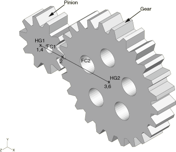
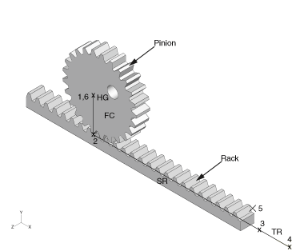
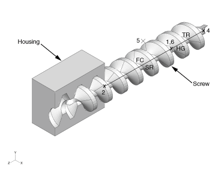
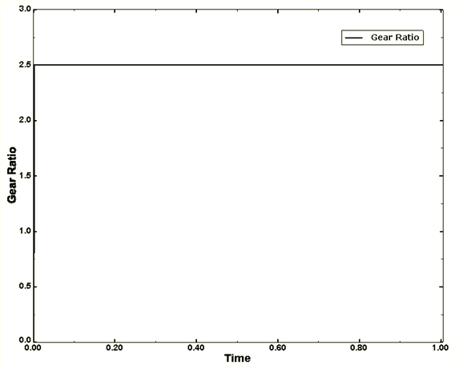
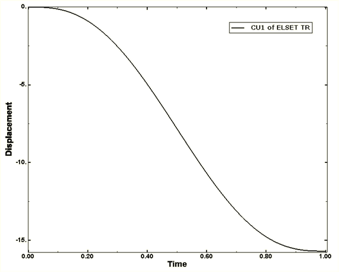
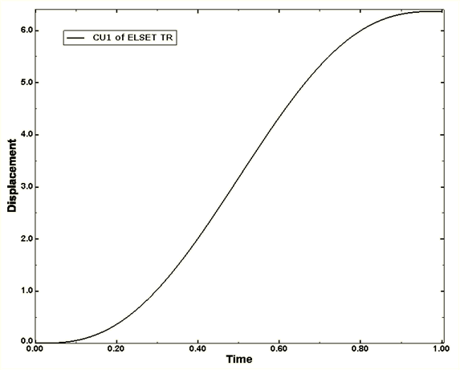

# 4.1.12 Gear assemblies

**Product: **Abaqus/Explicit  

### Objectives

This example illustrates the use of connectors in modeling the kinematics of gear assemblies.

### Application description

Gears are widely used in a variety of machinery to transfer torque (rotational motion) from one shaft to another shaft and to act as a means to change the torque (rotational speed) acting on a shaft. Three types of gear assemblies (spur gear assembly, rack and pinion mechanism, and screw gear assembly) are studied in this example with a focus on the proper transmission of torque and rotational motion between the gears. The units used are millimeters-tonnes-seconds.

### Geometry

**Spur gears**

A spur gear assembly consists of a driving gear (labeled `Pinion`) with input torque acting on it and a driven gear (labeled `Gear`) that receives the torque from the pinion, as shown in [Figure 4.1.12--1](ch04s01aex116.md#exa-mec-spur-gear1-nls). In this example the gear ratio is chosen as 2.5; i.e., the gear has 2.5 times more teeth than the pinion and, hence, it rotates 2.5 times slower than the pinion. To measure the power transmission in the gear system, a linear torsional spring is placed on each shaft such that the ratio of their elastic constants is the square of the ratio of the gear radius on the respective shaft. The whole gear assembly is mounted on a single rigid body whose reference node is constrained to prevent rigid body motion. The pitch circle radius of the pinion and the gear is 1.04573 units and 2.61433 units, respectively, as marked by the position of node 2 in [Figure 4.1.12--1](ch04s01aex116.md#exa-mec-spur-gear1-nls). The elastic constant of the torsional spring on the pinion shaft is chosen as 1 unit while that on the gear shaft, as calculated from the gear ratio, is 6.25 units.

**Rack and pinion**

A rack and pinion mechanism is a special case of the spur gear assembly with one of the gears having an infinite radius. The mechanism consists of a spinning pinion pulling the rack toward itself, as shown in [Figure 4.1.12--2](ch04s01aex116.md#exa-mec-rack-pinion1-nls). A groove is provided to guide the movement of the rack. The whole rack and pinion assembly is mounted on a rigid body whose reference node is constrained to prevent any rigid body motion. The pitch circle radius of the pinion is 2.5 units.

**Screw gear and housing**

A screw gear mechanism is similar to a rack and pinion mechanism except that the translational motion takes place along the axis of rotation of the gear, as shown in [Figure 4.1.12--3](ch04s01aex116.md#exa-mec-screw-gear1-nls). As in the case of the rack and pinion arrangement, a slot guides the direction of the motion of the screw. The screw gear and housing assembly is mounted on a rigid body whose reference node is constrained to prevent any rigid body motion. The motion involves turning the screw one complete revolution as it runs along the grooves of the screw thread of a fixed housing. The screw has a radius of 1.5 units and a pitch of 2 units. 

### Abaqus modeling approaches and simulation techniques

This example illustrates the use of connectors for modeling gear assemblies in Abaqus/Explicit. The focus in this example is purely on the kinematics of gears without the consideration of gear-teeth forces.

### Summary of analysis cases

| Case 1: Spur gears | A rotating pinion driving a gear. |
| --- | --- |
| Case 2: Rack and pinion | A rotating pinion pulling a rack guided in a slot. |
| Case 3: Screw gear | A rotating screw moving through a groove in a housing. |

### Mesh design

All three cases of gear assemblies use CONN3D2 elements with the section behavior defined in detail in the following sections.

### Case 1: Spur gears

This case illustrates using connectors to model the kinematics of a spur gear assembly.

### Mesh design

Each spur gear is modeled using one CONN3D2 element with connection type HINGE and one CONN3D2 element with connection type FLOW-CONVERTER.

### Material model

The HINGE of the pinion has a torsional stiffness of 1 unit, and the HINGE of the gear has a torsional stiffness of 6.25 units.

### Boundary conditions

 The first nodes of both HINGEs are fixed. The second node of the HINGE of the pinion is driven by 18.85 radians.

### Interactions

As shown in [Figure 4.1.12--1](ch04s01aex116.md#exa-mec-spur-gear1-nls), the pinion and gear are each modeled with a HINGE and a FLOW-CONVERTER sharing a node (nodes 1 and 3, respectively). Nodes 1 and 3 of HINGEs `HG1` and `HG2`, respectively, are free to rotate, whereas their second nodes (node 4 and 6, respectively) form a rigid body along with node 5 (reference node). This rigid body has all of its degrees of freedom fixed to prevent overall rigid body motion of the gear system. 

The second node of FLOW-CONVERTERs `FC1` and `FC2` is common (node 2) with all of its rotations fixed. Any relative rotation in HINGE `HG1` causes material flow at node 2 of FLOW-CONVERTER `FC1`. The gear mechanism formed by HINGE `HG2` and FLOW-CONVERTER `FC2` mirrors the pinion mechanism formed by FLOW-CONVERTER `FC1` and HINGE `HG1`. Thus, any material flow at common node 2 of FLOW-CONVERTER `FC2` results in a relative rotational motion between the two nodes of HINGE `HG2`. 

The gear ratio of 2.5 is maintained by defining the scaling factor β (with proper sign) in FLOW-CONVERTERs `FC1` and `FC2`; for this case, the scaling factors are 1.0 and 0.4, respectively. The display bodies of the gear and pinion have reference nodes 10 and 11, respectively, that form a rigid body with the respective unconstrained nodes of HINGEs `HG1` and `HG2`.

### Case 2: Rack and pinion

This case illustrates using connectors to model the kinematics of a rack and pinion mechanism.

### Mesh design

The pinion is modeled using one CONN3D2 element with connection type HINGE and one CONN3D2 element with connection type FLOW-CONVERTER. The rack is modeled using one CONN3D2 element with connection type SLIPRING. The groove in which the rack moves is modeled using one CONN3D2 element with connection type TRANSLATOR.

### Material model

Both the HINGE and the SLIPRING are defined as rigid elastic.

### Boundary conditions

 The first nodes of the HINGE and TRANSLATOR are fixed. Degree of freedom 10 of the common node of the SLIPRING and TRANSLATOR is also fixed. The second node of the HINGE of the pinion is driven by 6.28 radians.

### Interactions

The rack and pinion mechanism, as shown in [Figure 4.1.12--2](ch04s01aex116.md#exa-mec-rack-pinion1-nls), is modeled similarly to the spur gears described in Case 1. The pinion is modeled with HINGE `HG` (nodes 1 and 6) and FLOW-CONVERTER `FC` (nodes 1 and 2) that share a common node (node 1). The rack is modeled with a SLIPRING `SR` (nodes 2 and 3) and TRANSLATOR `TR` (nodes 4 and 3) that is used to guide the motion of SLIPRING `SR`. SLIPRING `SR` and FLOW-CONVERTER `FC` share a common node (node 2). 

Nodes 2, 4, and 6 are part of a rigid body with reference node 5 that is constrained to prevent any rigid body motion of the rack and pinion system. A fixed boundary condition on degree of freedom 10 is imposed at node 3 of SLIPRING `SR` to prevent any material flow past this node. Any relative rotation between nodes 1 and 6 of HINGE `HG` results in material flow at node 2 of FLOW-CONVERTER `FC`. This material flow at node 2 results in tension in the adjoining SLIPRING `SR` that drives the rack. 

The relation between the translational motion of the rack and the rotational motion of the pinion is maintained by defining the scaling factor β (with proper sign) of FLOW-CONVERTER `FC`; for this case, the scaling factor is 0.4. As mentioned before, the motion of the rack occurs parallel to the axis of the TRANSLATOR `TR`, and it can be measured via the connector displacement of TRANSLATOR `TR`. In this example available component 4 in HINGE `HG` and available component 1 in SLIPRING `SR` are both defined as rigid elastic. The display bodies of the rack and pinion have reference nodes 10 and 11, respectively, that form a rigid body with the respective unconstrained nodes of SLIPRING `SR` and HINGE `HG`.

### Case 3: Screw gear

This case illustrates using connectors to model the kinematics of a screw gear and housing assembly.

### Mesh design

The screw is modeled using one CONN3D2 element with connection type HINGE, one CONN3D2 element with connection type FLOW-CONVERTER, and one CONN3D2 element with connection type SLIPRING. The groove in which the screw moves is modeled using a CONN3D2 element with connection type TRANSLATOR.

### Material model

Both the HINGE and the SLIPRING are defined as rigid elastic.

### Boundary conditions

 The first nodes of the TRANSLATOR are fixed. Degree of freedom 10 of the common node of the SLIPRING and TRANSLATOR is also fixed. The second node of the HINGE of the screw is driven by 20 radians.

### Interactions

The screw gear system, as shown in [Figure 4.1.12--3](ch04s01aex116.md#exa-mec-screw-gear1-nls), is modeled similarly to the rack and pinion system described in Case 2. The screw is modeled with HINGE `HG` (nodes 6 and 1), FLOW-CONVERTER `FC` (nodes 1 and 2), and SLIPRING `SR` (nodes 2 and 3). The housing is modeled with TRANSLATOR `TR` (nodes 4 and 3). HINGE `HG` and FLOW-CONVERTER `FC` share a common node (node 1). SLIPRING `SR` and FLOW-CONVERTER `FC` share node 2. 

Nodes 2, 4, and 11 are part of a rigid body with reference node 5 that is constrained to prevent any rigid body motion of the housing. Material flow at node 3 of the SLIPRING is prevented via a fixed boundary condition on degree of freedom 10. Similar to the rack and pinion mechanism, the relative rotation between nodes 1 and 6 of HINGE `HG` results in material flow at node 2 of FLOW-CONVERTER `FC`. This material flow at node 2 causes tension in the belt of SLIPRING `SR`, resulting in a translational displacement of node 3. Nodes 3 and 6 are tied together as a rigid body and, hence, the translational motion of node 3 results in the linear motion of the screw. The rotational motion of the screw is identical to the rotational motion of node 1. 

The scaling factor β of FLOW-CONVERTER `FC` is defined to scale the rotational motion of node 1 in relation to its translational motion; for this case, the scaling factor is 3.14. As in the case of the rack and pinion mechanism, TRANSLATOR `TR` guides the direction of the motion of the screw. Available component 1 in SLIPRING `SR` is defined as rigid elastic. The display bodies of the screw and the housing have reference nodes 10 and 11, respectively, that form a rigid body with the respective unconstrained nodes of HINGE `HG` and SLIPRING `SR`.

### Discussion of results and comparison of cases

**Case 1: Spur gears**

The pinion shaft is given an angular displacement of 18.85 radians by defining connector motion in HINGE `HG1`. The final angular displacement of the gear shaft is measured to be 7.54 radians, with the gear ratio holding at 2.5 throughout the analysis duration, as shown in [Figure 4.1.12--4](ch04s01aex116.md#exa-mec-spur-gear2). The ratio of the input to output power, which is calculated by taking the product of connector moment CTM1 and connector motion CUR1 of the respective HINGEs, is also found to be constant.

**Case 2: Rack and pinion**

The pinion is rotated one complete revolution by defining connector motion in HINGE `HG`. The rack moves 15.7 units, measured by CU1 of TRANSLATOR `TR` in [Figure 4.1.12--5](ch04s01aex116.md#exa-mec-rack-pinion2). This distance is the same as the circumference of the pitch circle of the pinion.

**Case 3: Screw gear**

The screw is given an angular rotation of 20 radians by defining connector motion in HINGE `HG`. The screw moves 6.37 units, measured by CU1 of TRANSLATOR `TR` as shown in [Figure 4.1.12--6](ch04s01aex116.md#exa-mec-screw-gear2). 

### Input files

[spur_gear.inp](../eif/spur_gear.inp)

Spur gear assembly.

[rack_pinion.inp](../eif/rack_pinion.inp)

Rack and pinion assembly.

[screw_gear.inp](../eif/screw_gear.inp)

Screw gear assembly.

### Figures

**Figure 4.1.12–1** Spur gear assembly.

**Figure 4.1.12–2** Rack and pinion assembly.

**Figure 4.1.12–3** Screw gear assembly.

**Figure 4.1.12–4** Ratio of angular displacement of the pinion (CUR1 of HINGE `HG1`) to that of the gear (CUR1 of HINGE `HG2`).

**Figure 4.1.12–5** Displacement of the rack (CU1 of TRANSLATOR `TR`).

**Figure 4.1.12–6** Displacement of the screw (CU1 of TRANSLATOR `TR`).

