# 5.1.1 Thermal-stress analysis of a disc brake

**Products: **Abaqus/Standard  Abaqus/Explicit  

Disc brakes operate by pressing a set of composite material brake pads against a rotating steel disc: the frictional forces cause deceleration. The dissipation of the frictional heat generated is critical for effective braking performance. Temperature changes of the brake cause axial and radial deformation; and this change in shape, in turn, affects the contact between the pads and the disc. Thus, the system should be analyzed as a fully coupled thermo-mechanical system.

In this section two thermally coupled disc brake analysis examples are discussed. The first example is an axisymmetric model in which the brake pads and the frictional heat generated by braking are “smeared” out over all 360 of the model. This problem is solved using only Abaqus/Standard. The heat generation is supplied by user subroutine [`FRIC`](../sub/sub-link.md#sub-xsl-fric), and the analysis models a linear decrease in velocity as a result of braking.

The second example is a three-dimensional model of the entire disc with pads touching only part of the circumference. The disc is rotated so that the heat is generated by friction. This problem is solved using both Abaqus/Standard and Abaqus/Explicit.

It is also possible to perform uncoupled analysis of a brake system. The heat fluxes can be calculated and applied to a thermal model; then the resulting temperatures can be applied to a stress analysis. However, since the thermal and stress analyses are uncoupled, this approach does not account for the effect of the thermal deformation on the contact which, in turn, affects the heat generation.

Another type of geometrical model for a disc brake is used by Gonska and Kolbinger (1993). They model a “vented” disc brake ([Figure 5.1.1--1](ch05s01aex117.md#sxmdiskbrake-design)) and take advantage of radial repetition by modeling a pie-slice segment ([Figure 5.1.1--2](ch05s01aex117.md#sxmdiskbrake-modelseg)). Like the axisymmetric model, this requires the effect of the pads to be smeared, but it allows the modeling of radial cooling ducts while still reducing the model size relative to a full model.

### Geometry and model

Both models analyzed in this example have solid discs, which allows the models to use coarser meshes than would be required to model the detail of a typical disc brake that has complicated geometrical features such as cooling ducts and bolt holes. The first example further simplifies the model by considering the pads to be “smeared” around the entire 360 so that the system is axisymmetric. The second example is a full three-dimensional model of the entire annular disc with pads touching only part of the circumference. However, the geometry of the disc has been simplified by making it symmetrical about a plane normal to the axis. Therefore, only half of the disc and one brake pad is modeled, and symmetry boundary conditions are applied.

The dimensions of the axisymmetric model are taken from a typical car disc brake. The disc has a thicker friction ring connected to a conical section that, in turn, connects to an inner hub. The inner radius of the friction ring is 100.0 mm, the outer radius is 135.0 mm, and it is 10.0 mm thick. The conical section is 32.5 mm deep and 5.0 mm thick. The hub has an inner radius of 60.0 mm, an outer radius of 80.0 mm, and is 5.0 mm thick. The pads are 20.0 mm thick and initially cover the entire friction ring surface.

Two analyses of the axisymmetric model are performed in which the pads and disc are modeled using fully integrated and reduced-integration linear axisymmetric elements. Reduced integration is attractive because it decreases the analysis cost and, at the same time, provides more accurate stress predictions. Frictional contact between the pads and the disc is modeled by contact pairs between surfaces defined on the element faces in the contact region. Small sliding is assumed. The mesh is shown in [Figure 5.1.1--3](ch05s01aex117.md#sxmdiskbrake-aximesh), with the pads drawn in a darker gray than the disc. There are six elements through the thickness of the friction ring and four elements through the thickness of each of the pads. The mesh is somewhat coarse but is optimized by using thinner elements near the surfaces of the disc and pads where contact occurs for better resolution of the thermal gradients in these areas.

The disc for the three-dimensional model has an outer radius of 135.0 mm, an inner radius of 90.0 mm, and a thickness of 10.0 mm (the half-model has a thickness of 5.0 mm). The ring has a thinner section out to a radius of 100.0 mm, which has a thickness of 6.0 mm (the half-model has a thickness of 3.0 mm). The pad is 10.0 mm thick and covers a little less than one-tenth the circumference. The pad does not quite reach to the edge of the thicker part of the friction ring.

The pad and disc of the three-dimensional model are modeled with C3D8T elements in Abaqus/Standard and with C3D8RT elements in Abaqus/Explicit; the contact and friction between the pad and the disc are modeled by contact pairs between surfaces defined on the element faces in the contact region. The same mesh is used in both Abaqus/Standard and Abaqus/Explicit. It is shown in [Figure 5.1.1--4](ch05s01aex117.md#sxmdiskbrake-3dmesh), with the pad drawn in a darker gray than the disc. The disc is a simple annulus with a thinner inner ring. This mesh is also rather coarse with only three elements through the thickness of the disc and three elements through the pad. The elements on the contact sides are thinner since they will be in the areas of higher thermal gradients. There are 36 elements in the circumferential direction of the disc.

### Material properties

The thermal mechanical properties for the axisymmetric model were taken from a paper by Day and Newcomb (1984) describing the analysis of an annular disc brake. The pad is made of a resin-bonded composite friction material, and the disc is made of steel. Although Day and Newcomb note that material changes occur in the pad material because of thermal degradation, the pad in the axisymmetric model has the properties of the unused pad material. For the axisymmetric model the modulus, density, conductivity, and coefficient of friction are divided by 18 since the pads actually cover only a 20 section of the disc, even though they are modeled as being smeared around the entire circumference.

The pad for the three-dimensional model is also a resin-bonded composite friction material whose thermal mechanical properties are listed in [Table 5.1.1--1](ch05s01aex117.md#table-thermmechprops) and coefficient of friction is listed in [Table 5.1.1--2](ch05s01aex117.md#table-braketemp). The properties were taken from a paper by Day (1984). It is noted that above certain temperatures, approximately 400C, the pad material becomes thermally degraded and  is assumed constant from this point on.

It is assumed that all the frictional energy is dissipated as heat and distributed equally between the disc and the pad; therefore, the fraction of dissipated energy caused by friction that is converted to heat is set to 1.0, and the default distribution is used. This fractional value allows the user to specify an unequal distribution, which is particularly important if the heat conduction across the interface is poor. In this example the conductivity value specified with the gap conductance is quite high; hence, the results are not very sensitive to changes in distribution. In Abaqus/Explicit arbitrarily high gap conductivity values may cause the stable time increment associated with the thermal part of the problem to control the time incrementation, possibly resulting in a very inefficient analysis. In this problem the gap conductivity value used in the Abaqus/Explicit simulation is 20 times smaller than the one used in the Abaqus/Standard simulation. This allows the stable time increment associated with the mechanical part of the problem to control the time incrementation, thus permitting a more efficient solution while hardly affecting the results.

### Loading

The pads of the axisymmetric model are first pressed against the disc. The magnitude of the load is divided by 18 since the pads are not actually axisymmetric. The frictional forces are then applied through user subroutine [`FRIC`](../sub/sub-link.md#sub-xsl-fric) to simulate a linear decrease in velocity of the disc relative to the pads. The braking is done over three steps; then, when the velocity is zero, a final step shows the continued heat conduction through the model.

The pad of the three-dimensional model is fixed in the nonaxial degrees of freedom and is pressed against the disc with a distributed load applied to the back of the pad. In Abaqus/Standard the disc is then rotated by 60 using an applied boundary condition to the center ring. In Abaqus/Explicit this boundary condition is prescribed using smooth step data to minimize the effects of centrifugal forces at the beginning and end of the step. Frictional forces between the surfaces generate heat in the brake.

The initial temperature of both models is 20C.

### Solution controls (Abaqus/Standard only)

Since the three-dimensional model has a small loaded area and, thus, rather localized forces and heat fluxes, the default averaged flux values for the convergence criteria produce very tight tolerances and cause more iteration than is necessary for an accurate solution. To decrease the computational time required for the analysis, the solution controls override the automatic calculation of the average forces and heat fluxes. Solution controls are first used to set parameters for the displacement field and warping degrees of freedom equilibrium equations. The convergence criterion ratio is set to 1%, and the time-average and average fluxes are set to a typical nodal force (displacement flux):

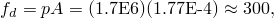

where *p* is the pressure and *A* is the area of a typical pad element. Solution controls are next used to set parameters for the temperature field equilibrium equations. The convergence criterion ratio is set to 1%, and the time-average and average fluxes are set to the nodal heat flux (temperature flux) for a typical pad element. The heat flux density generated by an interface element due to frictional heat generation is 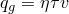, where  is the gap heat generation factor,  is the frictional stress, and *v* is the velocity. Therefore, the nodal heat flux is

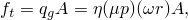

where *A* is the contact area of a typical pad element,  is the friction coefficient, and *p* is the contact pressure. The angular velocity, , is obtained as the total rotation, 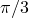, divided by the total time, 0.015 sec. The radius, *r*, is set to 0.120 m, which is the distance from the axis to a point approximately in the middle of the pad surface. This yields 

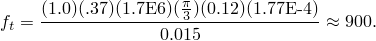

Additional solution controls can reduce the solver cost for an increment by improving the initial solution guess, solving thermal and mechanical equations separately, and reducing the wavefront of three-dimensional finite-sliding contact analysis. These features are discussed below. The impact of combining these features is also discussed.

When the default convergence controls are used, it is possible to obtain faster convergence with a parabolic extrapolation step. For the three-dimensional model the use of this feature yields a 14% enhancement in computational speed per increment.

The coupling between the thermal and mechanical fields in this problem is relatively weak. It is, therefore, possible to obtain a more efficient solution by specifying separate solutions for the thermal and mechanical equations each increment. This technique results in faster per-iteration solution times at the expense of poorer convergence when a strong interfield coupling is present. Use of this technique also permits the use of the symmetric solver and storage scheme. The resulting symmetric approximation of the mechanical equations was also found to be cost effective for this problem, when combined with a quality initial solution guess obtained by specifying parabolic extrapolation in the step. Neither of these approximations impacts solution accuracy. For the three-dimensional model the use of the separated solution scheme, parabolic extrapolation, and symmetric matrix storage yields a 50% decrease in the total solution time.

In the three-dimensional model the deformable master surface is defined from a large number of connecting elements resulting in a large wavefront. By default, Abaqus/Standard employs an automated contact patch algorithm to reduce the wavefront and solution time. For instance, in the coupled thermal-mechanical analysis a substantial savings in solution time (a 30% to 50% decrease) is obtained when the automatic contact patch algorithm is employed compared to an analysis that uses a fixed contact patch encompassing the entire master surface. The reduction in solution time is system dependent and depends on several factors, such as CPU type, system memory, and IO speed. This solution time savings is in addition to any of the other savings discussed in this section. The additional savings is, therefore, realized when the separated solution scheme and parabolic extrapolation are also specified.

### Results and discussion

The temperature distribution of the axisymmetric model at an early time increment is shown in [Figure 5.1.1--5](ch05s01aex117.md#sxmdiskbrake-isotherms). The temperature is greatest at the interfaces between the disc and pads, and the heat has just started to conduct into the disc. [Figure 5.1.1--6](ch05s01aex117.md#sxmdiskbrake-isoend) shows the temperature distribution at the end of the analysis when the velocity is zero. The heat has conducted through the friction ring of the disc. [Figure 5.1.1--7](ch05s01aex117.md#sxmdiskbrake-defmag) is a displaced plot of the model at the end of the analysis and shows the characteristic conical deformation due to thermal expansion. The displacement has been magnified by a factor of 128 to show the deformation more clearly.

The temperature distribution of the disc surface of the three-dimensional model after a rotation of 60 is shown in [Figure 5.1.1--8](ch05s01aex117.md#sxmdiskbrake-isosurf) (Abaqus/Standard) and [Figure 5.1.1--9](ch05s01aex117.md#sxmdiskbrake-isosurf-xpl) (Abaqus/Explicit). The agreement between the two results is excellent. The hottest region is the area under the pad, while the heat in the regions that the pad has passed over has dissipated somewhat. [Figure 5.1.1--10](ch05s01aex117.md#sxmdiskbrake-isoinside) shows the temperature distribution of the inside of the brake pad predicted by Abaqus/Standard, while [Figure 5.1.1--11](ch05s01aex117.md#sxmdiskbrake-isoinside-xpl) shows the same result obtained with Abaqus/Explicit. Again excellent agreement between the two results is noted. [Figure 5.1.1--12](ch05s01aex117.md#sxmdiskbrake-isothick) shows the temperature distribution in the disc predicted by Abaqus/Standard with the thickness magnified by a factor of 20. The heat has conducted into the disc in the regions that the pad has passed over.

The stresses predicted by Abaqus/Standard do not account for the effects of centrifugal loads (fully coupled thermal-stress is a quasi-static procedure), while the stresses predicted by Abaqus/Explicit do. These effects can be significant, especially during the early transient portion of the simulation when the initially stationary disc is brought up to speed. To compare the stress results between Abaqus/Standard and Abaqus/Explicit, we gradually initiated and ended the disc rotation in the Abaqus/Explicit simulation; thus, in Abaqus/Explicit, the centrifugal stresses at the beginning and end of the step are small compared with the thermal stresses. At points in between, however, the effects of centrifugal loading are more pronounced and differences between the stress states predicted by Abaqus/Standard and Abaqus/Explicit are observed. The overall effect on the thermal response, however, is negligible.

The Abaqus/Explicit analysis did not include mass scaling because its presence would artificially scale the stresses due to the centrifugal loads. It is possible to include mass scaling to make the analysis more economical, but any results obtained with mass scaling must be interpreted carefully in this problem.

### Input files

##### **Abaqus/Standard input files**

[discbrake_std_cax3t.inp](../eif/discbrake_std_cax3t.inp)

Axisymmetric model with CAX3T elements.

[discbrake_std_cax3t.f](../eif/discbrake_std_cax3t.f)

User subroutine [`FRIC`](../sub/sub-link.md#sub-xsl-fric) used in discbrake_std_cax3t.inp.

[discbrake_std_cax4t.inp](../eif/discbrake_std_cax4t.inp)

Axisymmetric model with CAX4T elements.

[discbrake_std_cax4t.f](../eif/discbrake_std_cax4t.f)

User subroutine [`FRIC`](../sub/sub-link.md#sub-xsl-fric) used in discbrake_std_cax4t.inp.

[discbrake_std_cax4rt.inp](../eif/discbrake_std_cax4rt.inp)

Axisymmetric model with CAX4RT elements.

[discbrake_std_cax4rt_surf.inp](../eif/discbrake_std_cax4rt_surf.inp)

Axisymmetric model with CAX4RT elements using the surface-to-surface approach.

[discbrake_std_cax4rt.f](../eif/discbrake_std_cax4rt.f)

User subroutine [`FRIC`](../sub/sub-link.md#sub-xsl-fric) used in discbrake_std_cax4rt.inp.

[discbrake_3d.inp](../eif/discbrake_3d.inp)

Three-dimensional model.

[discbrake_postoutput.inp](../eif/discbrake_postoutput.inp)

[*POST OUTPUT](../key/key-link.md#usb-kws-hpostoutput) analysis of the three-dimensional model.

[discbrake_3d_extrapara.inp](../eif/discbrake_3d_extrapara.inp)

Three-dimensional model with the second step run with [*STEP](../key/key-link.md#usb-kws-hstep), EXTRAPOLATION=PARABOLIC and with the default [*CONTROLS](../key/key-link.md#usb-kws-hcontrols) option.

[discbrake_3d_extrapara_300c.inp](../eif/discbrake_3d_extrapara_300c.inp)

Three-dimensional model with the second step run with [*STEP](../key/key-link.md#usb-kws-hstep), EXTRAPOLATION=PARABOLIC. It is assumed that several revolutions occurred and the initial temperature for the disc brake and pad is 300C.

[discbrake_3d_separated.inp](../eif/discbrake_3d_separated.inp)

Three-dimensional model run using the [*SOLUTION TECHNIQUE](../key/key-link.md#usb-kws-hsolutiontech), TYPE=SEPARATED option.

##### **Abaqus/Explicit input file**

[discbrake_3d_xpl.inp](../eif/discbrake_3d_xpl.inp)

Three-dimensional model.

### References

Day,  A. J., “An Analysis of Speed, Temperature, and Performance Characteristics of Automotive Drum Brakes,” Journal of Tribology, vol. 110, pp. 295–305, 1988.

Day,  A. J., and T. J. Newcomb, “The Dissipation of Frictional Energy from the Interface of an Annular Disc Brake,” Proc. Instn. Mech. Engrs, vol. 198D, no.11, pp. 201–209, 1984.

Gonska,  H. W., and H. J. Kolbinger, “ABAQUS Application Example: Temperature and Deformation Calculation of Passenger Car Brake Disks,” ABAQUS Users' Conference Proceedings, 1993.

### Tables

**Table 5.1.1–1** Thermal-mechanical properties.
| Temperature of property measurement (C) | 20 | 100 | 200 | 300 |
| --- | --- | --- | --- | --- |
| Young's modulus, *E* (N/mm2) | 2200 | 1300 | 530 | 320 |
| Poisson's ratio,  | 0.25 | 0.25 | 0.25 | 0.25 |
| Density,  (kg/m3) | 1550 | 1550 | 1550 | 1550 |
| Thermal expansion coefficient (K1) | 10 106 | -- | 30 106 | -- |
| Thermal conductivity,  (w/mK) | 0.5 | 0.5 | 0.5 | 0.5 |
| Specific heat,  (J/kgK) | 1200 | 1200 | 1200 | 1200 |

**Table 5.1.1–2** Brake lining temperature characteristic.
| Temperature of property measurement (C) | 100 | 200 | 300 | 400 |
| --- | --- | --- | --- | --- |
| Friction coefficient,  | 0.38 | 0.41 | 0.42 | 0.24 |

### Figures

**Figure 5.1.1–1** A vented brake disc design.

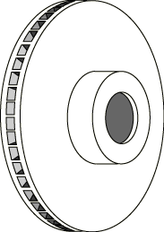

**Figure 5.1.1–2** Modeling a segment of a brake disc.

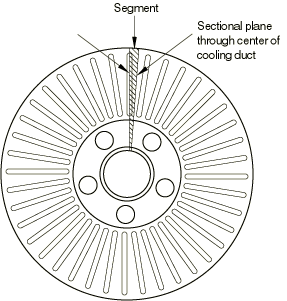

**Figure 5.1.1–3** Mesh for the axisymmetric model, Abaqus/Standard.

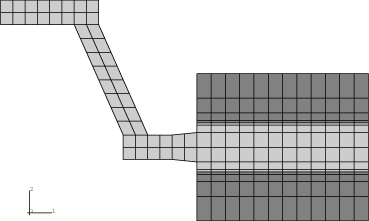

**Figure 5.1.1–4** Mesh for the three-dimensional model.

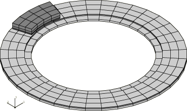

**Figure 5.1.1–5** Isotherms of the axisymmetric model at 0.675, Abaqus/Standard.

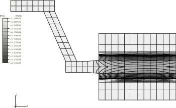

**Figure 5.1.1–6** Isotherms of the axisymmetric model when braking has ended, Abaqus/Standard.

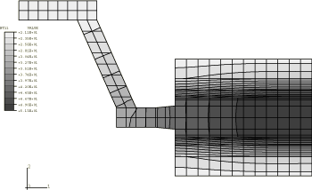

**Figure 5.1.1–7** Deformation of the axisymmetric disc, displacement magnified by 128, Abaqus/Standard.

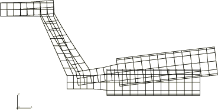

**Figure 5.1.1–8** Isotherms of the disc surface, Abaqus/Standard.

**Figure 5.1.1–9** Isotherms of the disc surface, Abaqus/Explicit.

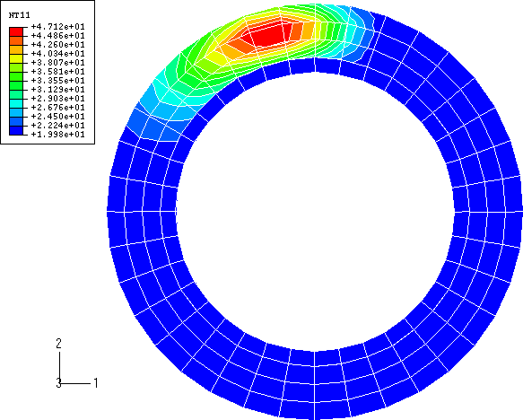

**Figure 5.1.1–10** Isotherms of the inside of the brake pad, Abaqus/Standard.

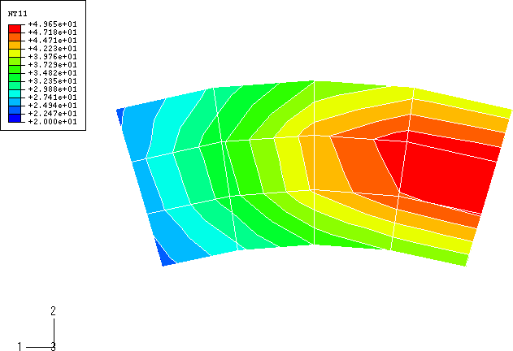

**Figure 5.1.1–11** Isotherms of the inside of the brake pad, Abaqus/Explicit.

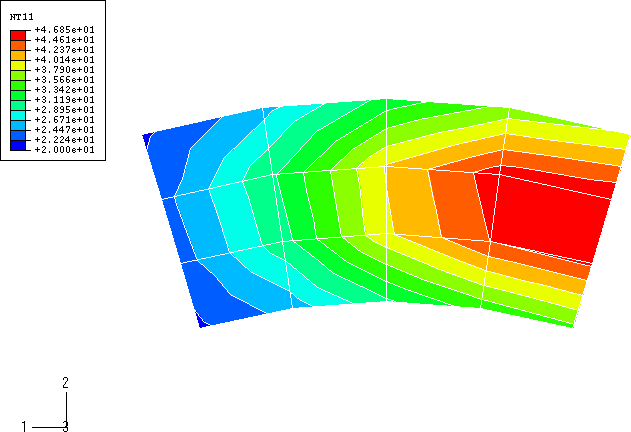

**Figure 5.1.1–12** Isotherms of the disc with the thickness magnified 20 times, Abaqus/Standard.

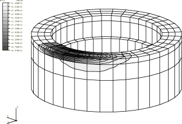

