# 5.1.2 A sequentially coupled thermal-mechanical analysis of a disc brake with an Eulerian approach

**Product: **Abaqus/Standard  

The prediction of fatigue and failure of a disc brake system is fundamental in assessing product performance. Disc brakes operate by pressing a set of brake pads against a rotating disc. The friction between the pads and the disc causes deceleration. The brake system then converts the kinetic energy of vehicle motion into heat. Severe temperature changes as well as mechanical loadings cause inelastic deformation and circumferential tensile stress in the disc, which may eventually lead to the failure of the disc.

The traditional way of analyzing this kind of problem is to use a Lagrangian approach in which the mesh used to discretized the disc rotates relative to the brake assembly. Since many revolutions are typically required to reach the state of interest to the analyst, this approach is prohibitively expensive and cumbersome. The steady-state transport analysis capability in Abaqus/Standard (["Steady-state transport analysis," Section 6.4.1 of the Abaqus Analysis User's Guide](../usb/usb-link.md#usb-anl-asteadystatetransport)), which uses the Eulerian method in which the finite element mesh of the disc does not rotate relative to the brake assembly but the material “flows” through the mesh, provides a cost-effective alternative approach. The paths that the material points follow through the mesh are referred to as streamlines. This kinematic description converts the moving disc brake problem into a pure spatially dependent simulation. Thus, the mesh has to be refined only in a fixed region where the brake pads are in contact with the disc initially.

### Geometry and model

The model analyzed in this example is a solid disc. An axisymmetric model is created to define the cross-sectional geometry of the disc, as shown in [Figure 5.1.2--1](ch05s01aex118.md#sxmdiscbrake-sst-axi). The disc has a thicker friction ring connected to a conical section that, in turn, connects to an inner hub. The inner radius of the friction ring is 86.5 mm, the outer radius is 133.0 mm, and the ring is 13.0 mm thick. The conical section is 27.2 mm deep. The inner radius of the conical section is 64.75 mm, the outer radius is 86.5 mm, and the section is 6.4 mm thick. The conical section has a thinner section out to a radius of  71.25 mm, which has a thickness of 4.5 mm. The hub has an inner radius of 33.0 mm, an outer radius of 71.25 mm, and is 6.2 mm thick. Symmetric model generation (["Symmetric model generation," Section 10.4.1 of the Abaqus Analysis User's Guide](../usb/usb-link.md#usb-anl-aaximodelgen)) is used to create a three-dimensional disc, as shown in [Figure 5.1.2--2](ch05s01aex118.md#sxmdiscbrake-sst-symm), by revolving the two-dimensional cross-section about the symmetry axis and to create the streamlines needed for the steady-state transport analyses in this example. There are eight elements through the thickness of the friction ring, four elements through the thickness of the hub, and four elements through the conical section. There are 40 element sectors in the circumferential direction of the disc, with a more refined mesh used in the region with higher thermal and stress gradients. The model consists of 9440 first-order forced convection/diffusion bricks (DCC3D8) in the heat transfer analysis, giving a total of about 11520 degrees of freedom; and it consists of 9440 first-order bricks (C3D8) in the subsequent steady-state transport analysis, giving a total of about 34560 degrees of freedom.

The disc pads are not modeled in the example. Instead, the thermal and mechanical interactions between the disc and the pads are represented by the application of appropriate distributed heat fluxes in the heat transfer analysis and by the application of appropriate concentrated loads in the steady-state transport analysis, respectively. 

### Material properties

The disc is made of metallic material, with a Young's modulus of 93.5 GPa, a yield stress of 153 MPa, a Poisson's ratio of 0.27, and a coefficient of thermal expansion of 11.7  10–6 per C at room temperature. In this example the dissipation of the frictional heat-generated temperature fluctuates, ranging from a minimum value of 40C to a maximum value of 560C over the entire braking cycle. The temperature distribution when the disc is heated to its peak value is shown in [Figure 5.1.2--3](ch05s01aex118.md#sxmdiscbrake-sst-tempdist). Under such operating conditions plastic deformation, as well as creep deformation, is observed. The two-layer viscoelastic-elastoplastic model, which is best suited for modeling the response of materials with significant time-dependent behavior as well as plasticity at elevated temperatures, is used to model the disc (see ["Two-layer viscoplasticity," Section 23.2.11 of the Abaqus Analysis User's Guide](../usb/usb-link.md#usb-mat-cviscous)). This material model consists of an elastic-plastic network that is in parallel with an elastic-viscous network. The Mises metal plasticity model with kinematic hardening is used in the elastic-plastic network, and the power-law creep model with strain hardening is used in the elastic-viscous network. Because the elastic-viscoplastic response of the material varies greatly over this temperature range, temperature-dependent material properties are specified.

The thermal properties for the disc are temperature dependent with a conductivity of 51  10–3W/mm per C, a specific heat of 501 J/kg per C, and a density of 7.15  10–6 kg/mm at room temperature.

### Problem description and loading

A simulation of braking a solid disc rotating initially at an angular velocity of 155.7 rad/sec is performed. The braking time is approximately 5 seconds, followed by a cooling period of 600 seconds. A sequentially coupled thermal-mechanical analysis is performed on the solid disc using the Eulerian approach: a forced convection/diffusion heat transfer analysis is followed by a steady-state transport analysis. Heat fluxes with film condition and prescribed mass flow velocity through user subroutine [`UMASFL`](../sub/sub-link.md#sub-xsl-umasfl) are applied to the thermal model, which consists of three steps.  The first step, which lasts 0.2 seconds, simulates the response of the disc under constant distributed fluxes and a constant angular velocity. The second step involves 4.8 seconds during which the distributed fluxes and the angular velocity are decreased linearly to small values near zero at the end of the step. The final step, which lasts 600 seconds, simulates the continued cooling in the model. The resulting temperatures obtained during the heat transfer analysis are applied to the subsequent mechanical analysis, which involves five steady-state transport analysis steps.

The purpose of the first step in the mechanical analysis is to obtain a steady-state solution for a disc under constant concentrated loads due to the application of the brake pads to the disc. There is only one increment in this step. A constant temperature of 40C is used, and a constant angular transport velocity of 155.7 rad/sec is specified.

The second step obtains a series of quasi-steady-state transport solutions under different temperature loading passes through the disc.  The pass-by-pass steady-state transport analysis technique is used for this purpose. This step lasts 0.2 seconds with a constant angular velocity of 155.7 rad/sec throughout the entire step. Several increments are involved, with each increment corresponding to a complete temperature loading pass through the disc. The temperature values obtained during the first step of the heat transfer analysis are read into this step.

The third step also obtains a series of quasi-steady-state transport solutions under different temperature loading passes through the disc. However, this step involves 4.8 seconds over which the angular velocity is decreased linearly from 155.7 rad/sec at the beginning of the step to a small value close to zero at the end of this step. There are several increments in this step, with each increment corresponding to a complete temperature loading pass through the disc. The temperature values obtained during the second step of the heat transfer analysis are read into this step. 

The fourth step obtains a steady-state solution for the disc due to the removal of the concentrated loads. There is only one increment in this step.

The last step obtains a series of quasi-steady-state transport solutions when the disc cools down. There are several increments over a step period of 600 seconds. The temperatures obtained during the last step of the heat transfer analysis are read into this step. Since the angular velocity is very small, this step essentially simulates a long-term elastic-plastic response for the disc. 

### Solution controls

Since the modified Newton's method is used in a steady-state transport analysis, more numerical iterations are necessarily required to obtain a converged solution. To decrease the computational time required for the analysis due to the unnecessary cutback of the increment size, the time incrementation control parameters are used to override the default values (see ["Time integration accuracy in transient problems," Section 7.2.4 of the Abaqus Analysis User's Guide](../usb/usb-link.md#usb-anl-aautomaticinc)).

### Results and discussion

One of the considerations in the design of a disc brake system is the stress distribution and deformation in the region where the brake pads are applied. Circumferential tensile stress, which may cause the fracture of the disc, will develop, making this region critical in the design. The results shown in [Figure 5.1.2--6](ch05s01aex118.md#sxmdiscbrake-sst-s33) through [Figure 5.1.2--11](ch05s01aex118.md#sxmdiscbrake-sst-energy) are measured in this region (element 7817, integration point 5; see point A in [Figure 5.1.2--2](ch05s01aex118.md#sxmdiscbrake-sst-symm)). The temperature in this region (node 7820) is shown in [Figure 5.1.2--4](ch05s01aex118.md#sxmdiscbrake-sst-temphist) as a function of the time over the entire braking process. [Figure 5.1.2--5](ch05s01aex118.md#sxmdiscbrake-sst-mises) shows the Mises stress distribution just before the distributed loads are removed and the cooling period starts (Step 3, increment 60).

[Figure 5.1.2--6](ch05s01aex118.md#sxmdiscbrake-sst-s33), [Figure 5.1.2--7](ch05s01aex118.md#sxmdiscbrake-sst-pe33), and [Figure 5.1.2--8](ch05s01aex118.md#sxmdiscbrake-sst-ve33) show the evolution of the circumferential stress, circumferential plastic strain, and circumferential viscous strain, respectively, as a function of the time throughout a complete braking cycle. A tensile stress of 54 MPa is developed after the disc is cooled down completely. Both plastic strain and viscous strain reach their saturation levels during the cooling period. The time evolution of the circumferential stress versus the circumferential plastic strain, shown in [Figure 5.1.2--9](ch05s01aex118.md#sxmdiscbrake-sst-pe33-s33), is obtained by combining [Figure 5.1.2--6](ch05s01aex118.md#sxmdiscbrake-sst-s33) with [Figure 5.1.2--7](ch05s01aex118.md#sxmdiscbrake-sst-pe33). Similarly, the  time evolution of the circumferential stress versus the circumferential viscous strain, shown in [Figure 5.1.2--10](ch05s01aex118.md#sxmdiscbrake-sst-ve33-s33), is obtained by combining [Figure 5.1.2--6](ch05s01aex118.md#sxmdiscbrake-sst-s33) with [Figure 5.1.2--8](ch05s01aex118.md#sxmdiscbrake-sst-ve33). The shapes of the stress-strain curves represent the plastic and viscous energies dissipated, respectively, over an entire braking cycle. These dissipated energies, which could be used to predict the fatigue life for the disc, are shown in [Figure 5.1.2--11](ch05s01aex118.md#sxmdiscbrake-sst-energy) as a function of the time.

### Acknowledgements

SIMULIA gratefully acknowledges PSA Peugeot Citron and the Laboratory of Solid Mechanics of the Ecole Polytechnique (France) for their cooperation in developing the Eulerian algorithm for steady-state transport analysis and for supplying the geometry and material properties used in this example.

### Input files

[discbrake_sst_heat_axi.inp](../eif/discbrake_sst_heat_axi.inp)

Axisymmetric model for the heat transfer analysis.

[discbrake_sst_heat_symm.inp](../eif/discbrake_sst_heat_symm.inp)

Three-dimensional model for the heat transfer analysis.

[exa_discbrake_sst_heat_symm.f](../eif/exa_discbrake_sst_heat_symm.f)

User subroutine [`UMASFL`](../sub/sub-link.md#sub-xsl-umasfl) used in discbrake_sst_heat_symm.inp.

[discbrake_sst_axi.inp](../eif/discbrake_sst_axi.inp)

Axisymmetric model for the mechanical analysis.

[discbrake_sst_symm_pbp.inp](../eif/discbrake_sst_symm_pbp.inp)

Three-dimensional model for the mechanical analysis.

### References

Maitournam,  M. H., “Formulation et Rsolution Numrique des Problmes Thermoviscoplastiques en Rgime Permanent,” Thse de l’Ecole des Ponts et Chausses, 1989.

Nguyen-Tajan,  T. M.L., “Modlisation Thermomcanique des Disques de Frein par une Approche Eulrienne,” Thse de l’Ecole Polytechnique, 2002.

### Figures

**Figure 5.1.2–1** Mesh for the axisymmetric model.

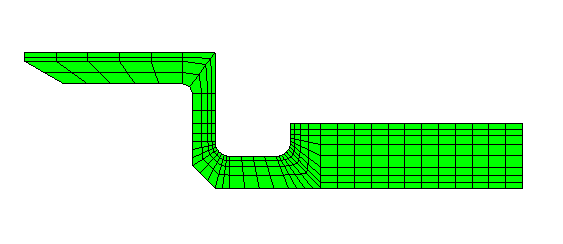

**Figure 5.1.2–2** Mesh for the three-dimensional model.

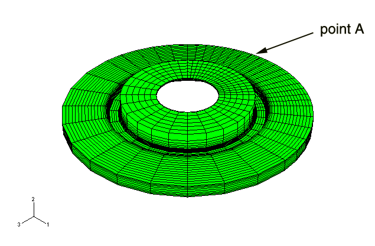

**Figure 5.1.2–3** Temperature distribution when the disc is heated to its peak value.

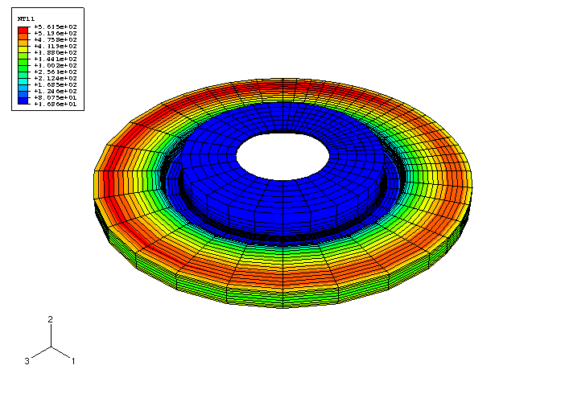

**Figure 5.1.2–4** Temperature at node 7820 as a function of time during the entire braking period.

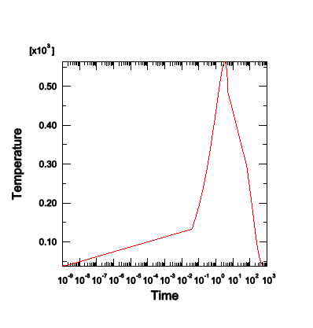

**Figure 5.1.2–5** Mises stress distribution (Step 3, increment 60) just before the cooling period starts.

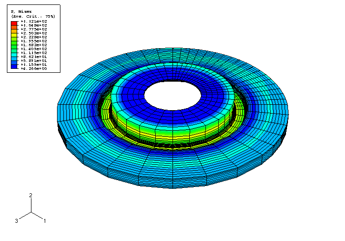

**Figure 5.1.2–6** Evolution of the circumferential stress as a function of time.

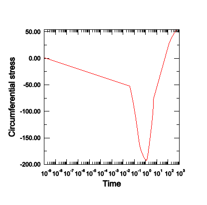

**Figure 5.1.2–7** Evolution of the circumferential plastic strain as a function of time.

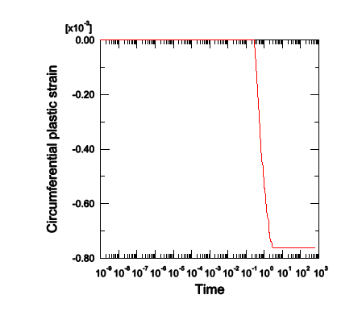

**Figure 5.1.2–8** Evolution of the circumferential viscous strain as a function of time.

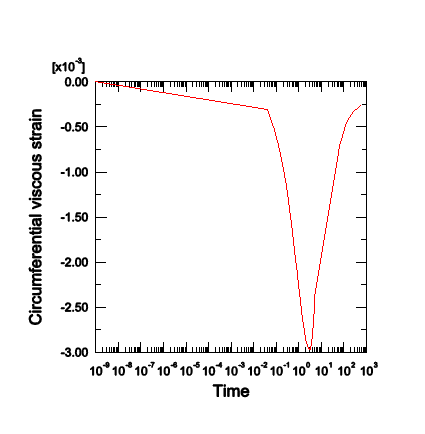

**Figure 5.1.2–9** Evolution of the circumferential stress versus the circumferential plastic strain.

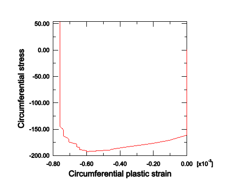

**Figure 5.1.2–10** Evolution of the circumferential stress versus the circumferential viscous strain.

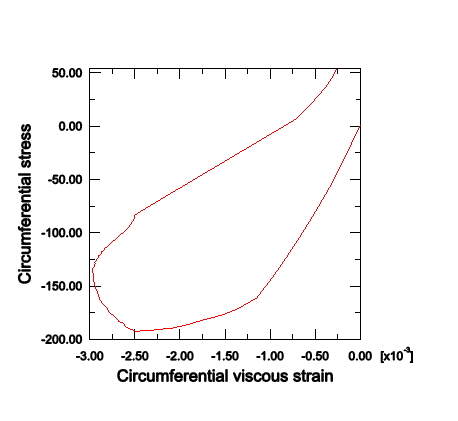

**Figure 5.1.2–11** Evolution of the plastic dissipated energy and the viscous dissipated energy as a function of time.

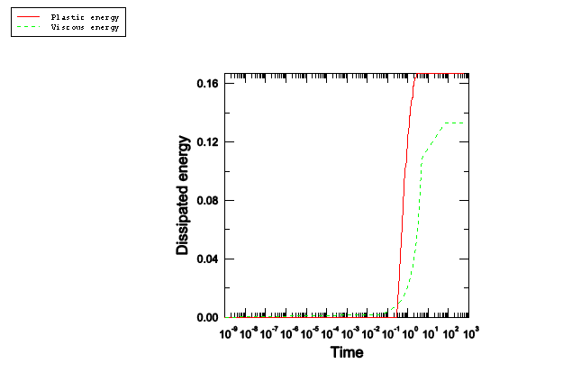

