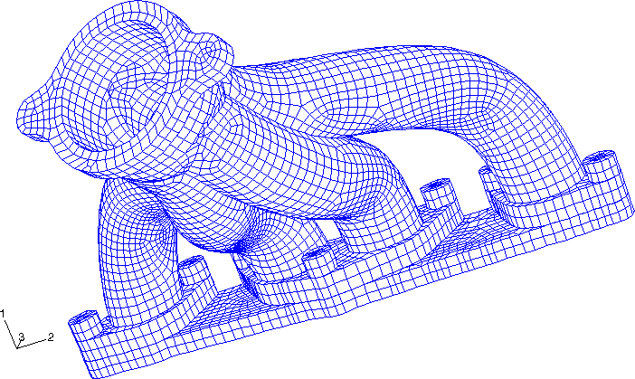
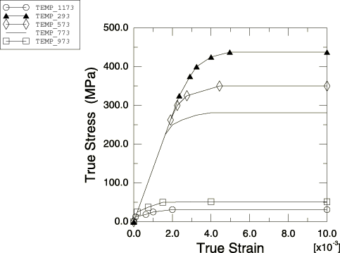
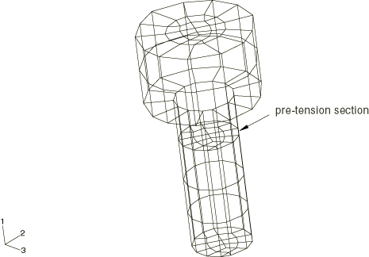
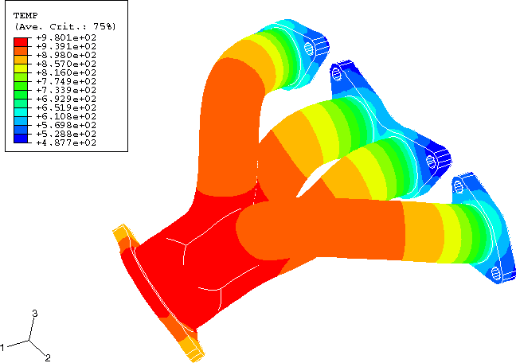
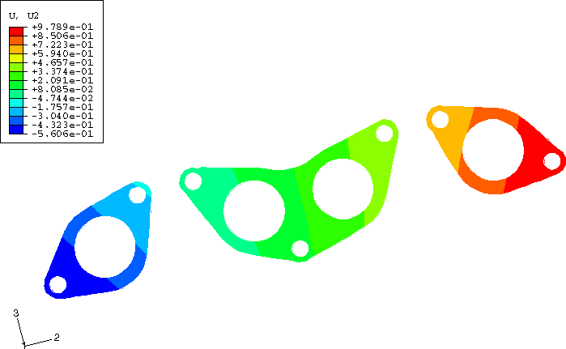
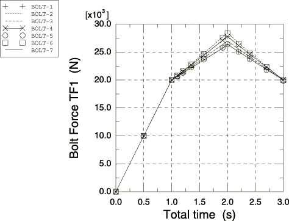

# 5.1.3 Exhaust manifold assemblage


**Product: **Abaqus/Standard  

Engine exhaust manifolds are commonly subject to severe thermal cycles during operation and upon shutdown. Thermal expansion and contraction of the manifold is constrained by its interaction with the engine head to which it is bolted. These constraints govern the thermo-mechanical fatigue life of the manifold.

The initial assembly procedure consists of bolting the flanges of the manifold to the engine head with prescribed bolt forces that produce uniform axial bolt stresses. Under subsequent operating conditions such as thermal cycling and creep, these bolt forces may increase or relax, possibly changing normal pressures and resulting in lateral slippage between the engine head and the manifold flanges. Thus, the boundary constraints on the manifold flanges are a function of the response of the entire assembly to its operating conditions. As such, these boundary constraints cannot be prescribed *a priori*. This example shows how to simulate these varying boundary constraints with the prescribed assembly load capability of Abaqus.

The problem scenario consists of three steps:

1. Apply prescribed bolt loads to fasten the exhaust manifold to the engine head.
2. Subject the assembly to the steady-state operating temperature distribution.
3. Return the assembly to ambient temperature conditions.

### Geometry and model

The exhaust manifold assemblage being analyzed is depicted in [Figure 5.1.3--1](ch05s01aex119.md#sxmexhaust-mesh). It consists of a four tube exhaust manifold with three flanges, bolted with seven bolts to a small section of the engine head.

The manifold is cast from gray iron with a Young's modulus of 138 GPa, a Poisson's ratio of 0.283, and a coefficient of thermal expansion of 13.8  106 per C. In this example the region of the manifold where the hot exhaust gases converge is subject to temperatures ranging from an initial value of 300 K to an extreme of 980 K. The elastic-plastic response of gray cast iron varies greatly over this range of temperatures, so the temperature-dependent plasticity curves shown in [Figure 5.1.3--2](ch05s01aex119.md#sxmexhaust-curves) are used for the manifold material. Gray cast iron exhibits different behavior in tension and compression; therefore, these curves represent the average response. The Mises metal plasticity model with isotropic hardening is used. The three manifold flanges contain a total of seven bolt holes. The 9.0 mm diameter of these bolt holes is slightly greater than the 8.0 mm diameter of the bolt shanks to allow for some unobstructed lateral motion of the manifold.

For simplicity, only a portion of engine head directly beneath the manifold flanges is modeled. The head is made from aluminum, with a Young's modulus of 69 GPa, a Poisson's ratio of 0.33, and a coefficient of thermal expansion of 22.9  106 per C. The head has four exhaust ports leading into the manifold tubes. It has seven bolt holes used to secure the manifold.

Seven bolts fasten the manifold to the head. The bolts are made from steel, with a Young's modulus of 207 GPa, a Poisson's ratio of 0.3, and a coefficient of thermal expansion of 13.8  106 per C. The bolt shanks have a diameter of 8 mm. The bolt head diameters are 16 mm.

Three-dimensional, deformable-to-deformable, small-sliding contact conditions apply to the model. The bottoms of the bolt heads form contact bearing surfaces, with the top surfaces of the manifold flanges lying directly beneath them. In addition, the bottoms of the manifold flanges form contact bearing surfaces with the top of the engine head. Each of these surfaces is defined in Abaqus with a surface definition. Respective mating surfaces are paired together with contact pairs. Normal pressures will be transmitted through these contact pairs as a result of the bolt tightening forces in Step 1. The forces carried by the bolts will vary as they respond to the thermal cycling of the assembly in subsequent steps. These fluctuations in bolt loads will result in varying normal pressures transmitted across the contact pairs. Lateral slip of the mating components will occur if the critical frictional shear stress limit is surpassed by lateral forces developed in the system. A friction coefficient of 0.2 is used between all contacting surfaces. Contact conditions are not necessary between the bolt shanks and the holes in the manifold flanges because of the design clearance between them. Contact between the bolt shanks and the holes in the engine head is not modeled.

All three structural components (manifold, head, and bolts) are modeled with three-dimensional continuum elements. The model consists of 7450 first-order brick elements with incompatible deformation modes, C3D8I, and 282 first-order prism elements, C3D6. The C3D6 elements are used only where the complex geometry precludes the use of C3D8I elements. The C3D8I elements are selected to represent the bending of the manifold walls with only one element through the thickness of the tube walls.

### Loading and boundary constraints

It is assumed that the engine head is securely fixed to a stiff and bulky engine block, so the nodes along the base of the head are secured in the direction normal to the base (the global *x*-direction) but are free to move in the two lateral directions to account for thermal expansion. It is also assumed that the bolts are threaded tightly into the engine head, with the bolt threads beginning directly beneath the section of engine head modeled. Therefore, the nodes at the bottom of the bolt shanks are shared with the nodes of the surrounding engine head elements and are also secured in the global *x*-direction. The manifold flanges are sandwiched between the top of the engine head and the base of the bolt heads using contact pairs. The line of action of the bolt forces (bolt shank axes) is along the global *x* degree of freedom. Soft springs acting in the global *y*- and *z*-directions are attached to the outlet end of the manifold and to the two ends of the head to suppress rigid body motions of the manifold and head, respectively. These springs have no influence on the solution.

In the first step of the analysis each of the seven bolts is tightened to a uniform bolt force of 20 kN. In subsequent steps the variation of the bolt loads is monitored as the bolts respond to the thermal loading on the assembly as a whole. The “prescribed assembly load” capability of Abaqus is used. For each bolt we define a “cut,” or pre-tension section, and subject the section to a specified tensile load. As a result, the length of the bolt at the pre-tension section will change by the amount necessary to carry the prescribed load, while accounting for the compliance of the rest of the system. In the next step the prescribed bolt loads are replaced by the condition that the length changes calculated in the previous step remain fixed. The remainder of the bolt is free to deform.

The same procedure is used for all seven bolts. First, pre-tension sections are defined as “cuts” that are perpendicular to the bolt shank axes by defining surfaces on the faces of a group of elements within each bolt shank, as shown in [Figure 5.1.3--3](ch05s01aex119.md#sxmexhaust-pretension). The line of action of the bolt force is in the direction that is normal to this surface. Next, each bolt is assigned an arbitrary, independent node that possesses one degree of freedom (DOF 1), to which the bolt force will be applied. These nodes are called the “pre-tension nodes” (all seven bolt pre-tension nodes are placed into a node set named `BOLTS`). The spatial position of a pre-tension node is irrelevant. Finally, each surface is associated with the appropriate pre-tension node using a pre-tension section.

A portion of the Abaqus model definition section defining the pre-tension section is shown below:

```
[*ELSET](../key/key-link.md#usb-kws-melset), ELSET=BCUT1, GENERATE
19288,19307
[*SURFACE](../key/key-link.md#usb-kws-msurface), NAME=BOLT1
BCUT1,S2
[*NODE](../key/key-link.md#usb-kws-mnode), NSET=BOLTS
99991,   21.964    ,  -139.80    ,  -12.425
…
99997,   21.964    ,   137.38    ,  -12.226
[*PRE-TENSION SECTION](../key/key-link.md#usb-kws-mpretension), SURFACE=BOLT1, NODE=99991
```

In Step 1 of the analysis a concentrated clamping load of 20 kN is applied to each of the pre-tension nodes in node set `BOLTS`. In Step 2 the concentrated load from Step 1 is removed and replaced by a “fixed” boundary condition that will hold the pre-tension section length changes from Step 1 fixed. Over the course of a step in which a load is replaced by a boundary condition, CF1 is ramped down, while RF1 is ramped up to replace it. Therefore, the total force across the bolt is the sum of the concentrated force (CF1) and the reaction force (RF1) on the pre-tension node. This total force is available as TF1. Additionally in this step of the analysis nodal temperatures depicting the steady-state temperature distribution in the manifold are read from an external file. The temperature distribution is shown in [Figure 5.1.3--4](ch05s01aex119.md#sxmexhaust-sstempdist). These nodal temperatures can be generated by an Abaqus heat transfer analysis. Each of the nodes in the model has its temperature ramped up from the initial ambient temperature of 300 K to its final steady-state temperature. These nodal temperatures are interpolated to the element integration points so that the correct temperature-dependent plasticity data can be used in the constitutive calculations. Finally, in Step 3 the nodal temperatures are ramped back down to the initial ambient temperature of 300 K.

### Results and discussion

The analysis is performed as a small-displacement analysis. The nonlinearities in the problem are the result of changing contact conditions, frictional slip and stick, and temperature-dependent plasticity.

[Figure 5.1.3--5](ch05s01aex119.md#sxmexhaust-latexpan) shows the lateral displacement of the bottom surface of the flange at the end of the heat-up step. As a result of frictional sticking, the ends of the two outer manifold flanges have expanded outward relative to one another by only about 0.75 mm. Plastic yielding conditions result since thermal expansion of the remainder of the manifold is constrained by this limited lateral flange motion. A separate thermal-stress analysis of the manifold only, with no bolt constraints included, produced relative lateral expansions of about 1.1 mm and very little plasticity.

[Figure 5.1.3--6](ch05s01aex119.md#sxmexhaust-forcehist) is a plot of the forces carried by each of the seven bolts throughout the load history. This plot can be obtained with the *X*–*Y* plotting capabilities in Abaqus/CAE. The curves contain the values of the total forces (TF1) for the pre-tension nodes in node set `BOLTS`. The loads carried by the bolts increase significantly during the heat-up step. The loads do not return precisely to the original bolt load specification upon cool down because of the residual stresses, plastic deformation, and frictional dissipation that developed in the manifold.

### Input files

[manifold.inp](../eif/manifold.inp)

Input data for the analysis.

[manifold_node_elem.inp](../eif/manifold_node_elem.inp)

Node and element definitions.

[manifold_nodaltemp.inp](../eif/manifold_nodaltemp.inp)

Nodal temperature data.

### Figures

**Figure 5.1.3–1** Manifold assemblage.



**Figure 5.1.3–2** Gray cast iron temperature-dependent plasticity curves.



**Figure 5.1.3–3** Pre-tension section.



**Figure 5.1.3–4** Steady-state temperature distribution.



**Figure 5.1.3–5** Lateral expansion of manifold footprint.



**Figure 5.1.3–6** History of bolt forces.




