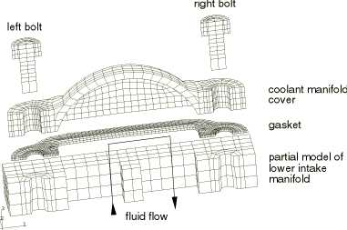
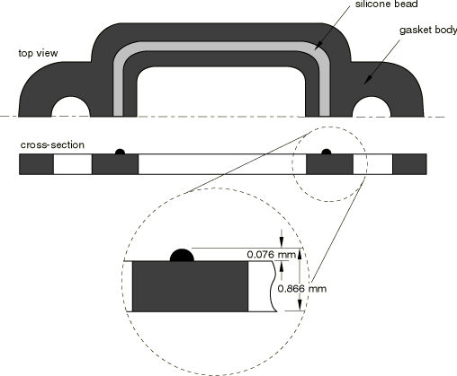
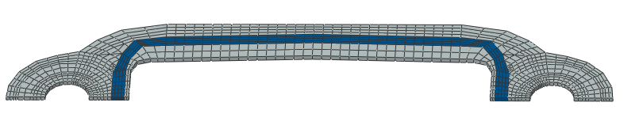
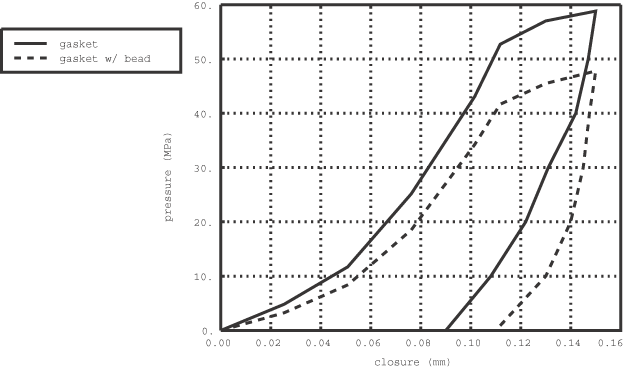
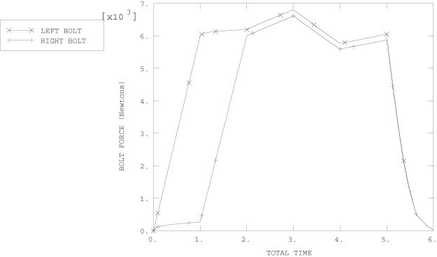
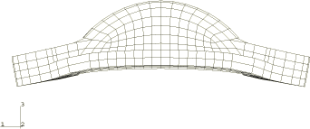
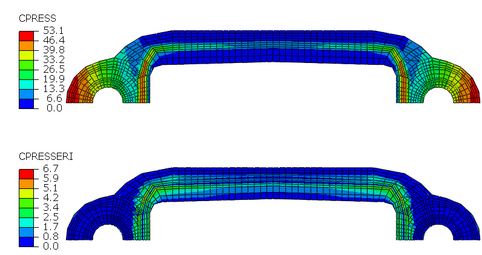
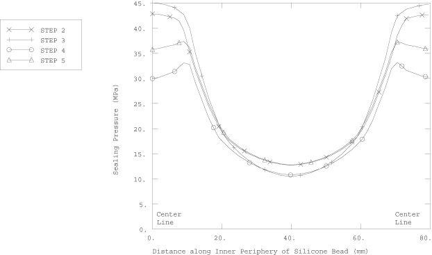
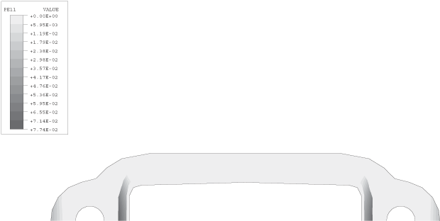
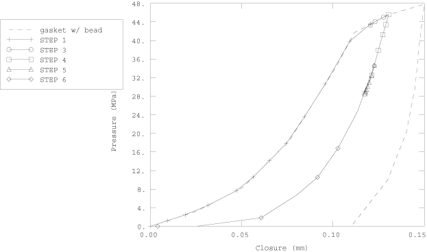

# 5.1.4 Coolant manifold cover gasketed joint

**Product: **Abaqus/Standard  

Engine gaskets are used to seal the mating surfaces of engine components to maintain the integrity of the closed system throughout a wide range of operating loads and environmental conditions. Inadequate gasket performance leads to diminished engine pressure and fluid leakage, resulting in degradation of engine performance and potential engine damage. The gasket, the engine component flanges, and the fasteners—collectively referred to as a gasketed joint—must be considered as a unit when determining the system sealing performance because most gasketed joints do not obtain a uniform contact stress distribution due to nonuniform bolt spacing and flange distortion during assembly and subsequent operational loading.

Engine gaskets are often complicated geometric constructs of various engineering materials and are subject to large compressive strains. The compressive response of the gasket is highly nonlinear. Such complexities make detailed modeling of gaskets with continuum elements difficult and impractical when analyzing complete assemblies.

Abaqus has a dedicated class of elements, referred to as gasket elements, that simplify the modeling of such components while maintaining the essential ingredients of the nonlinear response. Typical use of these gasket elements involves a tabular representation of the pressure versus closure relationship in the thickness direction of the gasket. The pressure versus closure models available in Abaqus allow the modeling of very complex gasket behaviors, including nonlinear elasticity, permanent plastic deformation, and loading/unloading along different paths. These behaviors are usually calibrated directly from test data. In this manner a complex gasket can be modeled effectively using a single gasket element in the thickness direction.

In this example a paper foam gasket with a silkscreened silicone bead is compressed between the lower engine intake manifold and the coolant manifold cover. The coolant manifold cover seals the lower intake manifold coolant passages so that the coolant can be distributed to the cylinder heads. An exploded view of the gasketed joint model is shown in [Figure 5.1.4--1](ch05s01aex120.md#sxmgasket-assembly). It consists of two steel bolts, an aluminum coolant manifold cover, a paper foam gasket with a silicone bead, and—for simplicity—only a portion of the lower intake manifold, which is composed of steel. Symmetry conditions reduce the structure to a half model. The gasketed joint is subjected to the following mechanical and environmental load conditions:

1. Simulate the bolt loading sequence to fasten the joint.
2. Heat the assembly to the maximum operating temperature and apply interior cavity pressure.
3. Cool the assembly to the minimum operating temperature while maintaining interior cavity pressure.
4. Return the assembly to ambient conditions with the interior pressure removed.
5. Disassemble the gasketed joint.

### Geometry and material

The portion of the lower intake manifold that is modeled has two passages. Coolant flows from one passage into the manifold cover and back out through the other passage. Two steel bolts secure the cover to the manifold. The bolt shanks have a diameter of 6.0 mm, and the bolt heads have a diameter of 11.8 mm. The bolts and the lower intake manifold are assigned a Young's modulus of 2.0  105 MPa, a Poisson's ratio of 0.28, and a coefficient of thermal expansion of 1.6  105 per C. The aluminum coolant manifold cover has a Young's modulus of 7.1  104 MPa, a Poisson's ratio of 0.33, and a coefficient of thermal expansion of 2.3  105 per C.

The metal components (bolts, cover, and intake manifold) are modeled with three-dimensional continuum elements: 1304 first-order brick elements with incompatible deformation modes (C3D8I) and 208 first-order prism elements (C3D6). The C3D8I elements are chosen to capture the bending of the cover, using only one element through its thickness. The C3D6 elements are used only where geometric constraints preclude the use of C3D8I elements.

The gasket schematic shown in [Figure 5.1.4--2](ch05s01aex120.md#sxmgasket-geom) has two distinct regions. The majority of the gasket is composed of a 0.79 mm thick, flat, crushable paper foam material. To ensure proper sealing pressures for this joint, a 0.076 mm thick silicone bead has been silkscreened along the top surface of the gasket encircling the interior cavity. Placing silicone beads on gaskets results in a change in the load transmitting characteristics of the gasket, which often improves both the recovery properties of the gasket and its potential to remain sealed for the long term.

The entire gasket, including the bead, is modeled as a flat sheet with one gasket element through the thickness (see [Figure 5.1.4--3](ch05s01aex120.md#sxmgasket-mesh)). A relatively fine mesh is used for the gasket to capture the in-plane variation of the gasket sealing pressure. This creates a mismatched mesh across the contacting surfaces, but Abaqus contact definitions do not require one-to-one matching meshes across contact pairs. The gasket components (silicone bead region and paper foam region) are modeled with 973 first-order 8-node area elements (GK3D8) and 29 first-order 6-node area elements (GK3D6). The physical thickness of the entire sheet of gasket elements corresponds to the initial combined height of the paper foam and the silicone bead, 0.866 mm. The elements in the region of the gasket beneath the silicone bead are assigned different gasket properties from the rest of the elements in the gasket model. The paper foam region is initially not in contact with the cover. The initial gap is 0.076 mm. No pressure is generated in this portion of the gasket until the gap has closed. Gasket region property distinctions, such as initial gaps and different pressure versus closure relationships, are assigned to corresponding element sets by referring to different gasket behavior definitions.

Experimentally determined pressure versus closure curves for the two distinct gasket regions without the initial gap taken into account are shown in [Figure 5.1.4--4](ch05s01aex120.md#sxmgasket-press-closure). Tabular representations of these curves are specified using a gasket thickness-direction behavior that is associated with the respective gasket behavior definitions. Creep/relaxation properties of the gasket and temperature-dependent pressure versus closure properties, capturing such effects as the glassy transition temperature of the silicone bead, are not accounted for in this example. Initially, Abaqus considers the gasket behavior to be nonlinear elastic, such that loading and unloading occur along the same user-defined nonlinear path. Abaqus considers yielding to occur once the slope of the pressure versus closure curve decreases by at least 10%. In addition to the single loading curve, whose closure increases monotonically, the user can define any number of unloading curves at different levels of plastic closure. Yielding occurs at a closure of 0.1118 mm for both regions of the gasket in this example, after which the gasket stiffness decreases slightly up to a closure of 0.15 mm, the final point on the loading curve. Beyond the data of the loading curve defined by the user, Abaqus considers the gasket to behave with a fully crushed elastic response by linearly extrapolating the last segment of the last specified unloading curve (alternatively, the user could have specified a piecewise linear form).

A single unloading curve is defined for each of the two gasket regions: the unloading curve for the silicone bead region is defined at 0.11 mm of plastic closure, and the unloading curve for the paper foam region is defined at 0.09 mm of plastic closure. Any unloading of the gasket beyond the yield point occurs along a curve interpolated between the two bounding unloading curves, which—for this example—are the initial, nonlinear elastic curve and the single unloading curve.

Gasket materials often have higher coefficients of thermal expansion than most of the metals from which the bolts and flanges are made. For situations involving wide and rapid temperature fluctuations resultant differences in relative expansion and contraction can have a significant effect on the sealing properties of the gasket. The coefficient of thermal expansion for the silicone bead region is 1.2  104 per C, and for the paper foam region it is 3.0  105 per C.

In this case, because of the differences in thermal expansion between the aluminum cover and the steel intake manifold, it is important to account for the membrane and transverse shear properties of the gasket and to model frictional effects between mating surfaces. For this analysis the silicone bead region of the gasket is defined to have a membrane stiffness of 75 MPa and a transverse shear stiffness of 40 MPa. The base foam material is defined with a value of 105 MPa for the membrane stiffness and a value of 55 MPa for the transverse shear stiffness. A friction coefficient of 0.2 is used between all mating surfaces.

A separate analysis is included in this example problem using the “thickness-direction only” version of the gasket elements (GK3D8N and GK3D6N). These elements respond only in the thickness direction and have no membrane or transverse shear stiffness properties. They possess only one degree of freedom per node. As a result, frictional effects cannot be included at the surfaces of these elements. They are more economical than more general gasket elements that include membrane and transverse shear responses and may, thus, be preferable in models where lateral response can be considered negligible.

### Loading and boundary constraints

Symmetry boundary constraints are placed along the nodes on the symmetry plane. Furthermore, it is assumed that the intake manifold is a stiff and bulky component, so nodes along the base of the portion of the manifold modeled are secured in the normal direction (the global *z*-direction). Except for a soft spring constraint to eliminate rigid body motion, these manifold base nodes are free to displace laterally to allow for thermal expansion. Soft springs are also attached to the cover to eliminate rigid body motion in the *x*- and *z*-directions.

The bottoms of the bolt heads form contact bearing surfaces with the top surface of the cover flange. In addition, the top of the gasket interacts with the bottom of the cover, while the bottom of the gasket contacts the top of the manifold. Each of these surfaces is defined with a separate surface definition. Mating surfaces are paired together with contact pairs. Three-dimensional, deformable-to-deformable, small-sliding contact conditions apply to each of these contact pairs. The gasket is attached to the manifold base using the no-separation contact behavior, thus constraining it against rigid body motion in the global *z*-direction. The gasket membrane is allowed to stretch, contract, or shear as a result of frictional effects on both sides of the gasket. The bolts are assumed to be threaded tightly into the base. Therefore, the nodes at the bottom of the bolt shanks are shared with the intake manifold. Contact between the bolt shanks and the bolt holes is not modeled.

The “prescribed assembly load” capability is used to define pre-tension loads in each of the bolts. For each of the two bolts we define a “cut” or pre-tension section and subject the section to a specified load. As a result, the length of the bolt at the pre-tension section changes by the amount necessary to carry the prescribed load, while accounting for the compliance of the rest of the joint. Once a bolt has been pre-tensioned, the applied concentrated bolt load is replaced with a “fixed” boundary condition, which specifies that the length change of the bolt at the “cut” remains fixed, while the remainder of the bolt is free to deform.

The sequence in which the bolts are tightened can have an impact on the distribution of the resultant contact area stress. A poorly specified bolt sequence can cause excessive distortion of the gasket and the flanges, which may lead to poor sealing performance. In the first step of the analysis the left bolt is pre-tensioned to a load of 6000 N using a pre-tension section. In the second step the right bolt is pre-tensioned to 6000 N and the prescribed load on the left bolt is replaced with a fixed boundary condition as described above. Since only half of each bolt is modeled, a total load of 12000 N is carried by each bolt. 

Step 3 is the beginning of the three-step thermo-mechanical operational cycle. In Step 3 the entire assembly is heated uniformly to its maximum operating temperature of 150C, while simultaneously the interior cavity is pressurized to 0.689 MPa and the prescribed load on the pre-tension section of the right bolt is replaced with a fixed boundary condition. In Step 4 the system temperature is decreased to the minimum operating temperature of 40C while maintaining the interior pressure load of 0.689 MPa. In Step 5 the gasketed joint is returned to the ambient temperature conditions and the internal cavity pressure is removed.

The sixth and final step in the analysis simulates disassembly of the gasketed joint by removing the bolt loads. This process demonstrates the interpolated unloading response for the different regions of the permanently deformed gasket.

### Results and discussion

The prime interest in this problem is the variation of bolt forces during the initial assembly and thermo-mechanical cycle and the resultant distribution and variation of the gasket sealing pressure.

The function of the fasteners in a gasketed joint is to apply and maintain the load required to seal the joint. The bolt pattern and tension are directly related to the sealing pressure in the clamped gasket. At the maximum service temperature the bolt loads can be expected to be at their peak as a result of thermal expansion effects. It is important to ensure that the stress values of the metal engine components remain below yield and that there is no significant bending of the flanges, which may cause improper sealing of the gasket. At the minimum operating temperature the bolt loads are expected to reach a minimum as a result of thermal contraction effects. Hence, it is necessary to assess that adequate sealing pressure is retained throughout the gasket.

[Figure 5.1.4--5](ch05s01aex120.md#sxmgasket-forcehist) shows the bolt load variation over the course of the six analysis steps. During the first step the pre-tension section node on the right bolt was prescribed a zero change of length constraint, which implies that the right bolt has just been placed in position but not torqued tightly. Hence, as the left bolt is tightened during Step 1, a small reaction load is generated in the right bolt. At the end of the second step during which the right bolt is tightened to carry a force of 6000 N, the force in the left bolt increases to 6200 N. In Step 3 the deformation of the assembly causes the bolt forces to increase to maximum values of 6800 N in the left bolt and 6600 N in the right bolt because of thermal expansion and interior pressurization. When the assembly is cooled to the minimum operating temperature, the bolt loads reach their minimum values. Due to thermal cycling and interior cavity pressure inducing inelastic response in the gasket, the bolt forces at the end of the operational cycle reduce to 6050 N in the left bolt and 5950 N in the right bolt.

The gasket sealing pressure pattern depends on the rigidity of the flanges. Hence, it is useful to predict how the structure will deform due to the applied loading. [Figure 5.1.4--6](ch05s01aex120.md#sxmgasket-deform) shows the deformed shape of the coolant manifold cover at a displacement magnification factor of 50. Bowing of the cover from initial assembly and subsequent operational loads will lead to a nonuniform sealing pressure distribution in the gasket. [Figure 5.1.4--7](ch05s01aex120.md#sxmgasket-pressdist) illustrates the distribution of the contact pressure along with the contact pressure error indicator on the gasket surface after initial fastening of the joint. The error indicator field is used to assess the contact pressure accuracy and validate the existing mesh refinement. High values of the error indicator are observed in the regions near the boundary between the two materials used for modeling the gasket response. Capturing the contact pressure gradients more accurately would require increasing the mesh refinement in these regions.

[Figure 5.1.4--8](ch05s01aex120.md#sxmgasket-presshist) shows the sealing pressure as a function of position along the perimeter of the silicone bead at the end of each of the analysis steps. The sealing pressure reaches a minimum at the point equidistant from the bolts, making this the critical point in the gasketed joint design. This figure also reflects the reduction in the sealing pressure near the bolt holes as a result of plastic deformation of the gasket body during the operational cycle. [Figure 5.1.4--9](ch05s01aex120.md#sxmgasket-closure) is a contour plot of the permanent deformation in the gasket after completion of the thermo-mechanical cycle.

[Figure 5.1.4--10](ch05s01aex120.md#sxmgasket-tracking) follows the pressure/closure history of one point in the gasket during this analysis in relation to the user-specified loading/unloading test data. The “mechanical closure” (total closure, E11, minus thermal closure, THE11) is plotted along the abscissa of this figure. The material point traced (element 18451, integration point 1) is located along the inside periphery of the silicone bead at the symmetry plane of the assembly nearest the left bolt. Step 1 shows that this point follows the initial elastic loading curve up to the closure of 0.1118 mm. After this amount of closure, further loading causes plastic deformation. In the second step the tightening of the bolt results in a very small amount of unloading for this material point. For purposes of clarity, this deformation is not shown in the figure. Step 3 involves heating the system to the maximum operating temperature and pressurizing the interior cavity so that further yielding of the material point occurs. Step 4 results in the partial unloading of the point due to the thermal contraction associated with cooling the assembly to the minimum operating temperature. For this case the unloading path is based on a curve interpolated between the initial, nonlinear elastic curve and the single unloading curve. The return of the assembly to ambient conditions partially reloads this point along the same path as the previous unloading; however, no further yielding of this material point occurs during this step. In the final step the gasket is unloaded completely.

The analysis using the “thickness-direction only” gasket elements runs in nearly half the CPU time of the full three-dimensional gasket element model. Minimum gasket sealing pressures in Step 4 of this analysis are predicted to be about 20% lower because frictional effects are neglected.

### Input files

[manifoldgasket.inp](../eif/manifoldgasket.inp)

Input data for the analysis.

[manifoldgasket_mesh.inp](../eif/manifoldgasket_mesh.inp)

Node, element, and surface definitions.

[manifoldgasket_thick.inp](../eif/manifoldgasket_thick.inp)

“Thickness-direction only” gasket element analysis.

[manifoldgasket_thick_mesh.inp](../eif/manifoldgasket_thick_mesh.inp)

Node, element, and surface definitions for the “thickness-direction only” gasket element analysis.

### Reference

Czernik,  D. E., *Gasket Handbook, *McGraw-Hill, New York, 1996.

### Figures

**Figure 5.1.4–1** Coolant manifold assemblage.

**Figure 5.1.4–2** Schematic representation of a silicone bead printed on the gasket body.

**Figure 5.1.4–3** Mesh of gasket with silicone bead highlighted.

**Figure 5.1.4–4** Pressure versus closure behavior for the gasket and the gasket with silicone bead.

**Figure 5.1.4–5** History of bolt force.

**Figure 5.1.4–6** Deformed shape of coolant manifold cover at a displacement magnification factor of 50.

**Figure 5.1.4–7** Contact pressure and contact pressure error indicator on the gasket surface after the initial fastening sequence.

**Figure 5.1.4–8** Sealing pressure along inside periphery of silicone bead region of gasket.

**Figure 5.1.4–9** Plastic closure in gasket after operational cycle.

**Figure 5.1.4–10** Typical pressure-closure diagram for material point in silicone bead region of gasket.

