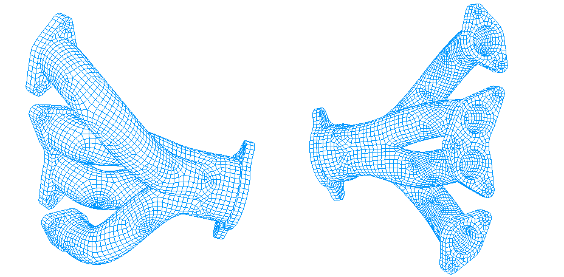
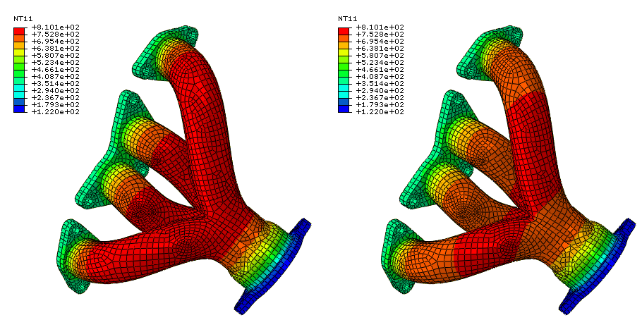
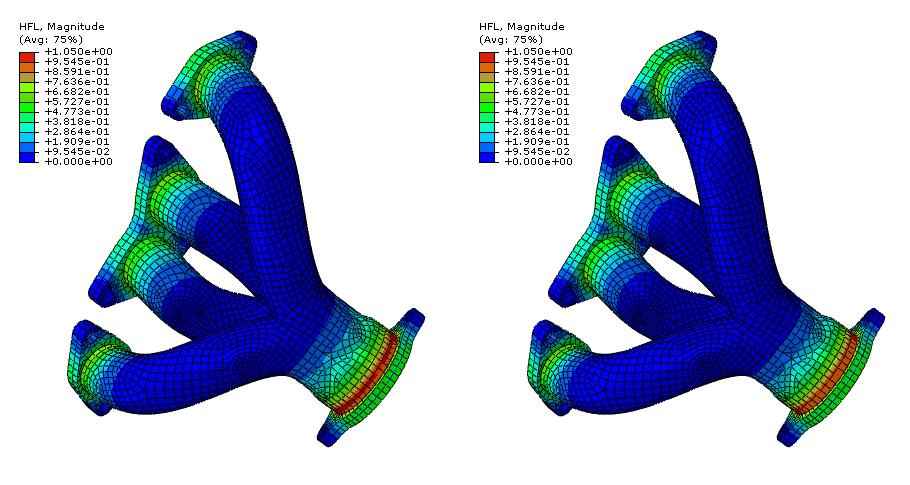

# 5.1.5 Conductive, convective, and radiative heat transfer in an exhaust manifold

**Product: **Abaqus/Standard  

### Objectives

 This example demonstrates the following Abaqus features and techniques:
- computing steady-state heat transfer in an exhaust manifold,
- comparing results for radiation heat transfer formulations using cavity radiation and average-temperature radiation conditions, and
- using film conditions to simulate the convective heat transfer from the exhaust gases.

### Application description

Heat transfer in engine exhaust manifolds is governed by three effects: conduction through the metal, convection from the hot exhaust gases, and radiative exchange between different parts of the metal surface. This example illustrates the computation of the equilibrium thermal state of a manifold subject to these effects. The units of length in this example are millimeters; otherwise, standard metric units are used.

 The procedure consists of a single heat transfer step in which the thermal loading conditions are ramped up from zero. The boundary constraints on the manifold flanges are a simplification of those experienced under operating conditions: the temperatures at the cylinder head and the outlet are fixed. Convection due to heat transfer from the hot exhaust is applied at the internal surfaces of the manifold tubes. Radiation is modeled between the internal surfaces of the tubes using several methods: the cavity radiation method, with and without cavity parallel decomposition enabled, and using average-temperature radiation conditions.

### Geometry

The exhaust manifold part being analyzed is depicted in [Figure 5.1.5--1](ch05s01aex121.md#heattransfermanifold_mesh). It consists of a four tube exhaust manifold with three flanges, as in ["Exhaust manifold assemblage," Section 5.1.3](ch05s01aex119.md).

### Materials

The manifold is cast from gray iron with a thermal conductivity of 4.5 102 W/mm/C, a density of 7800  109 kg/mm3, and a specific heat of 460 J/kg/C. The manifold begins the analysis with an initial temperature of 20C. The part is dimensioned in millimeters, and the temperature is measured in C, so the Stefan Boltzmann constant is taken as 5.669  1014 W/mm2/K4 and absolute zero is set at 273.15C below zero. The surface emissivity of gray iron is taken as a constant value of 0.77. 

### Initial conditions

The initial temperature of the manifold is set to 20C.

### Boundary conditions and loading

The hot exhaust gases create a heat flux applied to the interior tube surfaces. In this example this effect is modeled using a surface-based film condition, with a constant temperature of 816C and a film condition of 500  106 W/mm2/C. A temperature boundary condition of 355C is applied at the flange surfaces attached to the cylinder head, and a temperature boundary condition of 122C is applied at the flange surfaces attached to the exhaust.

### Abaqus modeling approaches and simulation techniques

The radiative transfer between the interior surfaces of the manifold tubes is modeled using several methods for comparison: through the cavity radiation method, with and without cavity parallel decomposition enabled, and through average-temperature radiation conditions (see ["Cavity radiation," Section 41.1.1 of the Abaqus Analysis User's Guide](../usb/usb-link.md#usb-cni-acavityradiation)). Using the cavity radiation methods, geometric view factors are computed in Abaqus between each facet of the mesh on the exposed interior tube surface. These view factors quantify the effect of radiative transfer between each facet and each of the other facets in the user-defined cavity. The view factors, in turn, are used to compute a fully populated interaction matrix to compute the radiation flux between each pair of facets in the model. When modeling radiation through average-temperature radiation conditions, the flux at each facet is equal to that resulting from a black enclosure, held at the average temperature in the cavity, enclosing the facet. For the cavity radiation methods, some of the facets on the interior of the manifold have a view of the exterior, which is not modeled in this example. The exterior ambient temperature is taken to be the average of the temperatures used for the cylinder head and exhaust boundary conditions. Only the temperatures on the surface are considered when using average-temperature radiation conditions, so an ambient temperature does not need to be defined. For simplicity, all methods are defined using a single surface that includes all of the interior facets of the manifold tubes. 

### Summary of analysis cases

| Case 1 | Steady-state heat transfer with film and radiation effects; radiation modeled using the cavity radiation method without parallel decomposition enabled. |
| --- | --- |
| Case 2 | Steady-state heat transfer with film and radiation effects; radiation modeled using the cavity radiation method with parallel decomposition enabled. |
| Case 3 | Steady-state heat transfer with film and radiation effects; radiation modeled using average-temperature radiation conditions. |

The following sections discuss analysis considerations that are applicable to all cases.

### Analysis types

Due to the fourth-order dependence of the radiation flux on the surface temperatures, this example problem is intrinsically nonlinear. For all cases the steady-state heat transfer procedure is used. This is a general analysis step in Abaqus, chosen because iteration is required for convergence. An initial increment is chosen as one-tenth of the final value.

### Mesh design

The manifold is meshed using linear hexahedral and wedge heat transfer elements with linear interpolation.

### Discussion of results and comparison of cases

[Figure 5.1.5--2](ch05s01aex121.md#heattransfermanifold_temp) shows the nodal temperature field for the manifold. On the left, results obtained using the cavity radiation method are shown (results with and without cavity parallel decomposition enabled were identical); on the right, results using the average-temperature radiation conditions are shown. In this problem we observe good agreement between all methods, although some differences can be discerned between the cavity radiation and average-temperature radiation condition results in the plots. 

The peak temperature in the field is higher when using the cavity radiation method. The effect of radiation heat transfer is to smooth out the temperature field in the equilibrium solution: high-temperature zones radiate more heat, which is absorbed by the cooler areas. In the cavity radiation method, this smoothing effect is limited and affected by the geometric view factors: the distance and orientation of the surface facets affects the degree to which radiation exchange can occur. This is not the case when using average-temperature radiation conditions. Each facet absorbs or emits radiative heat flux based on its temperature and the averaged cavity temperature only; the localizing effects of view factors are ignored. Therefore, the average method results reflect the greater smoothing effect of the radiation model used, resulting in lower peak values.

[Figure 5.1.5--3](ch05s01aex121.md#heattransfermanifold_flux) shows the flux magnitude results. The flux field shows even greater agreement than the temperature field.

Solving the cavity radiation equations without parallel decomposition enabled involves the inversion of a fully populated matrix operator. Therefore, this method is significantly more computationally expensive than either the cavity radiation method with parallel decomposition enabled (even when only 1 CPU is used) or the average-temperature radiation condition method. [Table 5.1.5--1](ch05s01aex121.md#heattransfermanifold-cost) illustrates the differences and compares the computational costs between the methods. In the case of the cavity radiation method with parallel decomposition enabled, we include the performance results for 1, 2, and 4 CPUs. No significant performance enhancement was observed when using multiple CPUs with the other two methods. In this problem the cavity surface contained 4505 facets—it consists of the entire interior of the manifold. The timing results were obtained on a desktop computer using Xeon processors, but the relative comparisons between run times are more pertinent than the specific run times.

### Input files

[heattransfermanifold.inp](../eif/heattransfermanifold.inp)

Input data for the analysis using average-temperature radiation conditions.

[heattransfermanifold_cavity.inp](../eif/heattransfermanifold_cavity.inp)

Input data for the analysis using the cavity radiation method without parallel decomposition enabled.

[heattransfermanifold_cavity_parallel.inp](../eif/heattransfermanifold_cavity_parallel.inp)

Input data for the analysis using the cavity radiation method with parallel decomposition enabled.

### References

**Abaqus Analysis User's Guide**
- ["Steady-state analysis" in "Uncoupled heat transfer analysis," Section 6.5.2 of the Abaqus Analysis User's Guide](../usb/usb-link.md#usb-anl-aheattransfer-steadystate)
- ["Cavity radiation," Section 41.1.1 of the Abaqus Analysis User's Guide](../usb/usb-link.md#usb-cni-acavityradiation)

**Abaqus Keywords Reference Guide**
- [*CAVITY DEFINITION](../key/key-link.md#usb-kws-mcavitydef)
- [*HEAT TRANSFER](../key/key-link.md#usb-kws-hheattrans)
- [*RADIATION VIEW FACTOR](../key/key-link.md#usb-kws-hradviewfactor)
- [*SFILM](../key/key-link.md#usb-kws-hsfilm)
- [*SRADIATE](../key/key-link.md#usb-kws-hsradiate)

**Abaqus Theory Guide**
- ["Uncoupled heat transfer analysis," Section 2.11.1 of the Abaqus Theory Guide](../stm/stm-link.md#stm-anl-uncoupledheat)
- ["Cavity radiation," Section 2.11.4 of the Abaqus Theory Guide](../stm/stm-link.md#stm-anl-cavradiation)
- ["View factor calculation," Section 2.11.5 of the Abaqus Theory Guide](../stm/stm-link.md#stm-anl-viewfactor)

### Table

**Table 5.1.5–1** Relative computational costs of the cavity radiation methods and average-temperature radiation conditions.
|  | Cavity Radiation | Average-Temperature Radiation Conditions |
| --- | --- | --- |
| Parallel Decomposition | No Parallel Decomposition |
| 1 CPU | 2 CPUs | 4 CPUs |
| Increments | 6 | 6 | 6 | 6 | 6 |
| Total iterations | 14 | 14 | 14 | 7 | 10 |
| Wall clock time (sec) | 147 | 81 | 51 | 375 | 12 |

### Figures

**Figure 5.1.5–1** Manifold mesh.

**Figure 5.1.5–2** Equilibrium temperature field in the manifold using cavity radiation (left) and  average-temperature radiation conditions (right).

**Figure 5.1.5–3** Equilibrium heat flux magnitude field in the manifold using cavity radiation (left) and  average-temperature radiation conditions (right).

