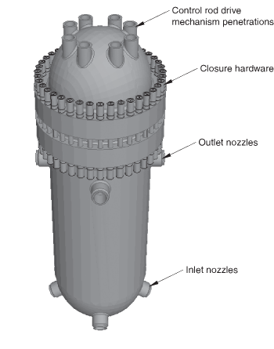
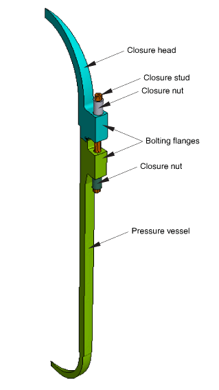
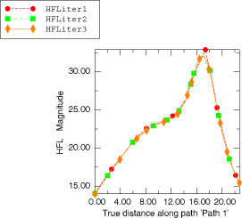
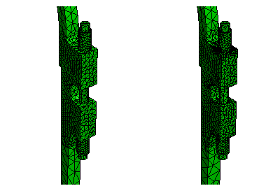
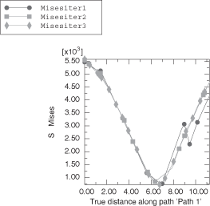
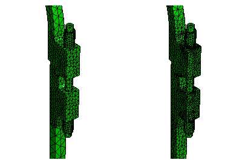

# 5.1.6 Thermal-stress analysis of a reactor pressure vessel bolted closure

**Products: **Abaqus/Standard  Abaqus/CAE  

### Objectives

This example demonstrates the following Abaqus features and techniques for heat transfer and static stress analyses:
- specifying adaptive remeshing rules in different regions of a model in a particular analysis step;
- using an automated process to remesh the model adaptively based on the remeshing rules specified; and
- viewing error indicator results as a means of assessing mesh quality.

### Application description

This example examines the thermal and stress behavior of the bolted closure region of a nuclear reactor vessel assembly. The vessel assembly forms the pressure boundary surrounding the fuel core. This example considers the strength of sustaining the following loading conditions: 
- pre-tension load in the stud bolts,
- constant internal pressure, and
- specified heat-up/cool-down rate.

These loading conditions cover the most basic design requirements of a reactor vessel. A short and rapid temperature change is one of the most severe loading cases and will be considered in this example. The International System of units (SI) will be used in the following sections to describe the model. The analysis itself is performed in English units. The model and analysis are derived from details of the Shippingport pressurized water reactor (1958).

### Geometry

The problem domain comprises a cylindrical vessel shell, a hemispherical bottom head, a dome-shaped closure head, and the closure and seal assembly, as shown in [Figure 5.1.6--1](ch05s01aex122.md#exa-sta-reactorwhole). The overall height of the vessel shell including the bottom head is 7650 mm (301 in). The bottom head has an inner radius of 1410 mm (55.5 in) and a thickness of 157 mm (6.18 in). The inner radius of the vessel shell is 1380  mm (54.5  in), and the thickness is 213 mm (8.40 in). The closure head has a height of 2330 mm (91.8 in), an inner radius of 1310 mm (51.5 in), and a thickness of 210 mm (8.25 in). The closure head is attached to the vessel shell by a seal and closure assembly. The assembly includes 40 stud bolts passing through the bolting flanges of the closure head and the vessel shell, each of which is restrained by two cap nuts. To complete the closure assembly, an omega seal is welded to the under surface of the closure head and top surface of the vessel shell. The stud bolt is 2290 mm (90 in) in length and has a diameter of 146 mm (5.75 in). The closure nuts are 304 mm (12 in) long with a thickness of 28.6 mm (1.13 in). 

### Boundary conditions and loading

The outside of the vessel is exposed to air that has a constant temperature of 21C (70F). The inside of the vessel is filled with hot water with an operating temperature of 320C (600F). During a cool-down process, the internal temperature is reduced by 38C (100F) in two hours. The water inside imposes a constant pressure of 1.38  107 Pa (2000 psi) on the internal surface of the vessel.

### Abaqus modeling approaches and simulation techniques

The objective of this analysis is an understanding of stresses near the vessel-to-head interfaces. Although the assembly contains many features, such as inlet and outlet nozzles, the example ignores these details since they are far away from the vessel-to-head interface. The rest of the geometry is cyclically symmetric, which allows the example to model the entire 360 structure at a reduced computational expense by analyzing only a single repetitive sector of the model. Since there are 40 stud bolts along the circumference of the reactor vessel, the following analysis is performed on a 9 model with one sector as shown in [Figure 5.1.6--2](ch05s01aex122.md#exa-sta-reactorsector).

 The example also takes advantage of the fact that the thermal and mechanical responses of the vessel are only weakly coupled. Based on this fact, a sequentially coupled thermal-stress analysis is performed on the reactor vessel. The distribution of the temperature field is obtained first through a heat transfer analysis, then the mechanical response of the vessel is obtained by performing a static stress analysis with the temperature field specified using the results of the thermal analysis. 

### Summary of analysis cases

| Case 1 | Steady-state and transient heat transfer analyses, with adaptive remeshing in Abaqus/CAE. |
| --- | --- |
| Case 2 | Static stress analysis, with adaptive remeshing in Abaqus/CAE. |

The following sections discuss analysis considerations that are applicable to both analyses. More detailed descriptions are provided later including discussions of results and listings of the files provided. The models for the two analyses were generated using Abaqus/CAE and imported ACIS-format files. 

### Analysis types

The thermal analysis includes a steady-state and a transient heat transfer step. The structural analysis is performed using multiple linear general static steps.

### Mesh design

The omega seal is meshed with first-order brick elements, while the rest of the model is meshed with second-order tetrahedral elements. The geometry is partitioned to create a fine initial mesh in the area near the closure assembly, where the geometry is most complex and high stress and heat flux are expected. The purpose of this mesh design is to obtain an accurate estimate of the error indicators specified in the remeshing rules, which will result in faster convergence in the adaptivity procedure. 

##### Adaptive remeshing rules

The patch recovery techniques that Abaqus/CAE uses to calculate the error indicator variables can have a significant impact on the analysis solution time. In particular, the element energy density is calculated after each increment and is more costly than the other error indicator variables. To reduce the computational expense, the omega seal is excluded from the region where remeshing rules are specified. The closure head and the vessel shell are also partitioned in such a way that regions relatively farther away from the stud bolt are not included in the remeshing regions. Four separate remeshing rules are defined in the closure head, the vessel shell, the cap nuts, and the stud bolt. In both the thermal and structural analyses, the remeshing rules are specified in only the last step.  

Additional details of the remeshing rules used in the two analyses are discussed with each example.

### Constraints

 To simulate the welding constraints, the bottom surfaces of the omega seal are tied to the surfaces of the bolting flanges in both analyses.

#### Adaptivity process

Each adaptivity process specifies a maximum number of three remesh iterations. 

### Heat transfer analysis

The example starts by performing a heat transfer analysis to obtain the temperature distribution in the pressure vessel under the thermal loading.

### Analysis types

 The analysis consists of a steady-state heat transfer step, representing the steady operation of the reactor. This step is followed by a transient heat transfer step, representing a rapid cool-down event. The resulting temperatures obtained are applied to the subsequent mechanical analysis.

### Mesh design

When performing the heat transfer analysis, first-order hexahedral diffusive heat transfer elements (DC3D8) are used in the omega seal, and the rest of the geometry is meshed with second-order tetrahedral diffusive heat transfer elements (DC3D10).

##### Adaptive remeshing rules

The heat flux error indicator is chosen in all remeshing rules. For each remeshing rule the sizing method is set to uniform error distribution and the error indicator target is set to automatic target reduction. 

### Material model

 The heat transfer analysis requires specification of thermal conductivity, which is 46.7 W/m/C (2.25 Btu/h/in/F), and specific heat, which is 460 J/kg/C (0.11 Btu/lb/F). The density of the material is also specified, which is 7850 kg/m3 (0.284 lb/in3). One solid, homogenous section is used to assign material properties to the elements.

### Initial conditions

The initial temperature is set to 21C (70F) in the entire model. 

### Boundary conditions

No temperature boundary conditions are applied. The thermal response of the model is driven entirely by thermal loading through film coefficients.

### Interactions

Conductive heat transfer is defined between adjacent/contacting surfaces, and a gap conductance coefficient is specified, which is 1220 W/m2/C (1.5 Btu/h/in2/F). Heat flux on the surfaces is applied by film conditions. The outer surfaces are exposed to air, which has a film coefficient of  28 W/m2/C (0.035 Btu/h/in2/F). The inner surfaces are in contact with water with a film coefficient of  580 W/m2/C  (0.70 Btu/h/in2/F). The outer surfaces are initially associated with a sink temperature of 21C (70F), and the inner surfaces, 320C (600F). During a subsequent two-hour cooling process, the sink temperature associated with the inner surfaces is reduced by 38C (100F).

### Analysis steps

 The heat transfer analysis is performed using a steady-state step followed by a transient step. The purpose of the first step is to obtain a steady-state solution of temperature distribution in the whole model. The second step lasts for 7200 seconds (2 hours), and it simulates the response of the thermal model during a rapid cooling process. 

### Convergence

The convergence of the error indicator HFLERI during a three-iteration adaptivity process is presented in [Table 5.1.6--1](ch05s01aex122.md#exa-sta-reactor-tablethermal). Convergence is observed in each of the remeshing regions.

### Run procedure

The model for the heat transfer analysis is generated using Abaqus/CAE to import the geometry, create the thermal loading, mesh the assembly, create the remeshing rules, and run the adaptivity process. Python scripts are provided to build the model and to submit the adaptivity process. The scripts can be run interactively or from the command line. 

To create the heat transfer model, select ****File****Run Script**** from the Abaqus/CAE main menu and select `adaptReactorVesselHT_model.py`. 

When you are ready to run the adaptivity process, select ****File****Run Script**** and select `adaptReactorVesselHT_job.py`. After the Abaqus Scripting Interface scripts have created the model and run the adaptivity process, you can use Abaqus/CAE to view the model and to explore variations of the example. 

### Results and discussion

 The magnitude of the heat flux (HFL) along a particular path near the head to vessel interface is shown in [Figure 5.1.6--3](ch05s01aex122.md#exa-reactor-heatflux). This figure shows the spatial variation of the heat flux as the mesh is refined through the three remesh iterations. [Figure 5.1.6--4](ch05s01aex122.md#exa-reactor-heatmesh) shows the original mesh and the final mesh resulting from the adaptive remeshing process. The refined mesh shows how Abaqus/CAE reacted to the higher temperature gradients in the bolted flange region.

### Structural analysis

The temperature distribution calculated in the heat transfer case will now augment bolting and pressure loads to define the structural loading of the vessel assembly.

### Analysis types

A series of static steps is performed to simulate the mechanical response of the model under both thermal and force loading.

### Mesh design

The omega seal is meshed with first-order reduced-integration continuum elements (C3D8R), and the rest of the geometry is meshed with modified second-order tetrahedral elements (C3D10M).

##### Adaptive remeshing rules

 The response of the model varies from step to step during the analysis; therefore, the time history-dependent error indicator ENDENERI is chosen to capture the extreme of the model's response to the load history. For each remeshing rule the sizing method is set to uniform error distribution and the error indicator target is set to automatic target reduction.

### Material model

 The linear static structural analysis requires specification of Young’s modulus, which is 2.07  107 N/m2 (3.0  107 lbf/in2), and Poisson’s ratio, which is 0.29. A thermal expansion coefficient is also defined, which is 6.3  106. One solid, homogenous section is used to assign material properties to the elements.

### Boundary conditions

 Symmetry boundary constraints are placed on the two side surfaces of the sector. Since the two symmetry constraints overlap at the centerline and such definitions are not allowed by the analysis input file processor, partitions are made on the side surfaces so that the centerline and a small part of its surrounding region are excluded from the symmetry boundary constraints. The nodes on the centerline are constrained separately and are free to move only in the axial direction. The center node on the outer surface of the bottom head is fixed to prevent rigid body motion.

### Loads

 A pre-tension load of 2200 kN (5  106 lbf) is applied to the stud bolt. The inner surfaces of the head and the vessel shell are subject to a constant pressure of 1.38  107 Pa (2000 psi) from the water.

### Predefined fields

When the bolt loading is applied in the pre-assembly step, a constant temperature of 21C (70F) is applied. The temperature field is specified using the thermal results from the previous steady-state heat transfer analysis when the inner pressure is applied. The results of the temperature after each increment during the transient heat transfer analysis are imported in the last step when no additional loading is applied.

### Interactions

The outer surface of the stud bolt is tied to the inner surfaces of the cap nuts. Small-sliding surface-to-surface contact interactions are defined between the contact surfaces of the cap nuts and the bolting flange on the head and vessel shell. A friction coefficient of 0.2 is specified in the contact between the cap nuts and the bolting flanges. The analysis assumes that the contact between the closure head and the vessel shell is frictionless. The augmented Lagrange method is chosen to enforce the contact constraints.

### Analysis steps

The structural analysis is performed by using two static steps. The bolt force and internal pressure are both applied in the first step, a predefined temperature field is also specified using the results obtained in the steady-state heat transfer step. The temperature obtained from the transient heat transfer step is specified in the last loading step, and the structure expands with the change of temperature.

### Output requests

Default field output requests are specified in the first step. In the second step, field output requests are made at specified time points to match the results of the structural analysis to those of the thermal analysis at the exact step times.  

### Convergence

The convergence of error indicators ENDENERI and MISESERI during a three-iteration adaptivity process is presented in [Table 5.1.6--2](ch05s01aex122.md#exa-sta-reactor-tablestruct). 

### Run procedure

The model for the static analysis is generated using Abaqus/CAE to import the geometry, create the structural loading, mesh the assembly, create the remeshing rules, and run the adaptivity process. Python scripts are provided to build the model and to submit the adaptivity process. The scripts can be run interactively or from the command line. 

To create the structural model, select ****File****Run Script**** from the Abaqus/CAE main menu and select `adaptReactorVesselSTR_model.py`. 

When you are ready to run the adaptivity process, select ****File****Run Script**** and select `adaptReactorVesselSTR_job.py`. After the Abaqus Scripting Interface scripts have created the model and run the adaptivity process, you can use Abaqus/CAE to view the model and to explore variations of the example. 

### Results and discussion

 The magnitude of the Mises stress (MISES) along a particular path near the head to vessel interface is shown in [Figure 5.1.6--5](ch05s01aex122.md#exa-reactor-mises). This figure shows the spatial variation of the Mises stress as the mesh is refined through the three remesh iterations. [Figure 5.1.6--6](ch05s01aex122.md#exa-reactor-structmesh) shows the original mesh and the final mesh resulting from the adaptive remeshing process. The refined mesh shows how Abaqus/CAE reacted to the higher stress gradients near the nut-to-bolted flange interfaces and the vessel-to-head interface.

### Discussion of results and comparison of cases

The thermal and structural cases presented in this example are complementary; the structural case depends on the thermal case. You can compare how adaptive remeshing refines the mesh in each case. As seen, in [Figure 5.1.6--4](ch05s01aex122.md#exa-reactor-heatmesh) and [Table 5.1.6--1](ch05s01aex122.md#exa-sta-reactor-tablethermal) for the heat transfer case and [Figure 5.1.6--6](ch05s01aex122.md#exa-reactor-structmesh) and [Table 5.1.6--2](ch05s01aex122.md#exa-sta-reactor-tablestruct) for the structural case, the mesh refinement is significantly different.

### Files

To create the models and to run the adaptivity processes, you can use the Python scripts listed below.

##### **Heat transfer analysis**

[adaptReactorVesselHT_model.py](../eif/adaptReactorVesselHT_model.py)

Script to create the model.

[adaptReactorVesselHT_job.py](../eif/adaptReactorVesselHT_job.py)

Script to analyze the model.

##### **Structural analysis**

[adaptReactorVesselSTR_model.py](../eif/adaptReactorVesselSTR_model.py)

Script to create the model.

[adaptReactorVesselSTR_job.py](../eif/adaptReactorVesselSTR_job.py)

Script to analyze the model.

### References

**Abaqus Analysis User's Guide**
- ["Adaptive remeshing: overview," Section 12.3.1 of the Abaqus Analysis User's Guide](../usb/usb-link.md#usb-anl-aadpover)

**Abaqus/CAE User's Guide**
- ["Understanding adaptive remeshing," Section 17.13 of the Abaqus/CAE User's Guide](../usi/usi-link.md#usi-mgn-conc-adaptivity)

**Other**

- Naval Reactors Branch, Division of Reactor Development, United States Atomic Energy Commission, *The Shippingport Pressurized Water Reactor,* Reading, Massachusetts: Addison Wesley Publishing Company, 1958.

### Tables

**Table 5.1.6–1** The convergence of the thermal error indicator HFLERI during an adaptivity process with three iterations.
| Remeshing Region | Error Indicator Result (%) | Element Count |
| --- | --- | --- |
| 1 | 2 | 3 | 1 | 2 | 3 |
| Stud Bolt | 11.7 | 7.0 | 4.1 | 1080 | 1386 | 2112 |
| Closure Head | 4.9 | 2.5 | 1.7 | 2210 | 4846 | 9226 |
| Cap Nuts | 2.8 | 1.5 | 1.4 | 1500 | 4210 | 5317 |
| Vessel Shell | 5.4 | 2.3 | 1.5 | 2443 | 5124 | 11036 |

**Table 5.1.6–2** The convergence of the stress-based error indicator ENDENERI during an adaptivity process with three iterations.
| Remeshing Region | Error Indicator Result (%) | Element Count |
| --- | --- | --- |
| 1 | 2 | 3 | 1 | 2 | 3 |
| Stud Bolt | 1.8 | 1.7 | 1.5 | 1334 | 1737 | 2211 |
| Closure Head | 8.7 | 4.7 | 3.2 | 2210 | 5120 | 13320 |
| Cap Nuts | 6.0 | 5.7 | 4.8 | 1500 | 3315 | 7534 |
| Vessel Shell | 6.7 | 3.6 | 2.7 | 2438 | 5813 | 15290 |

### Figures

**Figure 5.1.6–1** Reactor vessel assembly.

**Figure 5.1.6–2** 9 sector model.

**Figure 5.1.6–3** Heat flux along a path near the vessel-to-head interface.

**Figure 5.1.6–4** Original and refined mesh for the heat transfer analysis.

**Figure 5.1.6–5** Mises stress along a path near the vessel-to-head interface.

**Figure 5.1.6–6** Original and refined mesh for the structural analysis.

