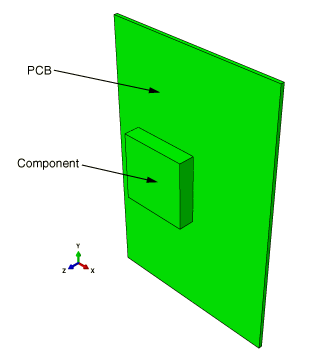
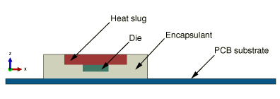
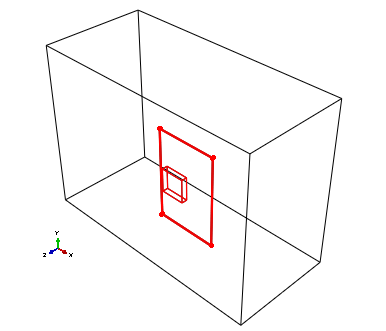
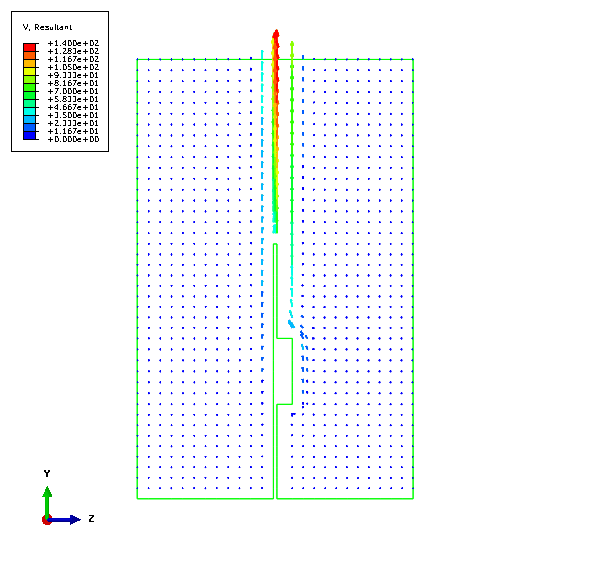
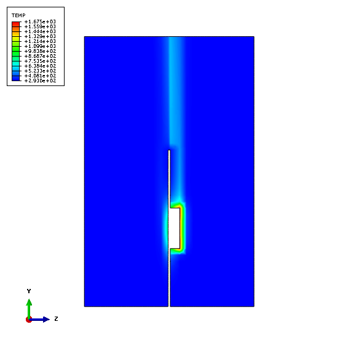
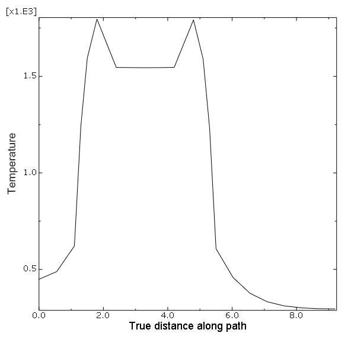
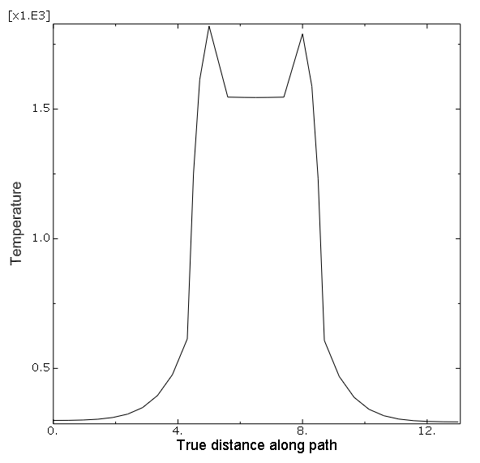

# 6.1.1 Conjugate heat transfer analysis of a component-mounted electronic circuit board

**Products: **Abaqus/Standard  Abaqus/Explicit  Abaqus/CFD  Abaqus/CAE  

### Objectives

This example demonstrates Abaqus techniques to analyze a conjugate heat transfer problem using:
- Abaqus/CFD for solving both the laminar flow field and buoyancy-driven natural convection heat transfer occurring external to a structure,
- Abaqus/Standard or Abaqus/Explicit for solving the heat transfer within the structure, and
- the co-simulation technique to maintain fidelity of the solution on the interface.

### Application description

This example examines the transient conjugate heat transfer between a single printed circuit board (PCB)–mounted electronic component and the ambient air. The component is subjected to a passive power dissipation that results in the transfer of heat both within the component and the PCB due to conduction. Furthermore, the heated surface of the component and the PCB induces a temperature-dependent density differential in the surrounding air, thereby setting up a buoyancy-driven natural convection process external to the surface. Heat is thus transferred from the component and PCB surfaces to the ambient air through this convection process. Understanding the resulting conduction-convection conjugate heat transfer phenomenon results in more accurate damage estimation and life prediction for electronic components.

The details of the model are largely derived from Eveloy and Rodgers (2005).

### Geometry

Nominal component/PCB geometry dimensions are considered. The PCB dimensions are 7.8  11.6  0.16 cm. The mounted electronic component consists of an encapsulant of dimension 3  3  0.7 cm that encapsulates a heat slug of dimension 1.8  1.8  0.3 cm mounted atop a die of dimension 0.75  0.75  0.2 cm. The assembled PCB-component package is shown in [Figure 6.1.1--1](ch06s01aex123.md#assembled_pcb). The cross-section view of the assembled package is shown in [Figure 6.1.1--2](ch06s01aex123.md#circuit-board_crssecn-nls). The  size of the computational domain that encloses the electronic package is taken to be 27.8  20  12.56 cm for the Abaqus/CFD flow computations.

### Materials

The PCB material has a thermal conductivity of 19.25 W/m/K, a density of 8950 kg/m3, a specific heat of 1300 J/kg/K, and a thermal expansion of 1.6  105 /K. The heat slug material has a thermal conductivity of 398 W/m/K, a density of 8940 kg/m3, a specific heat of 385 J/kg/K, and a thermal expansion of 3.3  106 /K. The die material has a thermal conductivity of 130.1 W/m/K, a density of 2330 kg/m3, a specific heat of 712 J/kg/K, and a thermal expansion of 3.3  106 /K. The encapsulant material has a thermal conductivity of 0.63 W/m/K, a density of 1820 kg/m3, a specific heat of 882 J/kg/K, and a thermal expansion of 1.9  105 /K. For the external fluid domain, properties of air, namely a density of 1.127 kg/m3, a thermal conductivity of 2.71  102 W/m/K, a specific heat of 1006.4 J/kg/K, a thermal expansion of 3.43  103 /K, and a viscosity of 1.983  105 kg/m/s, are assumed.

### Initial conditions

The initial temperature of the assembled electronic package and the external fluid (ambient air) is set to 293 K. In addition, the fluid is initially assumed to be quiescent and, hence, its velocity is set to zero everywhere.

### Boundary conditions and loading

The electronic component of the assembled package is subjected to a passive power dissipation corresponding to a specified body heat flux value of 5  107 W/m3. The bottom surface of the external computational domain is assumed to be a rigid floor, and an adiabatic wall condition is assumed there. The electronic package is firmly attached to the bottom of the computational domain, as shown in [Figure 6.1.1--3](ch06s01aex123.md#cfd_domain). The computational domain boundaries for the external flow and heat transfer calculations are positioned at sufficient distances from the assembled electronic package such that the effects of the boundaries on the results are negligible. A no-slip, no-penetration flow wall boundary condition is enforced at the bottom surface. At the top, an outlet boundary condition is specified with the fluid pressure set to zero. For all other boundaries, free-stream conditions are applied for both the velocity and temperature.

Gravity loading is applied along the negative *y*-axis (see [Figure 6.1.1--3](ch06s01aex123.md#cfd_domain)).

### Interactions

The component-mounted circuit board is subjected to volumetric power dissipation, which generates heat within the structure. Heat transfer to the surface of the structure takes place via conduction. The heated surface then generates a buoyancy-driven natural convection in the surrounding ambient air.

### Abaqus modeling approaches and simulation techniques

The co-simulation approach coupling Abaqus/CFD to either Abaqus/Standard or Abaqus/Explicit is used to solve the conjugate heat transfer problem. The Abaqus/CFD model of the co-simulation consists of the external region bounding the electronic package (see [Figure 6.1.1--3](ch06s01aex123.md#cfd_domain)); whereas, the component-mounted PCB electronic package (see [Figure 6.1.1--1](ch06s01aex123.md#assembled_pcb)) is modeled either in Abaqus/Standard or Abaqus/Explicit. Co-simulation regions across which data will be exchanged during the co-simulation analysis are identified on each model at the location of the electronic package surface. 

### Analysis types

The Abaqus/Standard model includes a transient heat transfer step; whereas the Abaqus/Explicit model includes a dynamic coupled thermal-stress analysis step with all translational degrees of freedom fixed. The Abaqus/CFD model includes an incompressible laminar flow analysis coupled with the energy equation that governs the temperature distribution.

### Mesh design

The Abaqus/Standard model is meshed with linear hexahedral (DC3D8) elements. The Abaqus/Explicit model is meshed with coupled linear hexahedral (C3D8RT) elements. The Abaqus/CFD model is meshed with linear hexahedral (FC3D8) fluid elements.

### Results and discussion

The heat generated within the electronic component gets distributed to its surface and also to the surface of the PCB substrate by conduction. The heated air near the component surface becomes less dense and rises upward due to buoyancy. The Grashof number (a parameter describing the ratio of buoyancy to viscous forces) for this problem, based on the board length, was estimated to be of the order 106 as reported by Eveloy and Rodgers (2005). Because of incompressibility, the upward rising air entrains cold air from the surroundings, thereby setting up a natural convection flow. The upward rising hot air and entrained cold air from the sides are illustrated in [Figure 6.1.1--4](ch06s01aex123.md#velocity_vectors), where the velocity vectors (V) are plotted on the center cross-sectional slice of the domain in the *y*–*z* plane. In [Figure 6.1.1--4](ch06s01aex123.md#velocity_vectors) entrainment from the out-of-plane direction appears as small dots. The contours of temperature distribution (TEMP) on the same cross-sectional slice are shown in [Figure 6.1.1--5](ch06s01aex123.md#temperature_contours), where the hot electronic component surface and the upward rising thermal plume can be clearly seen. The temperature distribution (NT11) along a particular path in the spanwise direction (*x*-axis) on the surface of the component-mounted electronic package is shown in [Figure 6.1.1--6](ch06s01aex123.md#spanwise_temperature). Heat is seen to spread from the component surface (the area of near-constant heat distribution) to the surfaces of the PCB substrate on either side. The temperature distribution (NT11) along a particular path in the streamwise direction (*y*-axis) on the surface of the electronic package shown in [Figure 6.1.1--7](ch06s01aex123.md#streamwise_temperature) illustrates the same phenomenon. These distributions are qualitatively similar to the experimentally measured temperature profiles given in Eveloy and Rodgers (2005).

### Files

[circuit_board_cht.py](../eif/circuit_board_cht.py)

Script to generate the model in Abaqus/CAE using the orphan meshes from cfd_mesh.inp and std_heat_transfer.inp.

[cfd_mesh.inp](../eif/cfd_mesh.inp)

Orphan mesh for the Abaqus/CFD domain.

[std_heat_transfer.inp](../eif/std_heat_transfer.inp)

Orphan mesh for the Abaqus/Standard domain.

[cht_circuitboard_cfd.inp](../eif/cht_circuitboard_cfd.inp)

Abaqus/CFD model used for co-simulation with Abaqus/Explicit.

[cht_circuitboard_xpl.inp](../eif/cht_circuitboard_xpl.inp)

Abaqus/Explicit model used for co-simulation with Abaqus/CFD.

[cht_circuitboard_config.xml](../eif/cht_circuitboard_config.xml)

Configuration file used for the Abaqus/CFD to Abaqus/Explicit co-simulation.

### References

**Abaqus Analysis User's Guide**
- ["Incompressible fluid dynamic analysis," Section 6.6.2 of the Abaqus Analysis User's Guide](../usb/usb-link.md#usb-anl-aifluiddyn)
- ["Fluid-to-structural and conjugate heat transfer co-simulation," Section 17.3.2 of the Abaqus Analysis User's Guide](../usb/usb-link.md#usb-anl-acosimcfdtoabq)

**Other**

- Eveloy, V., and P. Rodgers, "Prediction of Electronic Component-Board Transient Conjugate Heat Transfer," IEEE Transactions on Components and Packaging Technologies, vol. 28, no. 4, pp. 817--829, 2005.

### Figures

**Figure 6.1.1–1** Component-mounted electronic circuit board.

**Figure 6.1.1–2** Cross-sectional view of the electronic package indicating the different materials forming the component and circuit board.

**Figure 6.1.1–3** Electronic package anchored to the bottom of the computational domain (enclosing box).

**Figure 6.1.1–4** Plot of velocity vectors induced due to natural convection on a cross-sectional slice.

**Figure 6.1.1–5** Plot of temperature contours on a cross-sectional slice.

**Figure 6.1.1–6** Temperature along a path in the spanwise direction (*x*-axis) on the surface of the electronic package.

**Figure 6.1.1–7** Temperature along a path in the streamwise direction (*y*-axis) on the surface of the electronic package.

