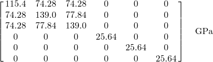
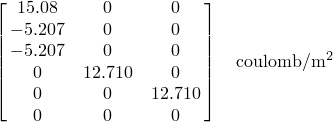
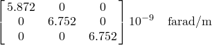
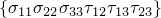
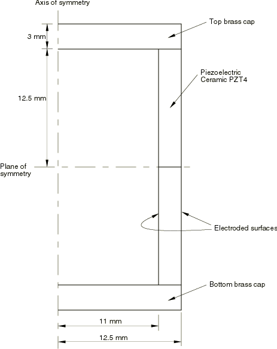
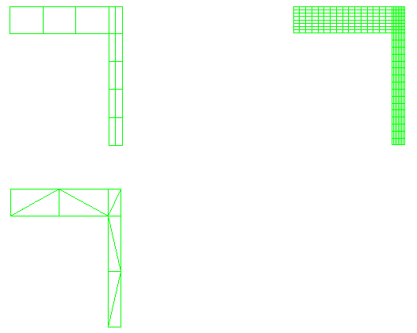
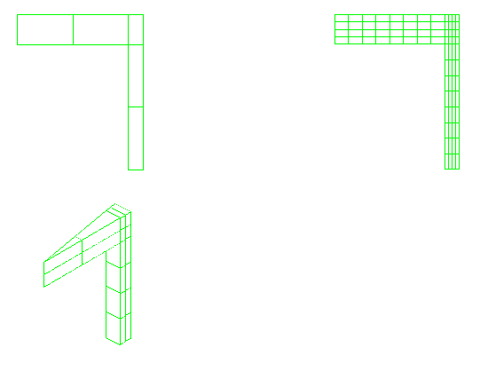
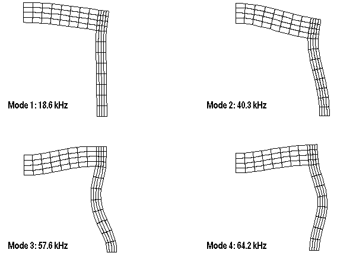

# 7.1.1 Eigenvalue analysis of a piezoelectric transducer

**Product: **Abaqus/Standard  

This problem performs an eigenspectrum analysis of a cylindrical transducer consisting of a piezoelectric material with brass end caps. Various elements are used in the analysis. The elements range from axisymmetric elements to three-dimensional elements, using both lower- and higher-order elements. The basis of the piezoelectric capability in Abaqus is described in ["Piezoelectric analysis," Section 2.10.1 of the Abaqus Theory Guide](../stm/stm-link.md#stm-anl-piezoelectric).

### Geometry and material

This problem is identical to the one discussed in a report by Mercer et al. (1987). The structure is shown in [Figure 7.1.1--1](ch07s01aex124.md#sxmpiezotrans-geom) and consists of a piezoelectric material PZT4 with brass end caps. The piezoelectric material is electroded on both the inner and outer surfaces.

The properties for PZT4 in a cylindrical system are:

Elasticity Matrix:

Piezoelectric Coupling Matrix (Stress Coefficients):

Dielectric Matrix: 

The 1-direction is radial, the 2-direction is axial, and the 3-direction is tangential. From these matrices it is seen that the poling direction is radially outwards from the axis of symmetry. (The order of the stresses in Abaqus may differ from those typically used in electrical applications. Abaqus uses the standard mechanical convention, where the stress components are ordered as . See ["Piezoelectric behavior," Section 26.5.2 of the Abaqus Analysis User's Guide](../usb/usb-link.md#usb-mat-cpiezoelect).)

The brass is elastic and isotropic with a Young's modulus of 104 GPa and a Poisson's ratio of 0.37.

### Models

The transducer is modeled with a variety of elements. It is modeled as an axisymmetric structure utilizing both the planar, axisymmetric elements and the three-dimensional elements. For the axisymmetric elements, five meshes employing 4-node, 6-node, and 8-node elements are used in the finite element discretization. The first two meshes use 4-node elements with two levels of refinement, the third mesh uses 6-node elements, and the last two meshes use the 8-node elements with two levels of refinement. Lumped mass matrices are used for the lower-order elements. Consistent mass matrices are used in the higher-order elements. The meshes used for the 4-node and 6-node axisymmetric elements are shown in [Figure 7.1.1--2](ch07s01aex124.md#sxmpiezotrans-4-6meshes). The meshes used for the 8-node axisymmetric elements are shown in [Figure 7.1.1--3](ch07s01aex124.md#sxmpiezotrans-8meshes).

The three-dimensional model uses a slice of the structure and applies axisymmetric boundary conditions; 8-node and 20-node brick elements are used. The discretization used for each model is shown in [Figure 7.1.1--3](ch07s01aex124.md#sxmpiezotrans-8meshes). These models use a local coordinate system to maintain the proper definitions of the material properties. Also, in order to prescribe the axisymmetric boundary conditions, the nodal degrees of freedom are transformed into a cylindrical coordinate system.

All the models are considered to be open-circuited. The potentials on the inside surface are restrained to zero. The frequencies correspond to those for antiresonance.

### Results and discussion

The solutions obtained with the various Abaqus models are shown in [Table 7.1.1--1](ch07s01aex124.md#table-piezotrans-eigestimates). Even for these coarse models, the results are quite close to the experimental results. In addition, the results from Abaqus for the lower-order axisymmetric elements with lumped mass and the higher-order axisymmetric elements with consistent mass matrices in the computation of both the resonant and antiresonant frequencies match well with the numerical results reported in Mercer et al. The first four mode shapes for the more refined model with CAX8RE elements are shown in [Figure 7.1.1--4](ch07s01aex124.md#sxmpiezotrans-modeshapes).

Similar analyses have been performed considering the problem to be closed-circuited to obtain the resonant frequencies. For this situation, the potentials on both the inner and outer surfaces are set to zero. The results also compare well with those given in Mercer et al.

### Input files

[eigenpiezotrans_cax4e_coarse.inp](../eif/eigenpiezotrans_cax4e_coarse.inp)

Coarse mesh with 4-node axisymmetric elements.

[eigenpiezotrans_cax4e_fine.inp](../eif/eigenpiezotrans_cax4e_fine.inp)

Refined mesh with 4-node axisymmetric elements.

[eigenpiezotrans_cax6e.inp](../eif/eigenpiezotrans_cax6e.inp)

Mesh with 6-node axisymmetric elements.

[eigenpiezotrans_cax8re_coarse.inp](../eif/eigenpiezotrans_cax8re_coarse.inp)

Coarse mesh with 8-node axisymmetric elements.

[eigenpiezotrans_cax8re_fine.inp](../eif/eigenpiezotrans_cax8re_fine.inp)

Refined mesh with 8-node axisymmetric elements.

[eigenpiezotrans_c3d8e.inp](../eif/eigenpiezotrans_c3d8e.inp)

Mesh with 8-node three-dimensional elements.

[eigenpiezotrans_c3d8e.f](../eif/eigenpiezotrans_c3d8e.f)

User subroutine [`ORIENT`](../sub/sub-link.md#sub-xsl-orient) used in eigenpiezotrans_c3d8e.inp.

[eigenpiezotrans_c3d20e.inp](../eif/eigenpiezotrans_c3d20e.inp)

Mesh with 20-node three-dimensional elements.

[eigenpiezotrans_c3d20e.f](../eif/eigenpiezotrans_c3d20e.f)

User subroutine [`ORIENT`](../sub/sub-link.md#sub-xsl-orient) used in eigenpiezotrans_c3d20e.f.

[eigenpiezotrans_elmatrixout.inp](../eif/eigenpiezotrans_elmatrixout.inp)

Data that test the use of [*ELEMENT MATRIX OUTPUT](../key/key-link.md#usb-kws-helemmatout) with piezoelectric elements.

[eigenpiezotrans_usr_element.inp](../eif/eigenpiezotrans_usr_element.inp)

Data for a job that reads in the matrices output in eigenpiezotrans_elmatrixout.inp and performs an eigenvalue analysis.

### Reference

Mercer,  C. D., B. D. Reddy, and R. A. Eve, “Finite Element Method for Piezoelectric Media,” University of Cape Town/CSIR Applied Mechanics Research Unit Technical Report, no.92, April 1987.

### Table

**Table 7.1.1–1** Piezoelectric transducer eigenvalue estimates.
| Model | Frequencies (kHz) for mode number |
| --- | --- |
| Type | # of Elements | 1 | 2 | 3 | 4 | 5 |
| CAX4E | 13 | 14.1 | 39.1 | 56.2 | 66.1 | 79.3 |
| CAX4E | 320 | 18.6 | 40.3 | 57.8 | 64.2 | 88.1 |
| CAX6E | 10 | 20.0 | 43.2 | 63.2 | 70.4 | 98.8 |
| CAX8RE | 5 | 19.6 | 42.8 | 61.0 | 66.9 | 96.3 |
| CAX8RE | 80 | 18.6 | 40.3 | 57.6 | 64.2 | 87.6 |
| C3D8E | 16 | 19.8 | 41.8 | 62.0 | 68.7 | 95.2 |
| C3D20E | 16 | 19.7 | 42.9 | 60.4 | 66.5 | 91.7 |
| Experimental(1) | 18.6 | 35.4 | 54.2 | 63.3 | 88.8 |
| (1): Experimental results obtained from Mercer et al. (1987). |

### Figures

**Figure 7.1.1–1** Piezoelectric transducer.

**Figure 7.1.1–2** Meshes used with 4-node and 6-node axisymmetric elements.

**Figure 7.1.1–3** Meshes used with 8-node axisymmetric and 8-node and 20-node three-dimensional elements.

**Figure 7.1.1–4** Mode shapes for 8-node axisymmetric elements.

