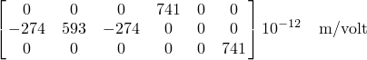
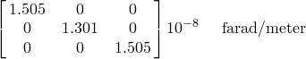
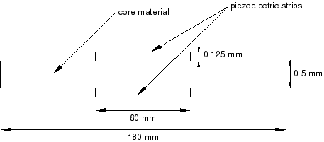
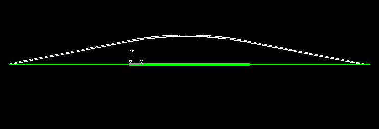
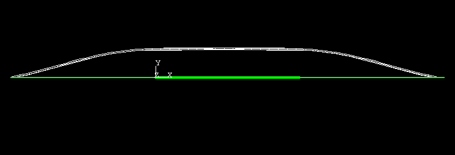
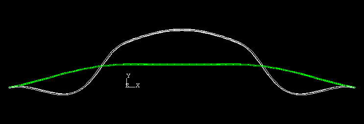
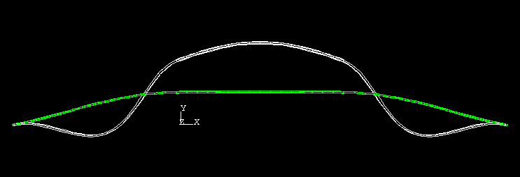
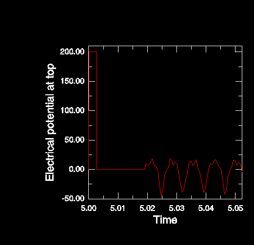
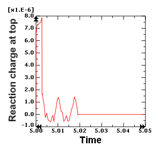
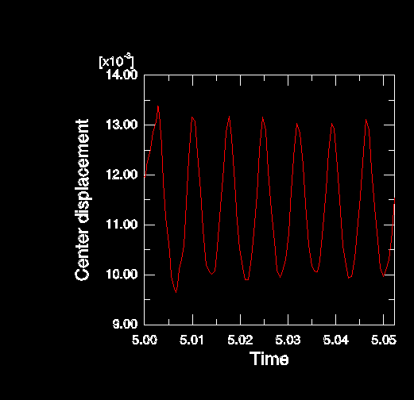

# 7.1.2 压电换能器的瞬态动力学非线性响应

**产品：** Abaqus/Standard

本示例演示了Abaqus预测包含压电元件的结构系统非线性瞬态动力学行为的能力。它利用一个理想化为简单层合梁结构的压电弯曲型换能器。对换能器的制造过程进行建模，并提取预加载结构的特征频率。最后，监测由于瞬态电势脉冲引起的动力学响应。压电换能器常用于以下应用领域：
- 超声成像系统
- 超声波清洗系统
- 超声波焊接/粘接系统
- 音频系统
- 声学换能器
- 主动振动控制系统

### 几何和材料

换能器如图所示。它有一个复合梁，宽0.0025米，长0.18米。初始直梁有0.0005米厚的绝缘芯；0.000125米厚的PZT-5H压电条带粘接在芯材料的上表面和下表面上。压电条带仅0.060米长，位于梁的中点。压电条带沿厚度方向极化。PZT-5H材料的属性如下：

弹性属性：

| 工程常数 |
| --- |
|  | 60.61 GPa |
|  | 48.31 GPa |
|  | 60.61 GPa |
|  | 0.512 |
|  | 0.289 |
|  | 0.408 |
|  | 23.0 GPa |
|  | 23.5 GPa |
|  | 23.0 GPa |

压电耦合矩阵（应变系数）：

介电矩阵：

局部1方向沿梁的纵向方向，局部2和3方向在梁的横截面上。从这些矩阵可以看出，极化方向在压电条带的局部2方向上。

芯材料是弹性和各向同性的，弹性模量为6 GPa，密度为1500 kg/m³，泊松比为0.35。

### 模型

梁芯材料用46个C3D20单元建模，压电条带每个用16个C3D20E单元建模。使用基于表面的绑定约束定义芯和压电材料之间的完美粘接，其中压电表面作为主表面。每个压电条带的上表面和下表面的电势通过线性约束方程耦合到分配给每个表面的主节点的电势。可以在这些主节点上监测电势和反作用电荷。粘接到芯材料上的压电表面在整个分析过程中被赋予零电势。

前8个步骤用于表示制造过程并研究制造换能器在制造各个阶段的行为。这些步骤包括线性扰动步骤，用于研究制造换能器在制造各个阶段的特征模态。第9至11步代表换能器的一般非线性瞬态分析。使用带阶跃函数幅值的边界条件施加200伏特的方波电势脉冲。脉冲后立即保持闭路条件（规定电势梯度）并监测反作用电荷。随后，打开电路（不规定电势梯度；电势是一个主动自由度，作为解的一部分确定）。在开路条件下，产生的电压可用于测量换能器的开路自由振动。分析步骤如下：

1. 静力形状制造：通过施加1000伏特电势引起的变形。
2. 静力形状制造：固定支撑端，并将施加电势降至0伏特。
3. 关于步骤2结束时获得的基态的闭路模态分析。
4. 静力形状制造：施加开路条件。
5. 关于步骤4结束时获得的基态的开路模态分析。
6. 在200伏特工作载荷下的静力测试。
7. 关于步骤6结束时获得的基态的闭路模态分析。
8. 重置为零电压条件。
9. 瞬态动力学响应：施加200伏特电势脉冲，持续0.00265秒。
10. 瞬态动力学响应：在0伏特闭路条件下的自由振动。
11. 瞬态动力学响应：在开路条件下的自由振动。

### 结果与讨论

在显示了在两个压电条带上施加1000伏特后的变形和叠加未变形形状。在显示了步骤2结束时的变形形状，其中两端固定并规定施加电势为0伏特。随后，提取关于这个预加载状态的特征频率。在显示了闭路条件下频率为150.9 cycles/sec的第三阶模态。显示了开路条件下频率为154.4 cycles/sec的第三模态形状。在规定电压为200伏特的闭路条件下，第三模态形状再次与显示的第三模态形状几乎相同。然而，特征频率已变为181.7 cycles/sec。

在步骤9和10中，为压电条带规定了闭路条件，随后在步骤11中移除电压边界条件导致开路条件。显示了闭路和开路条件下电势的时间历史。通常，在闭路条件下换能器充当"驱动源"，因为规定了电势梯度，从而驱动结构。另一方面，在开路条件下换能器充当"接收器"，因为可以测量机械响应的电压输出。在显示了上述条件下顶部压电条带的反作用电荷。在闭路条件下反作用电荷随时间变化，而在开路条件下反作用电荷等于零。换能器中心的位移如图所示。

给出这些结果是为了说明Abaqus预测压电结构瞬态响应的一般能力。如果该系统代表实际超声系统的一部分，将创建和分析与设计/分析目标相关的其他输出。

### 输入文件

[dynamictransducer.inp](../eif/dynamictransducer.inp)

压电换能器的瞬态动力学非线性响应。

[dynamictransducer_mesh.inp](../eif/dynamictransducer_mesh.inp)

装配定义。

### 图表

**图7.1.2-1** 压电换能器的几何形状。

**图7.1.2-2** 步骤1结束时叠加未变形形状的变形形状。

**图7.1.2-3** 步骤2结束时叠加未变形形状的变形形状。

**图7.1.2-4** 步骤2后基态叠加的模态形状3。

**图7.1.2-5** 步骤4后基态叠加的模态形状3。

**图7.1.2-6** 顶部压电条带的电势瞬态响应。

**图7.1.2-7** 顶部压电条带反作用电荷的瞬态动力学响应。

**图7.1.2-8** 中心位移的瞬态响应。

