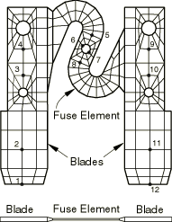
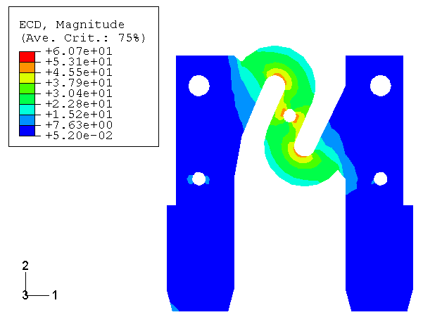
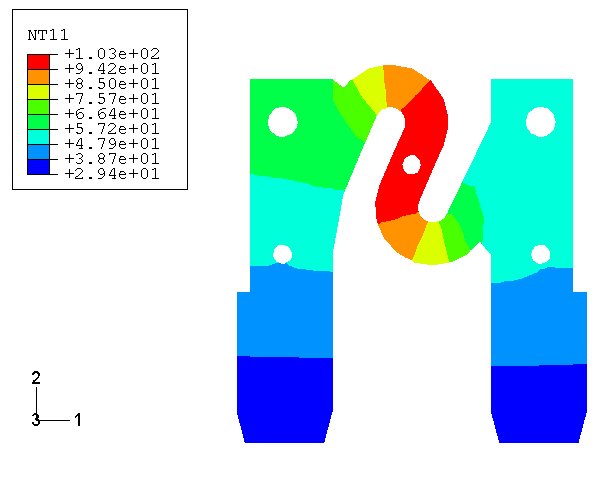
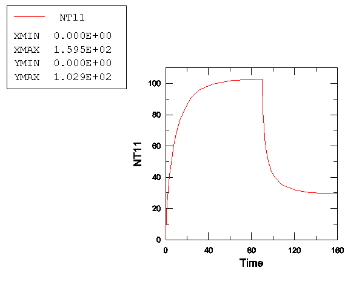

# 7.2.1 汽车熔断器的热-电建模

**产品：** Abaqus/Standard

当流过导体的电流耗散的能量转化为热能时，就会产生焦耳加热。Abaqus提供了完全耦合的热-电分析程序来分析这类问题。

该功能的概述在["耦合热-电分析，" Abaqus Analysis User's Guide的第6.7.3节](../usb/usb-link.md#usb-anl-ajouleheating)中提供。本示例说明了使用该功能建模由于稳定30 A电流引起的汽车电气熔断器加热的过程。熔断器是汽车中的主要电路保护装置。它们有多种不同的电流额定值，设计成当工作电流超过设计电流一段时间时，由于导电加热导致金属导体熔化，从而使电路断开。

原始问题的描述以及实验测量可以在Wang和Hilali（1995）中找到。实验数据和一些材料属性在此后得到了改进。这些属性在这里使用，有限元结果与改进后的测量值进行比较（Hilali，1995年7月）。

### 问题描述

汽车电气熔断器由嵌入透明塑料外壳中的金属导体（如锌）组成。塑料外壳仅保护和支撑细导体，在有限元模型中不表示。显示了导体几何形状的前视图和俯视图。它由两个0.76毫米厚的刀片组成，刀片之间支撑着S形熔断器元件。刀片紧密配合到标准电气端子中，端子被内置于电路中，提供电气电路和熔断器元件之间的连接。熔断器元件通常比熔断器刀片薄得多（本例中为0.28毫米厚），设计成当工作电流超过设计电流一段时间时熔化。熔断器刀片宽8毫米，长30.4毫米。熔断器元件约3.6毫米宽。

模型使用8节点一阶砖单元（单元类型DC3D8E）进行离散化（参见图），厚度方向使用一个单元。在几何不允许使用砖单元的区域使用两个6节点三角棱柱单元（单元类型DC3D6E）。为了比较，还提供了细化网格输入文件。

锌的电阻率在20°C时为16.75×10³ Ω·m，在100°C时为12.92×10³ Ω·m，呈线性变化。热导率在20°C时为0.1120 W/mm°C，在100°C时为0.1103 W/mm°C，呈线性变化。密度为7.14×10⁻⁶ kg/mm³，比热容为388.9 J/kg°C。耗散电能转化为热量的比例由焦耳热分数指定。我们假设所有电能都转化为热能。

分析分两步进行。第一步考虑电流流动引起的导体加热。一旦达到稳态条件，电流关闭，熔断器在第二步冷却至环境温度。在分析的第一部分，使用耦合热-电程序求解节点上的温度和电势的耦合热-电方程。在随后的冷却期间，由于熔断器中不再有电流，执行非耦合热传递分析（["非耦合热传递分析，" Abaqus Analysis User's Guide的第6.5.2节](../usb/usb-link.md#usb-anl-aheattransfer)）。耦合热-电程序定义足够通用，可以请求稳态或瞬态解；提供了说明两种分析类型的输入文件。瞬态分析使用自动时间增量方案，通过指定增量中允许的最大温度变化为20°C来控制。瞬态分析设置在达到稳态条件时终止。稳态在这里定义为温度变化率小于0.1°C/s的时刻。该条件作为耦合热-电程序定义的一部分来定义。我们指定总分析时间为100秒，初始时间步长为0.1秒。

电载荷是稳定的30 A电流。这作为集中电流施加在左侧端子底部边缘的每个节点上。输出通过熔断器元件定义截面的总电流和总热通量。电势（自由度9）为右侧刀片底部边缘使用边界条件约束（["Abaqus/Standard和Abaqus/Explicit中的边界条件，" Abaqus Analysis User's Guide的第34.3.1节](../usb/usb-link.md#usb-prc-pboundary)）。此选项还用于将熔断器刀片的底部边缘保持在分别为29.4°C和30.2°C的吸热温度（自由度11）。

假设暴露的金属表面通过对流散热到环境温度为23.3°C。忽略薄边缘的热损失。膜系数随温度变化的经验关系为：

其中是表面温度（°C）；*h*是膜系数（W/mm²°C）；是取决于表面几何形状的常数——刀片表面的= 4.747×10⁻⁶ W/mm²，熔断器元件表面的= 5.756×10⁻⁶ W/mm²。这种依赖性作为膜系数定义中膜属性值的表格输入（参见["热载荷，" Abaqus Analysis User's Guide的第34.4.4节](../usb/usb-link.md#usb-prc-pthermal)）。

### 结果与讨论

显示了稳态条件下电流密度矢量大小的等值线图。由于耗散的电能——因此热能——是电流密度的函数，该图代表了产生的热量的等值线。该图表明大部分热量在S形熔断器元件的内弯曲处和中心孔附近产生。与熔断器元件相比，熔断器刀片中的耗散能量可以忽略不计。

显示了第一步分析结束时温度分布的等值线图。最高温度在S形熔断器元件的中心附近达到。当工作电流超过设计电流时，该区域预计首先失效。比较了测量位置（定义于图）的温度与实验测量值（Hilali，1995年7月）。虽然结果显示出实验和分析之间的一些差异，但很明显，分析足够具有代表性，可以为研究此类系统提供有用的基础。显示了加热和随后冷却期间测量位置6的温度变化。

上述结果是针对粗网格模型的。细化网格模型产生的结果与粗网格模型略有不同。稳态分析中电流密度矢量大小的最大差异约为11.4%。

### 致谢

Delphi Packard Electric Systems的Hilali先生和Wang博士提供了熔断器的几何形状、材料属性和实验结果。Delphi Packard对分析方法的准确性或分析中包含的数据不承担任何责任。

### 输入文件

[thermelectautofuse_steadystate.inp](../eif/thermelectautofuse_steadystate.inp)

稳态分析。

[thermelectautofuse_transient.inp](../eif/thermelectautofuse_transient.inp)

瞬态分析。

[thermelectautofuse_transient_po.inp](../eif/thermelectautofuse_transient_po.inp)

`POST OUTPUT`分析。

[thermelectautofuse_node.inp](../eif/thermelectautofuse_node.inp)

模型的节点坐标。

[thermelectautofuse_element.inp](../eif/thermelectautofuse_element.inp)

单元定义。

[thermelectautofuse_controls.inp](../eif/thermelectautofuse_controls.inp)

与thermelectautofuse_steadystate.inp相同，只是使用`CONTROLS`选项来控制收敛标准。

[teaf-steadystate-refined.inp](../eif/teaf-steadystate-refined.inp)

稳态分析的细化网格模型。

[teaf-transient-refined.inp](../eif/teaf-transient-refined.inp)

瞬态分析的细化网格模型。

### 参考

Hilali, S. Y., Private communication, July 1995.

Hilali, S. Y., and B. -J. Wang, "ABAQUS Thermal Modeling for Electrical Assemblies," 1995 ABAQUS Users' Conference, Paris, May 1995, pp. 441-457.

Wang, B. -J., and S. Y. Hilali, "Electrical-Thermal Modeling Using ABAQUS," 1995 ABAQUS Users' Conference, Paris, May 1995, pp. 771-785.

### 图表

**图7.2.1-1** 几何形状和有限元离散化。

**图7.2.1-2** 电流密度矢量大小（A/mm²）的等值线。

**图7.2.1-3** 温度场（°C）的等值线。

**图7.2.1-4** 测量位置的温度（°C）。

**图7.2.1-5** 测量位置6的温度（°C）随时间（s）的变化。

