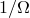
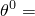
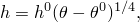
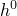
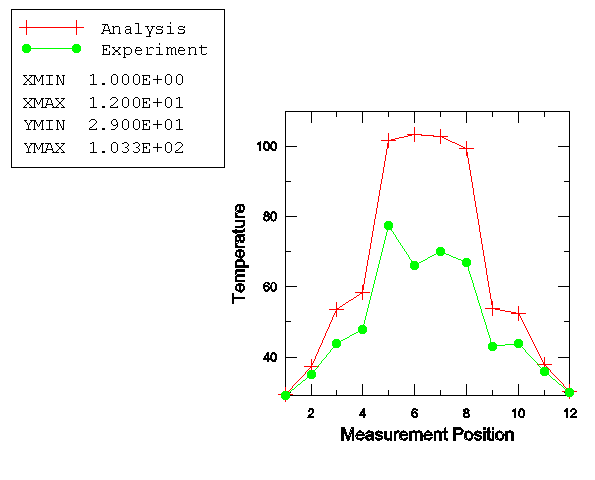

# 7.2.1 Thermal-electrical modeling of an automotive fuse

**Product: **Abaqus/Standard  

Joule heating arises when the energy dissipated by electrical current flowing through a conductor is converted into thermal energy. Abaqus provides a fully coupled thermal-electrical procedure for analyzing this type of problem.

An overview of the capability is provided in ["Coupled thermal-electrical analysis," Section 6.7.3 of the Abaqus Analysis User's Guide](../usb/usb-link.md#usb-anl-ajouleheating). This example illustrates the use of the capability to model the heating of an automotive electrical fuse due to a steady 30 A electrical current. Fuses are the primary circuit protection devices in automobiles. They are available in a range of different current ratings and are designed so that when the operating current exceeds the design current for a period of time, heating due to electrical conduction causes the metal conductor to melt and—hence—the circuit to disconnect.

A description of the original problem, as well as experimental measurements, can be found in Wang and Hilali (1995). The experimental data and some of the material properties were refined subsequent to this publication. These properties are used here, and the finite element results are compared with the refined measurements (Hilali, July 1995).

### Problem description

An automotive electrical fuse consists of a metal conductor, such as zinc, embedded within a transparent plastic housing. The plastic housing, which only protects and supports the thin conductor, is not represented in the finite element model. [Figure 7.2.1--1](ch07s02aex126.md#sxmthermelec-geom) shows front and top sections of the geometry of the conductor. It consists of two 0.76 mm thick blades, with an S-shaped fuse element supported between the blades. The blades fit tightly into standard electrical terminals that are built into the circuit and provide the connection between the electrical circuit and the fuse element. The fuse element is usually much thinner than the fuse blades (in this case 0.28 mm thick) and is designed to melt when the operating current exceeds the design current for a period of time. The fuse blades are 8 mm wide and 30.4 mm long. The fuse element is approximately 3.6 mm wide.

The model is discretized (see [Figure 7.2.1--1](ch07s02aex126.md#sxmthermelec-geom)) with 8-node first-order brick elements (element type DC3D8E), using one element through the thickness. Two 6-node triangular prism elements (element type DC3D6E) are used to fill regions where the geometry precludes the use of brick elements. For comparison refined mesh input files are also included.

The electrical conductivity of zinc varies linearly between 16.75  103  mm at 20C and 12.92  103 mm at 100C. The thermal conductivity varies linearly between 0.1120 W/mmC at 20C and 0.1103 W/mmC at 100C. The density is 7.14  106 kg/mm3, and the specific heat is 388.9 J/kgC. The fraction of dissipated electrical energy released as heat is specified by the joule heat fraction. We assume that all electrical energy is converted into thermal energy.

The analysis is done in two steps. In the first step heating of the conductor due to current flow is considered. Once steady-state conditions are reached, the current is switched off and the fuse is allowed to cooldown to the ambient temperature in a second step. During the first part of the analysis, the coupled thermal-electrical equations are solved for both temperature and electrical potential at the nodes using the coupled thermal-electrical procedure. In the subsequent cooldown period, since there is no longer any electric current in the fuse, an uncoupled heat transfer analysis (["Uncoupled heat transfer analysis," Section 6.5.2 of the Abaqus Analysis User's Guide](../usb/usb-link.md#usb-anl-aheattransfer)) is performed. The coupled thermal-electrical procedure definition is general enough to request either a steady state or a transient solution; input files illustrating both analysis types are provided. The transient analysis uses an automatic time incrementation scheme that is controlled by specifying the maximum temperature change allowed in an increment to 20C. The transient analysis is set to terminate when steady-state conditions are reached. Steady state is defined here as the point at which the temperature rate change is less than 0.1C/s. This condition is defined as part of the definition of the coupled thermal-electrical procedure. We specify a total analysis time of 100 s, with an initial time step size of 0.1 s.

The electrical loading is a steady 30 A current. This is applied as a concentrated current on each of the nodes on the bottom edge of the left-hand-side terminal. The total current and the total heat flux across a section defined through the fuse element are output. The electrical potential (degree of freedom 9) is constrained at the bottom edge of the right-hand-side blade by using a boundary condition (["Boundary conditions in Abaqus/Standard and Abaqus/Explicit," Section 34.3.1 of the Abaqus Analysis User's Guide](../usb/usb-link.md#usb-prc-pboundary)). This option is also used to keep the bottom edges of the fuse blades at sink temperatures (degree of freedom 11) of 29.4C and 30.2C, respectively.

It is assumed that the exposed metal surfaces lose heat through convection to an ambient temperature of  23.3C. Heat loss from the thin edges is ignored. The film coefficient varies with temperature according to the empirical relation 

where  is surface temperature (C); *h* is the film coefficient (W/mm2C); and  is a constant that depends on the surface geometry— = 4.747  106 W/mm2 for the blade surfaces, and  = 5.756  106 W/mm2 for the fuse element surfaces. This dependence is entered as a table of film property values in the film coefficient definition (see ["Thermal loads," Section 34.4.4 of the Abaqus Analysis User's Guide](../usb/usb-link.md#usb-prc-pthermal)).

### Results and discussion

[Figure 7.2.1--2](ch07s02aex126.md#sxmthermelec-densitycont) shows a contour plot of the magnitude of the electrical current density vector at steady-state conditions. Since the dissipated electrical energy—and, hence, the thermal energy—is a function of current density, this figure represents contours of the heat generated. The figure indicates that most of the heat is generated near the inside curves of the S-shaped fuse element and near the center hole. The dissipated energy in the fuse blades is negligible compared to that in the fuse element.

[Figure 7.2.1--3](ch07s02aex126.md#sxmthermelec-tempcont) shows a contour plot of the temperature distribution at the end of the first analysis step. The maximum temperature is reached near the center of the S-shaped fuse element. This area is expected to fail first when the operating current exceeds the design current. [Figure 7.2.1--4](ch07s02aex126.md#sxmthermelec-tempatpts) compares the temperatures at the measuring positions (defined in [Figure 7.2.1--1](ch07s02aex126.md#sxmthermelec-geom)) with the experimental measurements (Hilali, July 1995). While the results show some discrepancies between the experiment and analysis, it is clear that the analysis is sufficiently representative to provide a useful basis for studying such systems. [Figure 7.2.1--5](ch07s02aex126.md#sxmthermelec-tempvar) shows the variation of temperature at measuring position 6 during the heating and subsequent cooldown periods.

The results discussed above are for the coarse mesh model. The refined mesh models yield slightly different results from the coarse ones. The maximum difference in the magnitude of the electrical current density vector for the steady-state analysis is approximately 11.4%.

### Acknowledgments

Mr. Hilali and Dr. Wang of Delphi Packard Electric Systems supplied the geometry of the fuse, the material properties, and the experimental results. Delphi Packard assumes no responsibility for the accuracy of the analysis method or data contained in the analysis.

### Input files

[thermelectautofuse_steadystate.inp](../eif/thermelectautofuse_steadystate.inp)

Steady-state analysis.

[thermelectautofuse_transient.inp](../eif/thermelectautofuse_transient.inp)

Transient analysis.

[thermelectautofuse_transient_po.inp](../eif/thermelectautofuse_transient_po.inp)

[*POST OUTPUT](../key/key-link.md#usb-kws-hpostoutput) analysis.

[thermelectautofuse_node.inp](../eif/thermelectautofuse_node.inp)

Nodal coordinates for the model.

[thermelectautofuse_element.inp](../eif/thermelectautofuse_element.inp)

Element definitions.

[thermelectautofuse_controls.inp](../eif/thermelectautofuse_controls.inp)

Identical to thermelectautofuse_steadystate.inp, except that it uses the [*CONTROLS](../key/key-link.md#usb-kws-hcontrols) option for control of convergence criteria.

[teaf-steadystate-refined.inp](../eif/teaf-steadystate-refined.inp)

Refined mesh model for the steady-state analysis.

[teaf-transient-refined.inp](../eif/teaf-transient-refined.inp)

Refined mesh model for the transient analysis.

### References

Hilali, S. Y., Private communication, July 1995.

Hilali,  S. Y., and B. -J. Wang, “ABAQUS Thermal Modeling for Electrical Assemblies,” 1995 ABAQUS Users' Conference, Paris, May 1995, pp. 441–457.

Wang,  B. -J., and S. Y. Hilali, “Electrical-Thermal Modeling Using ABAQUS,” 1995 ABAQUS Users' Conference, Paris, May 1995, pp. 771–785.

### Figures

**Figure 7.2.1–1** Geometry and finite element discretization.

**Figure 7.2.1–2** Contours of the magnitude of the current density vector (A/mm2).

**Figure 7.2.1–3** Contours of temperature field (C).

**Figure 7.2.1–4** Temperature (C) at measuring positions.

**Figure 7.2.1–5** Variation of temperature (C) at measuring position 6 with time (s).

